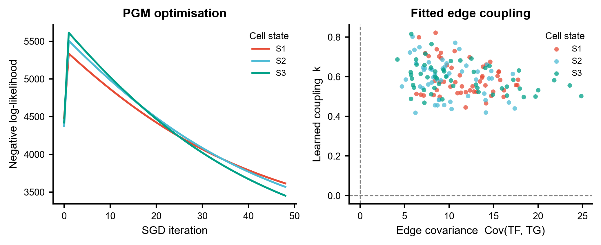
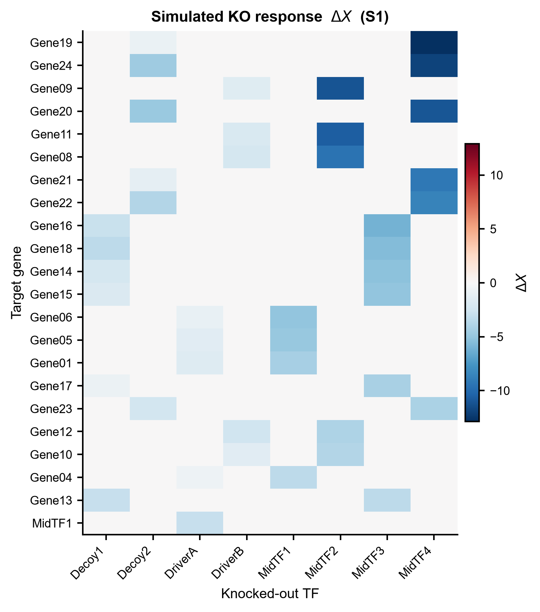
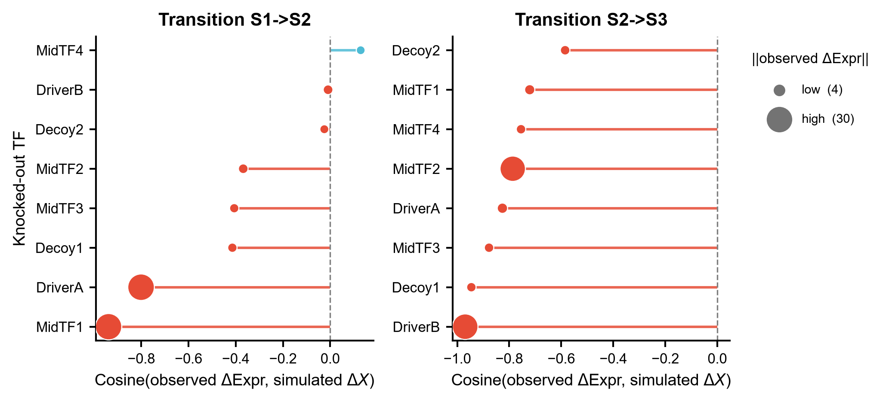

# 584 · CellPolaris — GRN 迁移 + 概率图模型 TF 敲除 + 主控 TF 打分

用 **CellPolaris**(Feng et al., *Advanced Science* 2026)在**已有的 GRN** 上建高斯概率图模型,
把某个转录因子置零,推出它下游靶基因的表达位移 **ΔX**,再拿 ΔX 与**真实相邻细胞状态之间的
表达差**算余弦相似度,给 TF 在每一段命运转换上打分,排出**主控 TF**。
上游还有一段用迁移学习**生成** GRN 的模块,需要 sci-db 下载的 PECA2 数据集 + 自己训练的权重 +
GPU —— 本模块把它做成**守卫式封装**,只检查环境、打印真实命令,不假装能跑。

| | |
|---|---|
| 语言 / 主依赖 | Python 3.12 · `numpy` `pandas` `torch`(CPU)`matplotlib`(全部本机已有) |
| 输入 | GRN(TF/TG/Score)+ 每个细胞状态的 metacell 表达矩阵 + 伪 bulk 表达 + 轨迹 |
| 输出 | `results/` 各状态 ΔX、PGM 参数、主控 TF 打分表、summary JSON;`assets/` 3 张展示图 |
| 运行时间 | CPU 约 20 秒(本机实测 17–23 秒;3 个状态 × 52 条边 × 50 个 metacell,含 torch 导入开销) |
| 状态 | 🟡 PGM + 主控 TF 段本机零改动跑通出图;GRN 迁移段需上游数据集 + 权重 + GPU |

---

## ① 输入数据

**主输入 1** `example_data/grn.txt` —— 制表符分隔,格式与上游 `model_PGM/data/generated_grn/*.txt` 一致。

| 列 | 类型 | 说明 |
|---|---|---|
| `TF` | str | 调控者基因名 |
| `TG` | str | 靶基因名 |
| `Score` | float | 边置信度;脚本内部线性缩放到 [0.1, 0.7](上游做法) |

```
TF	TG	Score
MidTF2	Gene11	0.9480386020941296
Decoy2	Gene20	0.9424780160265377
MidTF4	Gene21	0.9390515255291819
```

**主输入 2** `example_data/expr_metacell_<state>.csv` —— 行=基因,列=metacell(细胞小群的伪 bulk)。
PGM 的高斯边际 μ/σ 和每条边的协方差 Cov 全部从这里估,**列数就是样本量**(上游写死取前 50 列)。

```
# synthetic, for demo only -- NOT real scRNA-seq metacells
# rows = genes, columns = metacells (pseudobulked cell groups)
Row.names,MC00,MC01,MC02,...
DriverA,14.910586685965608,14.870996759785303,18.805251239126743,...
```

**主输入 3** `example_data/expr_pseudobulk_<state>.txt` —— 两列**无表头**,`基因<TAB>表达值`,
格式与上游 `model_PGM/data/RS*.txt` 一致。主控 TF 打分里的「观测表达差」用它算。

```
DriverA	17.908562
DriverB	15.913289
Decoy1	24.454782
```

**主输入 4** `example_data/trajectory.txt` —— 一行一条轨迹,状态名制表符分隔,顺序即分化顺序。

```
S1	S2	S3
```

> 全部示例文件均为**合成数据**(文件头已标 `synthetic, for demo only`),由脚本内
> `simulate_example_data()` 生成:两层 GRN(root TF → mid TF → 靶基因),真值设定为
> **DriverA 驱动 S1→S2 的上调模块、DriverB 驱动 S2→S3 的上调模块,Decoy1/Decoy2 的模块在
> 整条轨迹上不动**。它只用来造带 ground truth 的 demo,**不是对 CellPolaris 的复现或基准评测**。

---

## ② 方法 / 原理

### 第 1 段(🔴 守卫式封装)—— 迁移学习生成 GRN

上游用 PECA2 从 ATAC + RNA 建了一个多组织/多物种的高置信 GRN 库,再训练一个
NCF link-prediction 模型 + 域迁移损失,使得**只给 RNA-seq** 就能吐出对应语境的 GRN。
下列 API 逐条读自**本地克隆的上游源码**(读取日期 2026-07-21):

```python
# transfer_learning/load_dataset/dataset.py:12
dataset = GRNPredictionDataset(root="dataset")        # 需 dataset/processed_dataset.pt
# transfer_learning/models/base_model/ncf.py:5
NCF(num_nodes, hidden_dim=768)
# transfer_learning/models/transfer_model.py:11
TRModel(link_prediction_model, loss_type="graph_mixup", num_sourcedomains=...,
        mixup_alpha=0.2, top_ratio=0.2)
# transfer_learning/generate_grn.py
generate_grn(model, rna_seq, rna_seq_mask, tf_mask, tg_mask)
dump_generated_grn(edge_index, edge_weight, save_to_path, gene_names, ...)
```

命令行入口与全部参数读自 `transfer_learning/generate_external_grn.py`:

```bash
python transfer_learning/generate_external_grn.py \
  --species sc_mouse --fold 0 --transfer_loss_type graph_mixup \
  --model ncf --seed 0 --device cuda:0 --top_ratio 0.2 \
  --rna_seq_path <pseudobulk1.txt> <pseudobulk2.txt>
```

**为什么本机跑不了**(脚本 `--cellpolaris-repo` 会逐条检查并打印):
仓库里**没有** `dataset/processed_dataset.pt`(要去 <https://www.scidb.cn/en/s/VNvY3e> 下载),
**没有** `result/multi_to_multi_generalization/**/fold_*.pt` 权重(要自己按
`scripts_for_execute/script_train_multi_to_multi.py` 训),依赖 `torch_geometric`(上游
`environment.yml` 锁 2.3.1)+ CUDA。**已有 GRN 的人可以完全跳过这一段**,直接把 GRN 喂给第 2 段。

### 第 2 段(✅ 本机可跑)—— GRN 上的高斯概率图模型

对应上游 `model_PGM/model_PGM.py`。变量:每个 **root TF**(只当 TF 从不当 TG 的调控者)与每个
**TG** 各有高斯边际 (μ, σ);每条边有一个待学的耦合系数 **k**。负对数似然:

```
p = Σ_rootTF  logN(x_TF | μ_TF, σ_TF)
q = -Σ_TG  (入度 - 1) · logN(x_TG | μ_TG, σ_TG)          # 扣掉被各条边重复计入的边际
k = Σ_edge  logN(x_TG | loc, scale)
    loc   = relu(μ_TG + k_e · Cov_e · (x_TF - μ_TF) / σ_TF²) + 0.01
    scale = sqrt(relu(σ_TG² - Alpha_e² / σ_TF²) + 0.01)
loss = -(p + q + k)
```

优化器与超参照抄上游 `model_PGM.py:351-403`:SGD,μ/σ 学习率 0.01、k 学习率 0.1、k 初值 0,
49 次迭代;每步后 μ 被夹到 `0.9 × 初值`(上下界相同 = 直接冻结)、σ 夹到 `[0.8, 1.2] × 初值`。

### 第 3 段(✅ 本机可跑)—— ΔX 与主控 TF 打分

敲除 TF 后靶基因的位移(上游 `model_PGM.py:272`,系数 5 是写死的,这里暴露成 `--ko-factor`):

```
ΔX = -5 · k_e · Alpha_e · μ_TF / σ_TF²
```

主控 TF 打分对应 `plot/CellCruise.py:900 identifying_important_TFs()`:对轨迹上每一段
`start → next`,取观测表达差 `data1 = pseudobulk[next] - pseudobulk[start]`,取模拟位移
`data2 = ΔX[start]`,**只保留 data2 ≠ 0 的基因**(即该 TF 真正连到的靶),算两者余弦相似度。
**读法**:得分为负 = 敲除把细胞往这段转换的**反方向**推 → 该 TF 是这段转换的推动者。

### ⚠️ 为什么是「忠实重写」而不是直接调用上游

逐行核对本地克隆源码后发现,`model_PGM/model_PGM.py` **原样运行会崩**:

| 位置 | 问题 | 本模块的处理 |
|---|---|---|
| `model_PGM.py:307` | `__main__` 里硬编码作者机器绝对路径 `/home/share/jingzi_sample/RS1o2_sample.csv` | 改成命令行参数,相对路径 |
| `model_PGM.py:217-221` | 对空列表 `alpha_list` 迭代后 `return -(p + q + k + g)`,`g` 从未定义 → `NameError` | 采用它下一行被注释掉的可运行形式 `-(p + q + k)` |
| `model_PGM.py:167-168` | `Gauss_condition.forward` 的 TF_high 分支引用了该分支未定义的 `gTF_mu`/`gTF_sigma`(只定义了 `gTF_high_*`)→ `NameError` | 按显然意图用 `gTF_high_mu`/`gTF_high_sigma` |
| `model_PGM.py:30/44` | 算了 `network_sorted` 却切了**未排序**的 `network`(靠输入文件恰好已降序才没出错) | 显式按 Score 降序后再切 |

**数学形式一字未改**(边界条件、`relu`、`eps=0.01`、`入度-1` 权重、ΔX 的 `-5·k·Alpha·μ/σ²`、
SGD 学习率与夹逼规则),只是把逐基因建 `nn.Module` 的写法向量化,并修掉上述四处使其可运行。
另外上游 `model_PGM.py:393-394` 写了梯度裁剪但注释掉了 —— 原始表达尺度下 k 的梯度很容易发散,
本模块**默认开启** `--clip-grad 1.0`,传 `--clip-grad 0` 可关掉还原上游行为。

---

## ③ 用途

回答的科学问题:**沿着一条已知的分化/命运转换轨迹,哪个 TF 是把细胞从上一个状态推到下一个
状态的推动者?敲掉它会把细胞状态推向哪里?** 典型场景 ——

- 手上已有 GRN(SCENIC / CellOracle base-GRN / PECA2 / 本库 047、081 的产物),想在它上面直接
  做**虚拟敲除**,而不必再跑一遍网络推断;
- 分化轨迹上做**主控 TF 排序**,给重编程 / 转分化的 TF 组合挑候选;
- 已有 metacell 级表达(细胞太少、单细胞噪声太大时的常规做法),想要一个**样本量友好**的
  扰动模型 —— PGM 只需要几十个 metacell,不需要成千上万个细胞;
- 与本库 069(CellOracle)、585(IGNITE)互为独立引擎交叉验证。

**适用边界**:这是**给定网络后**的扰动推理,GRN 的质量决定一切;它不校正间接效应,ΔX 只传播
一跳(TF 的直接靶),不做多轮传播(上游 `model_PGM.py:474-476` 有 `propagation_rounds` 的
传播代码但被注释掉了,本模块未启用)。

---

## ④ 特点 / 亮点

- **只要有 GRN 就能跑**:不绑定任何特定的网络推断工具,TF/TG/Score 三列即可接入。
- **metacell 尺度**:高斯 PGM 吃的是几十个 metacell 而不是几万个细胞,小队列友好。
- **ΔX 带方向也带幅度**:每个 TF-靶基因对给出有符号的位移量,可直接做热图与下游比对。
- **打分锚在真实观测上**:主控 TF 的分数是模拟位移与**真实相邻状态表达差**的夹角,
  不是网络拓扑自说自话的中心性指标。
- **额外报 `obs_shift_norm`**:余弦相似度是**尺度无关**的,靶基因在轨迹上根本没动的 TF 也能
  靠噪声拿到 |cos| ≈ 1。本模块在上游打分之外多报一列「该 TF 靶基因上真实发生的表达变化幅度」,
  Fig3 用**点的大小**编码它。demo 里 Decoy1 在 S2→S3 拿到 cos = −0.946(看着像强命中),
  但 `obs_shift_norm` 只有 1.17,而真驱动 DriverB 是 27.4 —— 一眼就能把它排除。
- 出图全部走框架 `pubstyle`,**不用条形图**(折线 / 散点 / heatmap / lollipop)。

**关于示例结果的说明**:demo 数据是按「DriverA 驱动 S1→S2、DriverB 驱动 S2→S3」正向合成的,
所以打分能把它们排出来只说明**实现跑通了、方向没搞反**,不构成对 CellPolaris 的独立验证。
另外 Fig1 的似然曲线第 1 步先**升**后降,是上游那条 `μ → 0.9 × 初值` 夹逼造成的一次性跳变,
不是优化发散。

---

## ⑤ 输出结果图

| 文件 | 内容 |
|---|---|
| `results/deltax_<state>.csv` | 该状态下每个 TF 敲除后各靶基因的 ΔX(靶基因 × TF) |
| `results/pgm_params_<state>.csv` | 每条边的 Score / Alpha / Cov / 学到的耦合 k |
| `results/master_tf_scores.csv` | 每段转换 × 每个 TF 的余弦得分、靶基因数、`obs_shift_norm` |
| `results/584_summary.json` | 全部关键数字 + GRN 迁移段的可用性检查结果 |
| `assets/584_fig1_pgm_fit.png` | PGM 似然曲线 + 学到的耦合 k vs 边协方差 |
| `assets/584_fig2_deltax_heatmap.png` | 模拟敲除响应 ΔX 热图(靶基因 × 被敲 TF) |
| `assets/584_fig3_master_tf.png` | 主控 TF 打分 lollipop,点大小 = 真实表达变化幅度 |

**Fig 1 · PGM 拟合过程与边耦合**


**Fig 2 · 模拟敲除响应 ΔX**


**Fig 3 · 沿轨迹的主控 TF 打分**


---

## 运行

```bash
# 零改动跑通(读 example_data/ 写 results/,示例数据缺失时自动重新生成)
python 584_cellpolaris_grn_transfer.py

# 换自己的数据(datadir 里放 grn.txt / expr_metacell_*.csv / expr_pseudobulk_*.txt / trajectory.txt)
python 584_cellpolaris_grn_transfer.py --datadir data/mine --outdir results/run1

# 单独指定 GRN,并放大保留的边数
python 584_cellpolaris_grn_transfer.py --grn data/my_grn.txt --edge-num 3000

# 还原上游「不裁剪梯度」的行为
python 584_cellpolaris_grn_transfer.py --clip-grad 0

# 检查上游 GRN 迁移段能不能跑(会逐条列出缺什么)
python 584_cellpolaris_grn_transfer.py --cellpolaris-repo /path/to/CellPolaris
```

参数:`--grn` `--datadir` `--outdir` `--edge-num`(默认 3000,上游 `run.py` 用的值)
`--columns`(默认 50,上游写死)`--min-std` `--iters`(默认 49)`--lr-k` `--lr-mu` `--lr-sigma`
`--clip-grad` `--ko-factor`(默认 5,上游写死)`--cellpolaris-repo` `--seed`。
随机种子默认 0,全程相对路径,无 `setwd`。

## 依赖安装

第 2、3 段所需(`numpy` / `pandas` / `torch` / `matplotlib`)**本机已具备,无需安装**,CPU 即可。

第 1 段(GRN 迁移)本体没有发布到 PyPI / conda,只能从源码用,且需要额外下载数据与训练权重:

```bash
git clone https://github.com/xCompass-AI/CellPolaris.git
conda env create -f CellPolaris/transfer_learning/environment.yml   # torch 2.0.1 + torch_geometric 2.3.1 + CUDA
# 再从 https://www.scidb.cn/en/s/VNvY3e 下载 PECA2 数据集放到 transfer_learning/dataset/
# 权重需自行训练:python transfer_learning/scripts_for_execute/script_train_multi_to_multi.py
python 584_cellpolaris_grn_transfer.py --cellpolaris-repo /path/to/CellPolaris
```

未提供 `--cellpolaris-repo`、或数据集 / 权重 / `torch_geometric` 任一缺失时,脚本**不会静默跳过**,
而是逐条打印缺什么并给出上述真实命令。

## 引用

Feng G, Qin X, Zhang J, Huang W, Zhang Y, Cui W, Chen Y, Li S, Liu W, Tian Y, Liu Y, Dong J,
Xu P, Man Z, Liu G, Liang Z, Jiang X, Yang X, Wang P, Yang G, Wang H, Wang X, Tong MH, Zhou Y,
Zhang S, Chen Y, Wang Y, Li X. CellPolaris: Transfer Learning for Gene Regulatory Network
Construction to Guide Cell State Transitions. *Advanced Science* (Weinh). 2026 Feb;13(12):e08697.
doi:10.1002/advs.202508697 · PMID 41498638 · PMC12948241

**核实记录**:NCBI E-utilities `esearch db=pubmed term=CellPolaris[Title]` 唯一命中 PMID 41498638,
`esummary` 返回标题、28 位作者(首 Feng G / 末 Li X)、期刊 `Adv Sci (Weinh)`、卷期页
`13(12):e08697`、DOI `10.1002/advs.202508697` 与仓库 README 自述的引用一致(核实日期 2026-07-21)。

仓库:<https://github.com/xCompass-AI/CellPolaris>
API 与数学形式实际读取自本地克隆源码:
- `model_PGM/model_PGM.py`(`data_pro1` / `Gauss_top_TF` / `Gauss_TG` / `Gauss_condition` / `Model` / `get_param_numpy`)
- `model_PGM/run.py`(`edge_num=3000` 等默认值)
- `plot/CellCruise.py`(`identifying_important_TFs` / `cluster_to_PseudoBulk` / `calculate_cosine_similarity`)
- `transfer_learning/generate_external_grn.py`(命令行参数与权重路径约定)
- `transfer_learning/models/transfer_model.py`、`models/base_model/ncf.py`(`TRModel` / `NCF` 签名)
- `transfer_learning/load_dataset/dataset.py`(`GRNPredictionDataset(root="dataset")`)
- `transfer_learning/environment.yml`、`environment_pgm.yml`(依赖版本)

## 与 069 / 585 / 586 的关系

| 模块 | 网络从哪来 | 扰动怎么算 | 需要什么 |
|---|---|---|---|
| 069 CellOracle | motif 先验 + 回归 | TF 置零后在 KNN 图上传播,量状态位移 | scRNA + ATAC/motif 先验 |
| 585 IGNITE | 动力学 Ising 反问题,从伪时序学 | 敲除后重跑 Glauber 采样 | 伪时序 scRNA(小基因集) |
| 586 PSGRN | 从**带干预标签**的扰动数据学 | 网络本身就是从扰动学的,不外推 | Perturb-seq / CRISPRi + 对照 |
| **584 CellPolaris** | **迁移学习生成(或直接外部导入)** | **高斯 PGM 解析解 ΔX,一跳** | **GRN + metacell 表达 + 轨迹** |

584 的位置很清楚:它**不推网络**(第 2、3 段把 GRN 当输入),专门解决「网络已经有了,怎么在它
上面做可解释的敲除模拟并沿轨迹排 TF」。所以它可以直接接在 047 / 081 / 586 的输出后面,
也可以拿 069、585 的敲除结论跟它交叉验证 —— 交叉验证的前提是引擎假设不同,这一点是满足的。
