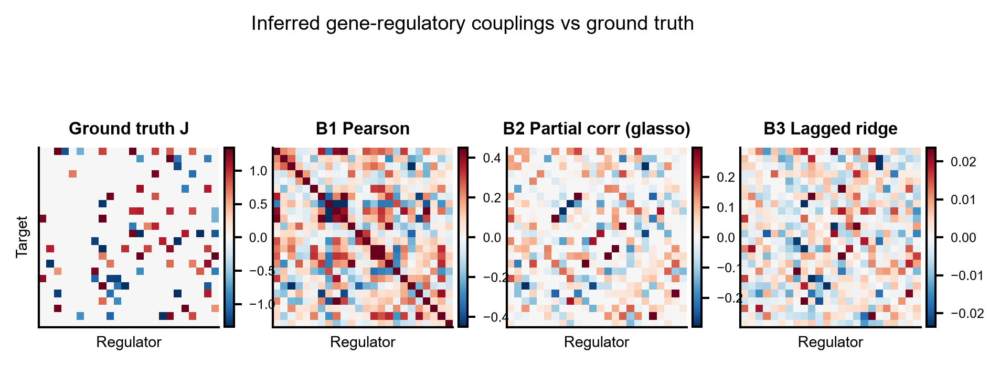
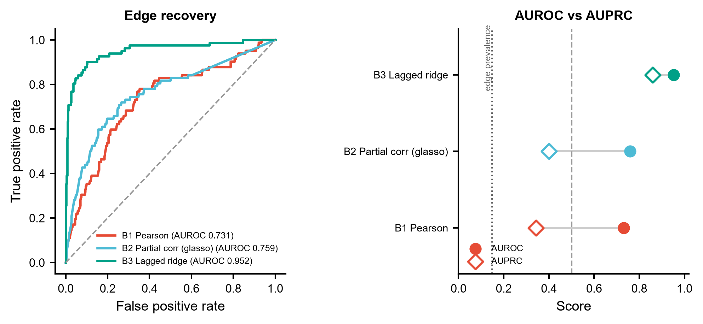
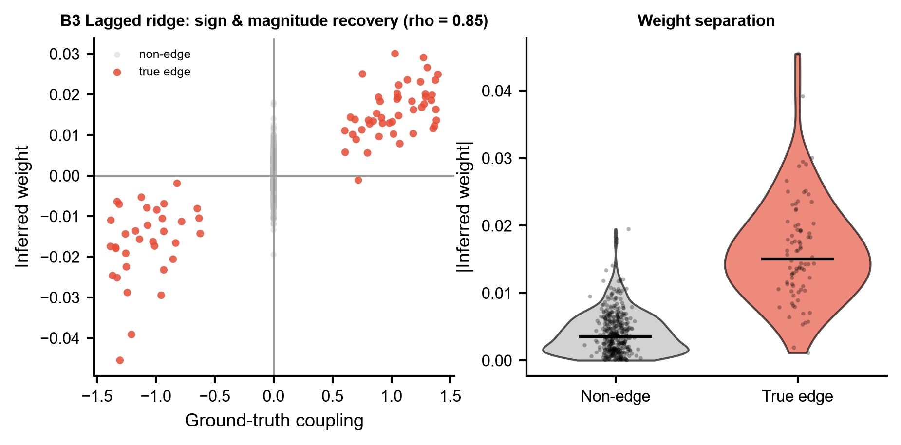

# 585 · IGNITE — 动力学 Ising 反问题推断 GRN 与敲除预测

用 **IGNITE**(Corridori et al., *PLoS Comput Biol* 2026)从**未扰动**的单细胞转录组反推
基因调控网络:把伪时序排序的表达二值化成 ±1 自旋,用**非对称动力学 Ising 模型的反问题**
(异步 Glauber 动力学 + 最大似然 + L1/L2 正则)学出耦合矩阵 **J** 与外场 **h**,再用学到的
网络模拟单/多基因敲除。模块自带**三个本机可跑的朴素 GRN 对照**,任何"IGNITE 更好"的说法
都必须先跑赢它们,尤其是**滞后回归**这个用了同样时序因果方向的线性对手。

| | |
|---|---|
| 语言 / 主依赖 | Python 3.12 · 基线:`numpy` `pandas` `scipy` `scikit-learn` `matplotlib`(全部本机已有) · IGNITE:仓库 clone + `numba` |
| 输入 | 基因 × 伪时序细胞 的 ±1 自旋矩阵 CSV(+ 可选真值网络 CSV) |
| 输出 | `results/` 各法耦合矩阵 + 边恢复评分 JSON/CSV;`assets/` 3 张展示图 |
| 运行时间 | 基线 CPU 约 20 秒(24 基因 × 4000 细胞);加 IGNITE(100 epochs)再约 20 秒 |
| 状态 | ✅ 本机零改动跑通出图;`--ignite-repo` 指向上游 clone 后**真实 IGNITE 也已在本机实跑通过**(numba 0.65.1 已装,2026-07-21 验证) |

---

## ① 输入数据

**主输入** `example_data/spins_pseudotime_ordered.csv` —— 行=基因,列=按伪时序排好的细胞,
值为 ±1 自旋。列顺序即时间顺序,**这是动力学模型的全部时序信息来源,不能打乱**。

| 列 | 类型 | 说明 |
|---|---|---|
| 行索引 | str | 基因名(上游示例用 24 个 naive→formative 转换相关基因) |
| `Cell00000`…| float | ±1 自旋;传入非 ±1 的值时脚本按每基因中位数自动二值化 |

```
# synthetic, for demo only -- kinetic Ising simulation, not real scRNA-seq
# rows = genes, columns = pseudotime-ordered cells, values = binarized spin (+1/-1)
,Cell00000,Cell00001,Cell00002,...
Gene00,1.0,1.0,-1.0,...
Gene01,-1.0,-1.0,-1.0,...
```

**可选输入** `example_data/true_network.csv` —— 真值耦合矩阵 `J[target, regulator]`,只在
基准评测(算 AUROC/AUPRC)时需要;跑真实数据通常没有真值,脚本会自动跳过评测只出网络图。

> 两个示例文件均为**合成数据**(文件头已标注 `synthetic, for demo only`),由脚本内
> `simulate_kinetic_ising()` 正向模拟产生。该模拟器**只用来造带 ground truth 的 demo 数据,
> 不是 IGNITE 的推断实现,也不是对 IGNITE 的复现**。

---

## ② 方法 / 原理

**基线(永远可跑,只用本机已有依赖)——三个朴素 GRN 对照:**

| | 方法 | 抓的是什么 | 局限 |
|---|---|---|---|
| B1 | Pearson 共表达网络 | 边际相关 | 对称、无方向,间接边泛滥 |
| B2 | `GraphicalLassoCV` 稀疏偏相关 | 条件独立(精度矩阵) | 仍对称、无时间方向 |
| B3 | 滞后岭回归 `s(t+1) ~ s(t)` | **非对称**线性耦合 | 线性,不含 Glauber 非线性 |

B3 是关键对照:它和 IGNITE 用**同一份时序信息、同一个"上一时刻决定下一时刻"的因果方向**,
只是把非线性最大似然换成线性最小二乘。若只拿 IGNITE 跟 Pearson 比,赢的是"有没有用时间"
而不是"Ising 模型好不好"。

**IGNITE 路径(守卫式引用封装):** IGNITE **没有 pip / conda 包**,上游是仓库里的 notebook
加 `IGNITE_and_SCODE_notebooks/lib/` 源码,必须 clone 后把该目录加进 `sys.path`。
下列 API 逐条对照**上游源码本体**核实(不是照文档抄;复核日期 2026-07-21,行号为 main 分支):

```python
from lib.ml_wrapper import asynch_reconstruction
model = asynch_reconstruction(x, delta_t, LAMBDA, MOM=None, gamma=1,
                              opt='NADAM', reg='L1', ax_names=[])
model.reconstruct(x, Nepochs, start_lr=1, drop=0.99, edrop=20)
model.h, model.J            # 外场向量 / 耦合矩阵 (Nvar × Nvar)
model.generate_samples(t_size=None, seed=1)
model.find_likelihood(x)
model.load_parameters(h, J, plot=False)
```

| 本模块调用 | 上游定义位置 |
|---|---|
| `asynch_reconstruction`(类) | `lib/ml_wrapper.py:7` |
| `__init__(x, delta_t, LAMBDA, MOM=None, gamma=1, opt='NADAM', reg='L1', ax_names=[])` | `lib/ml_wrapper.py:14` |
| `.reconstruct(x, Nepochs, start_lr=1, drop=0.99, edrop=20)` | `lib/ml_wrapper.py:50` |
| `.J`(Nvar×Nvar)/ `.h`(Nvar) | `lib/ml_wrapper.py:33` / `:38`,`reconstruct` 后被重新赋值 |
| `.find_likelihood(x)` / `.load_parameters(h, J, plot=False)` / `.generate_samples(t_size=None, seed=1)` | `lib/ml_wrapper.py:69` / `:74` / `:124` |
| 优化器实现 `NADAM_reconstruct`(默认 `LAMBDA=0.01`) | `lib/fun_asynch.py:323` |
| 敲除模拟 `KO_wrap` / `info_KO` / `KO_avg_weighted` / `KO_diff_sim` | `lib/funcs_ko.py:24` / `:58` / `:86` / `:117` |
| 超参搜索 `grid_search(...)` | `lib/funcs_IsingPars.py:41` |

输入 `x` 的形状与取值:**Nvar × Nsteps 的 ±1 自旋矩阵**,列按伪时序排列
(`lib/fun_asynch.py:80` 的 docstring 与 `:106` `generate_samples_asynch` 的 ±1 初始化)。
**J 的方向**:上游有效场算的是 `theta = h + J @ x`(`lib/fun_asynch.py:77`),即
`J[i, j] = 调控者 j 对靶基因 i 的作用`,与本模块 `J[target, regulator]` 的约定一致。

> ⚠️ **上游副作用**:`reconstruct()` 会逐 epoch 打印一张表,并在结束时调
> `plot_fields_and_couplings()` → `plt.show()`(`lib/ml_wrapper.py:66`、`:122`)。
> 交互后端下会弹窗阻塞脚本,所以本模块在文件头强制 `matplotlib.use("Agg")`,
> 调用后 `plt.close("all")` 清掉这张图。

> ⚠️ **未固定项**:上游仓库**没有 requirements 文件、也没有 LICENSE 文件**
> (2026-07-21 查 GitHub 仓库树逐个文件确认)。依赖版本与超参数(`LAMBDA` / `Nepochs` /
> `delta_t` / `gamma`)的标定**此处未固定**,请以官方 notebook
> `01_IGNITE_InferenceMethod.ipynb` 与 `lib/funcs_IsingPars.py:41` 的 `grid_search()` 为准。
> 函数名与参数顺序已核实,超参取值未核实。**无 LICENSE 意味着默认保留全部权利,复用前请
> 先与作者确认授权。**

---

## ③ 用途

回答的科学问题:**只有未扰动的单细胞数据时,能不能反推出有向调控网络,并预判敲掉某个基因
会把细胞状态推去哪里?** 典型场景 ——

- 分化轨迹上找驱动转换的核心 TF。上游用例(据论文摘要原文):**两套多能干细胞体系** ——
  小鼠 PSC naive→formative 转换(10X)与人 PSC 向定型内胚层分化(Fluidigm C1),
  仓库 README 说明小鼠这套聚焦 **24 个文献已知相关基因、5 个时间点**;论文报告 IGNITE 预测出
  `Rbpj`、`Etv5` 单敲及三敲的效应,并与已发表实验观察一致;
- 在做湿实验敲除之前,先用网络排出候选基因的优先级;
- 手上有 Perturb-seq / 敲除表达数据时,拿它当外部验证去检验网络质量;
- 跟基于先验 motif 的网络(如本库 069 CellOracle、047 RcisTarget)互为独立引擎交叉验证。

**规模限制**:Ising 反问题的参数量随基因数平方增长,上游示例只做 24 个基因。这是**小规模精
选基因集**的方法,不是全转录组 GRN。

---

## ④ 特点 / 亮点

- **不需要扰动数据训练**:只吃未扰动的野生型单细胞数据,扰动是模型外推出来的。
- **非对称耦合**:`J[i,j] != J[j,i]`,天然带调控方向,这是它相对共表达网络的核心区别。
- **物理模型可生成**:学完能正向 `generate_samples()` 采样,可做自洽性检验和多基因联合敲除。
- **本模块强制带对照**:三个基线永远跑,`edge_recovery_scores.csv` 把 AUROC/AUPRC 并排列出;
  IGNITE 装不上时脚本不静默降级,而是明确打印跳过原因和真实安装命令。
- 出图全部走框架 `pubstyle`,**不用条形图**(heatmap / ROC 曲线 / dumbbell / 散点 / violin)。

**关于示例结果的诚实说明**:demo 数据本身就是用动力学 Ising 正向模拟出来的,所以 B3 滞后回归
(AUROC 0.952)大幅领先两个相关类基线(0.731 / 0.759)**主要说明信号藏在时间方向上**,
并不构成对任何方法的独立验证。要评价 IGNITE,请在真实数据 + 真实敲除验证上跑。

同理,`--ignite-repo` 那条路径在本机已跑通、能正常吐出 `J` / `h`(这是**接口层面的验证**),
但**不要**把 demo 上的 AUROC 当成 IGNITE 与基线的方法比较:合成数据的更新规则(每步单点翻转)
与上游 `asynch_glauber_dynamics` 的规则(每步全体按概率翻转)并不相同,且此处 `LAMBDA` /
`Nepochs` 未按官方 `grid_search()` 标定。

---

## ⑤ 输出结果图

| 文件 | 内容 |
|---|---|
| `results/network_b1.csv` / `_b2` / `_b3` | 各基线推断的耦合矩阵(基因 × 基因) |
| `results/ignite_J.csv` / `ignite_h.csv` | IGNITE 耦合矩阵与外场(仅 `--ignite-repo` 成功时) |
| `results/edge_recovery_scores.csv` | 各法 AUROC / AUPRC / 边密度 |
| `results/585_summary.json` | 全部指标 + IGNITE 路径状态 |
| `assets/585_fig1_networks.png` | 真值 vs 各法耦合矩阵 heatmap |
| `assets/585_fig2_edge_recovery.png` | 边恢复 ROC 曲线 + AUROC/AUPRC dumbbell |
| `assets/585_fig3_weight_agreement.png` | 真值-推断权重散点 + 真边/非边权重 violin |

**Fig 1 · 推断网络对比真值**


**Fig 2 · 边恢复表现**


**Fig 3 · 权重符号与幅度的恢复情况**


---

## 运行

```bash
# 零改动跑通(基线 + 出图),读 example_data/ 写 results/
python 585_ignite_grn_inference.py

# 换自己的数据
python 585_ignite_grn_inference.py --spins data/my_spins.csv --outdir results/run1

# 有真值网络时做基准评测
python 585_ignite_grn_inference.py --spins data/my_spins.csv --truth data/true_J.csv

# 启用真实 IGNITE(需先 clone 上游仓库)
python 585_ignite_grn_inference.py --ignite-repo /path/to/IGNITE --epochs 500 --lam 0.01
```

参数:`--spins` `--truth` `--ignite-repo` `--delta-t` `--lam` `--epochs` `--outdir` `--figdir`
`--seed`。随机种子默认 0,全程相对路径,无 `setwd`。用自定义 `--outdir` 时图默认也写进该目录,
不会覆盖仓库里提交的 `assets/` 展示图。

## 依赖安装

基线所需(numpy / pandas / scipy / scikit-learn / matplotlib)**本机已具备,无需安装**。

IGNITE 本体没有发布到 PyPI / conda,只能从源码用:

```bash
git clone https://github.com/CleliaCorridori/IGNITE.git
# 推断实现在 IGNITE_and_SCODE_notebooks/lib/,依赖 numba(上游未提供 requirements 文件)
python 585_ignite_grn_inference.py --ignite-repo /path/to/IGNITE
```

本机 `numba` 已装(0.65.1),因此这条路径**无需再装任何包**;2026-07-21 以
24 基因 × 4000 细胞 × 100 epochs 实跑通过,退出码 0,正常写出 `ignite_J.csv` / `ignite_h.csv`。

未提供 `--ignite-repo`、目录不对、或 `import lib.ml_wrapper` 失败(例如缺 numba)时,脚本
只跑基线并打印具体原因与上述命令,不会静默跳过。

## 引用

Corridori C, Romeike M, Nicoletti G, Buecker C, Suweis S, Azaele S, Martello G.
Unveiling gene perturbation effects through gene regulatory networks inference from
single-cell transcriptomic data. *PLoS Computational Biology*. 2026 Apr 15;22(4):e1014067.
doi:10.1371/journal.pcbi.1014067 · PMID 41984780 · PMCID PMC13082667

**核实记录**(2026-07-21 复核):NCBI E-utilities `esummary` + `efetch` 返回的标题、7 位作者、
期刊、卷期页(22(4):e1014067)、日期(2026 Apr 15)与 DOI 均与上文一致;§③ 引用的
"小鼠 naive→formative + 人 PSC→定型内胚层""10X vs Fluidigm C1""`Rbpj` / `Etv5` / 三敲"
均出自 `efetch` 取回的**摘要原文**,非转述推测。

仓库:https://github.com/CleliaCorridori/IGNITE
API 逐条核实自本地 clone 的源码文件本体(非 README、非二手文档):
- `IGNITE_and_SCODE_notebooks/lib/ml_wrapper.py`(`asynch_reconstruction` 类及全部方法)
- `IGNITE_and_SCODE_notebooks/lib/fun_asynch.py`(输入形状 / ±1 取值 / `J` 的方向)
- `IGNITE_and_SCODE_notebooks/lib/funcs_ko.py`(敲除模拟函数)
- `IGNITE_and_SCODE_notebooks/lib/funcs_IsingPars.py`(`grid_search` 超参搜索)

具体符号 → 文件:行号的对应表见 §②。

## 与 069 / 507 / 561 的关系

| 模块 | 引擎 | 需要什么数据 | 扰动逻辑 |
|---|---|---|---|
| 069 CellOracle | motif 先验 GRN + 向量场传播 | scRNA + ATAC/motif 先验 | TF 置零后传播,打分状态位移 |
| 507 Geneformer | 基础模型 embedding | scRNA | 删基因,量 embedding 位移 |
| 561 RegVelo | GRN 耦合剪接动力学 | spliced/unspliced | regulon 扰动经 CellRank fate |
| **585 IGNITE** | **动力学 Ising 反问题** | **伪时序 scRNA(小基因集)** | **敲除后重跑 Glauber 动力学采样** |

585 的独立性在于:它**不需要 motif 先验**,网络完全从数据的时间结构学出来。这跟 069 的先验
依赖是正交假设,适合互为交叉验证;而堆两个共享假设的引擎并不能换来独立性。
