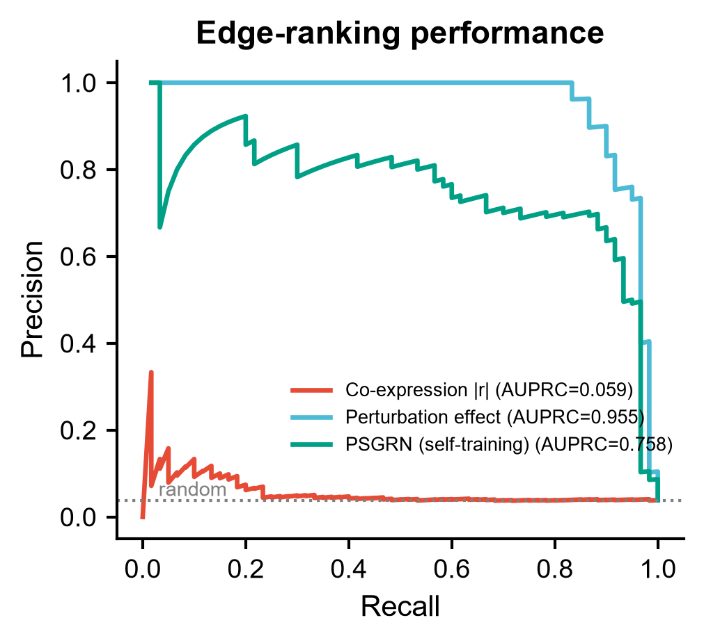
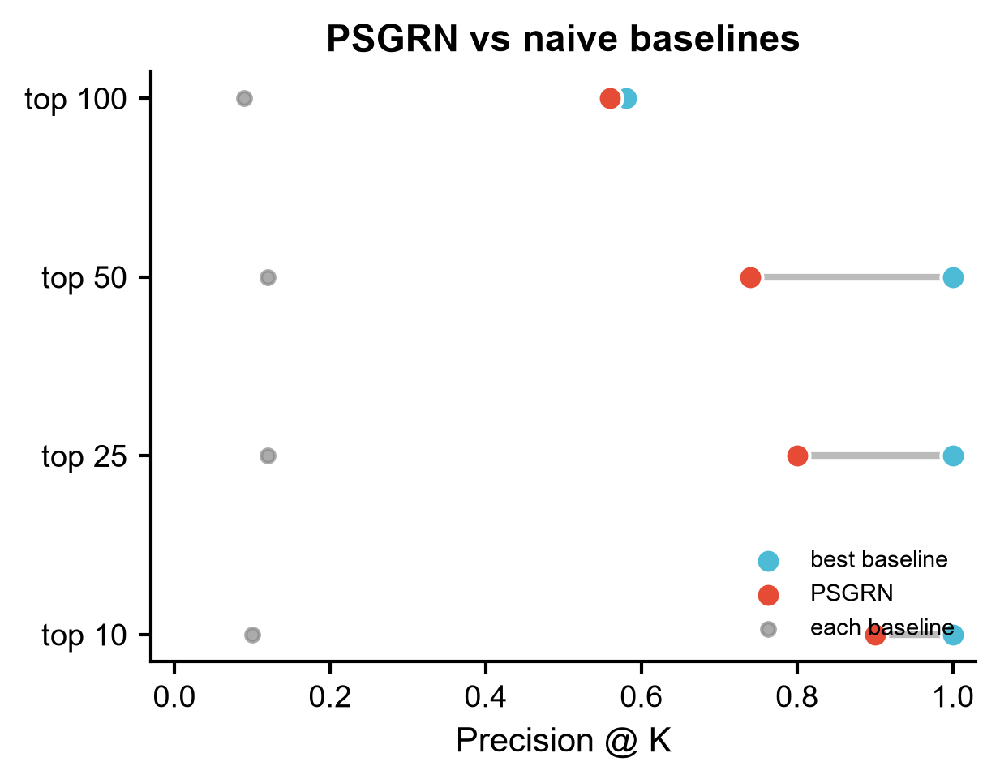
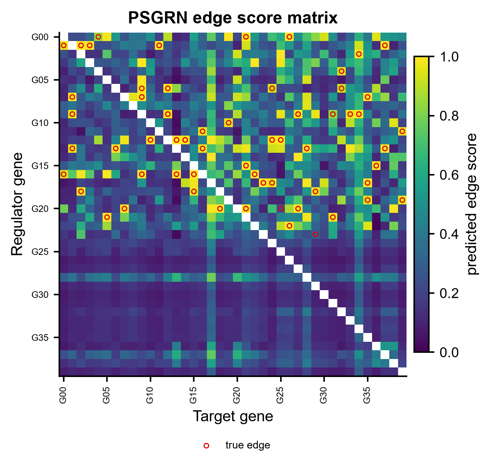

# 586 · PSGRN — 单细胞扰动数据的基因调控网络推断(自训练 + 合成金标准)

> 一句话定位:输入**带干预标签的单细胞表达矩阵**(CRISPRi/Perturb-seq 风格,含 `non-targeting` 对照)
> → 用**相关性造噪声金标准 + GBDT 自训练**把基因对重排 → 出**有向调控边列表**与
> **PR 曲线 / precision@K dumbbell / 打分热图**;并与两条朴素基线同图对照。

| | |
|---|---|
| **语言 / 主依赖** | Python · `numpy` `pandas` `scikit-learn` `lightgbm` `matplotlib`(全部本机已装) |
| **一句话用途** | 从扰动单细胞数据推断有向基因调控网络,并诚实对照朴素基线 |
| **输入** | `example_data/perturb_expression.csv`(+ 可选 `ground_truth_edges.csv`) |
| **输出** | `results/`(边列表 + `586_summary.json`) · 展示图见 `assets/` |
| **状态** | 🟡 本机零改动跑通并出图(算法忠实复现 + lightgbm 原超参);**上游官方 CausalBench 评测入口需另装 `causalscbench`**,已做守卫式封装 |

---

## ① 输入数据

**文件**:`perturb_expression.csv`(csv;行 = 单细胞,列 = 基因;首列为干预标签)

| 列名 | 类型 | 必需 | 示例 | 说明 |
|------|------|:---:|------|------|
| `intervention` | str | ✔ | `G03` / `non-targeting` | 该细胞被敲除(靶向)的基因名;对照细胞必须写 `non-targeting` |
| `<基因名>` × N | float | ✔ | `4.9201` | 该细胞中该基因的表达量(建议已归一化/对数化) |

**命名/格式约定**:
- 对照标签**必须**是 `non-targeting`(与上游 `src/main.py` 一致);缺失则脚本报错退出。
- 基因名**不要含下划线** `_`:上游用 `gene1_gene2` 拼接作为基因对索引,含 `_` 会导致拆分错位。
- 被敲除的基因必须同时出现在列名里(自身敲除效应 `f2` 依赖它)。

**样例(前 3 行,`#` 开头为注释行,读取时用 `comment="#"` 跳过)**:
```
# synthetic, for demo only — 非真实数据,仅用于冒烟测试与展示图
intervention,G00,G01,G02,...
non-targeting,4.9201,4.4398,4.8069,...
```

**可选真值**:`ground_truth_edges.csv`,两列 `From,To`。存在时脚本才做评估与出图;
没有真值就只导出各方法的 top-N 边列表。

## ② 方法 / 原理

PSGRN 的核心是**用相关性造一个"合成金标准",再让 GBDT 在这批噪声标签上自训练**,
把只含关联信息的排序,用**干预后的响应特征**重排成有向调控边。逐步对照上游
[`src/main.py`](https://github.com/GuanLab/PSGRN/blob/main/src/main.py):

1. **合成金标准** `get_topK_pairs(expression_matrix, T)`:对每个有序对 (g1→g2) 算细胞级
   `|Pearson|`;若 g1 被敲除过,先把对照细胞下采样到与干预细胞等量再拼接,让相关性带上干预方差。
   `|r| > T` 的对记为正样本(上游实际调用 `T = 0.1`)。
2. **成对特征** `create_dataset()`:按 `intervention` 分组求均值,每个有序对给 4 个标量特征 ——
   `f0` 对照下 g1 均值、`f1` 对照下 g2 均值、`f2` 敲除 g1 后 g1 自身均值(缺失记 0)、
   `f3` 敲除 g1 后 g2 均值(g1 未被敲除则 NaN)。造特征前对表达做整体 z-score。
3. **自训练** `train_lgb()`:LightGBM 二分类拟合上述噪声标签,再对**全部**基因对打分,
   取 top-N 作为网络(上游 `N = 1000` 即 PSGRN 1K,`N = 5000` 即 5K)。

**基线(库规矩:任何"更好"都必须有可跑对照)**
- **A 共表达 `|Pearson|`**:只用对照细胞,经典 GRN 起点,无方向、受共享潜因子混淆。
- **B 单变量干预效应**:`|mean(g2 | KO g1) − mean(g2 | ctrl)| / sd(ctrl)`。最"显然"的因果基线。
  PSGRN 若不能超过它,就不该在该数据上声称更好 —— 本模块示例中它**确实更强**(见 ⑤,如实报告)。

**忠实度与边界(诚实标注)**
- `get_topK_pairs` / `create_dataset` / `train_lgb` 三个函数按上游原文同名同结构重写;
  `LGB_PARAMS` 是上游 `Custom.__call__` 里写死的超参**逐字照抄**(仅把 `verbose: 0` 改为 `-1` 压日志)。
- 上游**官方入口**是 CausalBench 的 `causalscbench/apps/main_app.py --model_name custom
  --inference_function_file_path ./src/main.py`,而非直接 `import`;本机未装 `causalscbench`,
  故 `run_psgrn_upstream()` 只做**守卫式封装**:缺包时打印真实安装/运行命令并退出,**不伪造返回值**。
  上游真实签名(读自源码,非臆造):
  ```python
  class Custom(AbstractInferenceModel):
      def __call__(self, expression_matrix: np.array, interventions: List[str],
                   gene_names: List[str], training_regime: TrainingRegime,
                   seed: int = 0) -> List[Tuple[str, str]]
  ```
- ⚠ 本模块复现的是**算法**,不是上游在 CausalBench(weissmann_rpe1 / k562)上的评测数字;
  别拿本模块在合成数据上的结果替代原文报告值。

**引用(已核实)**
- Song X, Deng K, Chen M, Guan Y. *PSGRN: Gene regulatory network inference from single-cell
  perturbational data through self-training with synthetic gold standards.*
  **Science Advances** 2026 May;12(18):eaeb3376. doi:[10.1126/sciadv.aeb3376](https://doi.org/10.1126/sciadv.aeb3376) ·
  PMID **42054465** · PMCID PMC13127566
  (PMID 与 DOI 经 NCBI E-utilities esummary/efetch + Crossref 双向核对:标题、期刊、
  2026 年 5 月、卷 12 期 18、作者 Song/Deng/Chen/Guan 四方一致)
- **措辞注(避免过度陈述)**:上游 README 自述为 CausalBench Challenge 的 *winning solution*;
  论文摘要原文的措辞是 *"a top-performing method in the CausalBench Challenge"*。两处出处不同,
  本模块采用"优胜方案"这一不越界的说法。摘要中的 43% Wasserstein / 30% precision / 100% recall
  等增益是**原文在 CausalBench 八个数据集上的报告值**,与本模块合成数据的结果无关,勿混用。
- 上游仓库:https://github.com/GuanLab/PSGRN(API 读自 `README.md` 与 `src/main.py`,`main` 分支)
- 评测框架 CausalBench:https://arxiv.org/abs/2210.17283

## ③ 用途

回答:**"敲除基因 A 会不会直接影响基因 B?"** —— 从 Perturb-seq / CRISPRi 单细胞筛选数据里
恢复有向调控关系,而不是只给共表达模块。典型场景:

- 大规模 CRISPR 筛选后想要一张**有方向**的调控图谱,用于挑下游验证靶点;
- 判断某条共表达关系到底是**调控**还是**共享上游混杂**(基线 A vs PSGRN 的差距正是这个);
- 给虚拟扰动(CellOracle / RegVelo 等)提供 base-GRN 骨架,或与其结果做**独立引擎交叉验证**。

## ④ 特点 / 亮点

- **turnkey**:`python 586_psgrn_grn_inference.py` 一条命令跑完,`example_data/` 缺失时现场生成;
- **算法接地**:三个核心函数与 LightGBM 超参逐条对照上游源码,不臆造 API;
- **强制对照**:内置两条朴素基线,PR 曲线 / precision@K 同图呈现,**基线赢了也照报**;
- **顶刊图风**:统一 `_framework/pubstyle.py`,一次出矢量 PDF + 300 dpi PNG,**无条形图**
  (dumbbell / PR 曲线 / heatmap);
- **诚实边界**:上游官方评测入口做守卫式封装,缺包打印真实命令而非静默降级。

## ⑤ 输出结果图

| 文件 | 图型 | 说明 |
|------|------|------|
| `assets/fig1_pr_curves.png` | PR 曲线 | 三方法在全部有序基因对上的排序质量,含 AUPRC 与随机基准线 |
| `assets/fig2_precision_at_k.png` | dumbbell + dot | PSGRN 与"最佳基线"在 top-10/25/50/100 的 precision 位移 |
| `assets/fig3_score_matrix.png` | heatmap + 散点覆盖 | PSGRN 边打分矩阵(regulator × target),红圈标出真值边 |

`results/` 另出:`edges_psgrn.csv` / `edges_perturbation.csv` / `edges_co-expression.csv`
(各方法 top-N 边)与 `586_summary.json`(参数、后端、各方法 AUPRC 与 P@K)。







**示例数据上的实测(seed=0,40 基因 / 24 个被敲除 / 1260 细胞 / 60 条真值边)**:

| 方法 | AUPRC | P@10 | P@25 | P@50 | P@100 |
|---|---|---|---|---|---|
| Co-expression \|r\| | 0.059 | 0.10 | 0.12 | 0.12 | 0.09 |
| Perturbation effect | **0.955** | 1.00 | 1.00 | 1.00 | 0.58 |
| PSGRN (self-training) | 0.758 | 0.90 | 0.80 | 0.74 | 0.56 |

读法:PSGRN 与共表达基线拉开了一个数量级(0.758 vs 0.059),说明自训练确实把干预信息用上了;
但在这份**结构极简的合成数据**上,单变量干预效应基线更强 —— 合成数据里每条边都是独立可加的
均值偏移,正是该基线的最优假设,而 PSGRN 的优势(抗噪声、部分干预、间接效应去混淆)在这里
没有发挥空间。**换真实 Perturb-seq 数据前不要据此下结论**;要比较请跑上游的 CausalBench 评测。

---

## 运行

```bash
# 零改动跑示例(example_data 不存在会自动生成)
python 586_psgrn_grn_inference.py

# 换成自己的数据
python 586_psgrn_grn_inference.py --input data/你的.csv --truth data/真值.csv --outdir results/run1

# 常用参数
#   --T 0.1        合成金标准的相关性阈值(上游实际用 0.1)
#   --topN 1000    导出边数(上游 PSGRN 1K = 1000,5K = 5000)
#   --seed 0       随机种子
#   --run-upstream 探测上游官方 PSGRN 依赖并打印官方运行命令
```

## 依赖安装

本模块的可跑路径**无需安装任何东西**(numpy / pandas / scikit-learn / lightgbm / matplotlib 本机已具备)。
若 `lightgbm` 缺失,脚本自动退回 `sklearn.ensemble.HistGradientBoostingClassifier`
(参数对齐到同量级,属**替代实现**,会在日志与 `586_summary.json` 的 `gbdt_backend` 字段标明)。

跑**上游官方 PSGRN + CausalBench 评测**需另建环境(上游 README 原文):

```bash
conda create -n causal python=3.10 && conda activate causal
pip install causalbench==1.1.2
pip install lightgbm
pip uninstall causalbench -y          # 上游要求:装完依赖后卸掉,改用仓库内定制版 causalscbench
pip install pandas scikit-learn matplotlib seaborn scanpy --no-cache-dir
pip install numpy==1.24.4
pip install dask==2023.5.0 distributed==2023.5.0
git clone https://github.com/GuanLab/PSGRN
# 注:上游 README 写 python=3.10,但仓库内 environment.yml 实际锁的是 python=3.8.19
#     (并锁 lightgbm==4.5.0 / numpy==1.24.4 / pandas==2.0.3 / scikit-learn==1.3.2);
#     两者上游都给了,复现原文结果建议以 environment.yml 为准。上游许可证 = MIT (c) 2026 Guan Lab

export PYTHONPATH="./"
python causalscbench/apps/main_app.py \
    --dataset_name "weissmann_rpe1" --output_directory /path/to/output/ \
    --data_directory /path/to/data/ --training_regime "partial_interventional" \
    --fraction_partial_intervention 1.0 --model_name "custom" \
    --inference_function_file_path "./src/main.py" --do_filter
```
