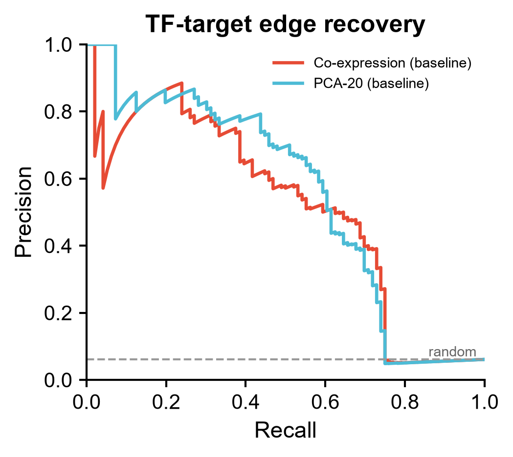
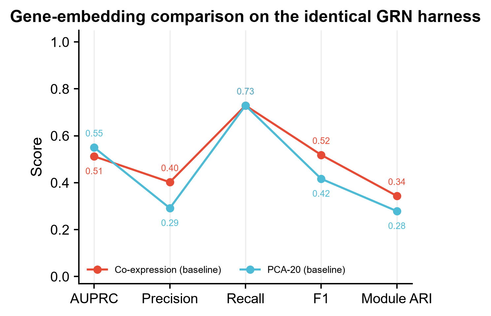
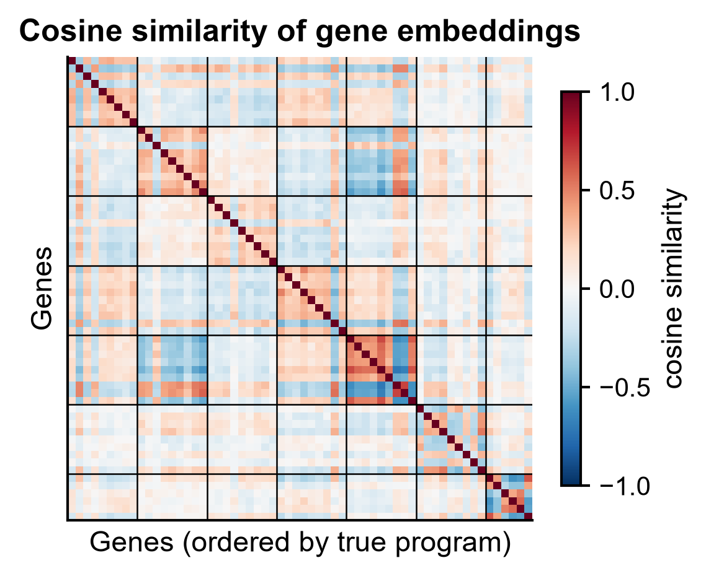
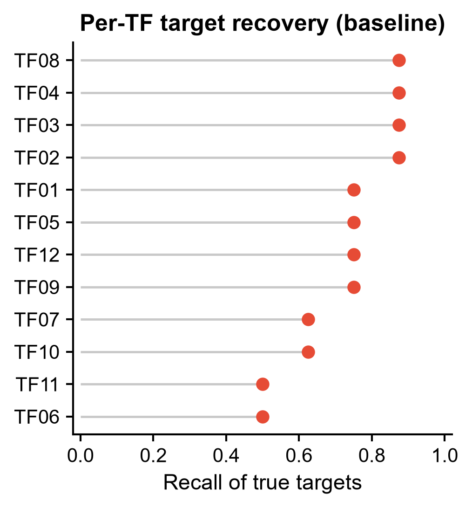

# 587 · RegFormer — GRN 重建评测台(Mamba 单细胞基础模型 vs 朴素基因嵌入)

把 **RegFormer**(GRN 先验 + Mamba 状态空间骨干的单细胞基础模型,Nat Commun 2026)的
**GRN 重建下游任务**拆成可复现的三步——**基因嵌入 → 余弦相似度 TF 有向图 → 谱聚类模块**——
并在同一套口径下,拿**朴素基因嵌入(共表达谱 / PCA)作为必跑基线**。
没装 RegFormer 也能零改动跑完;装了之后把它输出的 `gene_embedding.npy` 喂进来即可直接对比。

| | |
|---|---|
| 语言 / 主依赖 | Python 3.12 · `numpy` `pandas` `scikit-learn` `networkx` `matplotlib`(全部本机已有) |
| 输入 | cells×genes 计数 CSV + TF 名单;(可选)金标准边/模块;(可选)外部基因嵌入 `.npy` |
| 输出 | `results/` 边列表 + 模块 + 指标表 + JSON;`assets/` 4 张展示图 |
| 运行时长 | 示例数据 CPU 约 20 秒 |
| 状态 | 🟡 基线与评测链路本机零改动跑通出图;RegFormer 本体需 clone 仓库 + CUDA(守卫式探测) |

---

## ① 输入数据

| 文件 | 规格 | 说明 |
|---|---|---|
| `example_data/expression_counts.csv` | 行=细胞,列=基因,整数计数;首列为细胞名;`#` 开头为注释行 | 400 cells × 132 genes(合成) |
| `example_data/tf_list.txt` | 无表头,第 1 列为 TF symbol(制表符分隔) | 与上游 `tf_file` 格式一致,12 个 TF |
| `example_data/ground_truth_edges.csv` | `source,target` 两列 | **可选**,仅用于评测;真实数据没有就自动跳过评测 |
| `example_data/ground_truth_modules.csv` | `gene,module`,`module=-1` 表示不属任何调控程序 | **可选**,用于谱聚类 ARI |
| `--embedding` / `--gene-names` | `.npy`(genes×dims)+ 基因名 CSV | **可选**,可直接喂 RegFormer GRN 任务产出的 `gene_embedding.npy` + `gene_names.csv` |

`expression_counts.csv` 前 3 行(截断显示):

```
# synthetic, for demo only -- 400 cells x 132 genes, Poisson counts
cell,TF01,G001,G002,G003,G004,G005,G006,G007,G008,TF02,...
Cell0001,9,4,3,5,2,6,8,6,6,4,...
Cell0002,8,7,3,16,1,21,14,17,15,4,...
```

`tf_list.txt`:`TF01` / `TF02` / `TF03` …;`ground_truth_edges.csv`:`TF01,G001` / `TF01,G002` …

> 示例数据为 **synthetic, for demo only**:12 条 TF 调控程序 × 8 个靶基因 + 24 个未连基因,
> 表达量由 `mu = exp(base + 0.55·载荷·TF活性)` 经 Poisson 抽样生成,固定种子 42。
> 之所以造带金标准的数据,是因为 GRN 重建**没有对照就无法判断好坏**——真实数据上这一段自动关闭。

## ② 方法 / 原理

**RegFormer 的 GRN 下游任务实际在做什么(读上游源码所得,不是转述摘要):**
`downstream_task/regformer_grn.py::GrnTaskMamba` 先用 Mamba 主干抽出**基因嵌入**并存成
`gene_embedding.npy`,随后 `construct_grn()` 对嵌入算**余弦相似度**、**只允许 TF 作源节点**、
自相似置 −1、保留 **相似度 > 0.2** 的候选、每个 TF 取 **top-k = 20** 建有向边;
`evaluate_grn()` 再对邻接矩阵做 **SpectralClustering**(`affinity='precomputed'`,`random_state=42`,
`assign_labels='kmeans'`,k = 5…30 步长 5)切模块,并用 `gseapy.enrichr` 做富集。

也就是说:**基础模型只负责第一步(嵌入),后面整条链路与嵌入来源无关**。本模块正是利用这一点:

1. **归一化** — CPM-like(×1e4)+ `log1p`。
2. **基线嵌入 A · 共表达谱** — 基因嵌入 = 它自己的跨细胞中心化表达谱;在其上做余弦相似度
   ≈ 皮尔逊共表达,这是 GRN 推断几十年的默认地板。
3. **基线嵌入 B · PCA-20** — 对 基因×细胞 矩阵做 PCA。之所以必须报这一条:单细胞基础模型的
   zero-shot 嵌入在多项独立评测里**打不过 PCA**(Kedzierska et al., *Genome Biol* 2025),
   任何"基础模型更好"的说法都得先跨过这道线。
4. **构图** — 逐条复刻上游 `construct_grn` 的规则(阈值 0.2、top-k 20、TF-only 源),保证
   基线与 RegFormer 走**完全相同**的图构建口径,差异只来自嵌入本身。
5. **模块** — 对齐上游 `evaluate_grn` 的谱聚类参数,扫 k=5…30 取 ARI 最优。
   *诚实偏差*:上游把**有向**邻接直接交给 `affinity='precomputed'`,而 sklearn 要求对称亲和矩阵,
   本模块对称化为 `(A+Aᵀ)/2` 再聚类,已在代码注释标出。
6. **评测**(仅在给了金标准时) — TF→gene 全候选对按相似度排序算 **AUPRC**;
   对实际出的边算 **precision / recall / F1**;模块用 **ARI**。

**RegFormer 本体路径(`--run-regformer`,守卫式,不伪造)。** 脚本只探测仓库、`regformer` 包、
`mamba_ssm`、CUDA 是否齐备;缺任一项就打印真实原因与真实命令后退出,绝不用假输出顶替。
探测成功时打印的入口点全部读自 master 分支源码:

| 项目 | 实际值(读自源码,附行号;审计基准 commit `9618f1f`,2025-11-12) |
|---|---|
| CLI | `python downstream_task/regformer_grn.py --config_file grn.toml`(`regformer_grn.py` L403-410,参数名确为 `--config_file` 且 `required=True`) |
| 类 | `GrnTaskMamba(config_file, pad_token="<pad>", unk_token="<unk>", cls_token="<cls>")`(L35 / L41) |
| 方法 | `.get_gene_expression_embedding()` L171 · `.construct_grn(embeddings=None, top_k=20)` L202 · `.evaluate_grn(g_nx, gene_names=None)` L277 · `.run_grn_analysis()` L385 |
| 图规则 | 余弦相似度 L232 · 自相似置 −1 L246 · 阈值 `> 0.2` L249(**硬编码,非可配参数**)· top-k 取法 L252-254 · TF-only 源 L241 |
| 谱聚类 | L297 `range(5, 31, 5)` · L302-307 `SpectralClustering(affinity="precomputed", random_state=42, assign_labels="kmeans")` |
| TF 名单读法 | L220 `pd.read_csv(self.args.tf_file, header=None, sep="\t")[0].tolist()` |
| 产物 | `gene_embedding.npy` L195 · `gene_names.csv` L196 · `edges.csv` L393 · `grn_enrichment.csv` L379;落盘目录 = `save_dir/run_name`(L59) |
| 配置(toml)关键键 | `data_path` `vocab_file` `graph_path` `tf_file` `gene_sets` `load_model` `save_dir` `run_name` `model_name` `graph_sort` `max_seq_len` `n_bins` `device` —— 逐条见 `Docs/configs/grn_10k.toml` |

> **与上游的两处已知偏差(诚实标注,不掩饰)**
> 1. **孤立节点**:上游 L237 把 `G.add_nodes_from(genes)` 注释掉了,只有落到边上的基因进图;
>    本模块保留全部基因作节点,以便不同嵌入之间节点集一致、模块 ARI 可横向比较。**边集规则一致**。
> 2. **邻接对称化**:上游把**有向**邻接直接交给 `affinity='precomputed'`,而 sklearn 要求对称亲和矩阵,
>    本模块对称化为 `(A+Aᵀ)/2` 再聚类。
>
> 另注:上游 README「Installation」写的是 `cd RegFormer-Official`,但 clone 出来的目录名是
> `RegFormer`(上游笔误),本模块打印的安装命令已按实际目录名更正。

> **未固定的部分,照实说明**:RegFormer **不在 PyPI**(`https://pypi.org/pypi/regformer/json` 返回 404,
> 已实测),只能 clone 仓库运行;`regformer.model` / `regformer.graph` 等内部子模块的函数签名本模块
> **未逐一固定**,以官方仓库源码与 `Docs/` 下的 notebook 为准(仓库内实有 `Docs/grn.ipynb`
> `anno.ipynb` `cell_emb.ipynb` `drug.ipynb` `pert.ipynb` 五个 notebook 与 `Docs/configs/*.toml`
> 六个配置,已核目录;其内容本模块未逐格执行)。**预训练权重(`load_model`)需自行获取**——全仓库 grep 无
> Zenodo / figshare / HuggingFace 等权重下载直链,六个 toml 里给的是作者集群的绝对路径
> (`/home/share/huadjyin/...`)。`graph_path`(cisTarget 建的 DGL 图)情况不同:toml 里写的同样是集群
> 绝对路径,但**仓库内实际随附了同名文件 `graph/output_graph_no_cycles.dgl`(2.1 MB,已核)**,
> 把 `graph_path` 改指到它即可,无需另行获取。GPU 需求的依据是上游 `requirements.txt`
> 钉死 CUDA 构建(`torch==2.0.0+cuda11.6` `dgl==1.1.2+cu118` `mamba_ssm==1.1.1` `causal_conv1d==1.1.1`)
> 且 `grn_10k.toml` 中 `device = "cuda"`。上述 API 全部读自本地克隆的
> <https://github.com/BGIResearch/RegFormer> commit `9618f1f`(master)。

## ③ 用途

回答的科学问题是:**「用某个基因嵌入去重建 TF→靶基因调控网络,到底比朴素共表达强多少?」**

- 手上有 scRNA 表达矩阵 + TF 名单,想拿到一张 TF-anchored 的有向调控网络与基因模块划分;
- 已经跑了 RegFormer(或 scGPT / Geneformer 等任何能吐基因嵌入的模型),需要一个**中立、
  与模型无关的评测台**来判断它值不值得上——把 `.npy` 喂进来即可,图构建与指标口径完全一致;
- 写论文时需要一条**可辩护的基线**:审稿人问"和共表达/PCA 比呢",这个模块直接出图回答。

## ④ 特点 / 亮点

- **基线不是摆设,是主角**。默认路径完全不依赖 RegFormer,本机 CPU 二十秒跑完并出四张图;
  基础模型只是可插拔的第三条曲线。
- **口径可比**。构图与聚类参数逐条对齐上游源码(0.2 阈值、top-k 20、TF-only、谱聚类参数),
  换嵌入不换尺子,差异才归因得动。
- **带金标准的合成数据**,能真的算出 AUPRC / ARI,而不是只画一张看不出好坏的网络图。
- **守卫式引用封装**。RegFormer 缺依赖时打印真实安装命令与真实入口点,不模拟、不降级伪造。
- **全部非条形图**:PR 曲线 / slopegraph / heatmap / lollipop。

## ⑤ 输出结果图

| 文件 | 内容 |
|---|---|
| `results/edges_<emb>.csv` | 有向边列表(`nx.to_pandas_edgelist` 格式,同上游 `edges.csv`) |
| `results/modules_<emb>.csv` | 谱聚类模块归属(ARI 最优的 k) |
| `results/per_tf_recall.csv` | 每个 TF 的真实靶基因召回 |
| `results/metrics_table.csv` | 各嵌入的 AUPRC / precision / recall / F1 / ARI 汇总 |
| `results/587_summary.json` | 全部参数、指标与 RegFormer 探测结果 |
| `assets/fig1_pr_curve.png` | TF→靶基因边恢复的 precision-recall 曲线(含随机基线线) |
| `assets/fig2_metric_slopegraph.png` | 各嵌入在同一评测台上的多指标 slopegraph |
| `assets/fig3_similarity_heatmap.png` | 基因-基因余弦相似度热图,按真实调控程序排序 |
| `assets/fig4_tf_recall_lollipop.png` | 每个 TF 的靶基因召回 lollipop |






示例数据上的实测结果(种子 42):共表达基线 AUPRC 0.512 / F1 0.519 / 模块 ARI 0.344;
PCA-20 基线 AUPRC 0.550 / F1 0.417 / ARI 0.279(随机水平 = 边的先验比例 0.061)。
两条地板都远高于随机——**这就是基础模型需要跨过的高度**。

## 运行

```bash
# 零改动即跑(读 example_data/,写 results/ 与 assets/)
python 587_regformer_grn_mamba_fm.py

# 换自己的数据
python 587_regformer_grn_mamba_fm.py \
  --counts data/counts.csv --tf-file data/hs_hgnc_tfs.txt --outdir results/run1

# 把 RegFormer 的嵌入喂进同一评测台对比
python 587_regformer_grn_mamba_fm.py \
  --embedding <save_dir>/<run_name>/gene_embedding.npy \
  --gene-names <save_dir>/<run_name>/gene_names.csv

# 探测 RegFormer 环境(不伪造输出)
python 587_regformer_grn_mamba_fm.py --run-regformer --repo-dir /path/to/RegFormer
```

主要参数:`--top-k`(默认 20,上游默认值)、`--sim-thr`(默认 0.2,上游默认值)、
`--n-pcs`(默认 20)、`--truth-edges` / `--truth-modules`(不给则跳过评测)。随机种子固定为 42。

## 依赖安装

基线路径**无需安装任何东西**,本机 Python 3.12 已具备 `numpy` `pandas` `scikit-learn`
`networkx` `matplotlib`。

RegFormer 本体(需 CUDA;`mamba_ssm` 无 CPU 实现,不在 PyPI):

```bash
git clone https://github.com/BGIResearch/RegFormer
cd RegFormer          # 上游 README 写作 cd RegFormer-Official,实际目录名是 RegFormer
conda create -n regformer python=3.9 && conda activate regformer
pip install -r requirements.txt        # 仓库 README 注明约需 45 分钟
```

## 引用

Hu L, Qin H, Zhang Y, Lu Y, Qiu P, Guo Z, Cao L, Jiang W, Shen Y, Chen Q, Shang Y, Xia T,
Deng Z, Xu X, Zhao H, Fang S, Li Y, Zhang Y. **RegFormer: a single-cell foundation model
powered by gene regulatory hierarchies.** *Nat Commun*. 2026 May 5;17(1):6432.
doi:10.1038/s41467-026-72198-x · PMID 42086551 · PMCID PMC13376892

> 引用已核实:PMID 42086551 经 NCBI E-utilities `esummary` + `efetch` 查得,题名 / 18 位作者 /
> 期刊 / 卷期页 / DOI / PMCID 与上表逐项一致(2026 May 5;17(1):6432)。
> 摘要原文可核的数字只有一条:**预训练于 2500 万(25 million)人类单细胞、覆盖 45 个组织**;
> 本模块与本 README **不引用任何其他论文数字**(基准表、性能提升幅度等一概未复述)。
> 注意仓库 README 里给的自引写作 "Hu, L. et al. (2025)",与正式发表信息(Nat Commun 2026)不同,
> 以上以 PubMed 记录为准。

仓库:<https://github.com/BGIResearch/RegFormer>(MIT,默认分支 `master`)
