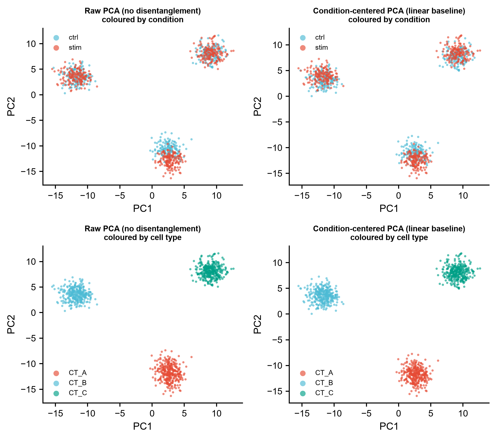
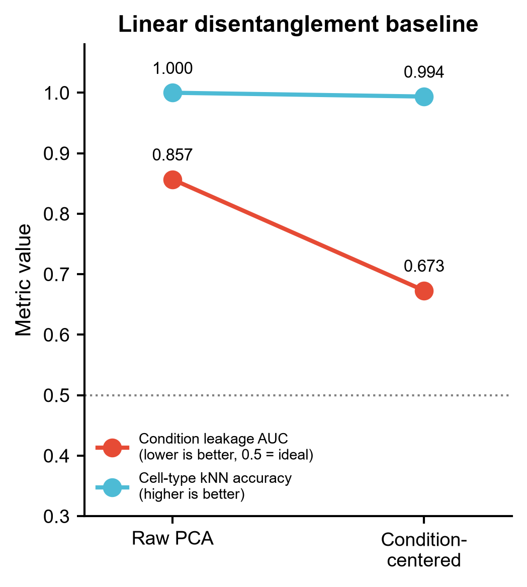
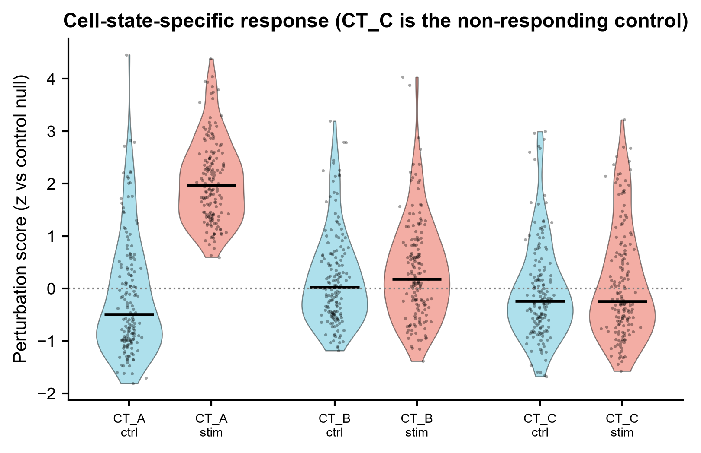
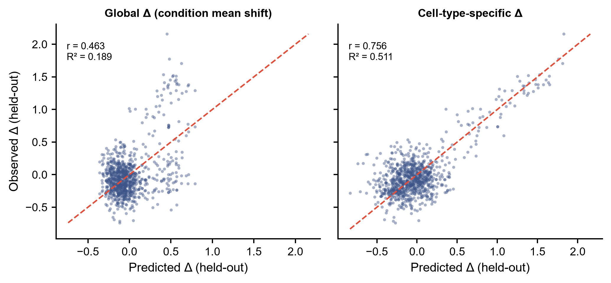
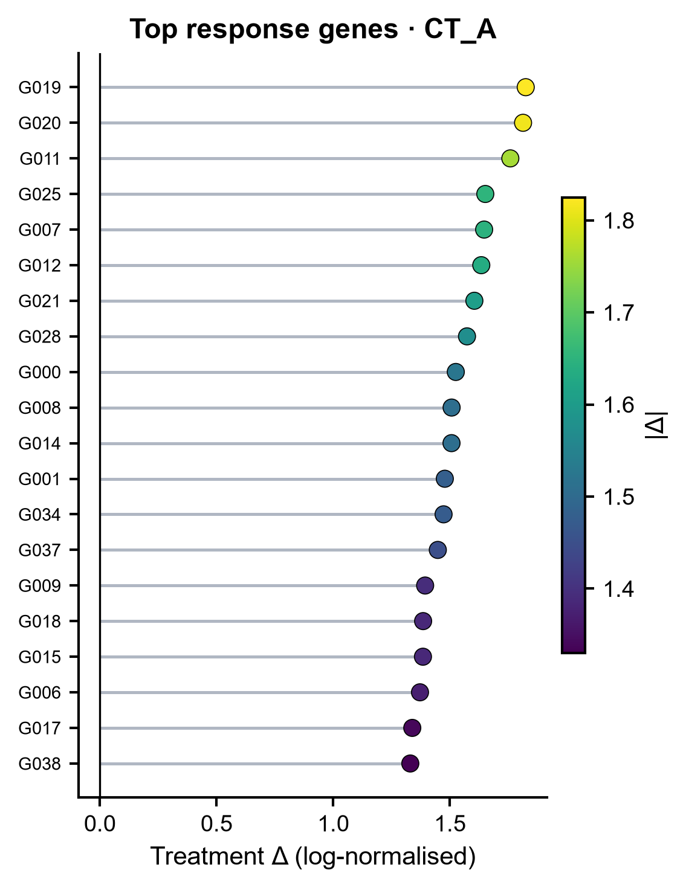

# 588 · scCausalVI 因果解耦扰动响应 (causal disentanglement of perturbation response)

> 一句话定位:输入 **case-control 单细胞计数矩阵(ctrl / stim + 细胞类型 + batch)** → 把
> **细胞固有状态(background)** 与 **处理诱导效应(treatment effect)** 分开、做 **跨条件反事实预测**
> 与 **响应细胞识别** → 出 **背景嵌入散点 / 解耦指标 slopegraph / 响应打分小提琴 / 反事实散点 /
> top 响应基因 lollipop**。**默认跑的是可复现的线性基线**,scCausalVI 深度模型为守卫式可选路径。

| | |
|---|---|
| **语言 / 主依赖** | Python ≥3.10 · 基线:`numpy` `scipy` `scikit-learn` `matplotlib`(本机已装,零安装即跑)· 完整方法:`scCausalVI`(需 pip 安装,含 `scvi-tools` `torch`) |
| **一句话用途** | 区分"细胞本来就不一样"与"处理把细胞改成了什么样",并预测反事实条件下的表达 |
| **输入** | `example_data/synthetic_counts.npz`(计数矩阵 + condition/cell_type/batch 标签) |
| **输出** | `results/`(指标 CSV + 每细胞打分 + summary.json)· 展示图见 `assets/` |
| **状态** | 🟡 基线本机零改动跑通出图;scCausalVI 深度模型路径需 `pip install scCausalVI`,**本机未安装、未实跑** |

---

## ① 输入数据

**文件**:`example_data/synthetic_counts.npz`(npz;行 = 细胞,列 = 基因;**synthetic, for demo only**)

| 数组 | 类型 | 必需 | 形状/示例 | 说明 |
|------|------|:---:|------|------|
| `X` | float32 | ✔ | `(960, 300)` | **原始计数**(不要传归一化后的值,scCausalVI 的 `setup_anndata(layer=...)` 要 count data) |
| `condition` | str | ✔ | `ctrl` / `stim` | case-control 条件标签,其中一个是对照(`--control`,默认 `ctrl`) |
| `cell_type` | str | ✔ | `CT_A`… | 细胞类型;基线里用于"细胞类型特异 Δ"与解耦指标评估 |
| `batch` | int | ✖ | `0` / `1` | 技术批次;可传给 scCausalVI 的 `batch_key` |
| `gene_names` | str | ✖ | `G000`… | 基因名,用于 lollipop 标注 |
| `true_responder` | bool | ✖ | `True/False` | **仅示例数据有**:真值标签,只用于事后评估 AUROC,不参与任何打分 |

**命名/格式约定**:`condition` 里必须存在 `--control` 指定的对照名;`X` 必须是整数计数。

**样例(前 3 行,X 的前 6 列)**:
```
X:            [[3. 2. 2. 1. 6. 4.]
               [1. 7. 1. 1. 2. 0.]
               [2. 5. 3. 2. 3. 2.]]
cell_type:    ['CT_A' 'CT_A' 'CT_A']
condition:    ['ctrl' 'ctrl' 'ctrl']
batch:        [0 1 0]
```

示例数据的设计意图(见 `example_data/README.txt`):处理效应是**细胞类型特异**的 ——
CT_A 强响应、CT_B 中等响应、**CT_C 完全不响应(阴性对照细胞类型)**,batch 与 condition 正交。
这正是"全局差异表达会失真"的场景,用来给方法一个有真值的检验台。

## ② 方法 / 原理

### A. 线性基线(默认执行,本机依赖即可跑通)

本库规矩:任何声称"更好"的深度模型都必须先跟朴素对照比。单细胞扰动预测领域已有明确证据表明
深度模型常常打不过线性基线,因此这里把基线做成**必跑项**而非可选项:

1. **背景表示**:`raw PCA`(不解耦)vs `condition-centered PCA`(每个条件各自减去基因均值后再 PCA,
   即"线性去处理效应")。
2. **解耦指标**(全部 5 折交叉验证的**外样本**预测,避免同一批细胞既拟合又评估的循环分析):
   - `condition_leakage_auc` —— 用背景表示预测 condition 的 AUC,取 `max(auc, 1-auc)`(方向无关,
     能解码出来就是泄漏);**0.5 = 理想,越低越好**。
   - `celltype_knn_acc` —— kNN(k=15)预测细胞类型准确率;**越高说明固有细胞状态保留得越好**。
3. **反事实预测基线**:`global Δ`(全体 stim-ctrl 基因均值差)vs `celltype Δ`(按细胞类型各算一份)。
   按 `celltype × condition` 分层把细胞对半分为拟合集/**留出集**,只在留出集上比较预测 Δ 与观测 Δ
   (Pearson r / R²)——**防数据泄漏**。
4. **响应细胞打分**:每个细胞到 control 流形的 kNN 平均距离,用 control→control 的同类距离作零分布
   做 z 标准化。这是 scCausalVI `responsive_cells()`「处理引起的偏移要跟生成模型自身重构不确定性比」
   思路的非参数替身;不使用任何标签,所以与真值 AUROC 的评估不循环。

### B. scCausalVI 真实路径(`--run-sccausalvi`,需安装)

scCausalVI 用**深层结构因果网络**学两组隐变量:background factors(细胞固有状态)与
treatment-effect factors(处理诱导的、细胞状态特异的转录改变),同时建模技术变异,支持
cross-condition in-silico 预测与响应细胞识别。

**API 来源(逐符号核对上游源码,标注 文件:行号;未臆造)**:

上游仓库已克隆到本地核对(`ShaokunAn/scCausalVI`,`setup.py` 声明 version **0.0.11**,MIT License)。
下表每一行都能在源码里指出定义位置:

| 本模块的调用 | 上游定义位置(文件:行号) | tutorial 是否演示 |
|---|---|:---:|
| `from scCausalVI import scCausalVIModel` | `scCausalVI/__init__.py:3`(导入)、`:16`(`__all__`) | ✔ |
| `scCausalVIModel(adata, condition2int, control, n_background_latent=10, n_te_latent=10, n_layers=2, n_hidden=128, dropout_rate=0.1, use_observed_lib_size=True, use_mmd=True, mmd_weight=1.0, norm_weight=0.3, gammas=None)` | `model/scCausalVI.py:54` | ✔ |
| `scCausalVIModel.setup_anndata(adata, layer=None, batch_key=None, condition_key=None, size_factor_key=None, categorical_covariate_keys=None, continuous_covariate_keys=None)` | `model/scCausalVI.py:116`(`@classmethod`) | ✔ |
| `model.train(group_indices_list, max_epochs=None, use_gpu=None, train_size=0.9, validation_size=0.1, batch_size=128, early_stopping=False, plan_kwargs=None, **trainer_kwargs)` | `model/base/training_mixin.py:9` | ✔ |
| `model.get_latent_representation(adata=None, indices=None, give_mean=True, batch_size=None)` → `tuple[ndarray, ndarray]`(background, treatment-effect) | `model/scCausalVI.py:162`(返回见 `:249`) | ✔ |
| `model.get_count_expression(adata=None, indices=None, target_batch=None, batch_size=None)` → `AnnData` | `model/scCausalVI.py:387` | ✔ |
| `model.get_count_expression_cross_condition(source_condition, target_condition, target_batch=None, adata=None, indices=None, batch_size=None)` → `AnnData` | `model/scCausalVI.py:499` | ✔ |
| `model.get_latent_representation_cross_condition(source_condition, target_condition, adata=None, indices=None, give_mean=True, batch_size=None)` → `tuple[ndarray, ndarray]` | `model/scCausalVI.py:252` | ✖ 仅源码 |
| `model.responsive_cells(adata, treatment_condition, control_condition, responsive_label='if_responsive', multi_test_correction=False, target_sum=1e4)` → 只含 treatment 细胞的 `AnnData`(标签写在 `.obs['if_responsive']`,另有 `.obs['-log p values']`) | `model/scCausalVI.py:683` | ✖ 仅源码 |
| `condition2int = adata.obs.groupby(key, observed=False)['_scvi_condition'].first().to_dict()` | tutorial 原样写法;`_scvi_condition` 来自 `setup_anndata` 注册的 `CONDITION_KEY='condition'`(`model/base/_utils.py:15`)加 scvi 的 `_scvi_` 前缀 | ✔ |

其他来源:官方 tutorial 只有一份 —— `docs/source/tutorial/scCausalVI-ifnb.ipynb`(IFN-β 刺激 PBMC,ifnb 数据经 `gdown` 从 Google Drive 下载);
上游 README 指向文档站 https://sccausalvi.readthedocs.io/en/latest/tutorial.html;`docs/source/api.md` 是**空文件**(无 API 文档正文)。

据此固定下来的真实接口(本模块 `run_sccausalvi()` 按此顺序调用):

```python
from scCausalVI import scCausalVIModel                      # 包唯一导出的类

scCausalVIModel.setup_anndata(adata, condition_key='condition', layer='counts',
                              batch_key=None)               # 可选 batch_key / size_factor_key
condition2int = adata.obs.groupby('condition', observed=False)['_scvi_condition'].first().to_dict()
group_indices_list = [np.where(cond == g)[0] for g in conditions]

model = scCausalVIModel(adata, condition2int=condition2int, control='ctrl',
                        n_background_latent=10, n_te_latent=10,
                        n_layers=2, n_hidden=128,
                        use_mmd=True, mmd_weight=10, norm_weight=0.2)
model.train(group_indices_list, use_gpu=..., max_epochs=200)

latent_bg, latent_te = model.get_latent_representation()
model.get_latent_representation_cross_condition(source_condition=..., target_condition=...)
model.get_count_expression_cross_condition(source_condition=..., target_condition=...)
model.responsive_cells(adata, treatment_condition='stim', control_condition='ctrl')
```

> **诚实标注**:上述签名逐字取自上游源码(行号见上表),但**本机没有安装 scCausalVI,这条路径
> 未在本机实跑验证** —— 只保证「调用的符号与参数名在上游确实存在」,不保证运行时行为。
> `train()` 的 `use_gpu` 是 scCausalVI 自己 mixin 的参数(`training_mixin.py:13`),
> 内部转成 `accelerator='gpu'/'cpu'` 传给 `scvi.train.TrainRunner`,因此不受 scvi-tools 弃用
> `use_gpu` 的影响;但上游把 `scvi-tools>=0.16.1` 放得很宽,过新的 scvi-tools 是否仍兼容未验证。
> 包未安装时脚本会优雅跳过并打印真实安装命令,绝不伪造结果。

## ③ 用途

回答这三类问题:

- **"这群细胞和对照不一样,是它本来就不一样,还是被处理改的?"** —— 背景 / 处理效应解耦。
- **"如果这群 stim 细胞没被处理,它长什么样?"(反事实)** —— cross-condition 预测,可用于
  在缺失组合(某细胞类型只测了一个条件)上补齐、或做 in-silico 扰动。
- **"哪些细胞真的响应了?响应的分子特征是什么?"** —— 响应细胞识别 + 细胞类型特异的响应基因。

典型场景:药物/细胞因子刺激的 case-control scRNA、疾病 vs 健康对照、免疫治疗响应者分层。
上游论文在 COVID-19 数据上做的就是识别处理响应群体与易感性分子特征。

## ④ 特点 / 亮点

- **基线是必跑项,不是装饰**:线性对照(global Δ / celltype Δ / 条件中心化 PCA)与深度模型同框报告;
  即使不装 scCausalVI,`python 588_*.py` 也能跑完出全部图。
- **有真值的示例数据**:细胞类型特异响应 + 阴性对照细胞类型 CT_C + 与条件正交的 batch,
  可以直接看出方法有没有把"不响应的细胞"误判成响应。
- **防循环分析**:解耦指标走 5 折交叉验证外样本;反事实 Δ 在留出细胞上评估。
- **API 不臆造**:所有 scCausalVI 调用都能在本地克隆的上游源码里指出 文件:行号(见 ②B 的表),
  并标明哪些方法只在源码里、官方 tutorial 并未演示;未验证之处明写未验证。
- **绘图**:散点 / slopegraph / 小提琴+抖动点 / lollipop,**无条形图**;统一走 `_framework/pubstyle.py`,
  一次出矢量 PDF + 300dpi PNG,图内文字英文。

## ⑤ 输出结果图

| 文件 | 图型 | 说明 |
|------|------|------|
| `assets/fig1_background_embedding.png` | 散点(2×2) | 原始 PCA vs 条件中心化 PCA,分别按 condition / cell type 上色 |
| `assets/fig2_disentanglement_slopegraph.png` | slopegraph | 条件泄漏 AUC 与细胞类型 kNN 准确率在两种表示间的变化 |
| `assets/fig3_response_score_violin.png` | 小提琴 + 抖动点 | 每细胞扰动打分,按细胞类型 × 条件;CT_C 为不响应对照 |
| `assets/fig4_counterfactual_scatter.png` | 散点(留出集) | 预测 Δ vs 观测 Δ,global 与 celltype 两种线性反事实模型对比 |
| `assets/fig5_top_response_genes_lollipop.png` | lollipop | 响应最强细胞类型的 top 20 响应基因 |

`results/`(运行生成,不入库):`disentanglement_metrics.csv`、`per_cell_perturbation_score.csv`、
`celltype_treatment_deltas.csv`、`588_summary.json`;若跑了 scCausalVI 路径还会有
`sccausalvi_latent_bg.npy`、`sccausalvi_latent_te.npy`、`sccausalvi_responsive_cells.csv`。







**本机示例数据实跑结果**(seed=42,960 细胞 × 300 基因):

| 项 | 值 |
|---|---|
| 条件泄漏 AUC:raw PCA → 条件中心化 | 0.857 → 0.673(仍未到 0.5,线性解耦不彻底 —— 这正是留给因果模型的空间) |
| 细胞类型 kNN 准确率:raw → 中心化 | 1.000 → 0.994 |
| 反事实 Δ:global vs celltype | r 0.463 / R² 0.189 → r 0.756 / R² 0.511 |
| 响应细胞 AUROC(基线,对真值) | 0.753 |

---

## 运行

```bash
# 零改动跑示例(自动生成 example_data,若已存在则直接读)
python 588_sccausalvi_causal_perturbation.py

# 换自己的数据(npz:X / condition / cell_type,可选 batch / gene_names)
python 588_sccausalvi_causal_perturbation.py --input data/mydata.npz --control ctrl --outdir results/run1

# 追加真实 scCausalVI 路径(需先 pip install scCausalVI;未装则优雅跳过)
python 588_sccausalvi_causal_perturbation.py --run-sccausalvi --max-epochs 200
```

参数:`--input` `--outdir` `--assets` `--control` `--n-pcs` `--run-sccausalvi` `--max-epochs`。
随机种子固定为 42。

## 依赖安装

基线所需(`numpy` `scipy` `scikit-learn` `matplotlib`)本机已具备,**无需安装**。

完整方法(本模块未在本机安装,故未实跑):

```bash
pip install scCausalVI
# 或开发版
pip install git+https://github.com/ShaokunAn/scCausalVI.git
```

上游 `setup.py`(version **0.0.11**,`python_requires=">=3.9"`,MIT License)与 `requirements.txt`
声明:`numpy>=1.23.5,<2.0`、`scvi-tools>=0.16.1`、`torch>=2.0.0`、`anndata>=0.10.3`、
`scanpy>=1.9.6`、`pandas>=2.1.1`、`pytorch-lightning>=1.5.10`、`gdown>=5.2.0` 等
(以上逐条取自本地克隆的 `setup.py` / `requirements.txt`)。
**注意本机 numpy 是 2.4.6,与上游 `numpy<2.0` 约束冲突,应在独立 conda 环境或服务器上安装**,
不要污染当前环境。训练建议 GPU。

## 引用

An S, Cho JW, Cao K, Xiong J, Hemberg M, Wan L. **scCausalVI disentangles single-cell
perturbation responses with causality-aware generative model.** *Cell Systems* 2025;16(11):101443.
doi:10.1016/j.cels.2025.101443 · PMID **41197632** · PMCID PMC12616520

> 引用状态:**已核实**。PMID 41197632 经 NCBI E-utilities `esummary` 查得,标题、期刊
> (Cell Syst 2025 Nov 19, 16(11):101443)、作者、DOI `10.1016/j.cels.2025.101443` 与
> 上游 README 指向的 Cell Systems 文章(pii S2405-4712(25)00276-5)一致。

- 代码仓库:https://github.com/ShaokunAn/scCausalVI
- 复现仓库:https://github.com/ShaokunAn/scCausalVI-reproducibility
- 文档:https://sccausalvi.readthedocs.io/en/latest/

## 与库内相关模块的关系

| 模块 | 引擎 | 扰动逻辑 |
|---|---|---|
| 069 CellOracle | GRN + 向量场信号传播 | 把 TF 敲成 0,传播,打分状态迁移 |
| 507 Geneformer | 基础模型嵌入 | 删基因,量嵌入位移 |
| 561 RegVelo | GRN 耦合剪接动力学 | regulon 扰动 → CellRank 命运 |
| **588 scCausalVI** | **结构因果生成模型(条件标签驱动)** | **不敲基因,而是把"处理"当因果变量,做跨条件反事实** |

588 与前三者假设不同:它需要的是**真实存在的 case-control 条件标签**,不需要 GRN、不需要
spliced/unspliced、不需要预训练权重;它给不出"敲掉某个基因会怎样",但能给出"没被处理会怎样"。
两类问题不要互相替代。
