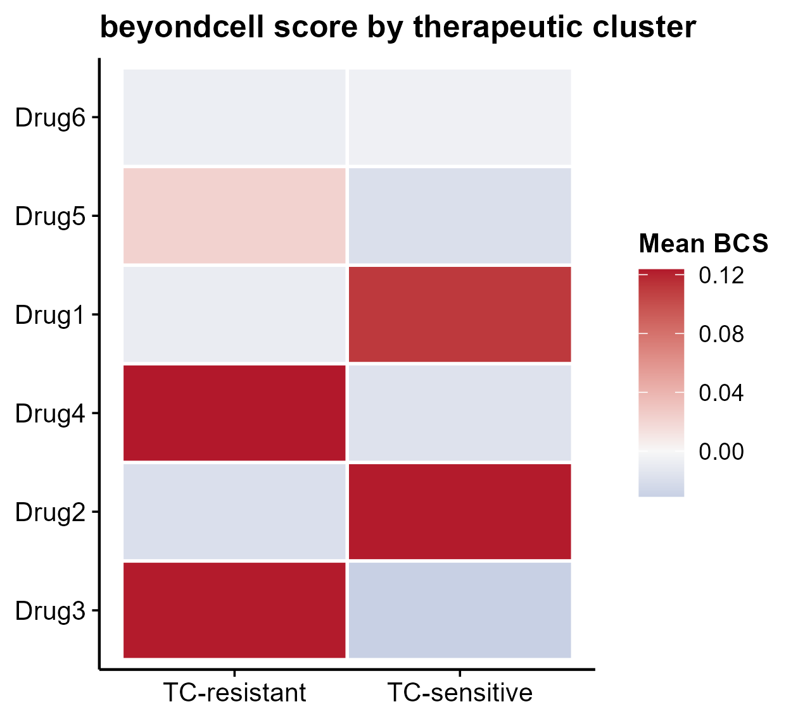

# 518 · beyondcell single-cell drug response

Reproduces the **beyondcell** core: score every cell for drug perturbation signatures
(BCS = UCell(up) − UCell(down)), group cells into **therapeutic clusters** from their
BCS profiles, and rank drugs by between-group BCS difference — revealing which drugs
separate sensitive vs resistant subpopulations.

| | |
|---|---|
| Language / deps | R · `ggplot2` (+ shared `theme_pub.R`) |
| Purpose | Drug-response heterogeneity & therapeutic clusters from scRNA |
| Input | synthetic scRNA (sensitive/resistant) + 6 drug signatures |
| Output | `results/` BCS + ranking; `assets/` heatmap + lollipop + UMAP |

## Input

Demo `beyondcell_demo.rds` is generated on first run: a gene × cell matrix with two
states, plus per-drug `up`/`down` signature gene lists. For real data supply a Seurat/
expression matrix and drug signatures (LINCS / beyondcell PSc-SSc collections).

## Method

1. **BCS** per cell per drug = `UCell(up) − UCell(down)` (rank-based signature score).
2. **Therapeutic clusters** = k-means on the (cell × drug) BCS matrix.
3. **Drug ranking** = group difference of BCS (sensitive − resistant) with Wilcoxon p.

## Use

Find drugs predicted to act on a specific malignant/resistant subpopulation, and
stratify cells into therapeutic clusters. Complements modules 070 (chemCPA) / 071 (scDrug).

## ⚠️ Full version on the server

This turnkey module **re-implements the BCS core** (only `ggplot2` + `UCell`-style
scoring) so it runs without the heavy package. For production install the real one:

```r
# real beyondcell (not installed locally; install on the analysis server)
# BiocManager::install("beyondcell")          # or remotes::install_github("cnio-bu/beyondcell")
```

Then use its curated **PSc/SSc drug-signature collections** and `bcRanks()` /
`bcRegressOut()` for batch correction, instead of the synthetic signatures here.

## Outputs

| File | Type | Description |
|------|------|------|
| `results/drug_ranking.csv` | table | drugs ranked by ΔBCS + Wilcoxon p |
| `results/BCS_by_therapeutic_cluster.csv` | table | mean BCS per therapeutic cluster |
| `assets/bcs_heatmap.png` | heatmap | drug × therapeutic cluster BCS (RdBu) |
| `assets/drug_lollipop.png` | lollipop | differential drug response (ΔBCS) |
| `assets/bcs_umap.png` | scatter | top-drug BCS over the cell embedding |



## Run

```bash
Rscript 518_beyondcell_drug_response.R
```

## Dependencies

```r
install.packages("ggplot2"); BiocManager::install("UCell")  # core scorer is built-in
```
