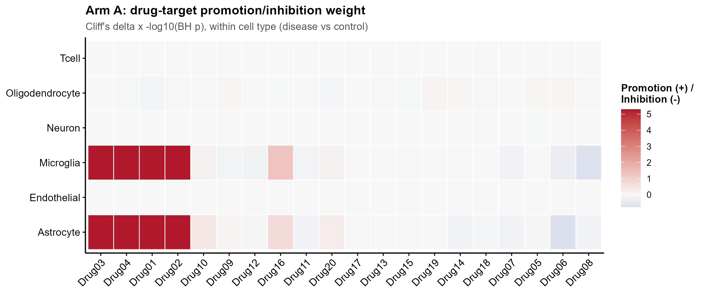
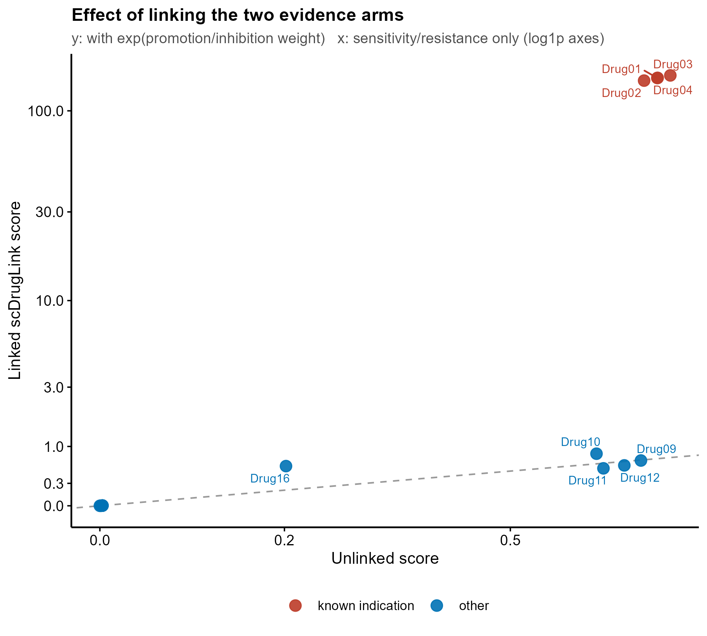
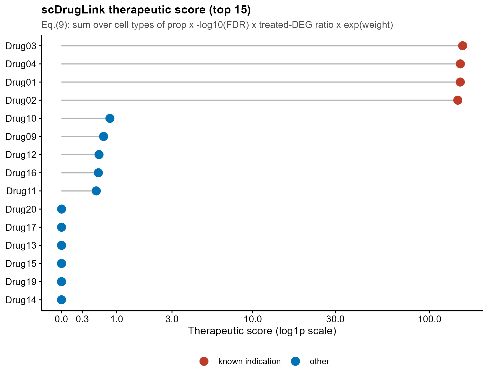
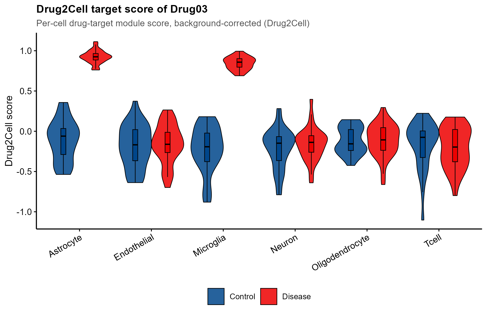

# 589 · scDrugLink 单细胞药物重定位

把**药物-靶点**证据(促进/抑制)与**药物-扰动签名**证据(敏感/耐药)在**细胞类型层面**
相乘串联(linking),得到全图谱与细胞类型两级的药物治疗评分排序。

| | |
|---|---|
| 语言 / 依赖 | R · `ggplot2`(+ 共享 `theme_pub.R`);`Seurat` 可选(有则用 `FindMarkers` 做 DEG) |
| 用途 | 疾病 scRNA 图谱 → 药物重定位打分与排序(细胞类型级 + 全图谱级) |
| 输入 | log-normalised 表达矩阵 + 细胞注释 + 药物靶点表 + 药物扰动签名(+ 已知适应症标签) |
| 输出 | `results/` 8 个 csv(d2c / 权重 / FDR / 评分 / 评估);`assets/` 4 张图 |
| 状态 | 🟡 A 臂(靶点)与 linking 公式**本机零改动跑通**;B 臂完整版需服务器装 Asgard + CMAP L1000 |

**上游**:Huang L, Lu X, Chen D. *scDrugLink: Single-Cell Drug Repurposing for CNS Diseases via
Computationally Linking Drug Targets and Perturbation Signatures.* IEEE J Biomed Health Inform.
2026 Jun;30(6):4535-4547. **PMID 40100675**,**DOI 10.1109/JBHI.2025.3552536**
(经 NCBI E-utilities esummary 核实)。源码 <https://github.com/LHBCB/scDrugLink>,
本地克隆 `C:/Users/fsy/Desktop/upstream-sources/589_scDrugLink/`。
实际逐行读过的上游文件:`R/build_drug_target_d2c.R`、`R/compute_drug_prom_inh.R`、
`R/get_intra_cell_type_degs.R`、`R/compute_drug_sens_res.R`、`R/compute_scdruglink_score.R`、
`NAMESPACE`、`DESCRIPTION`、`README.md`、`reproducibility/run_scDrugLink.R`、
`reproducibility/compute_eval_metrics.R`。上游包自带 273 个 CNS 药物的靶点表
`data/cns_drug_targets.csv`(274 行 = 表头 + 273 药,列 = `drug_name`,`gene_names`)与
标签表 `data/cns_drug_labels.csv`(列 = `drug_name`,`ad_label_final`,`gbm_label_final`,
`ms_label_final`)。上游 `DESCRIPTION`:`Imports: Asgard, Seurat, cmapR, effsize`,
`Depends: R (>= 3.5)`;`NAMESPACE` 只导出上述 5 个函数;**许可证 = PolyForm
Noncommercial 1.0.0(仅限非商业用途)**,复用时需注意。

### 上游调用 ↔ 源码位置对照

本模块**不 import 上游包**(上游依赖 Asgard + 数十 GB CMAP 数据),而是按源码复刻算法。
下表把本脚本每一步对应到克隆源码的确切位置,便于核对:

| 本模块步骤 | 上游源码位置 | 核对结论 |
|---|---|---|
| Step 1 `build_d2c()` | `R/build_drug_target_d2c.R:15-92`(`n_bins=25`,`ctrl_size=50`,`seed=42`) | 分档/抽样/相减逐行一致,默认值一致 |
| Step 2 Wilcoxon + Cliff's delta | `R/compute_drug_prom_inh.R:48-68`(`p_vals + 1e-6` 后 `p.adjust("BH")`,`weight = cliff × -log10(p_adj)`) | 一致(含 +1e-6 的位置) |
| Step 3 DEG | `R/get_intra_cell_type_degs.R:32-34`(`FindMarkers` → `score/adj.P.Val/P.Value`) | 一致;上游同样 `< 3` 细胞跳过(:27-30) |
| Step 4 B 臂 | `R/compute_drug_sens_res.R:17-25` 调 `Asgard::GetDrugRef` / `Asgard::GetDrug`(`repurposing.unit="drug"`,`connectivity="negative"`,`drug.type="FDA"`) | **上游确有此调用**;但 Asgard 本机未克隆,其函数签名未独立核验,故本模块不冒充等价实现(见下方边界声明) |
| Step 5 linking | `R/compute_scdruglink_score.R:231`(`(cluster_prop/100)*(-log10(fdr))*treated_degs_ratio*exp(weight)`)、`:44-45` 簇比例、`:83-101` `CombineP` | 公式、`cluster_sizes > 3` 过滤、Fisher 合并均一致 |
| 评估 AUROC/AUPR | `reproducibility/compute_eval_metrics.R:20-27`(ROCR `auc` + PRROC `pr.curve` 的 `auc.integral`) | 口径一致;本模块用 base R 等价实现(Mann-Whitney U / 梯形 PR),不引 ROCR/PRROC |
| Eq.(7)、Eq.(7-9) 提法 | `man/compute_drug_prom_inh.Rd:22`、`man/compute_scdruglink_score.Rd:48` | 编号来自上游 roxygen 文档原文 |

---

## ① 输入数据

| 文件 | 规格 | 说明 |
|---|---|---|
| `expr_lognorm.csv` | 基因 × 细胞,首列基因名 | **log-normalised** 表达(Seurat `NormalizeData` 后的 `data` 层) |
| `cell_meta.csv` | 细胞 × 2,列 `cell`,`cell_type`,`disease` | `disease` 取值须含 `--disease` 与 `--control` 两个标签 |
| `drug_targets.csv` | 列 `drug_name`,`gene_names` | 靶基因用 `;` 分隔(与上游 `cns_drug_targets` 同格式) |
| `drug_perturb_signature.csv` | 基因 × 药物,首列基因名 | 药物扰动响应 z 值(真数据= CMAP L1000 Level5) |
| `drug_labels.csv` | 列 `drug_name`,`known_label` | 可选,仅用于 AUROC/AUPR 评估(对应上游 `cns_drug_labels`) |

样例前 3 行(`example_data/`,**synthetic, for demo only**):

```
# cell_meta.csv
"cell","cell_type","disease"
"C0001","Microglia","Disease"
"C0002","Microglia","Disease"

# drug_targets.csv
"drug_name","gene_names"
"Drug01","G213;G236;G226;G203;G234;G209;G212;G231;G227;G225;G210;G230"
"Drug02","G232;G201;G212;G211;G238;G210;G214;G202;G205;G221;G240;G216"
```

合成数据设计:400 基因 × 360 细胞 × 6 细胞类型(每类 30 病 / 30 对照),20 个药物。
疾病程序只发生在 Microglia 与 Astrocyte;Drug01–04 既靶向疾病上调基因**又**有反向扰动签名
(阳性药),Drug05–08 签名同向(应被压低),Drug09–12 只有弱反向签名、靶点随机
(**只有 B 臂证据的诱饵**,用来看 linking 是否把它们压住)。

> **接真数据**:`expr` 从 Seurat 对象取 —— v4 `dat@assays$RNA@data`(上游写法),
> v5 需改用 `GetAssayData(dat, assay = "RNA", layer = "data")`;`cell_type` / `disease`
> 两个 meta 列名是上游硬性约定(见 `reproducibility/run_scDrugLink.R` 的标准化步骤)。

## ② 方法 / 原理

严格按上游源码分四步 + 一步串联:

1. **Drug2Cell 靶点打分**(`R/build_drug_target_d2c.R`,上游注明是 Kanemaru 等 Drug2Cell
   Python 流程的 R 实现,PMID 37438528):每药靶点组等权平均表达 `X·W`,再减去
   **同表达档背景**(Seurat `AddModuleScore` 式:按平均表达 rank 分 `n_bins=25` 档,
   每档随机抽 `ctrl_size=50` 个基因作对照)`control_profiles·drug_weights`。
2. **A 臂 促进/抑制**(`R/compute_drug_prom_inh.R`):在**每个细胞类型内部**,把该药的
   Drug2Cell 分在 病 vs 对照 之间做 Wilcoxon 秩和 → BH 校正;效应量用 Cliff's delta;
   `weight = delta × (−log10 p_adj)`(论文 Eq.7)。正 = 促进,负 = 抑制。
3. **细胞类型内 DEG**(`R/get_intra_cell_type_degs.R`):`Seurat::FindMarkers` 默认 wilcox,
   取 `score = avg_log2FC`、`adj.P.Val = p_val_adj`。
4. **B 臂 敏感/耐药**(`R/compute_drug_sens_res.R`):DEG 与药物扰动签名做**反向表达模式
   匹配 + K-S 检验**,给出每个 (细胞类型, 药物) 的 p / FDR。
5. **linking**(`R/compute_scdruglink_score.R`,论文 Eq.7–9):

   ```
   score(drug) = Σ_celltype (cluster_prop/100) × (−log10 FDR) × treated_DEG_ratio × exp(weight)
   treated_DEG_ratio = #{ −DEG_score × mean_drug_response > 0 } / #treatable_DEG
   ```

   跨细胞类型的 p 用 Fisher 合并(上游 `CombineP`:`χ² = −2Σln p`,`df = 2k`),再 BH。
   本模块额外算一份 **`drug_score_unlinked`**(把 `exp(weight)` 换成 1),用来直接看
   linking 带来的重排——即论文卖点的可视化。

### ⚠️ 实现边界(诚实声明)

* **A 臂 + Drug2Cell + linking 公式**:按上游源码逐步复刻,仅需 base R + ggplot2,本机跑通。
* **B 臂**:上游调 `Asgard::GetDrugRef` / `Asgard::GetDrug`,需要 CMAP L1000 GSE70138 +
  GSE92742 的 gctx(数十 GB)与组织特异 `rankMatrix`,**本机未装、未跑**。本脚本会先探测
  `Asgard` + `cmapR`:装了就提示改走上游函数;没装则退回**内置 CMap 式 KS 反向连接基线**
  (Lamb et al., Science 2006 的连接性打分思想 + 500 次基因标签置换求 p,BH 校正)。
  它**不是** `Asgard::GetDrug` 的等价实现,只保证管道可跑通、公式可演示。
  另需说明:`GetDrugRef` / `GetDrug` 的调用与参数写法出自上游
  `R/compute_drug_sens_res.R:17-25` 原文,**Asgard 包本身本机未克隆,其函数签名与返回
  结构未经独立核验** —— 上服务器跑完整版前请以 Asgard 官方源码为准。
* **Cliff's delta**:`effsize` 本机未装,用其 estimate 的定义式
  `(#x>y − #x<y)/(n1·n2)`(经 Mann-Whitney U 换算)内置实现。
* **上游两处 `drug_name_lower` 相关缺陷(读源码时实测,非推断)**:
  1. `R/build_drug_target_d2c.R:23-24` 按 `drug_target_df$drug_name_lower` 循环,但上游
     自带的 `cns_drug_targets`(`data/cns_drug_targets.rda`,实测 273 行)只有
     `drug_name` / `gene_names` 两列 —— 按 `reproducibility/run_scDrugLink.R:21` 的用法
     直接传入,该循环会对 `NULL` 迭代 0 次、`targets` 为空。使用者需自行补一列
     `drug_name_lower <- tolower(drug_name)`。
  2. `R/build_drug_target_d2c.R:89` 引用了未作为参数传入的全局 `drug_label_df`
     (只在 `reproducibility/plot.R:2` 与 `reproducibility/run_DrugReSC.R:5` 里从
     `data/drug_labels_273.csv` 读入,而该 csv 不在仓库中),函数单独调用会报
     object not found。`reproducibility/compute_eval_metrics.R:31` 同样按
     `cns_drug_labels$drug_name_lower` 合并,而该对象也无此列。

  本模块因此全程直接用 `drug_name` 作键,不做大小写回填,规避这两处。

## ③ 用途

* 有**病 vs 对照**的疾病 scRNA 图谱时,给候选药做重定位打分与排序;
* 定位「哪一类细胞在支撑这个药的得分」(`results/cell_type_drug_scores.csv`),
  区分泛细胞类型药与细胞类型特异药;
* 判断某药在疾病细胞中是被**促进**还是**抑制**(A 臂权重热图),避免只看签名反转的假阳性;
* 有已知适应症标签时,直接算 AUROC / AUPR 做方法对比(上游
  `reproducibility/compute_eval_metrics.R` 的评估口径)。

## ④ 特点 / 亮点

* **两类证据在细胞类型层面相乘**,不是简单取交集:`exp(weight)` 让"在病细胞里被促进"
  的药获得指数级放大,只有扰动签名反转的诱饵药被压住(见 `linking_effect_scatter.png`)。
* **细胞比例加权**:每个细胞类型的贡献乘 `cluster_prop/100`,罕见细胞类型不会主导排序。
* **双层输出**:全图谱评分 + 细胞类型评分矩阵,一次拿到"用哪个药 / 打哪类细胞"。
* **自带对照**:同时输出 unlinked 评分与两者的 AUROC/AUPR,linking 的增益可量化而非口述。
* 全流程零重包依赖,`--key value` 换数据即跑;图全部 lollipop / heatmap / 散点 / violin,无条形图。

## ⑤ 输出结果

| 文件 | 类型 | 说明 |
|---|---|---|
| `results/drug_target_d2c.csv` | 矩阵 | Drug2Cell 分数(药物 × 细胞) |
| `results/prom_inh_weight.csv` | 矩阵 | A 臂促进/抑制权重(细胞类型 × 药物) |
| `results/prom_inh_padj.csv` | 矩阵 | A 臂 BH 校正 p |
| `results/sens_res_fdr.csv` | 矩阵 | B 臂反向连接 FDR(细胞类型 × 药物) |
| `results/connectivity_score.csv` | 矩阵 | B 臂 KS 连接性分数(负 = 反转疾病签名) |
| `results/drug_scores.csv` | 表 | 全图谱治疗评分 + unlinked 对照 + Fisher 合并 p / FDR |
| `results/cell_type_drug_scores.csv` | 矩阵 | 细胞类型级评分(药物 × 细胞类型) |
| `results/eval_metrics.csv` | 表 | AUROC / AUPR(linked vs unlinked) |
| `assets/prom_inh_heatmap.png` | heatmap | A 臂权重,RdBu 发散 |
| `assets/drug_score_lollipop.png` | lollipop | Top 15 治疗评分(log1p 轴) |
| `assets/linking_effect_scatter.png` | 散点 | unlinked vs linked,展示 linking 重排 |
| `assets/d2c_violin_top_drug.png` | violin | 头名药 Drug2Cell 分在各细胞类型 病/对照 的分布 |






本机实跑结果(合成数据,种子 42):4 个阳性药(Drug01–04)排在最前,linked 分数
142.8–151.8,unlinked 0.712–0.757;只有 B 臂证据的诱饵药(Drug09–12)unlinked
0.633–0.657(与阳性药同一量级),linked 只有 0.62–0.84 —— 两组的**分离度**从
unlinked 的约 1.2 倍拉开到 linked 的约 180 倍,这是散点图 `linking_effect_scatter.png`
要说明的事。A 臂热图也只在 Microglia / Astrocyte 两个"患病"细胞类型上给 Drug01–04
高权重,与合成数据的埋点一致,可作管道方向的 sanity check。

⚠️ 但 **AUROC / AUPR 在 linked 与 unlinked 上都等于 1**(见 `results/eval_metrics.csv`):
本合成数据的阳性药在两种打分下都已完全可分,所以这里的评估指标**测不出 linking 的增益**,
只能确认管道方向正确。linking 的实际收益需在真实图谱 + 真实适应症标签上评估,
上游论文的对比结果以原文为准。

## 运行

```bash
Rscript 589_scdruglink_drug_response.R
# 换数据
Rscript 589_scdruglink_drug_response.R \
  --expr my_expr.csv --meta my_meta.csv --targets my_targets.csv \
  --sig my_sig.csv --labels my_labels.csv \
  --disease GBM --control control --outdir results/gbm
```

其他参数:`--n_bins 25`(背景分档数)、`--ctrl_size 50`(每档对照基因数)、
`--n_perm 500`(B 臂基线的置换次数)。随机种子固定 42。

## 依赖安装

本模块只需:

```r
install.packages("ggplot2")     # 必需
install.packages("Seurat")      # 可选:有则用 FindMarkers 做 DEG,无则用内置等价实现
```

要在服务器上跑**上游完整版**(B 臂走 Asgard + 真 CMAP L1000):

```r
install.packages("devtools"); devtools::install_github("lanagarmire/Asgard")
BiocManager::install("cmapR"); install.packages(c("effsize", "Seurat"))
devtools::install_github("lhbcb/scDrugLink")
```

外加下载 CMAP L1000 GSE70138 / GSE92742 的 gctx 与 sig/gene/cell info,
用 `Asgard::PrepareReference()` 生成组织特异参考(以上安装命令与 `PrepareReference`
调用均照抄上游 `README.md` 的 Installation 与 Tutorial 步骤 1)。
另注意上游包许可证为 **PolyForm Noncommercial 1.0.0**,仅授权非商业使用。

> 若要直接调上游 `build_drug_target_d2c()`,须先给 `cns_drug_targets` 补
> `drug_name_lower` 列,并在全局定义 `drug_label_df`(见上文「实现边界」两处缺陷)。
