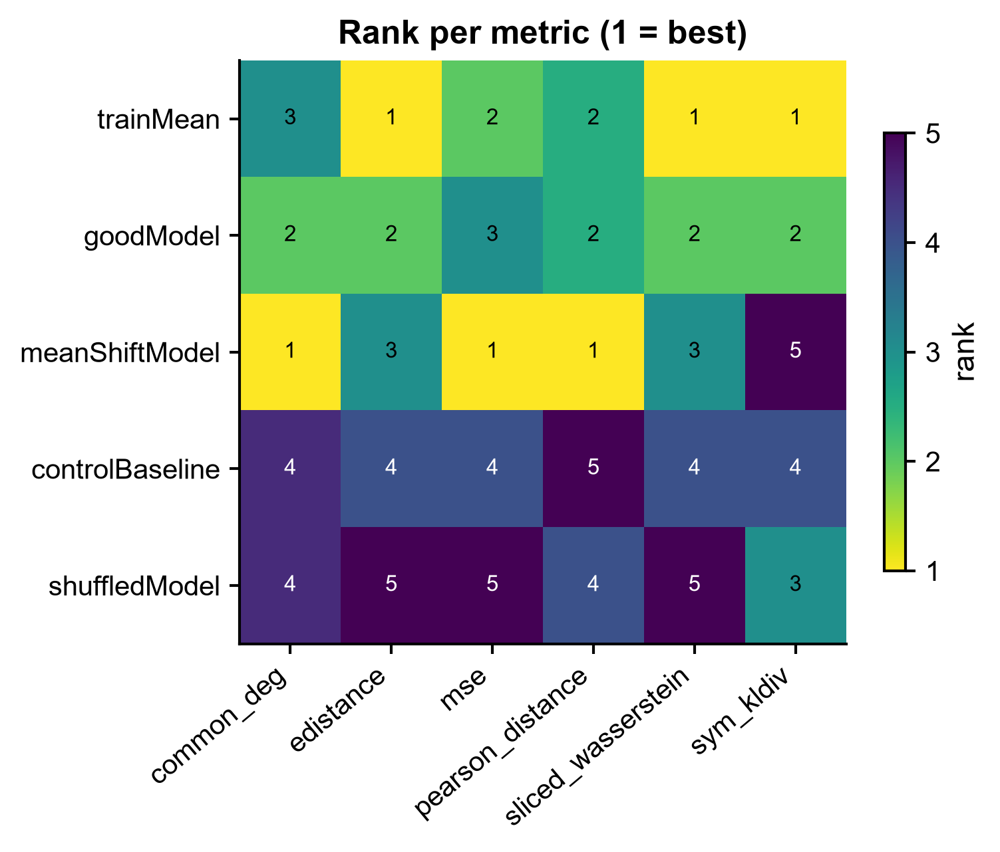
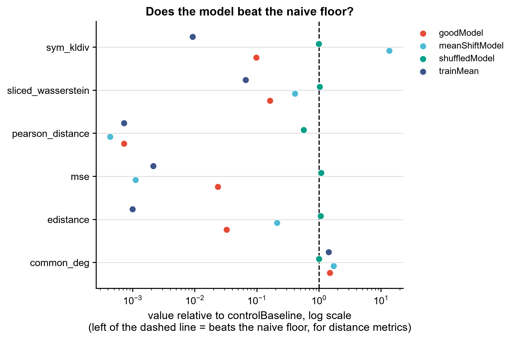
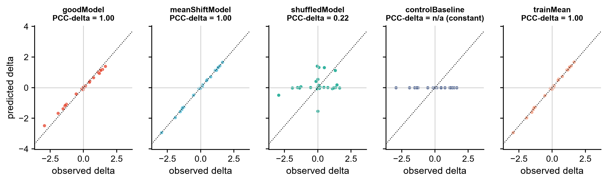

# 590 · scPerturBench — 扰动预测的评测尺(generalization benchmark metrics)

> 一句话定位:**输入**你自己的单细胞扰动预测(predicted)+ 真实观测(observed)→ **按
> scPerturBench(Nat Methods 2026)的同一套指标打分,并强制和朴素基线对照** → **出**
> 排名热图 / 相对基线点图 / delta 散点,回答唯一重要的问题:**你的模型真的赢过
> "什么都不预测"和"预测训练集均值"吗?**

| | |
|---|---|
| **语言 / 主依赖** | Python 3.12 · `numpy` `pandas` `scipy`(全部本机已装,**零额外安装**) |
| **一句话用途** | 给扰动预测结果打分 + 对照朴素基线,判断深度模型是否名副其实 |
| **输入** | `example_data/observed.csv` + `example_data/predicted.csv` |
| **输出** | `results/performance.tsv` `rank_matrix.csv` `summary.json` · 展示图见 `assets/` |
| **状态** | 🟡 本机零改动跑通并出图;上游同名 `wasserstein` 指标需自行装 `pertpy`(守卫路径) |

> ⚠️ **本模块不安装、不复现 scPerturBench 的 27 个预测方法**(上游用 Podman 镜像分发,
> 重型 + GPU)。它复用的是该 benchmark 的**评测层**。这是刻意的取舍:我们需要的是那把尺子。

---

## ① 输入数据

### 文件 1:`observed.csv`(真实观测,行=细胞,列=基因)

| 列名 | 类型 | 必需 | 示例 | 说明 |
|------|------|:---:|------|------|
| `cell_id` | str | ✔ | `ctrl_0000` | 细胞唯一 ID |
| `group` | str | ✔ | `control` / `stimulated` | **只允许这两个值**;对应上游 obs 列里的 control/stimulated |
| `<gene>` | float | ✔ | `4.2377` | 一列一个基因,已 normalize + log 的表达值 |

**样例(前 3 行,列已截断)**:
```
cell_id,group,G000,G001,G002,...
ctrl_0000,control,4.2377,3.2065,4.1338,...
ctrl_0001,control,3.6737,2.7860,4.6161,...
```

### 文件 2:`predicted.csv`(候选模型的预测,行=细胞,列=基因)

| 列名 | 类型 | 必需 | 示例 | 说明 |
|------|------|:---:|------|------|
| `cell_id` | str | ✔ | `goodModel_0000` | 细胞唯一 ID |
| `method` | str | ✔ | `goodModel` | 方法名;**同一个文件里可以放多个方法**,按此列分组 |
| `<gene>` | float | ✔ | `3.6039` | 基因列必须**覆盖** `observed.csv` 的全部基因列 |

**样例(前 3 行,列已截断)**:
```
cell_id,method,G000,G001,G002,...
goodModel_0000,goodModel,3.6039,1.1176,4.8397,...
goodModel_0001,goodModel,4.1656,1.1172,4.9005,...
```

**约定**:预测细胞数不必等于真实细胞数(分布型指标允许不等样本量);示例数据为
`synthetic, for demo only`,见 `example_data/README.md`。

---

## ② 方法 / 原理

### 流程

1. **train/eval 切分(防数据泄漏)**:把 `stimulated` 细胞随机对半切开。**评估用的
   ground truth 只用 eval 半**;`trainMean` 基线与 DEG 基因选择只看 train 半。
2. **构造朴素基线**(本模块的核心纪律,自动加入排名):
   - `controlBaseline` — 把 held-out 的 control 细胞**原样**当作预测,即"**什么都没发生**"。
     对齐上游 `baseControl.py:23`(`imputed_adata = control_adata.copy()`,方法名 `controlMean`)。
   - `trainMean` — 训练集 stimulated 的 per-gene **均值**,配上 control 的 per-gene
     **标准差**做高斯采样。对齐上游 `trainMean.py:9-13, 36`(`generateExp` →
     `np.random.normal(loc=train_mean[i], scale=control_std[i], size=cellNum)`)。
     ⚠️ 上游**不是**把均值广播成常数矩阵 —— 它带 control 方差的噪声,所以分布型指标
     在上游是有定义的,不会因零方差被特判。
3. **按 top-N DEG 子集基因**:用 Welch t 统计量在 control vs stim_train 上排序取 top-N
   (上游用预计算的 `DEG_hvg5000.pkl`,取 top 100 / 5000,见 `calPerformance.py:98,135`)。
4. **仅分布型指标子采样至 2000 细胞**:上游 `calPerformance.py:109` 的分支条件是
   `metric in ['edistance','wasserstein','mean_var_distribution','sym_kldiv']`,
   `mse` / `pearson_distance` 用全量细胞。本模块照抄该条件(`SUBSAMPLED_METRICS`),
   `f_subSample` 内 `np.random.seed(42)`。
5. **打分**,长表输出,格式对齐上游 `performance.tsv`。

### 指标(公式逐行对齐 pertpy 源码)

| 指标 | 方向 | 定义 | 与上游关系 |
|---|:--:|---|---|
| `mse` | ↓ | pseudobulk 均值向量差的 L2 平方 / 基因数 | 同名,`MeanSquaredDistance` |
| `pearson_distance` | ↓ | `1 - pearsonr(delta_pred, delta_true)`,delta = 减 control 均值 | 同名,论文里的 **PCC-delta** |
| `edistance` | ↓ | `2*between − within_X − within_Y`(平均两两欧氏距离) | 同名,`Edistance` |
| `sym_kldiv` | ↓ | 逐基因高斯假设下的对称 KL 取均值,再 `log2(x+1)` | 同名,含上游同款 log2 变换 |
| `sliced_wasserstein` | ↓ | 随机方向投影后的 1D W2 取均值 | ⚠️ **不是**上游的 `wasserstein` |
| `common_deg` | ↑ | 全基因空间里 top-N DEG 的重叠比例 | ⚠️ 本库自定义口径 |

**两条诚实声明:**

- **`sliced_wasserstein` 不等于上游的 `wasserstein`。** pertpy 的 `wasserstein` 是
  `ott-jax` 的 Sinkhorn 熵正则 OT(`reg_ot_cost`),本机无 `ott-jax`,故换成刻意改名的
  可本地计算的替代量。**只能用于同一批方法之间横向排序,不可与论文表格数值直接比较。**
  装了 `pertpy` 后加 `--use-pertpy` 可拿到上游同名同实现的值。
- **`common_deg` 口径未确认。** scPerturBench README 列出了 "Common-DEGs",但已发布的
  `calPerformance*.py` 三个脚本里**没有**它的实现代码(已逐个读过)。此处为本库自定义,
  不保证与论文数值一致。

### 实际读过的上游 API 来源(非臆造)

全部经**本地克隆的源码逐行核对**(非仅读 README):

| 本模块的用法 | 上游源码位置(文件:行) |
|---|---|
| `Distance(metric=, layer_key='X')` | `pertpy/tools/_distances/_distances.py:218-225`(`__init__` 确有 `metric` / `layer_key` 形参);导出于 `pertpy/tools/__init__.py:8` |
| `.onesided_distances(adata, groupby, selected_group, groups)` | `_distances.py:523-535`(四个形参名逐字一致) |
| 上游调用点 | `scPerturBench/Cellular_context_generalization/o.o.d./calPerformance.py:108-116`;`Perturbation_generalization/calPerformance_genetic.py:109-116`(后者 `groupby="Expcategory"`) |
| `metrics` 五元组 | `calPerformance.py:153` |
| `calculateDelta`(pearson 前减 control 均值) | `calPerformance.py:22-30`,调用于 `:101-102` |
| `sym_kldiv` 后取 `log2(x+1)` | `calPerformance.py:114-116` |
| `f_subSample` 2000 细胞 + `seed=42` | `calPerformance.py:58-77` |
| `mse` 公式 | `_distances.py:1017-1026`(`MeanSquaredDistance.__call__`) |
| `pearson_distance` 公式 | `_distances.py:1078`(`PearsonDistance.__call__`) |
| `edistance` 公式 | `_distances.py:868-872`(`Edistance.__call__`) |
| `sym_kldiv` 公式(`epsilon=1e-8`) | `_distances.py:1164-1175`(`SymmetricKLDivergence.__call__`) |
| `wasserstein` = Sinkhorn `reg_ot_cost` | `_distances.py:961-987`(`WassersteinDistance`,依赖 `ott-jax`) |
| `controlBaseline` / `trainMean` 基线定义 | `baseControl.py:23` / `trainMean.py:9-13,36` |

上游许可证:**GPL-3.0**(`scPerturBench/LICENSE`)。本模块不分发上游代码,只复现其**评测口径**。

上游真实调用签名(已核对):

```python
Distance = pt.tools.Distance(metric=metric, layer_key='X')
pairwise_df = Distance.onesided_distances(
    adata, groupby="perturbation", selected_group='imputed', groups=["stimulated"])
perf = round(pairwise_df['stimulated'], 4)
if metric == 'sym_kldiv':
    perf = np.log2(perf + 1)
```

`--use-pertpy` 走的就是这个签名(守卫式:import 失败则打印真实安装命令后跳过,不静默降级)。

---

## ③ 用途

回答这些问题:

- 我训的 / 我用的扰动预测模型(CellOracle、GEARS、scGPT、CPA、biolord…),**在我自己的
  数据上**,到底有没有赢过 `controlBaseline` 和 `trainMean`?
- 多个候选方法之间怎么排序?哪个指标下赢、哪个指标下输?
- 审稿人问"你和简单基线比过吗" —— 这里出的 `fig2` 就是答案。

**这是记忆里那条铁律的执行工具**:*DL 扰动模型常常打不过线性/朴素基线*。任何声称"我们的
模型更好"的结论,都应该先过这把尺子。

---

## ④ 特点 / 亮点

- **零额外安装即可跑完整流程**:指标全部用 `numpy/scipy` 本地实现,公式逐行对齐 pertpy 源码。
- **基线是强制的,不是可选的**:`controlBaseline` / `trainMean` 由脚本自动构造并参与排名,
  你无法"忘记"加对照。`summary.json` 直接给出 `X/N metrics beat controlBaseline`。
- **防数据泄漏**:train/eval 切分,DEG 选择与 trainMean 只看 train 半。
- **指标不一致性可见**:示例里 `meanShiftModel` 在 MSE / PCC-delta 上排第 1,在
  `sym_kldiv` 上垫底 —— 单看一个指标会得出完全相反的结论,这正是 benchmark 的意义。
- **不装 27 个方法**:诚实地只做评测层封装,重型依赖走守卫路径。
- 出图无条形图,固定种子,相对路径,PDF+PNG 双出。

---

## ⑤ 输出结果图

| 文件 | 图型 | 说明 |
|------|------|------|
| `assets/fig1_rank_heatmap.png` | heatmap | 方法 × 指标的排名矩阵(1 = 该指标下最好),按平均排名排序 |
| `assets/fig2_vs_baseline_dotplot.png` | 点图 | 各方法相对 `controlBaseline` 的比值,虚线 = 基线地板 |
| `assets/fig3_delta_scatter.png` | 散点 | 每基因 delta 的预测 vs 真实,每方法一 panel,标注 PCC-delta |

同时产出 `results/performance.tsv`(长表)、`performance_wide.csv`、`rank_matrix.csv`、
`summary.json`(含判定结论与 caveats)。







> **示例数据跑出来的结论(`summary.json` 原文)**:平均排名 `trainMean` **1.75** 排第一,
> `goodModel` 2.25,`meanShiftModel` 2.33。也就是说,按上游口径实现的那个**朴素基线,
> 把两个"模型"都压过去了** —— 这正是 scPerturBench 论文的核心结论,也是本模块存在的理由。
>
> 同时看 `fig1` 的指标不一致性:`meanShiftModel` 在 `mse` / `pearson_distance` /
> `common_deg` 上都是第 1,却在 `sym_kldiv` 上垫底(第 5)。只报一个指标,能得出完全
> 相反的结论 —— 所以必须多指标 + 基线一起看。

---

## 运行

```bash
# 零改动跑示例
python 590_scperturbench_generalization.py

# 换成自己的数据
python 590_scperturbench_generalization.py \
    --observed data/my_observed.csv --predicted data/my_predicted.csv \
    --n-deg 100 --outdir results/run1

# 只跑部分指标 / 额外用 pertpy 官方 Distance 复算
python 590_scperturbench_generalization.py --metrics mse,edistance,sym_kldiv
python 590_scperturbench_generalization.py --use-pertpy
```

参数:`--observed --predicted --outdir --n-deg(默认 30,上游用 100/5000)
--subsample(默认 2000)--metrics --seed(默认 42)--use-pertpy`。

重新生成示例数据:`python make_example_data.py`。

## 依赖安装

主流程**无需安装任何东西**(`numpy` `pandas` `scipy` `matplotlib` 本机已有)。

可选,拿上游同名指标(含 Sinkhorn `wasserstein`):

```bash
pip install pertpy        # 会带入 ott-jax / jax;本模块不代为安装
```

上游 27 个预测方法本身请用官方 Podman 镜像,见
<https://github.com/bm2-lab/scPerturBench>。本模块不复现它们。

---

## 引用

Wei Z, Wang Y, Gao Y, …, Liu Q. **Benchmarking algorithms for generalizable single-cell
perturbation response prediction.** *Nature Methods* 2026 Feb.
PMID **41381899** · doi **10.1038/s41592-025-02980-0**

> **引用已核实**(NCBI E-utilities `esummary` + `efetch` 原文):PMID 41381899 →
> *Nat Methods* **2026 Feb;23(2):451-464**,Epub 2025 Dec 11,DOI `10.1038/s41592-025-02980-0`,
> 首作 Wei Z、通讯 Liu Q —— 标题 / 期刊 / 卷期页 / DOI 四者一致。
>
> 摘要原文核对的具体数字:*"a comprehensive benchmark of **27 methods** for single-cell
> perturbation response prediction, evaluated across **29 datasets** using **6** complementary
> performance metrics"* —— 本 README 里"27 个预测方法"即出自此处,非估算。
> 六个指标的名字见上游 README:MSE、PCC-delta、E-distance、Wasserstein、KL-divergence、Common-DEGs。

指标实现参考:**pertpy**(scverse)`pertpy.tools.Distance`,源码
<https://github.com/scverse/pertpy/blob/main/pertpy/tools/_distances/_distances.py>。
(pertpy 自身的论文引用未在本模块核实,如需引用请自行查证。)
