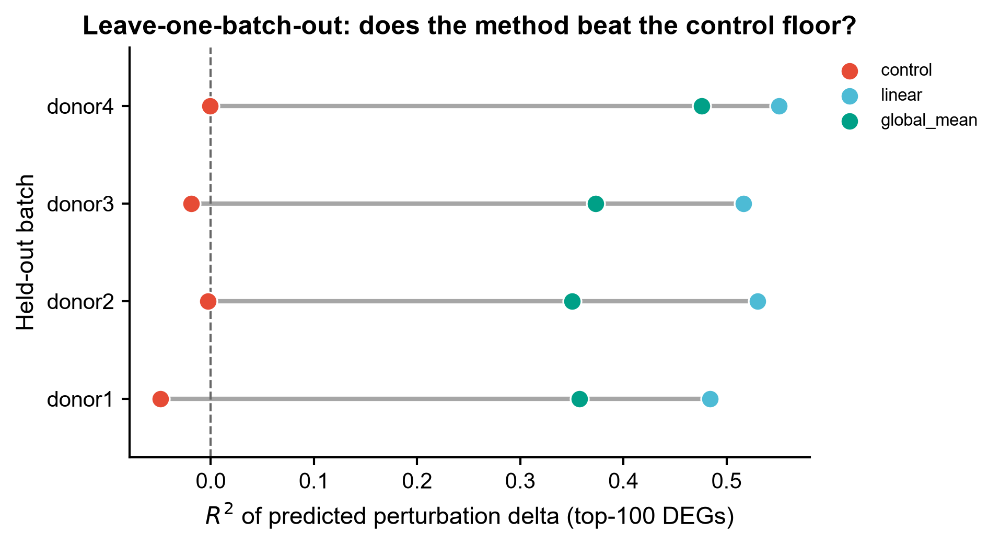
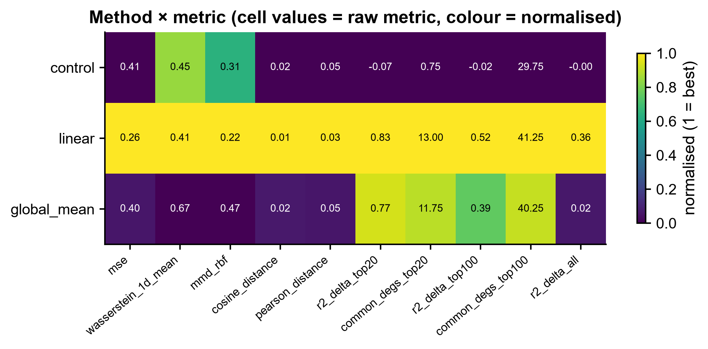
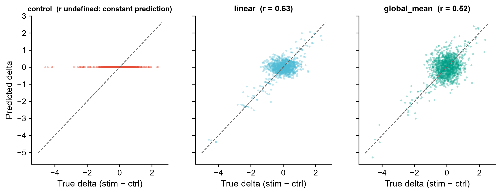
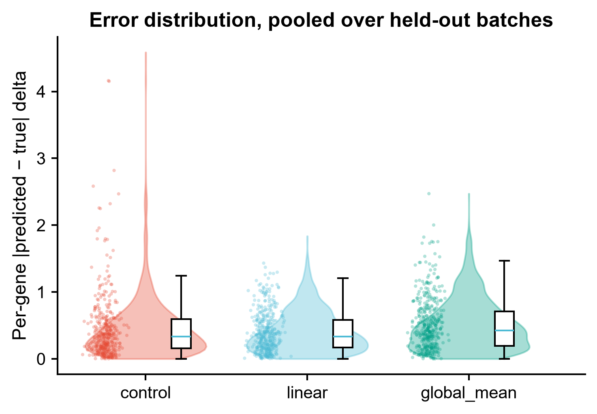

# 591 · scArchon — 单细胞扰动响应预测的基准评测

> 输入一份 `control` / `stimulated` × 多 batch 的单细胞数据 → 按 scArchon 的
> **留一 batch** 设计跑扰动响应预测并打分 → 出 dumbbell / heatmap / 散点 / raincloud 四张对照图。

| | |
|---|---|
| **语言 / 主依赖** | Python 3.12 · `anndata` `numpy` `scipy` `scikit-learn` `pandas` `matplotlib`(全部本机已装) |
| **一句话用途** | 在同一份数据上,把扰动预测方法与**不做预测的地板**放在一起量化对比 |
| **输入** | `example_data/synthetic_perturb.h5ad`(合成) |
| **输出** | `results/`(运行生成) · 展示图见 `assets/` |
| **状态** | 🟡 本机基线评测零改动跑通并出图;**真 scArchon 工作流**需服务器(Snakemake + Singularity + CUDA + ~60 GB) |

> **scArchon 是基准平台,不是预测方法。** 上游确认(README + 仓库结构):它用 Snakemake +
> Singularity 把 CellOT / CPA / scGen / scVIDR / scPRAM / scPreGAN / scDisInFACT / trVAE /
> SCREEN 以及一个 `linear` 基线容器化地跑在同一份数据上,再用统一指标评分。它**没有可 import
> 的 Python API**,只有工作流入口。因此本模块放在 `05_benchmark/`,并且**不封装任何假函数**。

---

## ① 输入数据

**文件**:`synthetic_perturb.h5ad`(AnnData;行=细胞,列=基因;`X` 为对数尺度表达)

| `obs` 列 | 类型 | 必需 | 示例 | 说明 |
|------|------|:---:|------|------|
| `condition` | str | ✔ | `control` / `stimulated` | 扰动前后标签,取值名可用 `--control/--stimulated` 改 |
| `batch` | str | ✔ | `donor1` | 留出单位(donor / cell type / 时间点),对应 scArchon 的 `target` |

**命名/格式约定**:batch 取值**不得含空格**(scArchon README 的硬性要求,如写 `TCell` 而非 `T Cell`);
每个 batch 的 control 与 stimulated 两格细胞数都需 ≥ 5,否则该 batch 被跳过。

**样例(obs 前 3 行)**:
```
                condition   batch
cont_0_0          control  donor1
cont_0_1          control  donor1
cont_0_2          control  donor1
```

`example_data/datasets.tsv` 另附一份**真 scArchon 的配置样例**,列名逐字取自上游
`config/datasets.tsv`:`file_path  condition  condition_control  condition_stimulated
batch  target  experiment_name  output_dir  Tools`。

## ② 方法 / 原理

**评测设计(照搬 scArchon 的实验协议)**:
1. **留一 batch**:每次留出一个 batch 作测试(上游 `datasets.tsv` 的 `target` 字段),
   其余 batch 作训练;
2. **预测**:用训练 batch 学到的扰动响应,去预测留出 batch 的 control 细胞被扰动后的状态;
3. **打分**:预测谱 vs 该 batch 真实的 stimulated 谱,算距离类与 DEG 类指标。

**本机跑的三个预测器**(都不需要额外安装):

| 名称 | 来源 | 逻辑 |
|---|---|---|
| `control` | 上游 `scripts/metrics/metrics_control.py` | 不做任何预测,直接把 control 当预测值——**地板**,打不过它=没学到扰动信息 |
| `linear` | 上游 `scripts/linear/snkmk_linear.py` | 加性 delta:`pred = control_test + (mean(stim_train) − mean(ctrl_train))` |
| `global_mean` | 本模块加的退化解探针 | 一律预测训练集 stimulated 均值,丢掉细胞自身状态——用来看指标会不会被"只要均值对"骗到 |

**指标**(与上游 `scripts/metrics/metrics.py` 同族):`mse`、`wasserstein_1d_mean`、`mmd_rbf`、
`cosine_distance`、`pearson_distance`(距离,越小越好);`r2_delta_top20/top100/all`、
`common_degs_top20/top100`(delta 空间的恢复度,越大越好)。

> ⚠️ **诚实标注**:上游的距离项由 `pertpy.tl.Distance` 计算(逐字见
> `scripts/metrics/metrics.py:73`,指标名列表在 `metrics.py:61-68`)(mse / wasserstein /
> pearson_distance / mmd / t_test / cosine_distance)。本机未装 `pertpy`,这里用
> numpy/scipy/sklearn 自行实现**同名同义**的量,`wasserstein_1d_mean` 是逐基因一维
> Wasserstein 的均值(非全空间 OT),`mmd_rbf` 用 median-heuristic 带宽。
> **数值不保证与 pertpy 逐位一致**,只用于同一批方法之间的相对排序。

**真 scArchon 路径**(`--check-scarchon`):检查 `snakemake` / `singularity` 是否在 PATH,
并打印真实的安装与调用命令、`datasets.tsv` 列名、被封装的工具清单。签名以官方仓库为准,
本模块**不固定、也不伪造**任何上游函数接口。

## ③ 用途

- 打算在自己的数据上用 scGen / CPA / scPRAM 这类扰动预测方法前,**先量一下这份数据的地板在哪**:
  如果 `linear` 加性 delta 已经拿到很高的 delta-R²,深度模型的增量空间就很小;
- 给深度扰动预测的结果做**必备对照**——这正是 scArchon 论文的核心论点。论文摘要原文:
  部分工具"occasionally underperform even compared to linear or control baselines",
  且"models with favorable quantitative scores may fail to retain key biological
  perturbation signatures"(PMID 42121287 摘要 RESULTS 段)。
  ("生物学幻觉/biological hallucinations" 是该工作 **bioRxiv 预印本**的标题用词,
  正式发表版已改题为 "a scalable benchmarking framework",此处不再作为论文题目引用);
- 作为跨 batch / 跨 cell type **泛化能力**的快速体检:看 dumbbell 图里各留出 batch 的落点是否稳定。

## ④ 特点 / 亮点

- **turnkey**:`python 591_scarchon_perturbation_benchmark.py` 一条命令跑完,不装任何包;
- **地板永远在图里**:`control`(不预测)与 `linear`(加性 delta)两条基线始终与方法同框呈现,
  不存在"只报自己方法好看的数"的路径;
- **带退化解探针**:`global_mean` 专门用来暴露"均值对了但细胞级异质性全丢"的假优胜;
- **不伪造 API**:上游只有 Snakemake 入口,本模块就只做守卫式检查 + 打印真实命令;
- 出图全部走框架 `pubstyle`,矢量 PDF + 300dpi PNG,**无条形图**。

## ⑤ 输出结果图

| 文件 | 图型 | 说明 |
|------|------|------|
| `assets/591_dumbbell_r2_by_batch.png` | dumbbell | 各留出 batch 上 delta-R²(top-100 DEG)相对 control 地板的位移 |
| `assets/591_heatmap_method_metric.png` | heatmap | 方法 × 指标(格内=原始值,配色=按指标方向归一化后的好坏) |
| `assets/591_scatter_delta_recovery.png` | 散点 | 逐基因真实 delta vs 预测 delta,对角线=完美恢复 |
| `assets/591_raincloud_gene_error.png` | raincloud | 逐基因绝对误差分布(violin + 抖动散点 + 箱) |

其余产物:`results/591_scores_per_batch.csv`(每 batch × 每方法的全部指标)、
`591_scores_mean.csv`、`591_per_gene_delta.csv`、`591_summary.json`。









合成数据上的读数(数值取自 `results/591_scores_mean.csv`,4 个留出 batch 的均值):

| 方法 | `r2_delta_top100` | `r2_delta_all` | `mse` | `wasserstein_1d_mean` | `mmd_rbf` |
|---|---|---|---|---|---|
| `control` | −0.018 | −0.004 | 0.412 | 0.450 | 0.309 |
| `global_mean` | 0.389 | 0.019 | 0.403 | 0.667 | 0.469 |
| `linear` | 0.520 | 0.362 | 0.262 | 0.410 | 0.219 |

读法:`linear` 加性基线在所有指标上都最好,说明合成数据里确实存在可跨 batch 迁移的扰动响应;
`global_mean` 在 `r2_delta_top100`(0.389)上看着不错,但 `r2_delta_all` 只有 0.019,
且 `wasserstein_1d_mean`(0.667)与 `mmd_rbf`(0.469)这两个对分布形状敏感的指标
**明显差于什么都不做的 `control`**(0.450 / 0.309)—— 这正是"均值对了、细胞级异质性全丢"
的退化解特征。注意它在 `mse` / `cosine_distance` / `pearson_distance` 上仍与 `control`
相当甚至略优,所以**单看这几个指标会被骗**。

---

## 运行

```bash
# 零改动跑示例
python 591_scarchon_perturbation_benchmark.py

# 换成自己的数据
python 591_scarchon_perturbation_benchmark.py --h5ad data/你的.h5ad \
    --condition-key condition --control ctrl --stimulated stim \
    --batch-key cell_type --outdir results/run1

# 重新生成合成示例数据
python 591_scarchon_perturbation_benchmark.py --make-example

# 检查真 scArchon 工作流是否可跑(打印真实安装/调用命令)
python 591_scarchon_perturbation_benchmark.py --check-scarchon
```

## 依赖安装

本机基线路径**无需安装**(anndata / numpy / scipy / scikit-learn / matplotlib 均已装)。

真 scArchon 工作流(服务器,需 CUDA ≥ 12.4、Singularity ≥ 3.6、约 60 GB 磁盘):

```bash
conda create -c conda-forge -c bioconda -n snakemake_env snakemake
conda activate snakemake_env
git clone https://github.com/hdsu-bioquant/scArchon
# 编辑 config/datasets.tsv 后:
snakemake --use-singularity --singularity-args '--nv -B .:/dum' \
          --cores all --jobs 1 --keep-going
```

## 引用

Radig J, Droit R, Doncevic D, Li A, Bui DT, Herfurth L, Kühn T, Herrmann C.
**scArchon: a scalable benchmarking framework for assessing single-cell perturbation models.**
*Genome Biology* 27, 2026. doi:10.1186/s13059-026-04104-z · PMID 42121287 · PMC13162514
(已用 NCBI E-utilities 核实:PMID 与 DOI 均指向本文)

仓库:https://github.com/hdsu-bioquant/scArchon(许可证 MIT,见仓库 `LICENSE`:
"MIT License / Copyright (c) 2025 health data science unit")。

**逐行核对过的上游文件**(`main` 分支源码,2026-07-21 复核):
`README.md`(CUDA 12.4+ / Singularity 3.6+ / 约 60 GB 三项要求、batch 值禁空格、
运行命令)、`config/datasets.tsv`(9 个列名)、`Snakefile:85-396`(rule 清单与工具名)、
`scripts/linear/snkmk_linear.py:99-118`(linear 加性 delta 基线)、
`scripts/metrics/metrics_control.py:56-83`(control 地板)、
`scripts/metrics/metrics.py:41-190`(Metrics 类:pertpy 距离 / common_degs / r2_scores)、
`LICENSE`。
