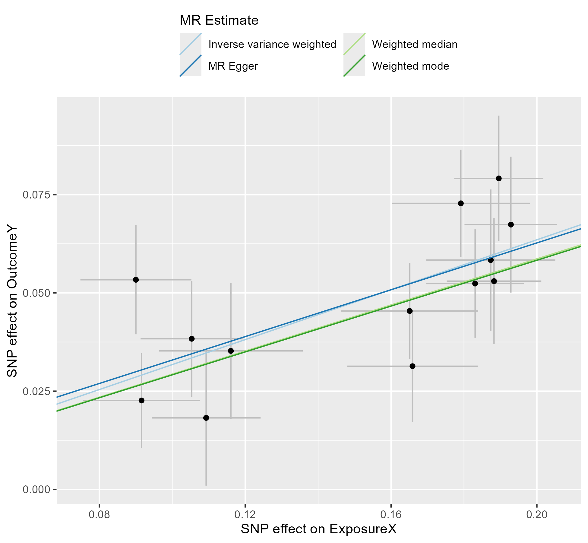

# 519 · Local Mendelian randomization (zero OpenGWAS API)

Full two-sample MR entirely from **local GWAS summary files** — no OpenGWAS API,
no token. Built because OpenGWAS server-side auth can reject a valid token (the
request silently falls back to the anonymous allowance of 30/10min → `401 Invalid
token`), and the API also rate-limits / goes down. Every step the default
TwoSampleMR workflow routes through the API (instrument extraction, LD clumping)
is done locally instead.

| | |
|---|---|
| Language / deps | R · `TwoSampleMR` `ieugwasr` `MRPRESSO` `ggplot2` + local plink (`plinkbinr` or `genetics.binaRies`) |
| Purpose | Two-sample MR from local exposure/outcome GWAS, with local LD clumping |
| Input | local exposure + outcome summary stats (CSV/TSV/.gz) |
| Output | `results/` (estimates + sensitivity tables) + `assets/` (scatter/forest/funnel/LOO) |

## Why this exists

The default OpenGWAS route (`extract_instruments()`, API `clump_data()`) needs a
JWT token and a live server. When the token is rejected server-side, the MR
stalls completely. This module removes that dependency: supply GWAS files you
downloaded yourself (GWAS Catalog / FinnGen / consortia / eQTLGen) and run LD
clumping against a **local 1000G panel via plink**.

## Pipeline

1. Read exposure → keep instruments `p < 5e-8`, compute F-stat, drop `F < 10`.
2. **Local LD clumping** — `ieugwasr::ld_clump(plink_bin=, bfile=)`, no API.
3. Read outcome (only the instrument SNPs) → `harmonise_data`.
4. MR: IVW / MR-Egger / weighted median / weighted mode + MR-PRESSO + heterogeneity (Q) + pleiotropy (Egger intercept) + Steiger + leave-one-out.
5. Figures: scatter / forest / funnel / leave-one-out (vector PDF + 300-dpi PNG).

## Run

```bash
# synthetic demo: no bfile needed → clumping auto-skipped; recovers true causal OR ≈ 1.35
Rscript 519_local_mr_pipeline.R

# real data
Rscript 519_local_mr_pipeline.R \
  --exposure exposure.csv --outcome finngen_outcome.tsv.gz \
  --bfile C:/Users/fsy/MR_LD_reference/EUR
```

Column names are set inside the `read_exposure_data` / `read_outcome_data` calls —
edit them to match your files.

## One-time setup for **real** local clumping

**1. plink binary** (pick one; the script auto-detects in this order):

```r
# A. plinkbinr (bundled plink1.9) — behind GFW use the gh-proxy zip:
#    curl -L -o plinkbinr.zip https://gh-proxy.org/https://github.com/explodecomputer/plinkbinr/archive/refs/heads/master.zip
remotes::install_local("plinkbinr-master")
# B. genetics.binaRies (ieugwasr official):
remotes::install_github("MRCIEU/genetics.binaRies")
# C. download plink 1.9 manually and point an env var at it:
#    Sys.setenv(MR_PLINK_BIN = "C:/tools/plink.exe")
```

Clumping needs **plink 1.9** — plink2 dropped `--clump`.

**2. 1000G reference panel**:

```bash
curl -L -o 1kg.v3.tgz http://fileserve.mrcieu.ac.uk/ld/1kg.v3.tgz
tar -xzf 1kg.v3.tgz        # → EUR.bed/.bim/.fam (+ AFR / EAS / SAS / AMR)
```

Point `--bfile` at the prefix (e.g. `.../EUR`, no extension). Set env var
`MR_LD_BFILE` to make it the default.

## Outputs

| File | Description |
|------|------|
| `results/MR_results.csv` | IVW / Egger / WM / WMode estimates + OR + 95% CI |
| `results/MR_heterogeneity.csv` | Cochran's Q |
| `results/MR_pleiotropy.csv` | Egger intercept test |
| `results/MR_steiger.csv` | directionality (Steiger) |
| `results/MR_PRESSO.txt` | global / outlier / distortion tests |
| `results/harmonised_instruments.csv` | final instruments used in MR |
| `assets/MR_{scatter,forest,funnel,leaveoneout}.{pdf,png}` | sensitivity figures |


