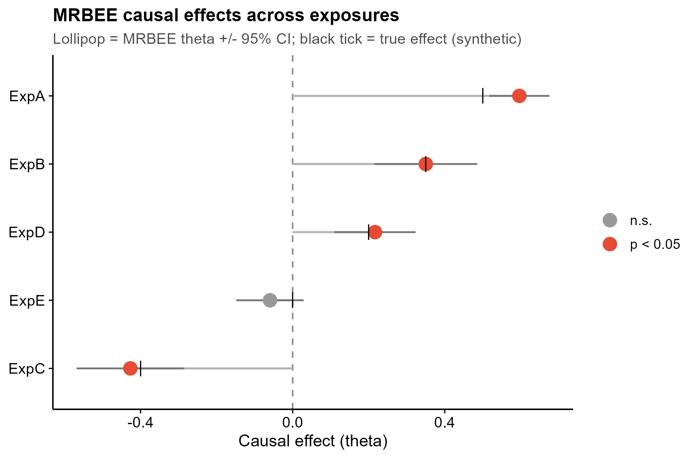
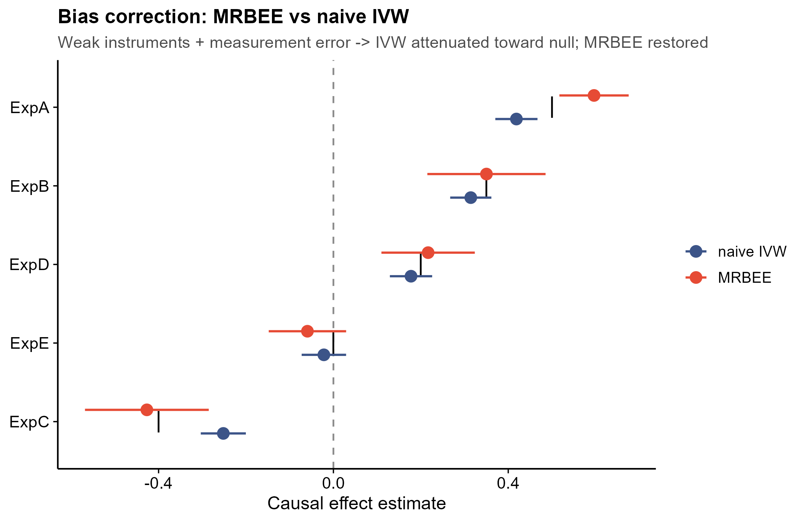
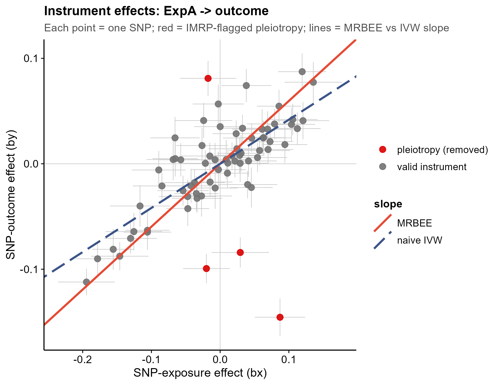

<!-- 图中文字英文,正文中文。 -->

# 535 · 偏差校正估计方程 MR (MRBEE cis/MV Mendelian Randomization)

> 一句话定位:输入**暴露/结局 GWAS summary**(单变量多暴露 + 多变量宽表)→ 用 **MRBEE**
> 在估计方程中**扣除工具变量测量误差偏倚** + **IMRP 迭代剔除水平多效性** → 出**因果效应
> lollipop / MRBEE-vs-naive-IVW forest / 工具效应散点**,并内置 **naive IVW 诚实基线**对照。

| | |
|---|---|
| **语言 / 主依赖** | R · `MRBEE`(Nat Commun)· `ggplot2`(经 `theme_pub.R`) |
| **一句话用途** | 弱工具 / cis 区 / 多变量场景下,做去测量误差偏倚 + 抗多效性的因果估计 |
| **输入** | `example_data/exposures_uv.csv`(单变量长表)+ `exposures_mv.csv`(多变量宽表) |
| **输出** | `results/`(表 + sessionInfo,运行生成) · 展示图见 `assets/` |

---

## ① 输入数据

**(A) 单变量多暴露长表** `exposures_uv.csv`(csv;每行 = 1 个 `(exposure, SNP)` 的 GWAS summary)

| 列名 | 类型 | 必需 | 示例 | 说明 |
|------|------|:---:|------|------|
| `exposure` | str | ✔ | `ExpA` | 暴露名(同名行归为一个暴露,各自跑一次 MR) |
| `SNP` | str | ✔ | `ExpA_rs00001` | 工具变量 rsID |
| `bx` | num | ✔ | `0.086` | SNP→暴露 效应量(exposure GWAS beta,**含抽样误差**) |
| `bxse` | num | ✔ | `0.032` | `bx` 的标准误(测量误差大小,MRBEE 据此校正) |
| `by` | num | ✔ | `0.055` | SNP→结局 效应量(outcome GWAS beta) |
| `byse` | num | ✔ | `0.016` | `by` 的标准误 |

**(B) 多变量宽表** `exposures_mv.csv`(csv;每行 = 1 个 SNP,多列暴露)

| 列名 | 类型 | 必需 | 说明 |
|------|------|:---:|------|
| `SNP` | str | ✔ | 工具变量 rsID |
| `bx_<E>` / `bxse_<E>` | num | ✔ | 每个暴露 `<E>` 一对列(如 `bx_MV1`,`bxse_MV1`) |
| `by` / `byse` | num | ✔ | 共同结局的效应量与标准误 |

**命名/格式约定**:多变量表的暴露列必须成对命名 `bx_<名>` 与 `bxse_<名>`(脚本据前缀自动配对)。

**样例(uv 前 3 行)**:
```
exposure,SNP,bx,bxse,by,byse
ExpA,ExpA_rs00001,0.0857,0.0322,0.0546,0.0155
ExpA,ExpA_rs00002,-0.0471,0.0312,-0.0425,0.0166
```

## ② 方法 / 原理 与 ★诚实基线

**MRBEE**(Bias-corrected Estimating Equation MR,Lorincz-Comi et al., *Nat Commun* 2024)解决 IVW
的两个系统性偏倚:① **测量误差偏倚** —— 工具的 SNP→暴露 效应 `bx` 本身是带抽样误差的 GWAS 估计,
普通 IVW 把它当真值代入,导致 regression dilution(弱工具下因果估计**被衰减向 0**);② **水平多效性**。
MRBEE 在估计方程里用 `Rxy`(暴露/结局测量误差的相关阵,样本无重叠时为单位阵)显式扣除测量误差项,
并用 **IMRP**(Iterative MR with Pleiotropy)逐轮把残差异常 SNP 的 `delta` 设为非 0 标记为多效性离群后剔除。

- 单变量:`MRBEE.IMRP.UV(by, bx, byse, bxse, Rxy)` → `theta`(因果)/`vartheta`(方差)/`delta`(每 SNP 多效性)
- 多变量:`MRBEE.IMRP(by, bX, byse, bXse, Rxy)` → `theta`(向量)/`covtheta`/`delta`

> **★诚实基线(内置,不可省)**:同一套数据并行跑 **naive IVW**(过原点逆方差加权回归,**不**校正测量误差)。
> 合成数据特意做成**弱工具 + 大测量误差**,故 IVW 估计被系统性衰减、MRBEE 拉回真值附近。脚本打印
> `平均绝对误差 |est-true|`(实测 **MRBEE≈0.040 < naive IVW≈0.062**),Fig2 直接把两者与黑色真值刻度并列。
> **不只报 MRBEE 的好看数字。**

> **关于 MRBEEX**:多变量正则化扩展 `MRBEEX` 在本机**装不上**,本模块仅用基础 `MRBEE` 的 `MRBEE.IMRP`
> 做多变量,功能完整、不依赖 `MRBEEX`。

## ③ 用途

回答「某暴露(尤其 cis 蛋白/代谢物等工具偏弱、或多个相关暴露共存)对结局是否有**因果**效应」。
典型场景:cis-pQTL 药靶 MR、弱工具暴露、需要扣除暴露 GWAS 测量误差与控制水平多效性的 MVMR。

## ④ 特点 / 亮点

- **turnkey**:`Rscript 535_mrbee_cis_mr.R` 一条命令,自动生成合成数据 → 跑通 → 出图;
- **真包实跑**:核心估计来自 `MRBEE` 真实导出函数(`MRBEE.IMRP.UV` / `MRBEE.IMRP`),非 stub;
- **★诚实基线对照**:naive IVW 并列,量化展示弱工具下 MRBEE 去衰减更准;
- **顶刊级图、零平凡条形**:lollipop / 双方法 forest / 工具效应散点(MRBEE vs IVW 斜率 + 多效性离群标注);
- **可复现**:`set.seed(42)`、相对路径、末尾落 `sessionInfo.txt` 依赖快照;qc_lint 0 高危。

## ⑤ 输出结果图

| 文件 | 图型 | 说明 |
|------|------|------|
| `assets/fig1_mrbee_lollipop.png` | Lollipop | 各暴露 MRBEE 因果效应 ±95%CI,按效应排序;红=p<0.05,黑刻度=真值 |
| `assets/fig2_mrbee_vs_ivw_forest.png` | 双方法 Forest | MRBEE vs naive IVW 并列;IVW 向 0 衰减、MRBEE 贴合黑色真值刻度 |
| `assets/fig3_instrument_scatter.png` | 工具效应散点 | bx-by 散点;红点=IMRP 标记的多效性离群;实线=MRBEE 斜率、虚线=IVW 斜率 |





---

## 运行

```bash
# 零改动跑合成示例(自动生成 example_data 并出图)
Rscript 535_mrbee_cis_mr.R

# 换成自己的数据
Rscript 535_mrbee_cis_mr.R --uv my_uv.csv --mv my_mv.csv --outdir results/run1
# 暴露/结局 GWAS 样本有重叠时,设测量误差相关(无重叠用默认 0.05 或 0)
Rscript 535_mrbee_cis_mr.R --rho_xy 0
```

## 依赖安装

```r
# MRBEE(GitHub;基础包,本模块所需)
remotes::install_github("noahlorinczcomi/MRBEE")
# 绘图框架依赖已随库提供(theme_pub.R 依赖 ggplot2;ggsci/patchwork 可选)
install.packages("ggplot2")
# 注:MRBEEX(多变量正则化扩展)非必需,本模块不依赖。
```
