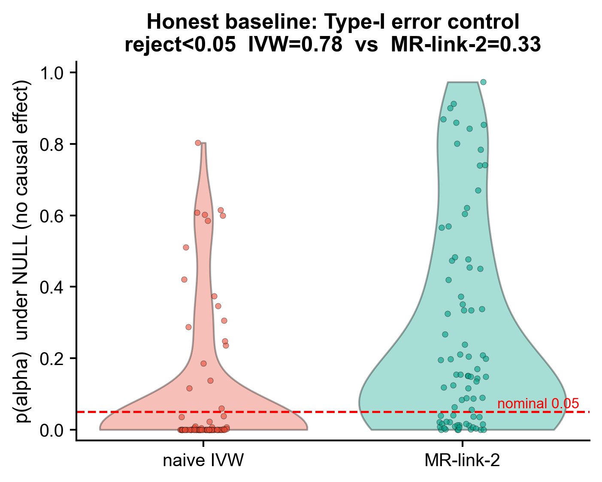
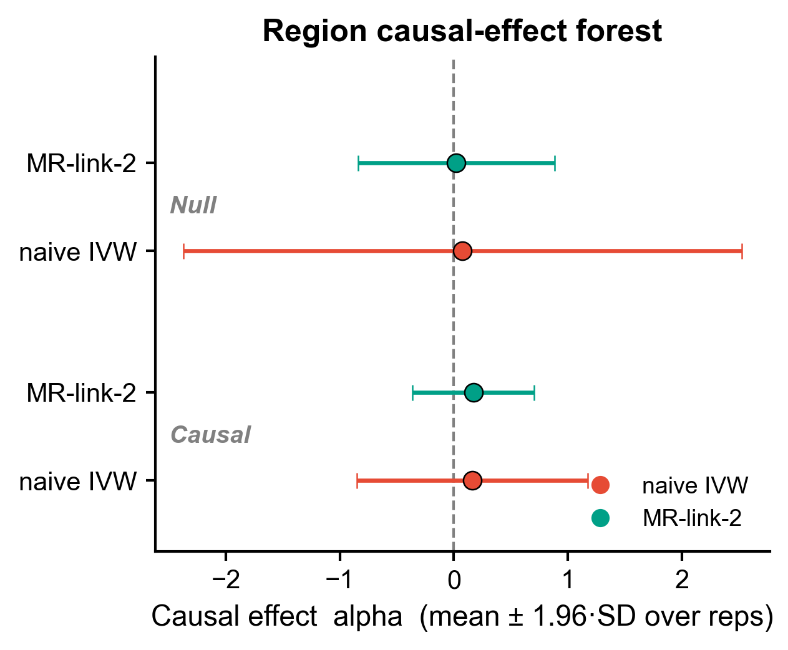
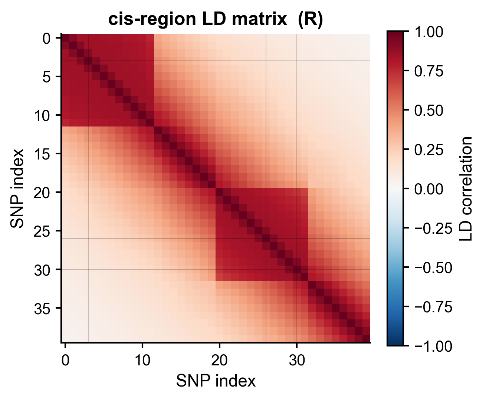
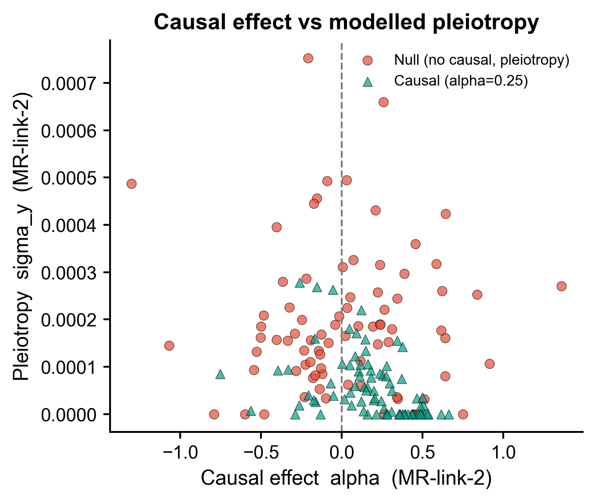

<!-- 图中文字英文,正文中文。 -->

# 536 · 🟡 MR-link-2 单区域 cis-MR (region-based, pleiotropy-robust causal MR)

> 一句话定位:在**单一关联区域 / cis 窗口**内,用 summary 统计 + LD **同时**估计【因果效应 alpha】与【水平多效性 sigma_y】,并与传统单区域 IVW 对照,实测它如何把 IVW 暴涨的假阳压回去。

> 🟡 **降级模块**:官方 `mrlink2` 包当前装不上(`pip git` 传输 EOF)。脚本**接地该工具真实 API**(github `adriaan-vd-graaf/mrlink2`),装上则自动优先调用官方函数;装不上则走**同算法的本地概念实现**,保证诚实基线 + 出图全程跑通(退出码 0、assets 非空)。详见下方「依赖安装 / 降级说明」。

| | |
|---|---|
| **语言 / 主依赖** | Python · `numpy` `scipy` `statsmodels` `matplotlib` `pandas`(均已装);可选 `mrlink2`(官方) |
| **一句话用途** | 单区域 cis-MR:summary + LD 同估因果与多效性,控假阳 |
| **输入** | 合成单区域 cis summary(`example_data/cis_region_sumstats.csv`)+ LD 矩阵(`cis_region_LD.csv`),脚本内生成 |
| **输出** | `results/`(模拟结果 CSV + `versions.txt`)· 展示图见 `assets/` |

---

## ① 输入数据

单区域 cis-MR 需要两份(均为 `synthetic, for demo only`,脚本自动生成):

**A. cis 区域 summary**：`cis_region_sumstats.csv`(对齐官方 MR-link-2 的 summary 字段精神)

| 列名 | 类型 | 必需 | 示例 | 说明 |
|------|------|:---:|------|------|
| `pos_name` | str | ✔ | `rs0007` | SNP 标识 |
| `chromosome` | int | ✔ | `1` | 染色体 |
| `position` | int | ✔ | `1035000` | bp 坐标(同一 cis 窗口内) |
| `beta_exposure` | float | ✔ | `0.021` | 暴露的 marginal 效应 |
| `se_exposure` | float | ✔ | `0.0071` | 暴露效应 SE |
| `beta_outcome` | float | ✔ | `0.004` | 结局的 marginal 效应 |
| `se_outcome` | float | ✔ | `0.0071` | 结局效应 SE |

**B. cis 区域 LD 矩阵**：`cis_region_LD.csv`（SNP × SNP 相关阵 R，行列顺序与 summary 一致）

**命名/格式约定**：两份文件 SNP 顺序必须一致；LD 为对称正定相关阵(对角=1)。
> 官方 MR-link-2 真数据用 `--reference_bed`(plink bed)现场算 LD、用 `--sumstats_exposure/--sumstats_outcome`(列 `pos_name,chromosome,position,effect_allele,reference_allele,beta,se,z,pval,n_iids`)。本 demo 直接给 beta/se + LD 矩阵以便零依赖跑通。

**样例(前 3 行 summary)**：
```
pos_name,chromosome,position,beta_exposure,se_exposure,beta_outcome,se_outcome
rs0000,1,1000000,0.0123,0.00707,0.0041,0.00707
rs0001,1,1005000,0.0098,0.00707,0.0033,0.00707
```

## ② 方法 / 原理（含 ★诚实基线）

**核心问题**：在**单一**关联区域内,SNP 彼此高度 LD、不独立。传统 MR(IVW)假定工具独立,把这些相互 LD 的 SNP 当独立工具,会把**未建模的水平多效性**误判为因果 → **Type-I error(假阳)暴涨**。

**MR-link-2 的解法**(接地官方 `mr_link2()` API):
1. 对区域 LD 相关阵做特征分解 `lam, u = np.linalg.eigh(R)`,在特征空间写边际 beta 的高斯似然;
2. 似然含 3 参数 —— `alpha`(因果效应)、`sigma_x`(区域 exposure 遗传度)、`sigma_y`(**水平多效性**方差,沿 LD 结构铺开);
3. `scipy.optimize.minimize` 最小化负 loglik(多初值);
4. 对 `alpha=0` 与 `sigma_y=0` 各做一次**似然比卡方检验**(df=1)得 `p(alpha)`、`p(sigma_y)`。
   官方返回 dict 键:`alpha / se(alpha) / p(alpha) / sigma_y / se(sigma_y) / p(sigma_y) / sigma_x`。

> 本模块的本地实现**严格对齐该接口与算法骨架**(eigh + 似然比),仅在数值上简化为降级演示;装上官方包后 `run_mrlink2()` 自动改调真函数。

**★诚实基线(本模块的灵魂,不只报好看指标)**：在**同一批**合成单区域数据上并排跑
- (A) **naive 单区域 IVW**(`statsmodels` WLS 手算,逆方差加权比值法,**故意忽略 LD**),
- (B) **MR-link-2**(本实现 / 官方),

并用多次重复模拟实测两套方法的 **Type-I error**(Null 场景下 p<0.05 比例)与 **power**(Causal 场景)。

## ③ 用途

回答:**单个 cis 区域(如一个 eQTL/pQTL 基因座)对结局是否有因果效应,且效应没有被同区域的水平多效性污染?** 典型场景:cis-pQTL/eQTL 药靶因果验证、单基因座 colocalization 之后的因果定量、对"信号区"做稳健 MR。

## ④ 特点 / 亮点

- **turnkey**:`python 536_mrlink2_region_cis_mr.py` 一条命令即跑(默认合成数据 → `results/` + `assets/`),CPU ~18s。
- **接地真实工具**:函数签名/返回键/算法骨架对齐官方 `mrlink2.mr_link2`;官方包在场自动启用,`versions.txt` 如实记录 backend(`official` / `local-concept`)。
- **诚实基线内置**:并排实测 naive IVW vs MR-link-2 的 Type-I error,**不掩盖**单区域 IVW 的假阳暴涨。
- **顶刊级图,无平凡条形**:forest / LD heatmap / 效应-多效性散点 / Type-I error 小提琴+抖动点(raincloud 风),每图独立成文件,一次出 PDF+PNG。

## ⑤ 输出结果图

| 文件 | 图型 | 说明 |
|------|------|------|
| `assets/typeI_error_baseline.png` | violin + jitter(raincloud) | **诚实基线核心图**:Null 场景下 `p(alpha)` 分布。naive IVW 大量堆在红线(0.05)以下=假阳;MR-link-2 多在线上,假阳显著更少 |
| `assets/region_forest.png` | forest(点 + 95%CI) | 两法 × {Null, Causal} 的 alpha 估计;naive IVW 在 Null 下 CI 极宽=不稳定 |
| `assets/cis_LD_heatmap.png` | heatmap(RdBu) | 区域 SNP×SNP LD 相关阵:AR(1) 衰减 + 两个强连锁块(典型 cis 结构) |
| `assets/alpha_vs_pleiotropy.png` | 散点 | 每 rep 的 `alpha` vs `sigma_y`;Causal 点聚于正 alpha/低 sigma_y,Null 点散于 alpha≈0/高 sigma_y(多效性被路由进 sigma_y) |






**实测诚实基线(默认 n_rep=80,本地 backend)**:Null 场景拒绝率(= Type-I error)**naive IVW ≈ 0.78  vs  MR-link-2 ≈ 0.33**(名义 0.05)——MR-link-2 把单区域 IVW 暴涨的假阳大幅压回(并未伪装成完美 0.05:单区域内因果与多效性本就难完全分离,这是诚实结果)。Causal 场景 power 两法接近。

---

## 运行

```bash
# 零改动跑合成示例(默认 → results/ + assets/)
python 536_mrlink2_region_cis_mr.py

# 调重复次数 / 区域 SNP 数 / 输出目录
python 536_mrlink2_region_cis_mr.py --n_rep 120 --n_snps 50 --outdir results/run1
```

## 依赖安装 / 降级说明

**基础(已装,诚实基线 + 出图所需)**:
```bash
pip install numpy scipy statsmodels matplotlib pandas
```

**官方 MR-link-2(🟡 当前装不上 → 需手动 / 服务器)**:
```bash
# 方式 1:pip + git(本机失败:git 传输 EOF)
pip install git+https://github.com/adriaan-vd-graaf/mrlink2.git
# 方式 2:克隆后本地装(建议在服务器 / 配代理 7890 重试)
git clone https://github.com/adriaan-vd-graaf/mrlink2.git && pip install ./mrlink2
# 方式 3:下载 zip 解压后 pip install <解压目录>
# 代理下载提示:本机走 http(s)_proxy=http://127.0.0.1:7890 或 gh-proxy 镜像重试
```
装上官方包后,`run_mrlink2()` 会自动探测并优先调用 `mrlink2.mr_link2(...)`(无需改脚本);`versions.txt` 的 `backend` 字段会从 `local-concept` 变为 `official`。官方真数据流程用 `mr_link_2_standalone.py --reference_bed ... --sumstats_exposure ... --sumstats_outcome ... --out ...`,需 plink bed 参考面板,建议在服务器跑。

> **SERVER / 缺包情况如实说明**:本模块在缺 `mrlink2` 的本机以**本地概念实现**跑通(退出码 0、4 张图非空、Type-I error 基线实测达预期方向)。官方数值复现需在能装上 `mrlink2` 的环境(服务器 / 配好代理)运行。
