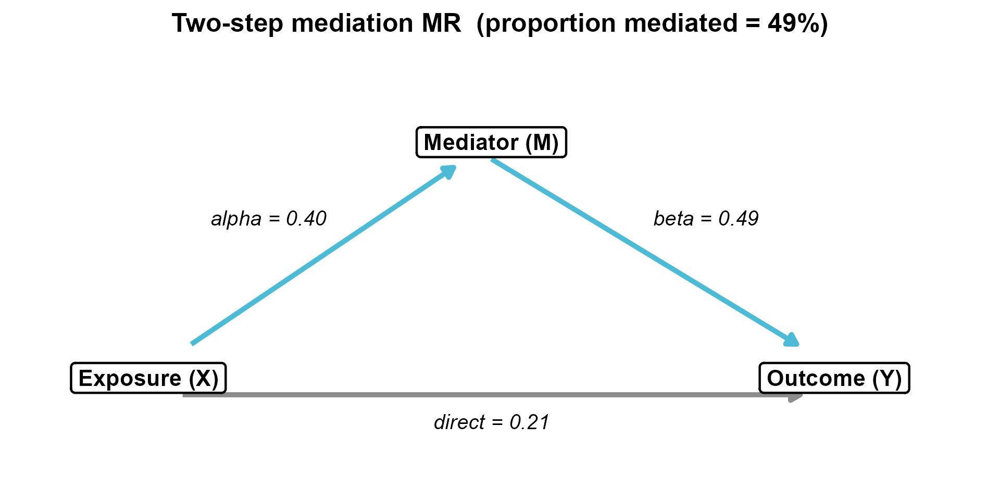
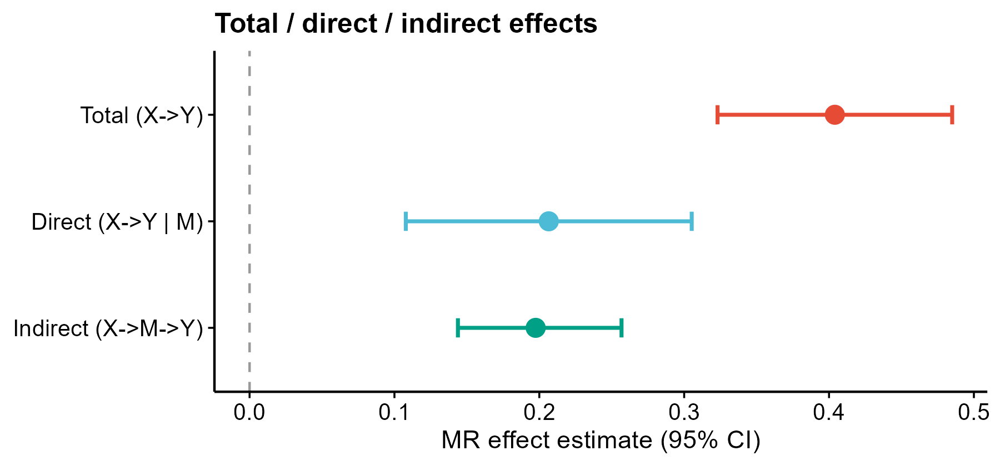

# 508 · Two-step (network) mediation MR — Sobel / Delta / Monte-Carlo

Decomposes a causal chain **exposure X → mediator M → outcome Y** under Mendelian
randomization: estimates the indirect (mediated) effect `α×β`, the direct effect,
and the **proportion mediated**, with three significance routes (Delta-method SE,
Sobel test, and a Monte-Carlo CI that does not assume the product is normal).

| | |
|---|---|
| Language / deps | R · `ggplot2` (+ shared `theme_pub.R`) |
| Purpose | Quantify how much of X→Y is transmitted through a mediator M |
| Input | `--x_instruments x.csv` + `--m_instruments m.csv`; else synthetic |
| Output | `results/` effects + stats; preview in `assets/` |

## Input

`x_instruments.csv` (instruments for the **exposure**):

| Column | Meaning |
|--------|---------|
| `SNP` | instrument id |
| `beta_exposure`, `se_exposure` | SNP → X |
| `beta_mediator`, `se_mediator` | SNP → M (for step-1 α and total) |
| `beta_outcome`, `se_outcome` | SNP → Y (for total effect) |

`m_instruments.csv` (instruments for the **mediator**): `SNP`, `beta_mediator`,
`se_mediator`, `beta_outcome`, `se_outcome` (for step-2 β = M→Y).

Demo data is synthetic (30 + 30 instruments, true proportion mediated = 50%),
generated on first run. Using **cis-pQTL/eQTL** instruments makes this the standard
**drug-target mediation MR (cis-MR)** workflow.

## Method

1. **Step 1** α = IVW(M ~ X) on exposure instruments.
2. **Step 2** β = IVW(Y ~ M) on mediator instruments.
3. **Total** βT = IVW(Y ~ X) on exposure instruments; **indirect** = α×β; **direct** = βT − α×β.
4. **Significance** — Delta-method SE & 95% CI, Sobel z-test, and a **Monte-Carlo CI**
   (200k draws of α, β); **proportion mediated** = α×β / βT with a Monte-Carlo CI.

## Use

Network/mediation MR for "X causes Y — but through what?" questions: e.g. does an
exposure act on disease via a protein/metabolite mediator, and what fraction is
explained. Pairs with modules 032/033 (MR suite) and 079 (pQTL-MVMR).

## Honest note

- The product α×β is non-normal; **prefer the Monte-Carlo CI** over Sobel/Delta when
  effects are modest.
- Proportion mediated is unstable when the total effect is weak / near zero — report it
  with its CI, never as a bare percentage.
- The direct-effect SE here is **approximate** (βT and the indirect effect share the
  exposure instruments). For a rigorous direct effect, estimate it with **MVMR**
  (regress Y on X and M jointly) — recommended for publication.

## Outputs

| File | Type | Description |
|------|------|------|
| `results/mediation_effects.csv` | table | total / direct / indirect + 95% CI |
| `results/mediation_stats.csv` | table | α, β, indirect, Sobel z/p, MC CI, proportion mediated |
| `assets/mediation_path.png` | path diagram | X→M→Y triangle with labelled effects |
| `assets/effects_forest.png` | forest | total / direct / indirect (point + 95% CI) |
| `assets/indirect_methods.png` | forest | indirect-effect CI by Delta / Sobel / Monte-Carlo |




## Run

```bash
Rscript 508_twostep_mediation_mr.R
Rscript 508_twostep_mediation_mr.R --x_instruments x.csv --m_instruments m.csv
```

## Dependencies

```r
install.packages("ggplot2")
```
