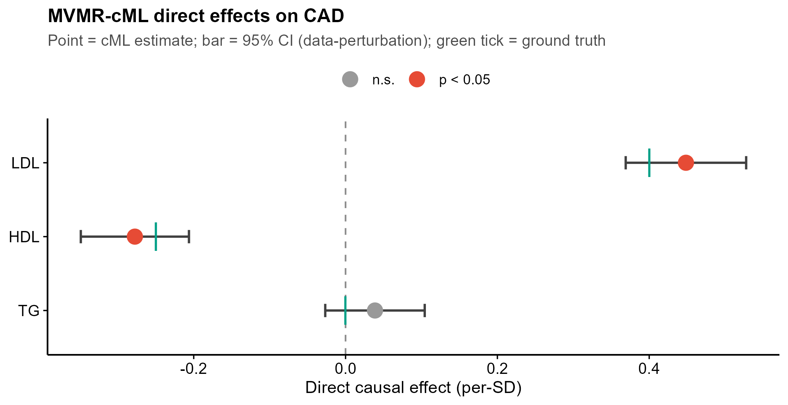
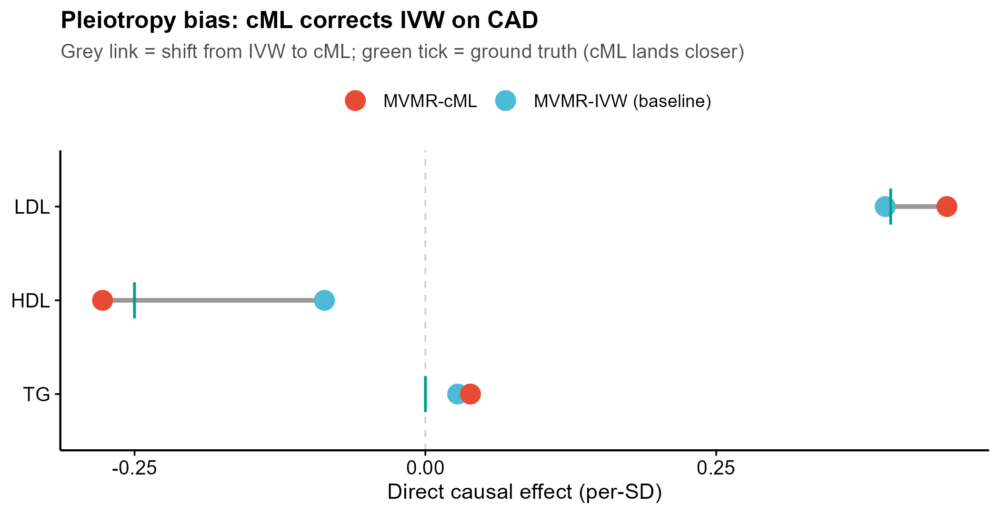
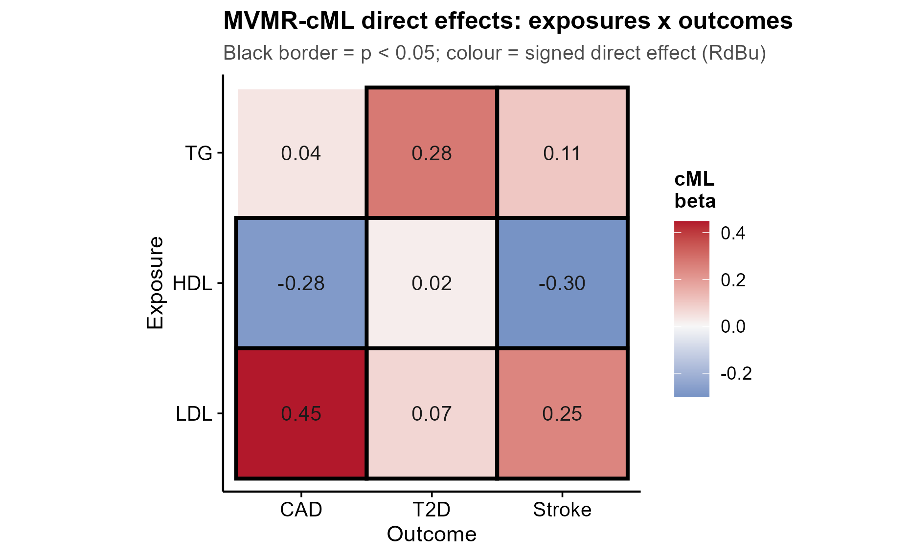

<!-- 图中文字英文,正文中文。 -->

# 534 · 多变量约束极大似然 MVMR (MVMR-cML / MVcML-DP)

> 一句话定位:**输入**多暴露×单结局的 GWAS summary(long 表)→ **做**用约束极大似然(constrained ML)同时抗【相关 + 非相关】水平多效性的多变量 MR、以 BIC 自动选出无效工具变量并去偏 → **出**各暴露直接因果效应的 forest / cML-vs-IVW dumbbell / 多暴露×多结局 heatmap。

| | |
|---|---|
| **语言 / 主依赖** | R · `MendelianRandomization` (>=0.10.0) · `ggplot2` · 框架 `theme_pub.R` |
| **一句话用途** | 多个暴露共同建模时,扣除水平多效性、估计各暴露对结局的 **direct effect** |
| **输入** | `example_data/mvmr_summary.csv`(long 表;脚本会 reshape 成矩阵) |
| **输出** | `results/`(运行生成:估计表 + 无效 IV 列表 + beta 矩阵 + sessionInfo) · 展示图见 `assets/` |

---

## ① 输入数据

**文件**:`mvmr_summary.csv`(类型:csv;orientation:**long 表**,每行 = 1 个工具 SNP × 1 个暴露 × 1 个结局的关联)

| 列名 | 类型 | 必需 | 示例 | 说明 |
|------|------|:---:|------|------|
| `SNP` | str | ✔ | `rs2407776` | 工具变量 rsID(同一 SNP 在每个暴露下各一行) |
| `exposure` | str | ✔ | `LDL` | 暴露名(列出现顺序 = 矩阵列顺序) |
| `bx` | num | ✔ | `0.0626` | SNP→该暴露的效应量(beta) |
| `bxse` | num | ✔ | `0.0156` | `bx` 的标准误 |
| `outcome` | str | ✔ | `CAD` | 结局名;**首个出现的结局 = 主结局**(forest/dumbbell 对象) |
| `by` | num | ✔ | `0.0238` | SNP→结局的效应量(同一结局/SNP 各暴露行相同) |
| `byse` | num | ✔ | `0.0119` | `by` 的标准误 |

**命名/格式约定**:同一 (SNP, outcome) 在每个 exposure 下都要有一行(脚本按 `unique(SNP)` 对齐成矩阵,缺失会变 `NA`);`by/byse` 与暴露无关,取任一暴露子表即可。示例数据为 `synthetic, for demo only`。

**样例(前 3 行,主结局 CAD、同一 SNP 跨 3 暴露)**:
```
SNP,exposure,bx,bxse,outcome,by,byse
rs2407776,LDL,0.06264538,0.01560313,CAD,0.02377444,0.01193
rs2407776,HDL,0.05686687,0.01454733,CAD,0.02377444,0.01193
rs2407776,TG,0.04251004,0.01704547,CAD,0.02377444,0.01193
```

## ② 方法 / 原理 与诚实基线

1. **reshape**:long 表 → 每个结局一组 (SNP×暴露) 的 `bx`/`bxse` 矩阵 + `by`/`byse` 向量,封装为 `mr_mvinput`。
2. **MVMR-cML-DP**(`MendelianRandomization::mr_mvcML`,Lin et al. 2023):约束极大似然把每个 SNP 的水平多效性效应 `r_j` 作为自由参数,用 **BIC** 自动选出"无效工具变量"(invalid IVs)的数目 K̂,对其多效性去偏;**DP = data perturbation** 给出稳健 SE/CI(`num_pert` 次扰动)。可同时抵抗**相关**与**非相关**两类多效性。
3. **★诚实基线对照**:内置 **MVMR-IVW**(`mr_mvivw`,不抗多效性)。合成数据在前若干 SNP **故意注入方向性(全正)水平多效性**,使 IVW 把它误当作因果而被系统性带偏;脚本把"基线被带偏 vs cML 去偏"摆在**同一张 dumbbell 上**对照真值,并报告平均 |bias|(cML vs IVW),不只报 cML 的好看指标。

> 合成真值 `theta_true = (LDL +0.40, HDL −0.25, TG 0)`,TG 为**零效应阴性对照**。实测(主结局 CAD):IVW 把 HDL 拉到 −0.087(p=0.18,**误判为 n.s.**),cML 校正回 **−0.278**(贴近真值 −0.25);平均 |bias| **cML 0.038 < IVW 0.065**,且 TG 在两法下均正确 n.s.。

## ③ 用途

回答:**当多个相关暴露(如血脂 LDL/HDL/TG)同时影响某结局时,扣掉彼此与多效性后,各暴露对结局的"直接"因果效应有多大、方向如何?** 典型场景:血脂谱→心血管/代谢结局、共病暴露解耦、药靶多变量验证。相对单变量 MR,可分离相关暴露;相对 MVMR-IVW/-Egret,可在存在水平多效性时给出去偏估计。

## ④ 特点 / 亮点

- **turnkey**:`Rscript 534_mvmr_cml_constrained.R` 一条命令即跑(自带合成数据);换数据 `--input`。
- **真包真分析**:全程调真实 `MendelianRandomization::mr_mvcML`(DP + BIC),非 stub;`assets/` 图来自真实运行。
- **诚实基线内建**:cML 与 IVW 同图对照 + 平均 |bias| 数字,展示"基线被多效性带偏、cML 去偏"。
- **顶刊级图**:forest / dumbbell / heatmap,**无条形图**;`theme_pub` + NPG 配色 + RdBu 发散;`save_fig` 一次出 PDF+PNG。
- **可复现**:`set.seed(42)`、相对路径、`sessionInfo.txt` 依赖快照。

## ⑤ 输出结果图

| 文件 | 图型 | 说明 |
|------|------|------|
| `assets/fig1_mvcml_forest.png` | forest(点+95%CI) | 各暴露 cML 直接效应;红=p<0.05、灰=n.s.;绿色刻度=真值 |
| `assets/fig2_cml_vs_ivw_dumbbell.png` | dumbbell(哑铃) | 同一暴露 IVW(蓝)↔cML(红)的差距=多效性偏倚;绿刻度=真值,cML 落得更近 |
| `assets/fig3_exposure_outcome_heatmap.png` | heatmap(RdBu) | 多暴露×多结局 cML beta;显著(p<0.05)描黑边 |

`results/` 另出:`mvmr_cML_vs_IVW.csv`(估计+bias 对照表)、`mvmr_cML_invalid_IVs.txt`(K̂/收敛次数/无效 IV 索引)、`mvmr_cML_beta_matrix.csv`、`sessionInfo.txt`。







---

## 运行

```bash
# 零改动跑示例(脚本内生成合成数据)
Rscript 534_mvmr_cml_constrained.R
# 换成自己的数据
Rscript 534_mvmr_cml_constrained.R --input data/你的mvmr.csv --n 80000 --outdir results/run1
# 关键参数:--n 结局 GWAS 样本量 | --num_pert DP 扰动次数(>=100 推荐) | --kmax BIC 搜索的最大无效工具数
```

## 依赖安装

```r
install.packages(c("MendelianRandomization", "ggplot2"))
# MendelianRandomization 需 >= 0.10.0(提供 mr_mvinput / mr_mvcML / mr_mvivw)
```
