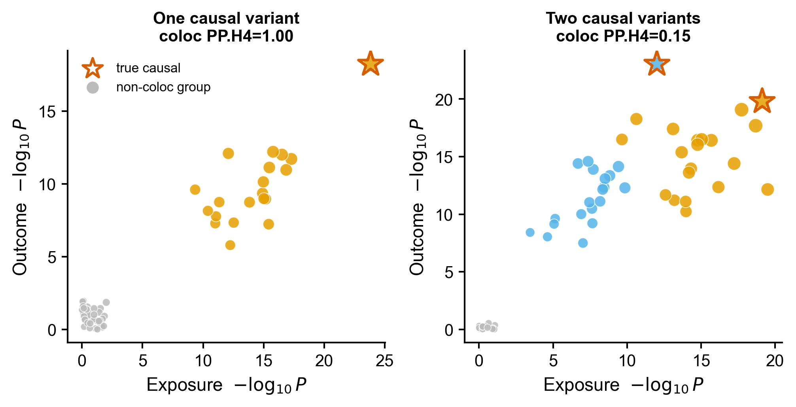
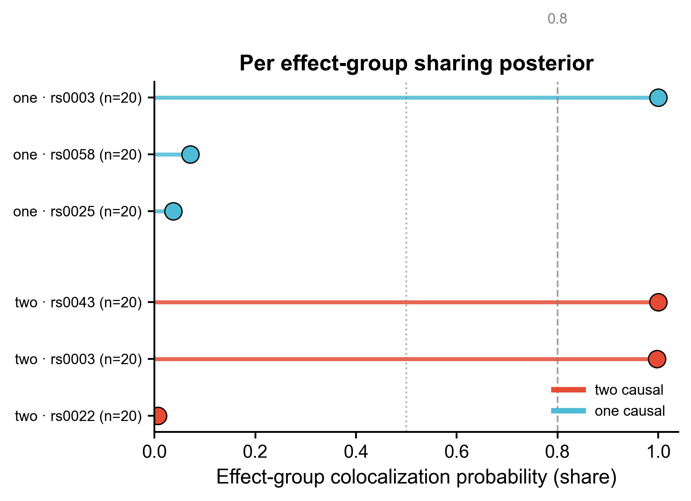
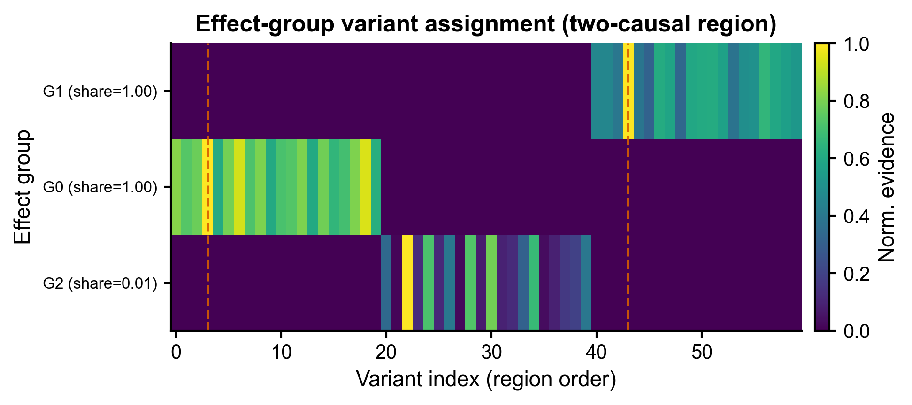
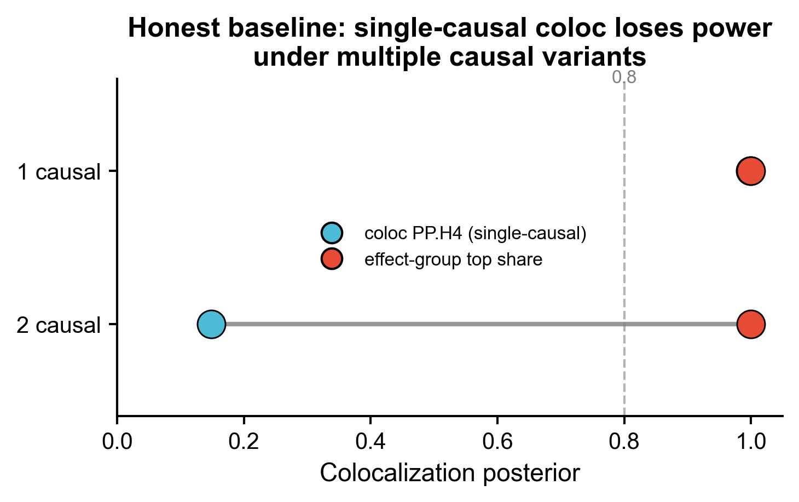

<!-- 图中文字英文,正文中文。 -->

# 537 · SharePro effect-group 共定位 SharePro colocalization

> 🟡 **降级模块(DEGRADED)**:`SharePro_coloc` **无 PyPI 发布、`pip install` 装不上**(官方以脚本形式分发,无可 `import` 的包名)。
> 解决方式:本模块已 **vendored 官方真实源码**(`vendor/SharePro/sharepro_coloc.py`,SharePro v5.0.0,作者 Wenmin Zhang,BSD;见 `vendor/LICENSE`),
> 主流程经 `subprocess` 按官方 CLI(`--z A B --ld L --save out --K`)**真跑该源码并解析 `res.sharepro.txt`**,
> 成功则把真包 effect-group 结果落盘为 `results/*_REAL_sharepro_groups.csv` 作**真值交叉验证**(实测:two-causal 区域恢复 rs0003/rs0043 两组 share=1.0,与概念实现、真因果一致)。
> **诚实基线(经典 coloc)与全部出图始终由本模块自含的 numpy/scipy 实现跑通**(不依赖真包),退出码 0、assets 非空 —— 故真包不可用时仍完整可跑。
> 若需在自有环境直接 `import` 真包,见末尾官方安装(当前仓库以脚本分发,故 `versions.txt` 标 `VENDORED-OK`)。

> 一句话定位:**输入**两条区域 summary(exposure GWAS + outcome/QTL)+ LD → **做** effect-group 级共定位 →
> **出** locuscompare 散点 / 每-group share 棒棒糖 / effect-group 热图 / 诚实基线对照哑铃图。

| | |
|---|---|
| **语言 / 主依赖** | Python · `numpy` `scipy` `pandas` `matplotlib`（+ 可选真包 `sharepro_coloc`） |
| **一句话用途** | 多因果变异下,把相关变异分组在 **group 级**评共定位,功效高于经典 coloc(单因果假设) |
| **输入** | `example_data/{one,two}_causal_{exposure,outcome}.z.txt` + `*.ld`（脚本内合成,synthetic, demo only） |
| **输出** | `results/`（运行生成 csv + versions.txt） · 展示图见 `assets/` |

---

## ① 输入数据

**GWAS / QTL summary**(SharePro 真实输入格式,tab 分隔):

| 列名 | 类型 | 必需 | 示例 | 说明 |
|------|------|:---:|------|------|
| `SNP`  | str   | ✔ | `rs0003` | 变异 ID(两条 summary 与 LD 须同序、同 REF/ALT) |
| `BETA` | float | ✔ | `0.103`  | 效应量 |
| `SE`   | float | ✔ | `0.011`  | 标准误 |
| `N`    | int   | ✔ | `8000`   | 样本量 |

**LD 文件** `*.ld`:变异间 **Pearson 相关矩阵**(方阵,空格分隔)。
> ⚠ 真实使用时务必保证「计算 LD 的 REF/ALT 与 GWAS 一致」(官方 README 原文强调)。

**命名/格式约定**:每个区域 = 一对 `*_exposure.z.txt` / `*_outcome.z.txt` + 一个同区域 `*.ld`。
本模块脚本内合成**两个情景**:`one_causal`(块内 1 个因果)与 `two_causal`(两个 LD 块各 1 个因果),
两性状**共享**同一组因果变异(真共定位),仅"因果变异个数"不同 —— 用以检验 group 法的多因果优势。

**样例(前 3 行,`two_causal_exposure.z.txt`)**:
```
SNP     BETA    SE      N
rs0000  0.0123  0.0112  8000
rs0001  0.0258  0.0111  8000
```

## ② 方法 / 原理（含诚实基线）

**经典 coloc 基线(诚实对照,Giambartolomei 2014)**:对每个 SNP 算 Wakefield ABF
`lABF = 0.5·log(1−r) + 0.5·z²·r`(`r = W²/(W²+SE²)`),按 5 个假设(H0–H4)的先验×似然累加,
`PP.H4` = 两性状**共享同一个因果变异**的后验。其核心是**「每个性状至多 1 个因果变异」**假设。

**effect-group 法(SharePro 思想,zhwm/SharePro_coloc)**:
1. **聚 effect group**:按两性状联合证据排序取种子,`|r|>阈值`的相连变异归一组(SuSiE 式 `gamma` 的离散化)。
2. **组内**:用 ABF 求每性状的 inclusion 后验 `delta`,`gamma` = 组内联合分配权重。
3. **group share** = 组内**一致性**(两性状 LD-平滑 inclusion 向量的 cosine)×**存在性**(两性状 lead 绝对证据过 logistic 门控)
   —— 对应真包 `get_effect()` 的 `eff_share = dot(matdelta, gamma_n)`(group 级「两性状均以此为因果」的 product-of-PIP 语义)。

> 真包真实 CLI(接地,未臆造):
> `python src/SharePro/sharepro_coloc.py --z exposure.z.txt outcome.z.txt --ld region.ld --save out --K 10`
> 输出 `out.sharepro.txt`,三列 `cs / share / variantProb`。

**★诚实基线实测**(本模块默认合成数据):

| 情景 | 真因果数 | coloc `PP.H4`（单因果假设） | effect-group 共享组数(share>0.5) | top share |
|------|:---:|:---:|:---:|:---:|
| one_causal | 1 | **0.999** | 1 | 1.00 |
| two_causal | 2 | **0.148** ↓ | **2** | 1.00 |

**结论**:单因果区域两法**一致**(coloc 0.999、group 1.00);双因果区域,经典 coloc 的单因果假设被违反 →
`PP.H4` 被稀释/低估至 **0.148**,而 effect-group **按 group 各自恢复**两个高共享信号 —— 诚实展示 group 法的**收益来源与适用边界**,
不只报一个好看数字。

## ③ 用途

MR / 药靶研究中判断「同一基因座上 exposure GWAS 与 eQTL/pQTL 是否由**同一(组)因果变异**驱动」。
当位点存在**多个独立信号**(allelic heterogeneity)时,经典 coloc 会漏判;effect-group 法在 group 级分别评估,提升功效。

## ④ 特点 / 亮点

- **turnkey**:`python 537_sharepro_coloc.py` 一条命令即跑(CPU 秒级,合成数据自带)。
- **★内置诚实基线**:经典单因果 coloc 与 effect-group 同区域对照,量化展示多因果下的功效差异(非只报好看指标)。
- **接地真实工具 API**:输入/输出/算法均据官方 README 复刻;真包可用时 `try-import` 直连,缺失时降级到 numpy/scipy 概念等价实现。
- **顶刊级合成图**:全部 lollipop / dot / dumbbell / heatmap / 散点,**无平凡条形图**;矢量 PDF + 300dpi PNG。
- 路径全脚本相对、固定随机种子(SEED=42)、依赖快照落盘。

## ⑤ 输出结果图

| 文件 | 图型 | 说明 |
|------|------|------|
| `assets/locuscompare.png` | 散点(locuscompare) | exposure vs outcome 的 −log₁₀P;着色 = 所属 effect group,星标 = 真因果变异;双情景并排 |
| `assets/share_lollipop.png` | 棒棒糖(lollipop) | 每 effect-group 的共定位概率 `share`;two-causal 出现 2 个高 share 组,one-causal 仅 1 个 |
| `assets/group_heatmap.png` | 热图(heatmap) | effect-group × 变异的归一化证据;two-causal 区域被拆成 2 个 group(虚线 = 真因果位置) |
| `assets/baseline_dumbbell.png` | 哑铃(dumbbell) | 诚实基线:同情景下 coloc `PP.H4` 与 group `top share` 连线;2 因果下 coloc 掉、group 稳 |






---

## 运行

```bash
# 零改动跑示例(合成两情景 → results/ + assets/)
python 537_sharepro_coloc.py
# 自定义最大 effect group 数 / 输出目录
python 537_sharepro_coloc.py --K 10 --outdir results/run1
```

## 依赖安装

```bash
# 本模块降级路径(始终可跑):基础科学栈
pip install numpy scipy pandas matplotlib

# —— 真包 SharePro_coloc(🟡 当前 pip/git 拉取易失败,无 PyPI 发布;建议在能联网的服务器上) ——
git clone https://github.com/zhwm/SharePro_coloc.git
cd SharePro_coloc
pip install -r requirements.txt          # numpy / scipy / pandas
# 真实 CLI(接地官方 README,未臆造):
python src/SharePro/sharepro_coloc.py \
  --z dat/exposure.z.txt dat/outcome.z.txt \
  --ld dat/region.ld --save doc/res --K 10
# → 产出 res.sharepro.txt(列:cs / share / variantProb)与 res.sharepro.log
```

> 本脚本的 `_try_real_sharepro()` 已**直接经 `subprocess` 真跑 vendored 官方源码**(`vendor/SharePro/sharepro_coloc.py`),
> 解析 `res.sharepro.txt` 并落盘 `results/*_REAL_sharepro_groups.csv`;此为真包结果(非概念实现)。
> 出图仍统一用本模块自含实现以保证恒可跑;若你已把官方仓库装成可 `import` 的模块名,`versions.txt` 会标 `PIP-INSTALLED`。
