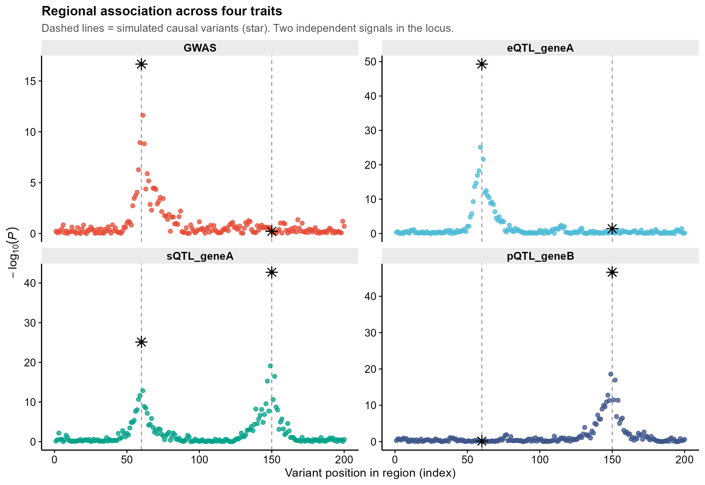
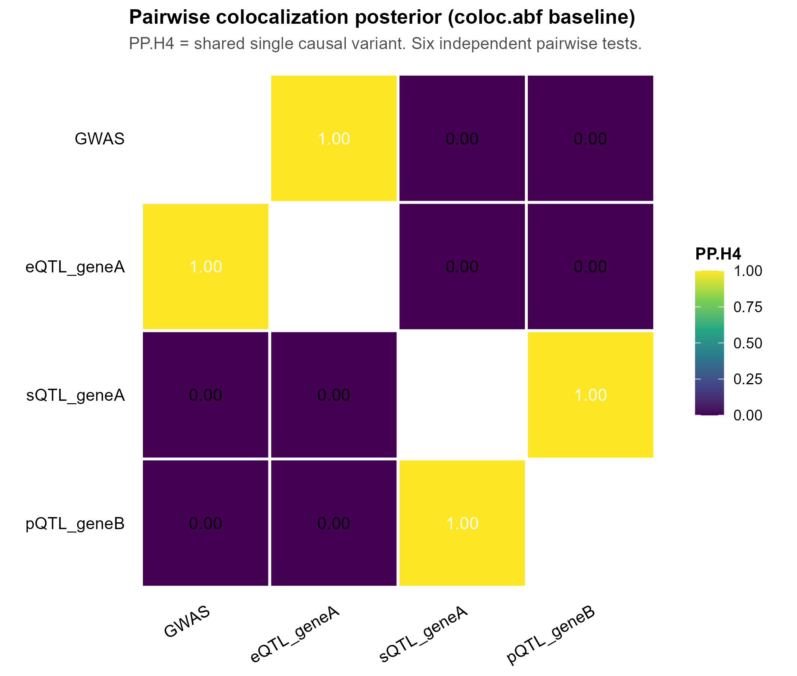
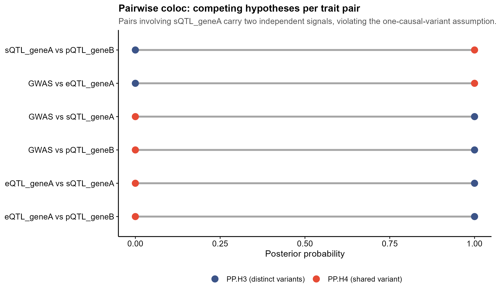
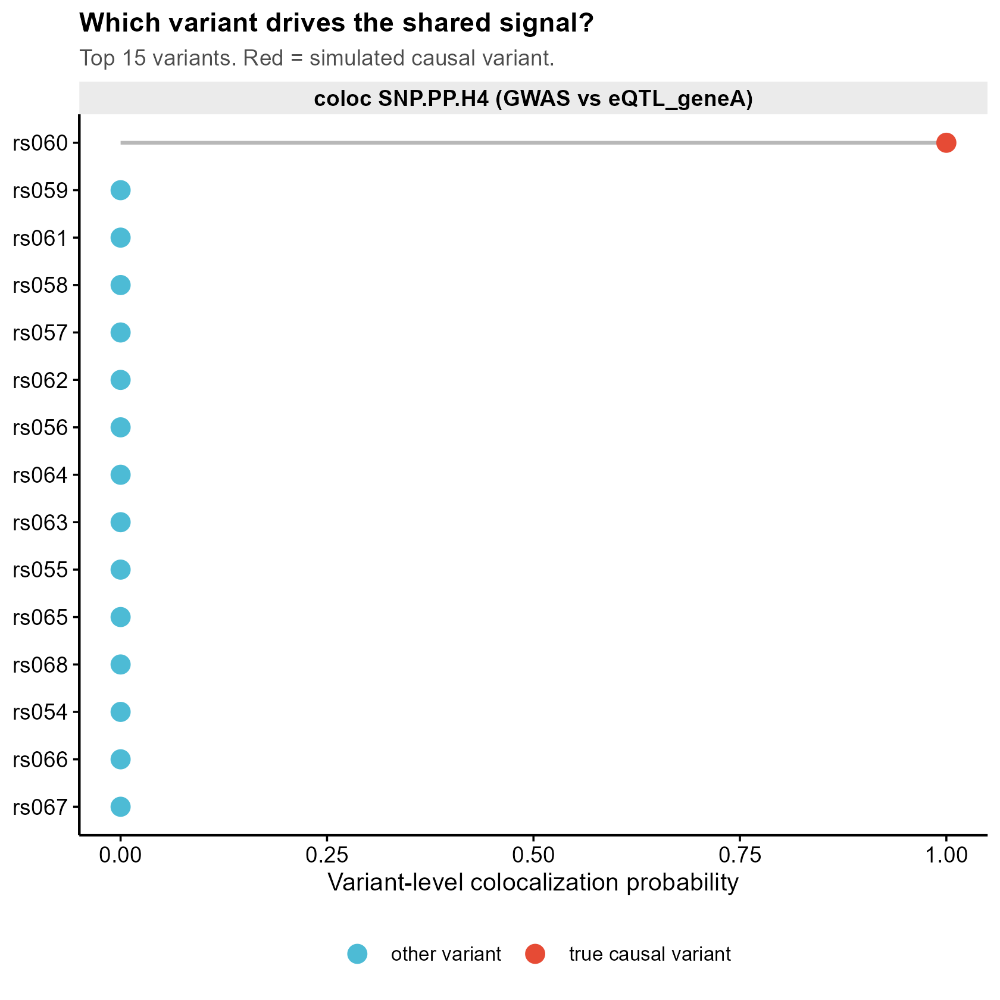

<!-- 图中文字英文,正文中文。 -->

# 594 · ColocBoost 多性状共定位 ColocBoost multi-trait colocalization

> 🟡 **降级模块(DEGRADED)**:本机 **未安装 `colocboost`**(本次任务不允许装包)。
> 脚本对真包做 `requireNamespace()` 守卫 —— 装了就按**官方真实签名**真跑并把
> `cos_summary` / `vcp` 落盘,没装就只跑基线并打印真实安装命令,**绝不伪造真包结果**。
> **基线不是我重写的近似,而是真包 `coloc::coloc.abf`(本机 coloc 5.2.3 已装)** ——
> 即 ColocBoost 声称要超越的 pairwise ABF 框架本身。因此无论真包在不在,
> `Rscript 594_colocboost_colocalization.R` 都退出码 0 并出全部 4 张图。

> 一句话定位:**输入**同一基因座上多个性状(GWAS + eQTL/sQTL/pQTL)的 summary statistics + LD →
> **做** 两两 coloc 基线(+ 可选 ColocBoost 多性状联合)→
> **出** 区域多性状散点 / 两两 PP.H4 热图 / H3-vs-H4 哑铃图 / 变异级共定位棒棒糖。

| | |
|---|---|
| **语言 / 主依赖** | R ≥4.0 · 基线 `coloc` `ggplot2`;真包 `colocboost`(CRAN,仅需 `Rfast` `matrixStats`) |
| **一句话用途** | 一个 locus 上多个组学性状,判断**哪些性状子集共享同一因果变异** |
| **输入** | `example_data/sumstat_<trait>.csv` × 4 + `region_ld.csv`(脚本内合成,synthetic, demo only) |
| **输出** | `results/`(csv + versions.txt) · 展示图见 `assets/` |
| **运行时间** | CPU 秒级(200 变异 × 4 性状) |

---

## ① 输入数据

**每性状一个 summary statistics 表** `sumstat_<trait>.csv`(行 = 变异):

| 列名 | 类型 | 必需 | 示例 | 说明 |
|------|------|:---:|------|------|
| `variant` | str | ✔ | `rs060` | 变异 ID,须与 LD 矩阵 dimnames 一致 |
| `pos` | int | ✔ | `60` | 区域内位置(索引,仅作图用) |
| `maf` | float | ✔ | `0.2314` | 次等位基因频率(coloc 基线需要) |
| `beta` | float | ✔ | `0.152` | 边际效应量 |
| `se` | float | ✔ | `0.018` | 标准误 |
| `z` | float | ✔ | `8.44` | z = beta/se(**ColocBoost 真包直接吃这一列**) |
| `n` | int | ✔ | `3000` | 样本量 |

**LD 文件** `region_ld.csv`:变异间 Pearson 相关方阵,**首行/首列为 variant 名**
(官方要求 LD 的 `rownames`/`colnames` 必须含 `variant` 名以便对齐)。

`true_causal.csv`:合成数据的真因果变异清单(仅用于出图标注与自查,真实分析中没有这个文件)。

**样例(前 3 行,`sumstat_GWAS.csv`)**:
```
"variant","pos","maf","beta","se","z","n"
"rs001",1,0.4185,0.013778,0.026243,0.525,3000
"rs002",2,0.4267,-0.004776,0.025824,-0.1849,3000
```

**合成数据设计**(见脚本 Step 0):200 变异、2 个 LD 块(块内 AR(1) ρ=0.93)、真实 0/1/2 dosage
(潜变量双单倍型阈值化,故 MAF 真实)、4 个性状、**2 个独立因果变异**:

| 性状 | causal_1 `rs060` | causal_2 `rs150` |
|---|:---:|:---:|
| `GWAS` | ✔ 0.16 | — |
| `eQTL_geneA` | ✔ 0.28 | — |
| `sQTL_geneA` | ✔ 0.22 | ✔ 0.24 |
| `pQTL_geneB` | — | ✔ 0.26 |

真值 = **两个共定位簇**:`{GWAS, eQTL_geneA, sQTL_geneA}` 共享 rs060;
`{sQTL_geneA, pQTL_geneB}` 共享 rs150。`sQTL_geneA` **同时属于两簇** —— 这正是
pairwise 框架处理不了的结构。

## ② 方法 / 原理

**基线(真包 `coloc::coloc.abf`,Giambartolomei et al. 2014)**:
对每一对性状独立跑一次 Wakefield ABF,输出 H0–H4 五个后验;`PP.H4` = 两性状共享**同一个**
因果变异。4 个性状 → **6 次独立两两检验**,且每次都假设「每性状在该区域至多 1 个因果变异」。

**ColocBoost(真包路径)**:把共定位改写成**多任务变量选择回归**问题 ——
在高度相关的预测变量(LD)与稀疏效应下,用 **proximity gradient boosting** 一次性对
所有性状联合建模,直接给出「哪个变异子集对哪个**性状子集**有非零效应」,
即 colocalization confidence set(CoS)。不需要枚举性状对,也不锁死单因果假设。

真实 API(**逐条读本地克隆的上游源码核对,非网页转述;出处见下方「API 接地」表**):
```r
# sumstat: list of data.frame,列名必须是 z(或 beta+sebeta)、n、variant
sumstat_list <- lapply(SS, function(d) data.frame(z = d$z, n = d$n, variant = d$variant))
res <- colocboost::colocboost(sumstat = sumstat_list, LD = LD)   # LD 需带 dimnames
res$cos_summary                 # 共定位事件汇总表
res$vcp                         # variant colocalized probability(每变异)
res$cos_details$cos$cos_index   # 每个 CoS 的变异索引,名字形如 "cos1:y1_y2_y3"
colocboost_plot(res)            # 官方可视化
```
其余 ~60 个调参(`M` `tau` `learning_rate_init` `coverage` `focal_outcome_idx` `output_level` …)
签名已在脚本头部注明来源,**本模块只用默认值**;生产运行前请以官方 vignette 为准。

**★诚实基线实测**(本机默认合成数据,`results/baseline_pairwise_coloc.csv`):

| 性状对 | 真值是否共享 | coloc `PP.H3` | coloc `PP.H4` | 判定 |
|---|:---:|---:|---:|:---:|
| GWAS vs eQTL_geneA | ✔ rs060 | 1.8e-08 | **1.000** | ✔ 对 |
| sQTL_geneA vs pQTL_geneB | ✔ rs150 | 0.000 | **1.000** | ✔ 对 |
| **GWAS vs sQTL_geneA** | **✔ rs060** | **1.000** | **1.4e-12** | ❌ **漏判** |
| **eQTL_geneA vs sQTL_geneA** | **✔ rs060** | **1.000** | **6.8e-14** | ❌ **漏判** |
| GWAS vs pQTL_geneB | ✘ | 1.000 | 1.3e-12 | ✔ 对 |
| eQTL_geneA vs pQTL_geneB | ✘ | 1.000 | 1.25e-40 | ✔ 对 |

**结论**:凡是**不涉及** `sQTL_geneA`(唯一的双信号性状)的性状对,pairwise coloc 全判对;
一旦某性状带**两个独立信号**,单因果 ABF 只认它更强的那个 lead(rs150),
于是把真实共享 rs060 的两对判成 `PP.H3≈1`(不同变异)—— **两个真阳性被漏掉**。
这是 allelic heterogeneity 下的经典失效模式。

> **不夸大**:这不是"coloc 不行、ColocBoost 行"的证明。
> ① coloc 自己的补丁是 `coloc.susie`(Wallace 2021, PLoS Genet, PMID 34587156),
> 专门解决多因果变异,本模块**没有**跑它,所以上表**不是** ColocBoost vs 最强 coloc 的公平对比;
> ② ColocBoost 相对 pairwise 的差异化主张是**多性状联合**(一次给出性状子集)与**避免 6 次独立检验**,
> 本机未装真包,该主张在本模块内**未经实测验证**。上表只诚实展示"最常用的 `coloc.abf` 默认用法"
> 在这个结构下会漏什么。

## ③ 用途

MR / 药靶 / 功能基因组研究中的典型问题:一个 GWAS 风险位点旁边挂着多个分子性状
(某基因的 eQTL、其剪接 sQTL、邻近基因的 pQTL、多组织多细胞类型的 xQTL……),
要判断**风险信号究竟通过哪个分子事件传导**。性状一多,pairwise coloc 的检验数按
O(K²) 膨胀且彼此独立、结论互相打架;多性状联合方法直接输出「性状子集 × 变异集」的共定位事件。
适合 xQTL 富集区域、多组织/多细胞类型 QTL、以及 disease-prioritized 共定位
(真包 `focal_outcome_idx` 参数)。

## ④ 特点 / 亮点

- **turnkey**:`Rscript 594_colocboost_colocalization.R` 一条命令即跑,秒级出全部结果与图。
- **★基线是真包不是手搓**:`coloc::coloc.abf` 直接跑,6 对全跑,结果表落盘可复核。
- **守卫式真包封装**:`colocboost` 在则真跑真落盘,不在则明确跳过 + 打印真实安装命令;
  `results/versions.txt` 记录 `REAL-RUN-OK` / `NOT-INSTALLED` / `INSTALLED-BUT-FAILED` 三态。
- **API 接地**:sumstat 列名(`z`/`n`/`variant`)、LD dimnames 要求、返回对象字段、
  全部调参默认值,**逐条指到上游源码文件:行号**(见文末表),未臆造。
- **顶刊级图**:dot / heatmap / dumbbell / lollipop,**无条形图**;矢量 PDF + 300dpi PNG。
- 路径全脚本相对、固定随机种子(SEED=42)、依赖快照落盘。

## ⑤ 输出结果图

| 文件 | 图型 | 说明 |
|------|------|------|
| `assets/region_multitrait_dots.png` | 散点(dot) | 4 性状区域关联图;虚线+星标 = 真因果变异;可见 sQTL 有两个峰 |
| `assets/pairwise_pph4_heatmap.png` | 热图(heatmap) | 6 次两两 coloc 的 `PP.H4` 方阵(viridis) |
| `assets/pph_dumbbell.png` | 哑铃(dumbbell) | 每对性状的 `PP.H3`(不同变异)vs `PP.H4`(共享变异)对照 |
| `assets/variant_level_lollipop.png` | 棒棒糖(lollipop) | 变异级共定位概率 top15;基线用 coloc 输出列 `SNP.PP.H4`,真包可用时并排叠加 `ColocBoost VCP` |






---

## 运行

```bash
# 零改动跑示例(自动合成 example_data → results/ + assets/)
Rscript 594_colocboost_colocalization.R

# 换成自己的数据 / 换焦点性状 / 换输出目录
Rscript 594_colocboost_colocalization.R --datadir data/mylocus --focal GWAS --outdir results/run1
```

冒烟测试(2026-07-20,本机 R 4.4.3 + coloc 5.2.3):退出码 0,
`results/` 产出 `baseline_pairwise_coloc.csv` + `versions.txt`,`assets/` 产出 4 × PNG + 4 × PDF,
`versions.txt` 中 `colocboost: NOT-INSTALLED`。

## 依赖安装

```r
# 基线路径(本机已具备,始终可跑)
install.packages("coloc")        # 本机 5.2.3
install.packages("ggplot2")

# —— 真包 ColocBoost(纯 R,CRAN,依赖极轻:Rfast + matrixStats)——
install.packages("colocboost")                        # CRAN 稳定版(1.0.9;上游 CRAN-SUBMISSION 记 2026-06-07)
devtools::install_github("StatFunGen/colocboost")     # 开发版
```

## API 接地(逐条对上游源码,2026-07-21 复核)

上游源码已克隆到本地(`StatFunGen/colocboost`,DESCRIPTION `Version: 1.0.9`,
`Date: 2026-06-07`,`License: MIT + file LICENSE`,`Imports: Rfast, matrixStats`)。
下表每一行都指到**源码文件:行号**,不是从网页转述的:

| 本模块调用 | 上游源码位置 | 复核结论 |
|---|---|---|
| `colocboost::colocboost(...)` | `R/colocboost.R:143` 函数定义 | ✔ 导出于 `NAMESPACE: export(colocboost)` |
| 形参 `sumstat=` / `LD=` | `R/colocboost.R:144` | ✔ 二者均为顶层形参,默认 `NULL` |
| sumstat 需列 `z`(或 `beta`+`sebeta`)、`n`、`variant` | `vignettes/Input_Data_Format.Rmd:49,55-57` | ✔ `z` 必需;`n`/`variant` 官方标"highly recommended" |
| `LD` 需带 dimnames | `vignettes/Input_Data_Format.Rmd:60` | ✔ 原文要求 `colnames`/`rownames` 含 variant 名 |
| 返回 `$cos_summary` | `R/colocboost.R:107` @return · `R/colocboost_assemble.R:238` 实际赋值 | ✔ |
| 返回 `$vcp` | `R/colocboost.R:108` @return · `R/colocboost_output.R:241-243` 实际计算 | ✔ 带 `names()` = variant 名 |
| 返回 `$cos_details$cos$cos_index` | `R/colocboost.R:135`(官方 roxygen 示例原句) | ✔ |
| CoS 命名形如 `cos1:y1_y2_y3` | `R/colocboost_output.R:290` `paste0("cos", i, ":", paste0(paste0("y", idx), collapse="_"))` | ✔ |
| 其余调参 `M=500` `tau=0.01` `learning_rate_init=0.01` `coverage=0.95` `output_level=1` `focal_outcome_idx=NULL` | `R/colocboost.R:160,162,163,182,201,150` | ✔ 名称与默认值逐个核过 |
| `colocboost_plot(res)` | `R/colocboost_plot.R:73` | ✔ 首参名为 `cb_output` |
| 基线 `coloc::coloc.abf(dataset1=, dataset2=)` | 本机已装 coloc 5.2.3,`formals()` 实测 = `dataset1, dataset2, MAF, p1, p2, p12` | ✔ |

上游 `vignettes/` 目录实有 **15 个 `.Rmd`**(含 `installation` 与 `announcements`);
官方教程站点 <https://statfungen.github.io/colocboost/> 由这些 vignette 生成。

## 引用(已核实)

**ColocBoost —— ⚠️ 截至 2026-07-20 仍是 preprint,未见期刊发表版**
(Crossref `type = posted-content`,`institution = medRxiv`,无 `is-preprint-of` 关系;
PubMed 记录 `source = medRxiv`,`pubtype` 含 `Preprint`):

> Cao X, Sun H, Feng R, Mazumder R, Buen Abad Najar CF, Li YI, de Jager PL, Bennett D,
> The Alzheimer's Disease Functional Genomics Consortium, Dey KK, Wang G.
> **Integrative multi-omics QTL colocalization maps regulatory architecture in aging human brain.**
> *medRxiv* 2025.04.17.25326042(PubMed `ArticleDate` = 2025-05-06;DOI 数字段 2025.04.17 为初次挂载版本号)。
> doi:10.1101/2025.04.17.25326042 · PMID **40385406** · PMCID **PMC12083576**

基线与对照方法:

> Giambartolomei C, Vukcevic D, Schadt EE, Franke L, Hingorani AD, Wallace C, Plagnol V.
> Bayesian test for colocalisation between pairs of genetic association studies using summary statistics.
> *PLoS Genet* 2014;10(5):e1004383. PMID **24830394**
>
> Wallace C. A more accurate method for colocalisation analysis allowing for multiple causal variants.
> *PLoS Genet* 2021;17(9):e1009440. doi:10.1371/journal.pgen.1009440 · PMID **34587156**
> (= `coloc.susie`;本模块**未**运行,列出以免上表被误读为"最强 coloc"的对比)
