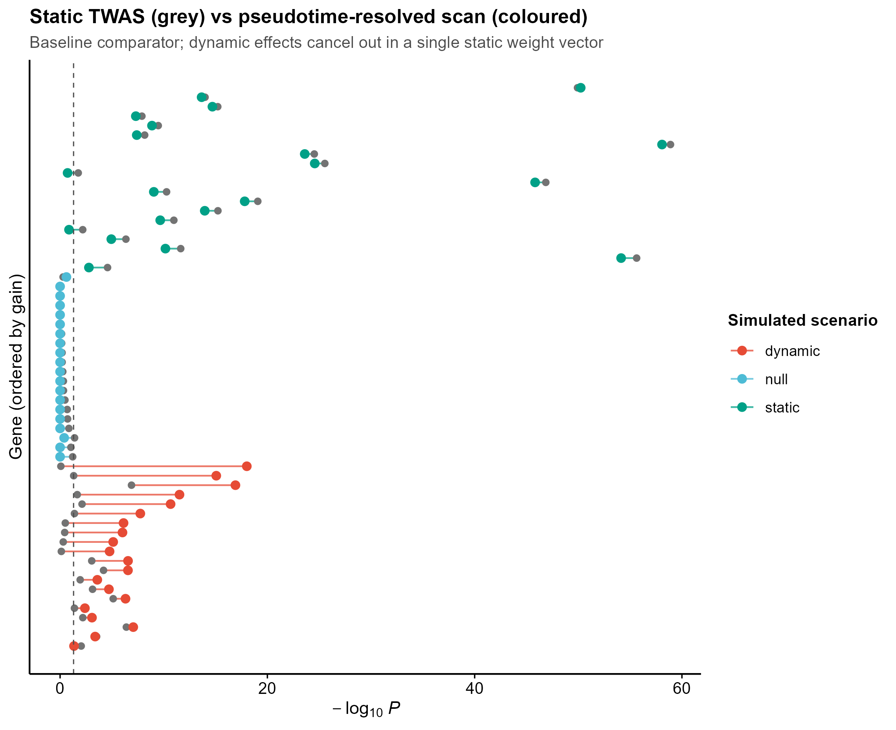
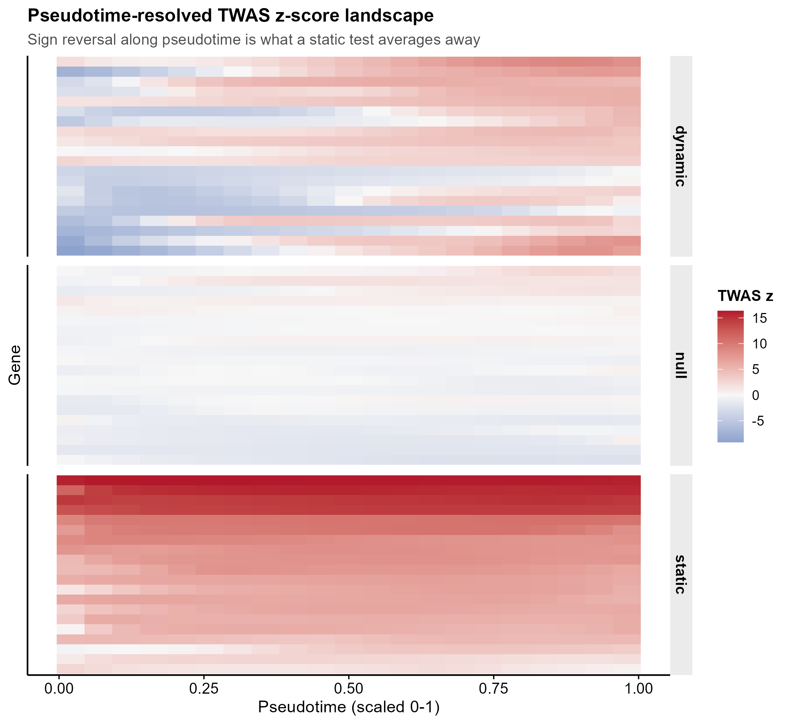
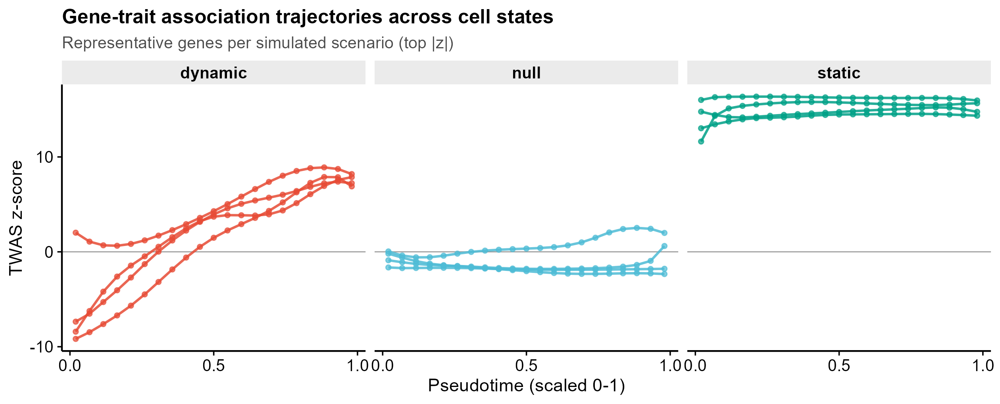
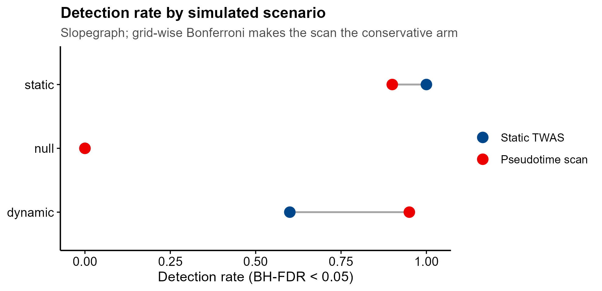

# 592 · TWiST — 细胞状态(拟时序)层面的转录组关联分析

> 输入 **GWAS 汇总统计 + 单细胞 eQTL 训练出的 B-spline 权重矩阵 + LD 参考** → 沿**拟时序**逐点做 TWAS,
> 与传统"一个细胞类型压成一个权重向量"的静态 TWAS 对照 → 出 dumbbell / 热图 / 轨迹 / slopegraph 四图。

| | |
|---|---|
| **语言 / 主依赖** | R 4.4+ · 基线仅需 `splines`(base)+ `ggplot2`;正式 TWiST 路径需 `TWiST` `plink2R` `fda` `grpreg` |
| **一句话用途** | 检验基因-性状效应是否**沿细胞状态变化**,而不只是"这个细胞类型里有没有关联" |
| **输入** | `example_data/`(合成):GWAS z 值、Wmat 权重、wgtlist 注释、LD 矩阵 |
| **输出** | `results/`(运行生成)· 展示图见 `assets/` |
| **状态** | 🟡 基线本机零改动跑通出图;完整 TWiST 三联检验需另装 R 包(见文末) |

---

## ① 输入数据

**文件 1**:`gwas_sumstats_synth.txt`(tsv,行=SNP)—— 列名与上游 `twist_association(sumstat=)` 要求一致

| 列名 | 类型 | 必需 | 示例 | 说明 |
|------|------|:---:|------|------|
| `SNP` | str | ✔ | `GENE001:rs900001` | SNP ID |
| `A1` | str | ✔ | `T` | 效应等位 |
| `A2` | str | ✔ | `G` | 另一等位 |
| `Z` | num | ✔ | `-1.2716` | GWAS 关联 z 统计量 |

**文件 2**:`twist_weights_Wmat_synth.csv`(行=基因×SNP)—— 对应上游 `twist_train_model()` 输出的 `Wmat`

| 列名 | 类型 | 必需 | 示例 | 说明 |
|------|------|:---:|------|------|
| `ID` | str | ✔ | `GENE001` | 基因标识 |
| `SNP` | str | ✔ | `GENE001:rs900001` | cis-SNP |
| `basis1..basis7` | num | ✔ | `-0.1078` | SNP 对表达的效应在 7 个 B-spline 基上的系数 |

> 7 = `bs(t, knots=c(.25,.5,.75), degree=3, Boundary.knots=c(0,1), intercept=TRUE)` 的基数,
> 与 TWiST `twist_train_model()` 的默认 `knots`/`degree` 一致。任意拟时序点的权重
> **w(t) = Wmat %*% b(t)**。

**文件 3**:`wgtlist_synth.csv` —— 列 `ID, CHR, P0, P1, tss`(上游 `wgtlist` 规格),本模块额外带一列
`scenario`(仅合成数据用于标注真值,真实数据不需要)。

**文件 4**:`ld_reference_synth.csv` —— SNP×SNP LD 矩阵(真实分析中由 plink 参考面板算出)。
**文件 5**:`ngwas_synth.txt` —— GWAS 有效样本量;二分类性状为 `ncase*ncontrol/(ncase+ncontrol)`。

**命名/格式约定**:`Wmat` 与 `sumstat` 的 `SNP` 必须能对上;合成数据里每个基因占独立 cis 区间,故 SNP 名带基因前缀。

**样例(前 3 行,`gwas_sumstats_synth.txt`)**:
```
SNP	A1	A2	Z
GENE001:rs900001	T	G	-1.27156435105051
GENE001:rs900002	T	A	0.994905348379953
```

## ② 方法 / 原理

TWiST 的出发点:同一个细胞类型内部,eQTL 效应和基因-性状效应都会**沿细胞状态(拟时序)漂移**。
传统 TWAS 把整个细胞类型折叠成一个权重向量,沿拟时序反向的效应会互相抵消而被漏掉。

**本模块的基线(本机可跑,朴素对照)**
1. 用 `Wmat %*% b(t)` 复原任一拟时序点 t 的 eQTL 权重 `w(t)`;
2. 在每个 t 上做经典 FUSION 式 burden 检验 `z = w'z_gwas / sqrt(w'Rw)`;
3. **静态臂** 用拟时序平均权重 `w̄ = Wmat %*% mean(b(t))` 做同样一次检验;
4. **扫描臂** 取跨网格最小 p,乘网格点数做 Bonferroni(网格高度相关,该校正偏保守,
   是对扫描臂**不利**的设定,不是给它开后门);两臂各自再做 BH-FDR。

合成数据含三类真值基因:`null`(无效应)、`static`(效应沿拟时序恒定)、`dynamic`(效应沿拟时序变号)。
本机实跑结果(BH-FDR<0.05 检出率):`null` 0.00 / 0.00,`static` 1.00 / 0.90,`dynamic` **0.60 / 0.95**
(静态臂 / 扫描臂)。即:分辨细胞状态换来 dynamic 基因的检出,代价是在纯 static 基因上因多重校正略有损失。

**正式 TWiST 路径(守卫式封装)**
真正的 TWiST 不用这种网格扫描 + Bonferroni,而是把基因-性状效应写成
`β(t) = β_l0 + β_l1·t + Σ β_m ψ_m(t)`,用标量-函数回归 + 等价混合模型,做三个似然比检验:
`p.global`(有没有关联)、`p.dynamic`(效应随拟时序变不变)、`p.nonlinear`(变得是否非线性)。
本模块**不复刻**这套检验,只在包装好后调用官方函数。

已核实的官方签名(逐字取自上游文档,URL 见文末):

```r
twist_association(sumstat, wgtlist, weights_pred, bim_train, genos, ngwas,
                  opt = list(max_impute = 0.6, min_r2pred = 0.8, degree_beta = 3,
                             knots_beta = seq(0.05, 0.95, by = 0.05),
                             logsigma2vec = seq(-20, 8, by = 0.2)))
# 返回 list: out.tbl(ID CHR P0 P1 tss sigma2 p.global p.dynamic p.nonlinear degree),
#            betal, var.betal, beta, var.beta, knots

twist_train_model(y, geno_cell, pt, knots = c(0.25, 0.5, 0.75), degree = 3,
                  lambda = NULL, nlambda = 20, libsize, covar)
# 返回 grpreg 对象 + Wmat(nsnp x nbasis)、knots、degree、lambda.seq
```

> ⚠️ 上游文档与代码不一致(实测):`man/twist_train_model.Rd` 的正文写 "nlambda ... default value is 50",
> 但同文件 usage 块与 `R/train_pred_model.R:31` 的真实默认值是 **20**(上游 README 的示例里又写成 10)。
> 以代码为准 = 20。本模块的基线不调用该函数,此处仅为使用者提醒。

上游提供 **CD4+ T / CD8+ T / B 细胞**的预训练权重(repo 的 `pretrained_models/`),可跳过 stage-1 训练。

## ③ 用途

- 一个 TWAS 显著基因,它的效应是**贯穿整个细胞类型**,还是只在**某个分化/激活阶段**才出现?
- 传统 TWAS 在某细胞类型里为阴性的基因,是否因为效应沿细胞状态变号而被平均掉了?
- 自免/血液性状(如 RA)结合 OneK1K 等单细胞 eQTL 数据,把风险基因定位到具体细胞状态区间。

## ④ 特点 / 亮点

- **turnkey**:`Rscript 592_twist_transcriptome_wide_test.R` 一条命令跑完,自动生成合成输入;
- **自带朴素基线**:静态 TWAS vs 拟时序扫描同框对比,量化"分辨细胞状态到底买到了什么",
  且多重校正设定对扫描臂不利,不美化对照;
- **不臆造 API**:正式 TWiST 路径的函数名/参数逐字来自上游 `man/*.Rd` 与 `example_data/example.R`,
  缺包时打印真实安装命令并退出该分支,绝不降级伪造;
- **顶刊图,零条形图**:dumbbell / 发散色热图 / 轨迹曲线 / slopegraph;
- 固定随机种子(`--seed`),路径全相对。

## ⑤ 输出结果图

| 文件 | 图型 | 说明 |
|------|------|------|
| `assets/fig1_static_vs_scan_dumbbell.png` | dumbbell | 每个基因从静态 p(灰)到扫描 p(彩)的位移,按增益排序 |
| `assets/fig2_pseudotime_z_heatmap.png` | 发散色热图 | 基因 × 拟时序的 TWAS z 全景,dynamic 组可见沿 t 变号 |
| `assets/fig3_effect_trajectories.png` | 轨迹曲线 | 各情景代表基因的 z(t) 曲线 |
| `assets/fig4_detection_rate_slopegraph.png` | slopegraph | 两种检验在三类真值上的检出率 |

结果表(`results/`,不入库):`592_baseline_gene_results.csv`(每基因 z_static / p_static / t_peak / z_peak /
p_scan_bonf / FDR)、`592_pseudotime_zscore_matrix.csv`(基因×拟时序 z 矩阵)、
`592_detection_rate_by_scenario.csv`。









---

## 运行

```bash
# 零改动跑示例(基线 + 四张图)
Rscript 592_twist_transcriptome_wide_test.R

# 换目录 / 调网格 / 换种子
Rscript 592_twist_transcriptome_wide_test.R --datadir data/mine --outdir results/run1 --npt 41 --seed 7

# 重新生成合成示例数据
Rscript 592_twist_transcriptome_wide_test.R --regen-example

# 探测正式 TWiST 路径(未装包则打印安装命令与已核实调用模板后跳过)
Rscript 592_twist_transcriptome_wide_test.R --run-twist
```

## 依赖安装

基线只用 base R 的 `splines` 与 `ggplot2`,本机已有,无需安装。

正式 TWiST 路径(本模块**不会**自动安装):

```r
install.packages(c("devtools", "fda", "grpreg", "dplyr", "data.table"))
devtools::install_github("gqi/TWiST")
devtools::install_github("gabraham/plink2R/plink2R")
```

官方最小示例(上游 `example_data/example.R`):

```r
library(dplyr); library(plink2R); library(TWiST)
sumstats <- data.table::fread("example_data/RA_sumstats_chr6.txt")
ngwas <- 22350 * 74823 / (22350 + 74823)
load("pretrained_models/twist_weights_T_CD8.rda")   # -> wgtlist, weights_pred, bim_train
wgtlist.chr <- wgtlist %>% filter(CHR == 6)
genos.chr <- read_plink("example_data/1000G.EUR.6")
res <- twist_association(sumstat = sumstats, wgtlist = wgtlist.chr,
                         weights_pred = weights_pred[wgtlist.chr$ID],
                         bim_train = bim_train, genos = genos.chr, ngwas = ngwas)
```

## 引用(已核实)

Qi G, Lila E, Ji Z, Shojaie A, Battle A, Sun W. **Transcriptome-wide association studies at
cell-state level using single-cell eQTL data.** *Cell Genomics* 2026 Jan 14.
doi:[10.1016/j.xgen.2025.101060](https://doi.org/10.1016/j.xgen.2025.101060) · PMID **41187759**

核实方式:NCBI E-utilities `esummary`(PMID 41187759 → 标题、作者 Qi/Lila/Ji/Shojaie/Battle/Sun、
期刊 Cell Genomics、DOI 均对得上)。上游 README 引用的是同一工作的 medRxiv 预印本
(PMID 40166533,doi:10.1101/2025.03.17.25324128),此处给正式发表版。

**实际读取 API 的 URL**:
- `https://raw.githubusercontent.com/gqi/TWiST/HEAD/README.md`
- `https://raw.githubusercontent.com/gqi/TWiST/HEAD/man/twist_association.Rd`
- `https://raw.githubusercontent.com/gqi/TWiST/HEAD/man/twist_train_model.Rd`
- `https://raw.githubusercontent.com/gqi/TWiST/HEAD/example_data/example.R`
- `https://raw.githubusercontent.com/gqi/TWiST/HEAD/R/association.R`(读统计模型,未复刻)

API 核对基于本地克隆的上游源码(`R/association.R`、`R/train_pred_model.R`、`man/*.Rd`、
`example_data/example.R`),不是靠网页 README 推断。

**未确认项 / 上游现状(逐条已在克隆源码里查过)**:

- **许可证:上游未声明。** repo 内**没有 LICENSE 文件**,`DESCRIPTION` 的 License 字段仍是包骨架占位符
  (逐字为 `License: What license is it under?`)。因此 TWiST 的复用/再分发条件在法律上**未定**,
  用于论文前建议直接联系作者确认。本模块只调用、不再分发上游代码或预训练权重。
- 上游**没有** `pkgdown` 文档站、没有 vignette、没有 `docs/`(已在克隆目录中确认不存在);
  文档全部就是 `man/*.Rd` 三个文件 + README。
- `opt` 各字段除函数签名里的默认值外,上游无推荐取值说明。
- 预训练权重仅覆盖 CD4+ T / CD8+ T / B 三种细胞类型(`pretrained_models/` 下三个 `.rda`),
  其他细胞类型需自行跑 stage-1 训练。
- `read_plink()` 属于**另一个 repo**(`gabraham/plink2R`),不在 TWiST 源码内;
  本模块引用它的依据是上游 `example_data/example.R:13` 与上游 README 的安装指引,其源码未在本次核对范围内。
- 上游 `DESCRIPTION` 的 `Description:` 字段同样是未填写的骨架占位文本;`Imports` 为
  `splines, grpreg, fda, dplyr`(`plink2R`、`data.table`、`qqman` 是示例用到但未写进 Imports 的)。
