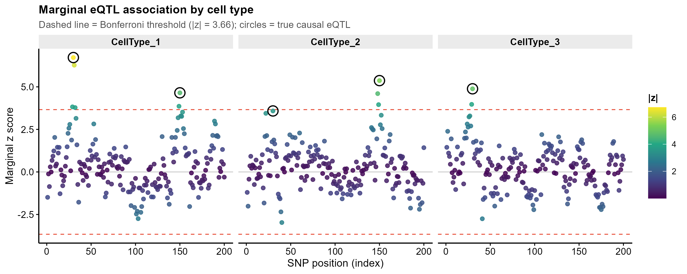
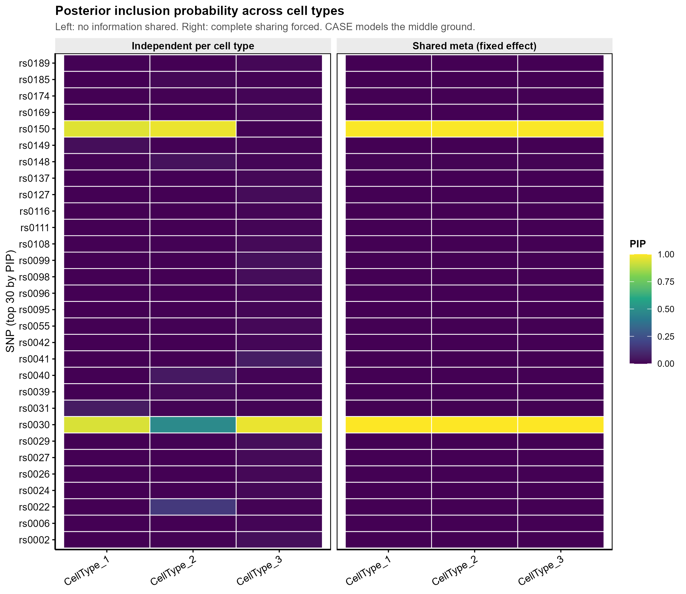
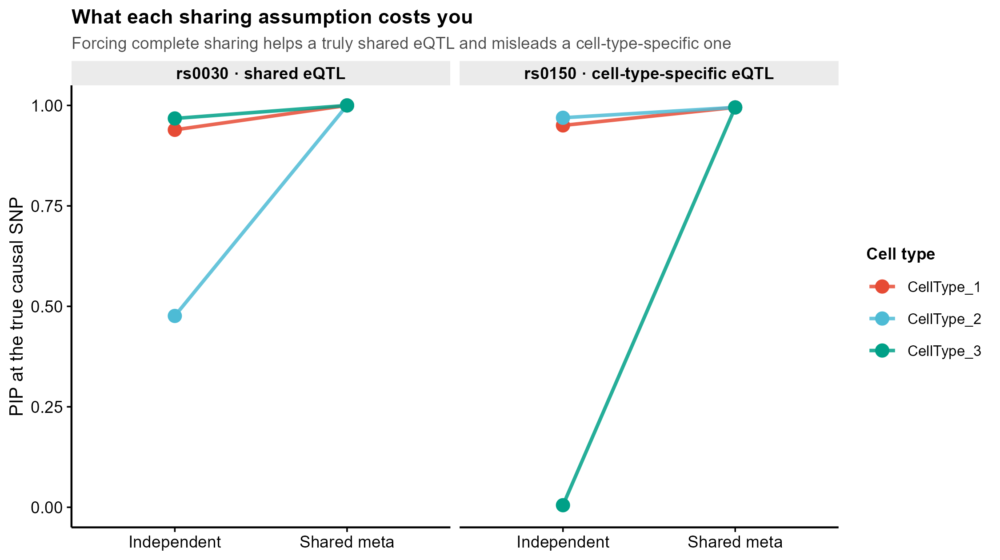
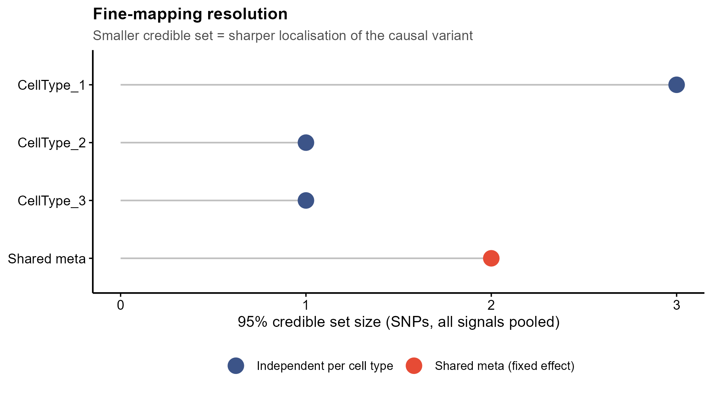

# 593 · CASE — 细胞类型特异与共享 eQTL 精细定位 (Cell-type-specific And Shared EQTL fine-mapping)

> 一句话定位:输入**基因型 + 分细胞类型表达**,在一个位点上同时对多个细胞类型做精细定位,
> **把"跨细胞类型共享的 eQTL"和"只属于某一种细胞类型的特异 eQTL"分开**,输出每细胞类型的
> PIP / 可信集,并出 z 分数散点、PIP 热图、共享假设 slopegraph、可信集分辨率点图。

| | |
|---|---|
| **语言 / 主依赖** | R 4.4 · base R + `ggplot2`(框架 `theme_pub.R`);**上游 `CASE` 为可选** |
| **一句话用途** | 多细胞类型 eQTL 联合精细定位,区分共享效应与细胞类型特异效应 |
| **输入** | `example_data/genotypes.csv`(样本×SNP 剂量) + `example_data/expression.csv`(样本×细胞类型) |
| **输出** | `results/`(运行生成)· 展示图见 `assets/` |
| **状态** | 🟡 诚实基线本机零改动跑通出图;**上游 CASE 包本机未安装**,走守卫式封装 |

---

## ① 输入数据

**文件 1**:`genotypes.csv`(csv;行=样本,列=SNP)

| 列名 | 类型 | 必需 | 示例 | 说明 |
|------|------|:---:|------|------|
| `sample` | str | ✔ | `S001` | 样本 ID,须与表达文件一致 |
| `rs0001` … | int | ✔ | `0/1/2` | 该 SNP 的等位剂量 |

**文件 2**:`expression.csv`(csv;行=样本,列=细胞类型)

| 列名 | 类型 | 必需 | 示例 | 说明 |
|------|------|:---:|------|------|
| `sample` | str | ✔ | `S001` | 样本 ID |
| `CellType_1` … | num | ✔ | `-0.83` | 该细胞类型下**这一个基因**的伪bulk表达 |

**文件 3(可选)**:`true_eqtl.csv` —— 仅合成示例带的 ground truth(`snp,index,pattern`),
真实数据不需要;缺失时脚本自动跳过真值评估与 slopegraph。

**命名/格式约定**:两张表的第一列都必须是样本 ID 且**行序可不同但取值须一致**;
`#` 开头为注释行,读表时自动跳过。示例数据全部为 **synthetic, for demo only**(种子 593)。

**样例(`expression.csv` 表头 + 前 2 条数据行,逐字取自实际文件)**:
```
sample,CellType_1,CellType_2,CellType_3
S001,-0.229456484386529,-1.13098060447468,1.95138274517088
S002,0.813807361341795,0.172032416251087,1.02151493534504
```
(文件真正的前两行是 `#` 开头的注释行:`# synthetic, for demo only — 593 CASE module (seed 593)`
与数据规格说明,读表时自动跳过。)

## ② 方法 / 原理

同一个 eQTL 位点在不同细胞类型里往往**部分共享**:有的因果变异在所有细胞类型都起作用,
有的只在一种细胞类型起作用。把每个细胞类型单独跑 → 丢掉了共享信息、功效不足;
把所有细胞类型合并成一个 → 又把特异性抹掉了。CASE 用贝叶斯框架直接对**共享模式**
(sharing patterns,先验概率 `pi` + 先验协方差 `U`)建模,同时解开 LD 混淆。

**本模块的三条路径:**

1. **基线 A · 每细胞类型独立精细定位("完全特异"极端)**
   单效应贝叶斯回归 SER(Wakefield 近似贝叶斯因子):`logBF_j = ½log(V/(V+W)) + ½z_j²W/(V+W)`,
   `V = se² ≈ 1/N`,`W` = 先验效应方差(`--prior_var`,默认 0.04 = 0.2²);
   `alpha_j = BF_j / ΣBF`。这一步即 SuSiE 内部的 SER。
2. **前向条件化取多信号(L=2)**:第 1 层取 top SNP 放进回归当协变量,用 `lm` **精确**重算
   所有 SNP 的条件 t 值(有个体水平数据,不需要 LD 近似),再跑第 2 层 SER;
   汇总 `PIP = 1 − Π_l (1 − alpha_l)`(SuSiE 的 PIP 定义)。这是经典的 stepwise
   conditional fine-mapping(GCTA-COJO 式)。
3. **基线 B · 固定效应 meta 后定位("完全共享"极端)**:每层把各细胞类型的条件 z 合并为
   `z_meta = Σz_c/√C`,再走同一套 SER + 条件化。
4. **可信集**:PIP 降序累加到 `coverage`,再按最小 |LD| ≥ `cor.min` 做纯度过滤。
   三个阈值默认值(`0.95` / `0.5` / `1e-4`)**刻意对齐上游 `CASE::get_credible_sets`**,
   便于与真 CASE 结果对读。

基线 A 与 B 是 CASE 想要超越的**两个极端**,纯 base R 实现,不装任何包即可跑完出图。

**CASE 路径(守卫式,`--run_case`)**:签名取自上游 `man/CASE.Rd`(2026-07-20 实读),
**未安装时脚本打印真实安装命令后跳过,绝不伪造结果**:

```r
CASE(Z = NULL, R, hatB = NULL, hatS = NULL, N, V = NULL, cs = TRUE, verbose = TRUE, ...)
#  Z : M*C z 分数矩阵            R : M*M LD 矩阵
#  N : 长度 C 的样本量向量,或 C*C 矩阵(对角=样本量,非对角=样本重叠)
#  V : (可选) C*C 细胞类型间噪声相关阵,默认单位阵
#  返回 "CASE" 对象:pi / U / V / pip (M*C) / post_mean (M*C);vignette 另用 fit$sets
```
其余导出函数(NAMESPACE):`CASE_train`、`CASE_test`、
`get_credible_sets(pips, R, verbose = TRUE, cor.min = 0.5, coverage_thres = 0.95, ruled_out = 1e-04)`。
本模块调用 `CASE::CASE(Z = Z, R = R, N = rep(N, C))`;官方 vignette 写的是
`fit <- CASE(Z = Z, R = R, N = N)`(标量 N)。两者语义等价——上游内部 `transform_Z()`
对 `length(N) == 1` 会自己 `rep(N, C)`(`R/CASE_uitility.R:1-14`),本模块直接传 `.Rd`
文档所写的「长度 C 向量」形式。**更复杂的用法(样本重叠矩阵、自定义 V、
CASE_train/CASE_test 两段式)请以官方 vignette 为准,此处未固定。**

上游包自身依赖(`DESCRIPTION`):`R >= 4.0.0`,Imports `magrittr` / `MASS` / `mvtnorm` / `stats`;
版本 0.3.1,License GPL (>= 3)。上游仓库**无预训练权重、无模型文件**,仅带一份
`data/example_data.rda` 演示数据。

- API 实读来源:上游仓库克隆到本地后**逐文件实读**(`C:\Users\fsy\Desktop\upstream-sources\593_CASE\`,
  2026-07-21):`R/CASE.R` · `R/CASE_models.R` · `R/CASE_uitility.R` · `DESCRIPTION` · `NAMESPACE`
  · `man/CASE.Rd` · `man/get_credible_sets.Rd` · `vignettes/Introduction_to_CASE.Rmd`。
  逐条对应关系见下表:

| 本模块用到的上游符号 | 源码位置 | 核对结论 |
|---|---|---|
| `CASE::CASE(Z, R, N)` | `R/CASE.R:72` | 形参与默认值逐字一致 |
| 返回 `pip` / `post_mean` / `pi` / `U` / `V` | `R/CASE_models.R:375`(`CASE_test` 返回) | 一致 |
| 返回 `sets` | `R/CASE.R:107`(`cs = TRUE` 时挂上) | 一致 |
| `get_credible_sets()` 三个阈值默认值 | `R/CASE_models.R:393` | `cor.min=0.5` / `coverage_thres=0.95` / `ruled_out=1e-4` 一致 |

## ③ 用途

回答的科学问题:**在一个基因位点上,哪个变异是因果的?它的调控作用是所有细胞类型共有的,
还是只发生在某一种细胞类型里?**

典型场景:
- 单细胞 eQTL 队列(如 OneK1K 式设计)按细胞类型做伪bulk 后的位点级精细定位;
- 为 GWAS 位点找细胞类型解释——共享 eQTL 提示通用调控,特异 eQTL 直接指向致病细胞类型;
- 给下游 colocalization / TWAS / sc-TWMR 提供细胞类型分辨率的因果变异先验。

## ④ 特点 / 亮点

- **turnkey**:`Rscript 593_case_celltype_eqtl_finemap.R` 一条命令跑完;`example_data/` 缺失时自动生成。
- **两个极端基线都能跑**:纯 base R 实现"完全特异"与"完全共享"两种假设,CASE 的价值正是这两者之间;
  不装上游包也有完整可读结果。
- **多信号**:前向条件化 L=2,不是只找一个 top SNP;条件 z 由 `lm` 精确计算。
- **阈值对齐上游**:可信集三个参数默认值与 `CASE::get_credible_sets` 一致。
- **不伪造 API**:CASE 路径未安装即跳过并给出真实安装命令;签名逐字取自上游 `.Rd`。
- **顶刊图风格,零条形图**:散点 / 热图 / slopegraph / 棒棒糖点图。

## ⑤ 输出结果图

| 文件 | 图型 | 说明 |
|------|------|------|
| `assets/fig1_zscore_scatter.png` | 分面散点 | 各细胞类型的边际 z 分数,Bonferroni 线 + 真因果位点圈出 |
| `assets/fig2_pip_heatmap.png` | 热图 | Top 30 SNP × 细胞类型的 PIP,两种共享假设并排 |
| `assets/fig3_sharing_slopegraph.png` | slopegraph | 真因果 SNP 的 PIP 在两种极端假设下如何移动 |
| `assets/fig4_credible_set_size.png` | 棒棒糖点图 | 95% 可信集大小 = 定位分辨率 |

`results/` 内(不提交):`593_pip_table.csv`(SNP×细胞类型 的 z / 各法 PIP 长表)、
`593_credible_sets.csv`、`593_truth_pip.csv`、`593_zscores.csv`。









**示例数据上的实跑结果**(种子 593):真值 `rs0030` 在 3 个细胞类型都有效应,`rs0150` 只在
细胞类型 1-2 有效应。独立基线在细胞类型 3 给 `rs0150` 的 PIP 为 0.005(正确保留了特异性),
但在细胞类型 2 给 `rs0030` 只有 0.476(功效不足);强行完全共享的 meta 基线把 `rs0030`
在所有细胞类型提到 1.000(收益),同时把 `rs0150` 在细胞类型 3 也提到 0.995(代价)。
CASE 要解决的正是这个取舍。

---

## 运行

```bash
# 零改动跑示例(自动生成 example_data,写 results/,出 assets/ 图)
Rscript 593_case_celltype_eqtl_finemap.R

# 换成自己的数据
Rscript 593_case_celltype_eqtl_finemap.R --geno data/geno.csv --expr data/expr.csv --outdir results/run1

# 尝试真 CASE 路径(需先安装上游包;未装则打印安装命令后跳过)
Rscript 593_case_celltype_eqtl_finemap.R --run_case
```

可覆盖参数:`--geno --expr --outdir --assets --prior_var --coverage --cor_min --ruled_out --seed --run_case`。

**冒烟测试**:`Rscript 593_case_celltype_eqtl_finemap.R` 退出码 0,
产出 `results/` 4 个 csv + `assets/` 4 组 PDF+PNG;`--run_case` 路径同样退出码 0(优雅跳过)。

## 依赖安装

基线路径**无需安装任何包**(base R + ggplot2 即可)。上游 CASE 为可选:

```r
# 上游 CASE 包(本机未安装,本模块不代为安装)
devtools::install_github("leaffur/CASE")
```

## 引用

Lin C, Lin Y, Li W, Xu L, Zhang X, Zhao H. **Leveraging cell-type specificity and similarity
improves single-cell eQTL fine-mapping.** *Nature Communications* 2026;17:5591.
doi:[10.1038/s41467-026-72176-3](https://doi.org/10.1038/s41467-026-72176-3) · PMID
[42020412](https://pubmed.ncbi.nlm.nih.gov/42020412/)

> 引用已核实(2026-07-21,NCBI E-utilities `esummary` + `efetch` 原文比对):PMID 42020412
> 的标题、6 位作者(Lin C / Lin Y / Li W / Xu L / Zhang X / Zhao H)、期刊 Nat Commun、
> 卷 17、文章号 `ELocationID` 5591、DOI `10.1038/s41467-026-72176-3`、电子出版日 2026-04-22
> 与上述引用逐项一致;PMC 全文号 PMC13315960。摘要原文确认 CASE 是「a Bayesian framework
> to perform cell-type-specific and shared eQTL fine-mapping」,对照方法为 SuSiE(单 trait)
> 与 mvSuSiE(多 trait),真实数据应用为 OneK1K。

基线方法为教科书级标准做法,按方法名列出:**Wakefield 近似贝叶斯因子(ABF)**、
**SuSiE 的单效应回归(SER)与 PIP 定义 `1−Π(1−α)`**、**GCTA-COJO 式前向条件化**。
⚠️ **这三条的具体文献出处本次未核实**(我尝试的 PMID 检索没有命中,不照抄未验证的引用串)。
写进论文前请自行核对原始文献;上游 CASE 的引用(见上)已逐条核实。
