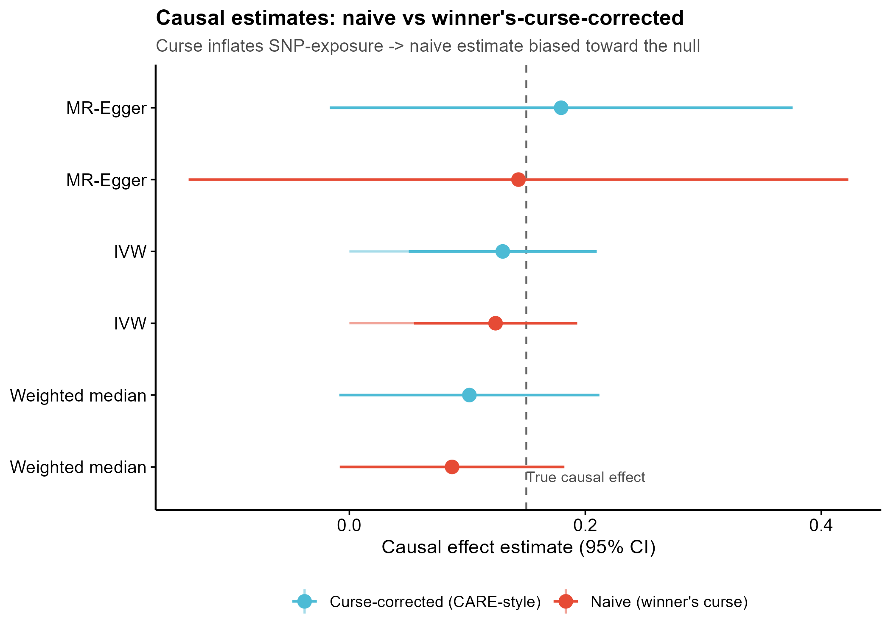
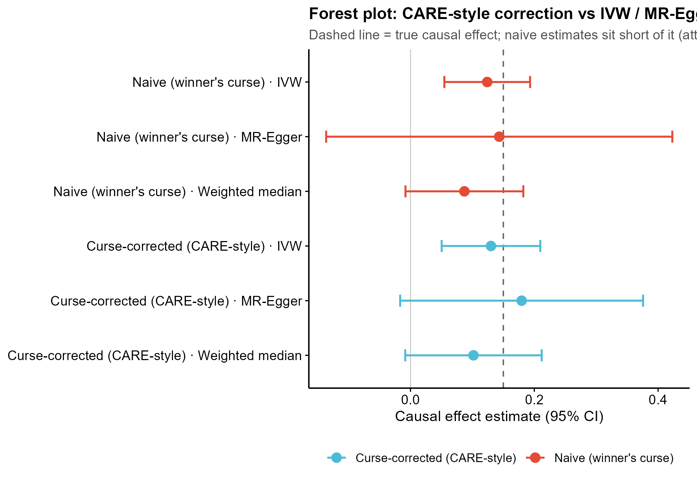
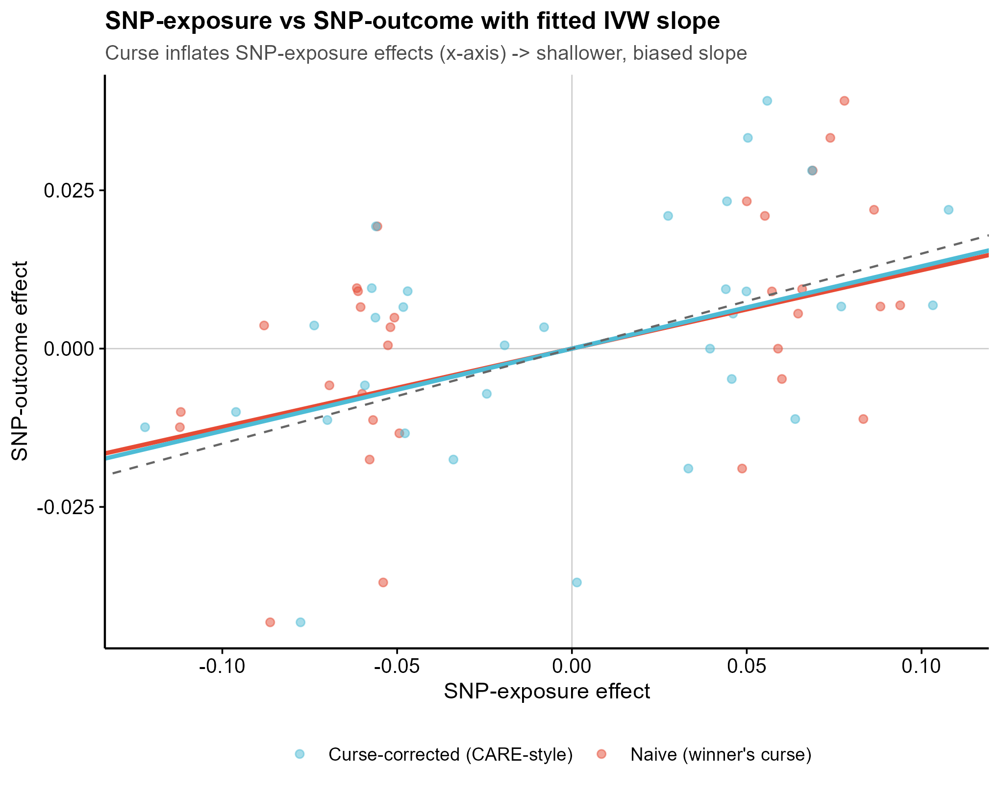
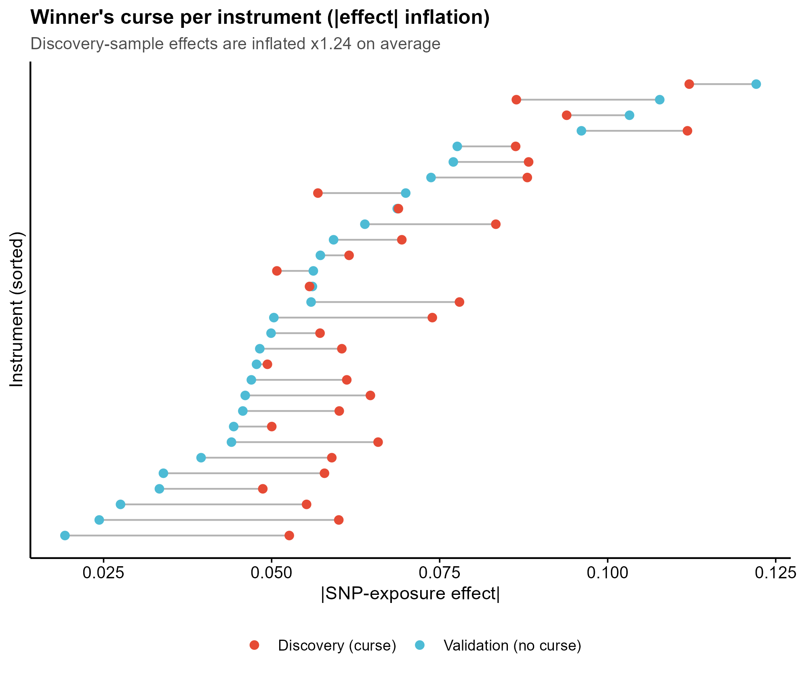

<!-- 图中文字英文,正文中文。 -->

# 533 · Winner-curse-free 稳健 MR (MRcare / CARE-RIVW)

> 🟡 **降级模块**:真实工具 **MRcare**(JASA 2026, ChongWuLab)当前**装不上**(GitHub 包,需手动装/服务器跑)。
> 脚本**接地其真实 API**(`mr_care()` / `RIVW()`,装上即自动调用),并用已装的 **TwoSampleMR**
> 在合成数据上**真实跑通**赢家诅咒(winner's curse)的纠偏概念演示与全部展示图(退出码 0,assets 非空)。

> 一句话定位:**合成两样本 MR summary(注入赢家诅咒)→ 朴素 vs 校正因果估计对照 → 出 4 张诊断图**,直观说明「按发现样本 p 值选工具」如何系统性拉偏 MR 因果效应,以及 CARE/RIVW 的纠偏思想。

| | |
|---|---|
| **语言 / 主依赖** | R · `TwoSampleMR`(诚实基线/降级路径,已装) · `ggplot2` · 可选 `MRcare`(真 CARE/RIVW) |
| **一句话用途** | 演示并量化赢家诅咒对两样本 MR 因果估计的偏倚,对照无诅咒参照,接地 MRcare 真实 API |
| **输入** | 无需外部输入;脚本内合成 `example_data/synthetic_two_sample_mr.csv`(synthetic, demo only) |
| **输出** | `results/`(运行生成:MR 估计表 + sessionInfo) · 展示图见 `assets/` |

---

## ① 输入数据

**无需外部输入**。脚本运行时自动合成两样本 MR summary 并落盘到 `example_data/synthetic_two_sample_mr.csv`(`synthetic, demo only`)。每行一个 SNP:

| 列名 | 类型 | 说明 |
|------|------|------|
| `SNP` | str | rsID(合成) |
| `b_disc` `se_disc` `p_disc` | num | **发现样本** SNP-暴露效应/标准误/p 值(用于按 p 选工具 → 被赢家诅咒) |
| `b_val` `se_val` | num | **独立验证样本** SNP-暴露效应/标准误(无诅咒,真值参照;CARE 的再随机化逼近它) |
| `b_out` `se_out` | num | SNP-结局效应/标准误(由真因果 × 真 beta 生成) |
| `true_b` | num | 该 SNP 的真 SNP-暴露效应(仅合成已知,真实数据不可得) |

**注入赢家诅咒的机制**:多数 SNP 为弱/近零真效应,少数为强真工具。当**用发现样本 p 值筛选**时,弱效应 SNP 只在「正好被噪声推大」那次才过阈值 → 选中集的 `b_disc` 系统性高估真效应。这正是 CARE/RIVW 要内生化校正的偏倚来源。

**换真实数据**:装好 MRcare 后,准备处理过的 exposure/outcome GWAS summary,调 `MRcare::mr_care(exposure_data=, outcome_data=, p_threshold=5e-5, ...)`(脚本 §0 已留真实调用入口,包可用时自动执行 `RIVW()`)。

## ② 方法 / 原理(含★诚实基线)

赢家诅咒:**用同一发现样本既选工具又估计 SNP-暴露效应**时,被选中工具的 |b_exp| 被系统性高估。在两样本 MR 的 IVW 比值估计里,分母(SNP-暴露效应)膨胀 → 因果估计被**系统性偏向零(衰减)**。

- **真实工具 MRcare**(JASA 2026):**CARE**(`mr_care()`)通过**再随机化(re-randomization)**把「选择」与「估计」解耦,内生化校正选择偏倚;**RIVW**(re-randomized IVW)是其核心估计子;并在不假设水平多效性分布的前提下筛除多效性工具。脚本 §0 用 `try(library(MRcare))` 包裹,装上即调真 API,**不臆造返回值**。
- **★诚实基线(降级路径,本机真实跑通)**:用已装 `TwoSampleMR` 的底层估计子(`mr_ivw` / `mr_egger_regression` / `mr_weighted_median`,真实 API)跑两组:
  - **朴素(被诅咒)**:选择 + 估计都用发现样本 `b_disc` → 含赢家诅咒;
  - **无诅咒参照(CARE-style)**:对同一批选中工具改用独立验证样本 `b_val`(CARE 再随机化所逼近的目标)。
  二者对照 + 真因果参照线,**实测**选择偏倚把因果估计拉偏了多少。

**本演示实测**(seed=42):候选 600 SNP → 选中 32 工具;选中集效应膨胀比 `|b_disc|/|b_val| = 1.24`;真因果 0.150,**朴素 IVW = 0.124(偏倚 −17.4%,向零衰减)**,校正后 IVW = 0.130(偏倚 −13.3%,纠偏一部分,残余因验证样本亦含噪)。

## ③ 用途

- 教学/方法演示:直观说明赢家诅咒对 MR 的影响方向与量级,论证为何需要 CARE/RIVW 这类纠偏估计子;
- 真实分析脚手架:装好 MRcare 后,把 §0 的 `mr_care()` 入口接上真实 GWAS,即得 winner-curse-free 稳健 MR;
- 稳健性自检:任何「按发现 GWAS p 值选工具」的两样本 MR,都应报告对赢家诅咒的敏感性。

## ④ 特点 / 亮点

- **turnkey**:`Rscript 533_mrcare_winnerscurse_mr.R` 一条命令即跑,无需外部数据;
- **接地真实 API 不臆造**:MRcare `mr_care()`/`RIVW()` 来自官方文档,`try(library())` 包裹;诚实基线用 TwoSampleMR 真实底层估计子;
- **★内置诚实基线对照**:朴素(被诅咒)vs 无诅咒参照 vs 真值,实测偏倚量级,不只报好看指标;
- **顶刊级合成图,零平凡条形**:lollipop / forest / 校正斜率散点 / 赢家诅咒 dumbbell;`save_fig()` 一次出 PDF+PNG;
- **路径全相对**,固定种子 42,末尾 `sessionInfo()` 锁依赖。

## ⑤ 输出结果图

| 文件 | 图型 | 说明 |
|------|------|------|
| `assets/fig1_estimates_lollipop.png` | Lollipop + 误差棒 | 各方法(IVW/Egger/WM)朴素 vs 校正因果估计,横虚线=真值 |
| `assets/fig2_forest_care_vs_classic.png` | Forest | CARE-style 校正 vs 经典 IVW/Egger;朴素估计短于真值线(衰减) |
| `assets/fig3_scatter_corrected_slope.png` | 散点 + IVW 拟合斜率 | SNP-暴露 vs SNP-结局,被诅咒(发现 beta)vs 校正(验证 beta)两套点与斜率 |
| `assets/fig4_winnerscurse_dumbbell.png` | Dumbbell | 每个工具 验证 beta → 发现 beta 的 |effect| 拉伸,平均膨胀 ×1.24 |






---

## 运行

```bash
# 零改动跑示例(自动合成数据 + 出全部图)
Rscript 533_mrcare_winnerscurse_mr.R
# 调参:更多候选 SNP / 改真因果 / 改选择阈值
Rscript 533_mrcare_winnerscurse_mr.R --n_snp 800 --causal 0.20 --p_sel 5e-5
```

## 依赖安装

```r
# 诚实基线/降级路径(必需,本机即可跑)
install.packages("TwoSampleMR")   # 或 remotes::install_github("MRCIEU/TwoSampleMR")
install.packages("ggplot2")

# 🟡 真实工具 MRcare(当前装不上 → 需手动/服务器装;装上后脚本自动走真 CARE/RIVW)
remotes::install_github("ChongWuLab/MRcare")
# 文档与真实 API:https://chongwulab.github.io/MRcare/  (mr_care() / RIVW() / preprocess_gwas_data())
```

> **降级说明**:MRcare 为 GitHub 源码包,依赖较重,本环境未能安装(`requireNamespace("MRcare")` = FALSE)。
> 脚本对其调用全程 `try()` 包裹,缺包时**不报错、不臆造结果**,自动走 TwoSampleMR 诚实基线路径出图;
> 真实研究请在能联网装包的机器/服务器装好 MRcare 后,接 §0 的 `mr_care()` 入口跑 winner-curse-free MR。
