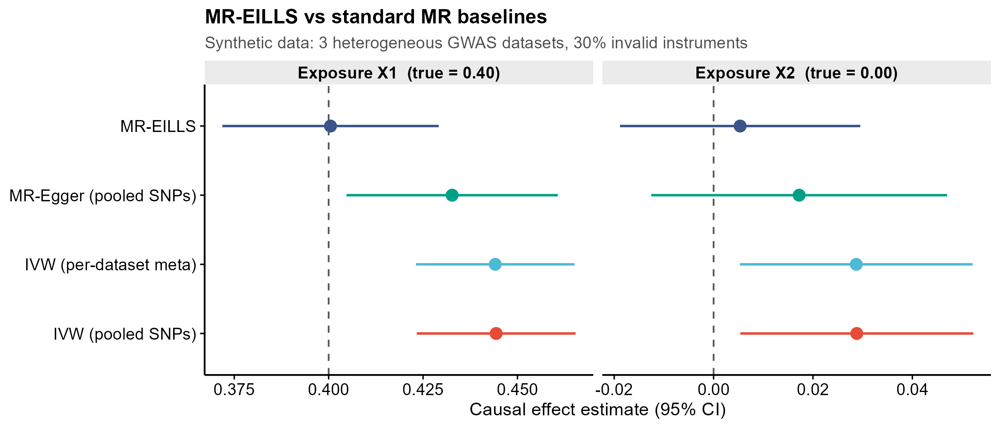
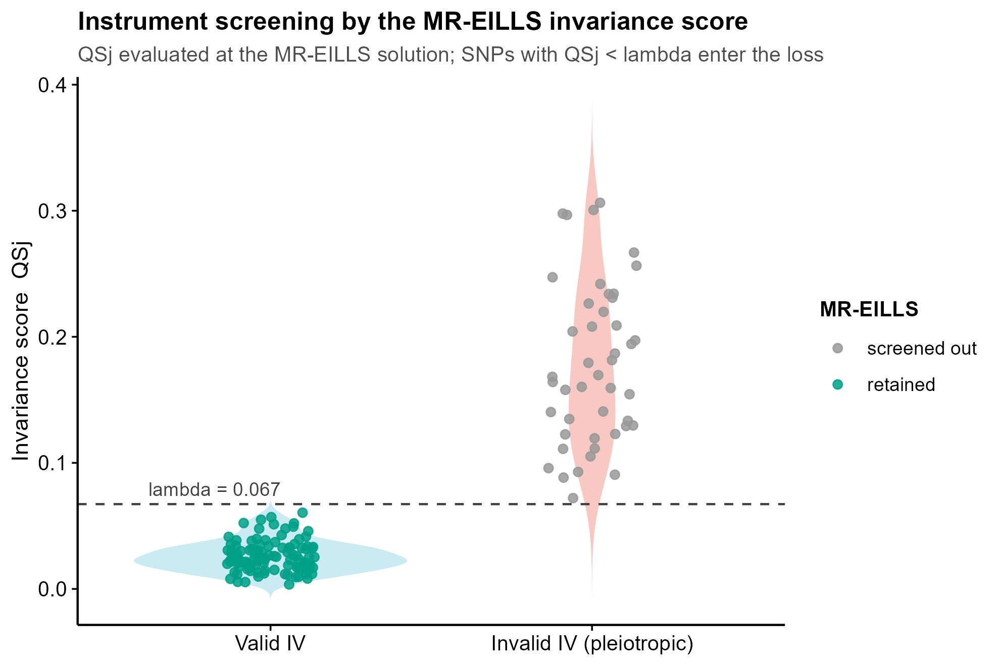
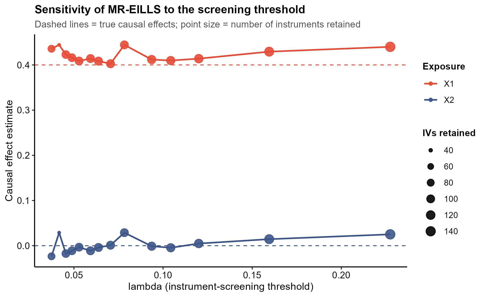
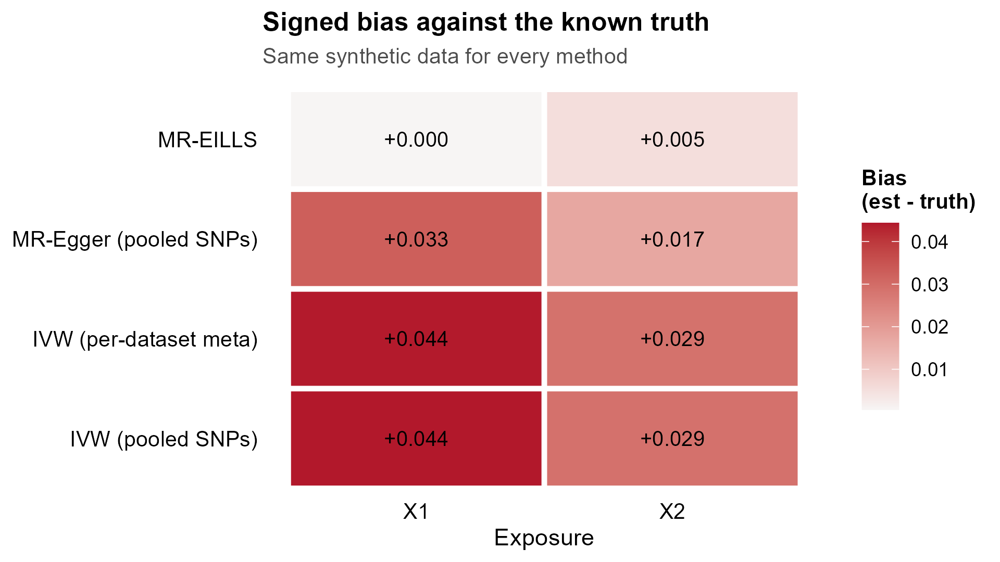

<!-- 图中文字英文,正文中文。 -->

# 595 · MR-EILLS 不变性稳健 MR(整合多个异质 GWAS summary 数据集)

> 🟡 **降级模块**:官方包 **MREILLS**(Nat Commun 2025)本机**未安装**(GitHub 包,需 `devtools` 联网装)。
> 脚本**接地其真实 API**(`MREILLS()` / `BOOT_MREILLS()` / `CHO_lambda()`,装上即自动切换调用官方实现),
> 未装时走**逐行转写自上游源码**的本地实现,在合成数据上**真实跑通**并出全部图(退出码 0,assets 非空)。
> ⚠️ 本地转写**未与官方包逐位对拍验证**(本机装不了包),这一点在下文 §② 明写,不当作"等价于官方"。

> 一句话定位:**E 个异质 GWAS summary 数据集(含一部分无效工具)→ MR-EILLS vs IVW/MR-Egger 同数据对照 → 出 4 张诊断图**,回答「当工具变量有水平多效性、且多个队列彼此异质时,因果估计还能不能信」。

| | |
|---|---|
| **语言 / 主依赖** | R · `ggplot2` + 框架 `theme_pub.R`(基线与转写实现只用 base R;**无需装任何包**) · 可选 `MREILLS`(官方实现) |
| **一句话用途** | 在多个异质 GWAS summary 数据集上做对无效工具稳健的(多变量)MR 因果估计,并与 IVW/MR-Egger 对照 |
| **输入** | `example_data/mreills_multi_gwas_summary.csv`(synthetic, for demo only;缺失时脚本自动重建) |
| **输出** | `results/`(运行生成:估计表 / 工具筛选表 / lambda 路径 / sessionInfo) · 展示图见 `assets/` |

---

## ① 输入数据

**文件**:`example_data/mreills_multi_gwas_summary.csv`(csv;**长表**,行 = 数据集 × SNP)

| 列名 | 类型 | 必需 | 示例 | 说明 |
|------|------|:---:|------|------|
| `dataset` | str | ✔ | `GWAS_1` | 数据集/人群标识,对应上游 `fdata_all` 的第 E 个元素 |
| `SNP` | str | ✔ | `rs0001` | 工具变量 rsID(各数据集须为同一批 SNP) |
| `beta_X1` `se_X1` | num | ✔ | `0.276` `0.0104` | 第 1 个暴露的 SNP-暴露效应与标准误 |
| `beta_X2` `se_X2` | num | | `0.219` `0.0207` | 第 2 个暴露(多变量 MR;单暴露就只给 `beta_X1`) |
| `beta_Y` `se_Y` | num | ✔ | `0.155` `0.0317` | SNP-结局效应与标准误 |
| `true_invalid_IV` | 0/1 | | `1` | **仅合成数据有**:该 SNP 是否为无效工具。真实数据不存在,只用于评估筛选表现 |

**命名约定**:暴露列必须成对命名为 `beta_<名>` / `se_<名>`,脚本按前缀自动识别暴露个数与名称(`beta_Y`/`se_Y` 为结局,不算暴露)。

**样例(前 3 行)**:
```
dataset,SNP,beta_X1,se_X1,beta_X2,se_X2,beta_Y,se_Y,true_invalid_IV
GWAS_1,rs0001,0.276073085750585,0.0104295000131242,0.218839658474447,0.0206800708943047,0.154507369998974,0.0317149351350963,1
GWAS_1,rs0002,0.295211453764447,0.0157293832488358,0.132252006886424,0.0220548901124857,0.158715608714496,0.0329240376665257,1
```

**合成数据的生成机制**(`synthetic, for demo only`):3 个数据集 × 150 SNP × 2 个暴露,真因果效应 `theta = (X1 = 0.40, X2 = 0.00)`。前 30% 的 SNP 被赋予对结局的**直接效应**(违反排他性限制 = 无效工具),且**各数据集的 G→X 强度与多效性强度都不同**(异质队列)。这正是 MR-EILLS 针对的场景;`X2` 的真值设为 0,用来看各方法会不会报出假阳性因果。

**换成自己的数据**:整理成上表长格式即可,或直接把 `list(betaGX, sebetaGX, betaGY, sebetaGY)` 的 `fdata_all` 结构喂给官方 `MREILLS()`。

## ② 方法 / 原理(含★诚实基线)

MR 的经典软肋:工具变量若有**水平多效性**(直接影响结局,而非只经暴露),IVW 会被系统性拉偏;多个来自不同人群的 GWAS summary 合并时,**遗传结构异质**又让偏倚方向不一致。

- **MR-EILLS**(Hou et al., Nat Commun 2025):把 **EILLS(environment invariant linear least squares)** 的不变性思想搬进 MR ——真因果效应应当在**所有异质数据集上同时成立**,而多效性带来的伪关联不会跨数据集保持不变。损失函数 = 逆方差加权残差 `R` + `r1` × 不变性惩罚 `J`(残差与各暴露 `betaGX` 的相关度,跨数据集加权),并内置**工具筛选**:每个 SNP 算不变性得分 `QSj`,`QSj < lambda` 者才进入损失。适用于单暴露与多暴露(MVMR)两种情形。
- **官方 API**(逐行读自 `https://raw.githubusercontent.com/hhoulei/MREILLS/HEAD/R/MREILLS.R`、`BOOT_MREILLS.R`、`CHO_lambda.R`,**未臆造**):
  - `MREILLS(fdata_all, r1, meth, lambda)` → `optim` 结果,`$par` 为各暴露的因果估计
  - `BOOT_MREILLS(fdata_all, r1, meth, lambda, numBoot)` → 各暴露估计的 bootstrap SE
  - `CHO_lambda(fdata_all)` → `list(QSj, plot)`,选 lambda 用的岭线密度图
  - `fdata_all` = E 个数据集的 list,每元素 `list(betaGX[nSNP×nExposure], sebetaGX, betaGY, sebetaGY)`
  脚本 Step 0 用 `requireNamespace("MREILLS")` 探测,**装上即调官方实现**。
- **本地转写实现**(未装官方包时的路径):损失函数与 bootstrap 逐行照抄上游源码,数学形式未改。**三处明示的偏离**:
  1. 矩阵子集加 `drop = FALSE`,入选工具数 `< Nv+2` 时返回大损失 —— 数值护栏,防 optim 探到退化解时维度塌缩报错;
  2. **`optim` 起点**:上游写死 `rep(0, Nv)`。上游示例用 `lambda = 100`,在其数据尺度下相当于"不筛选",损失面处处平滑,从 0 起步没问题;但当 lambda 收紧到真正起筛选作用时,`bb = 0` 处残差 = 全部因果信号 → `QSj` 普遍超阈 → 入选工具过少 → 损失退化为常数、数值梯度为 0,**估计会卡死在原点(本模块实测过:X1 估计恒为 0.000)**。故本模块默认从 IVW 估计 **warm start**(`--start zero` 可切回上游的原点起步)。⚠️ 官方 `MREILLS()` 的形参里**没有**起点参数,走官方包时无法 warm start —— 这是官方 API 的事实,不做假封装;
  3. **lambda 自动选择**:上游 `CHO_lambda()` 返回 `QSj` 向量和一张岭线密度图,但**不给任何阈值规则**,由使用者**肉眼**在谷底选 lambda(且它把 `bb` 写死为 0)。本模块 `--lambda auto` 给一个可复现起点(**本模块的启发式,非上游功能**):在 IVW 估计处算 `QSj`,取 `1 - maxinvalid` 分位数为阈值;并额外输出 **lambda 敏感性曲线**(Fig 3)供复核。也可 `--lambda 0.08` 直接指定。
- **★诚实基线(本机真跑,base R)**:同一份数据上跑 **MVMR-IVW**(以 `1/se_Y²` 为权重、`beta_Y` 对 `betaGX` 的加权最小二乘,无截距)与 **MR-Egger**(同上但含截距,截距即定向多效性),各出 **pooled(合并全部 SNP)** 与 **per-dataset meta(各数据集单独 IVW 再逆方差合并)** 两版。基线是硬要求:"更稳健"的说法必须在同一份数据上被量出来。

**本演示实测**(seed = 42,`lambda = auto → 0.0673`,`r1 = 0.1`,`numBoot = 200`,本地转写实现):

| 方法 | X1 估计(真值 0.40) | 偏倚 | X2 估计(真值 0.00) | 偏倚 |
|---|---|---|---|---|
| IVW (pooled SNPs) | +0.444 | **+0.044** | +0.029(95%CI 不含 0 → **假阳性**) | +0.029 |
| IVW (per-dataset meta) | +0.444 | +0.044 | +0.029 | +0.029 |
| MR-Egger (pooled SNPs) | +0.433 | +0.033 | +0.017 | +0.017 |
| **MR-EILLS** | **+0.400 ± 0.015** | **+0.000** | **+0.005 ± 0.012**(CI 含 0) | +0.005 |

工具筛选:105/150 入选,**无效工具剔除 100%、有效工具保留 100%**;MR-Egger 截距 = +0.0045 ± 0.0036(未达显著,说明这种"部分 SNP 有多效性"的场景下 Egger 的定向多效性检验并不灵敏)。

## ③ 用途

- **多队列/跨人群 MR**:手上有同一暴露-结局的多个异质 GWAS summary(不同人群、不同队列),想要一个不被人群异质性和多效性带偏的因果估计;
- **多变量 MR(MVMR)**:一次估计多个暴露对同一结局的直接因果效应,并抑制多效性造成的假阳性;
- **稳健性自检**:任何 IVW 主结果都应报告对无效工具的敏感性 —— 本模块给出「IVW vs Egger vs EILLS + 工具筛选诊断 + lambda 敏感性」这一整套;
- **方法教学**:直观展示不变性(invariance)筛工具的机制。

## ④ 特点 / 亮点

- **turnkey**:`Rscript 595_mreills_robust_mr.R` 一条命令即跑,**不需要装任何包**(基线与转写实现只用 base R + ggplot2),输入缺失自动重建合成数据;
- **接地真实 API 不臆造**:三个官方函数的签名与参数逐行读自上游 raw 源码;装上官方包自动切换,并在输出表的 `engine` 列标明本次用的是 `MREILLS package` 还是 `local transcription`;
- **★内置诚实基线对照**:IVW(两种合并方式)+ MR-Egger 与 MR-EILLS 跑同一份数据、比同一个已知真值,不只报好看数字;
- **★偏离与未验证之处全部写明**:warm start、数值护栏、auto-lambda 三处偏离,以及"转写未与官方包对拍"这一局限,均在 README 与代码注释中标注;
- **顶刊级图,零条形图**:dot-and-whisker / violin + jitter / 敏感性折线 / RdBu 发散热图;`save_fig()` 一次出 PDF + PNG;
- **路径全相对**,固定种子 42,末尾落盘 `sessionInfo()` 锁依赖;bootstrap 前**另置独立种子**,使 SE 不受"示例数据是否需要重建"影响(重建会先消耗随机数、把 RNG 流推到别处 —— 实测同一份数据两次运行曾得到 ±0.015 与 ±0.025 两个 SE,已修)。

## ⑤ 输出结果图

| 文件 | 图型 | 说明 |
|------|------|------|
| `assets/fig1_estimates_dotwhisker.png` | dot-and-whisker | 四种方法的因果估计 + 95% CI,虚线为已知真值,按暴露分面 |
| `assets/fig2_iv_screening_violin.png` | violin + jitter | 不变性得分 `QSj` 按**真实**工具有效性分层,虚线为 lambda 阈值;点色 = 是否被 MR-EILLS 保留 |
| `assets/fig3_lambda_sensitivity.png` | 折线 + 点(点大小 = 入选工具数) | 估计随 lambda 的变化,复核结论是否依赖阈值选择 |
| `assets/fig4_bias_heatmap.png` | 发散热图(RdBu) | 各方法 × 各暴露的有符号偏倚(估计 − 真值) |









**`results/` 产出**:`MR_estimates_eills_vs_baseline.csv`(各方法估计/SE/CI/真值/偏倚/engine)、`IV_selection_QSj.csv`(逐 SNP 的 `QSj`、是否入选、真实有效性)、`lambda_path.csv`(敏感性扫描)、`sessionInfo.txt`。

---

## 运行

```bash
# 零改动跑示例
Rscript 595_mreills_robust_mr.R

# 换成自己的数据 + 指定超参
Rscript 595_mreills_robust_mr.R --input data/我的_multi_gwas.csv --outdir results/run1 \
        --lambda 0.08 --r1 0.1 --meth L-BFGS-B --numboot 200

# 严格复刻上游的原点起步(注意:lambda 偏紧时会卡在原点,见 §②)
Rscript 595_mreills_robust_mr.R --start zero
```

主要参数:`--r1`(不变性惩罚权重,上游的 gamma,默认 0.1)、`--lambda`(工具筛选阈值,默认 `auto`)、`--maxinvalid`(auto-lambda 假设的无效工具上限比例,默认 0.4)、`--meth`(`optim` 方法,默认 `L-BFGS-B`)、`--numboot`(bootstrap 次数,默认 200)、`--start`(`ivw` / `zero`)、`--seed`(默认 42)。

## 依赖安装

本机零改动即跑,**无需安装**(`ggplot2` 已装;基线与转写实现只用 base R)。要用**官方实现**:

```r
# 需要联网 + devtools;本机未装,故官方路径未在本机验证过
devtools::install_github("hhoulei/MREILLS")
```

装上后脚本 Step 0 会自动探测并改调 `MREILLS::MREILLS()` / `MREILLS::BOOT_MREILLS()`,输出表 `engine` 列会变成 `MREILLS package`。

## 引用(已核实)

Hou L, Chen H, Zhou XH. **MR-EILLS: an invariance-based Mendelian randomization method integrating multiple heterogeneous GWAS summary datasets.** *Nat Commun.* 2025 Aug 18;16(1):7668. doi:10.1038/s41467-025-62823-6 · **PMID 40826001**

> 核实方式:NCBI E-utilities `esearch`(term = `MR-EILLS` → 唯一命中 PMID 40826001)+ `esummary`(标题/期刊/年份/卷期页/DOI 与上表一致)。
> API 来源:`https://raw.githubusercontent.com/hhoulei/MREILLS/HEAD/README.md` 及 `R/MREILLS.R`、`R/BOOT_MREILLS.R`、`R/CHO_lambda.R`(2026-07-20 读取)。
> 上游仓库另有 `hhoulei/MREILLS_simul`(论文仿真代码),本模块未使用。
