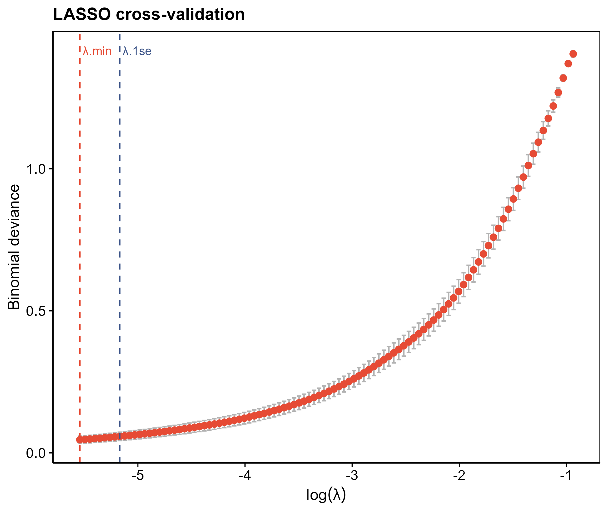

# 012 · LASSO feature gene selection

LASSO-penalized logistic regression that selects a minimal set of feature genes from candidate genes, with cross-validation and coefficient path plots.

## Summary

| | |
|---|---|
| Language / main dependencies | R · `glmnet` `ggplot2` `ggrepel` |
| Purpose | L1 regularization to select the smallest feature set associated with the grouping |
| Input | `example_data/Sample_Type_Matrix.csv` + `candidate_genes.csv` |
| Output | selected genes and figures in `results/`; display figures in `assets/` |

## Input

| File | Required | Description |
|------|:---:|------|
| `--input` expression matrix csv | Yes | first column genes; sample column names suffixed with group (`*_con` / `*_tre`) |
| `--genes` candidate genes csv | Optional | first column gene names; if omitted, all genes are used |

Convention: two-group classification (by suffix); candidate genes are intersected with the matrix.

## Method

`glmnet(family="binomial", alpha=1)` fits an L1-penalized logistic regression path. `cv.glmnet` selects λ by 10-fold cross-validation (min/1se), and genes with non-zero coefficients at that λ are taken as features.

Method citation: Friedman, Hastie & Tibshirani, *JSS* 2010 (glmnet).

## Use

Compresses differential or candidate gene sets into a robust small feature set for diagnostic models (016/063) and downstream validation. A standard step in disease biomarker selection.

## Details

- Runs the example without modification; `--lambda min/1se` switches the shrinkage strength.
- Produces a CV deviance curve (λ.min/λ.1se annotated) and a coefficient shrinkage path (selected genes in italic).
- Outputs the selected gene list plus its expression submatrix for downstream use.

## Outputs

| File | Type | Description |
|------|------|------|
| `assets/LASSO_CV_curve.png` | CV curve | deviance vs log(λ), annotated with λ.min / λ.1se |
| `assets/LASSO_coefficient_path.png` | coefficient path | shrinkage trajectory per gene, selected genes annotated |
| `results/LASSO_selected_genes.csv` | table | selected genes + coefficients |




## Usage

```bash
Rscript 012_LASSO_feature_selection.R                                  # 示例
Rscript 012_LASSO_feature_selection.R --input data/expr.csv --genes data/candidate.csv --lambda 1se
```

## Dependencies

```r
install.packages(c("glmnet","ggplot2","ggrepel","reshape2"))
```
