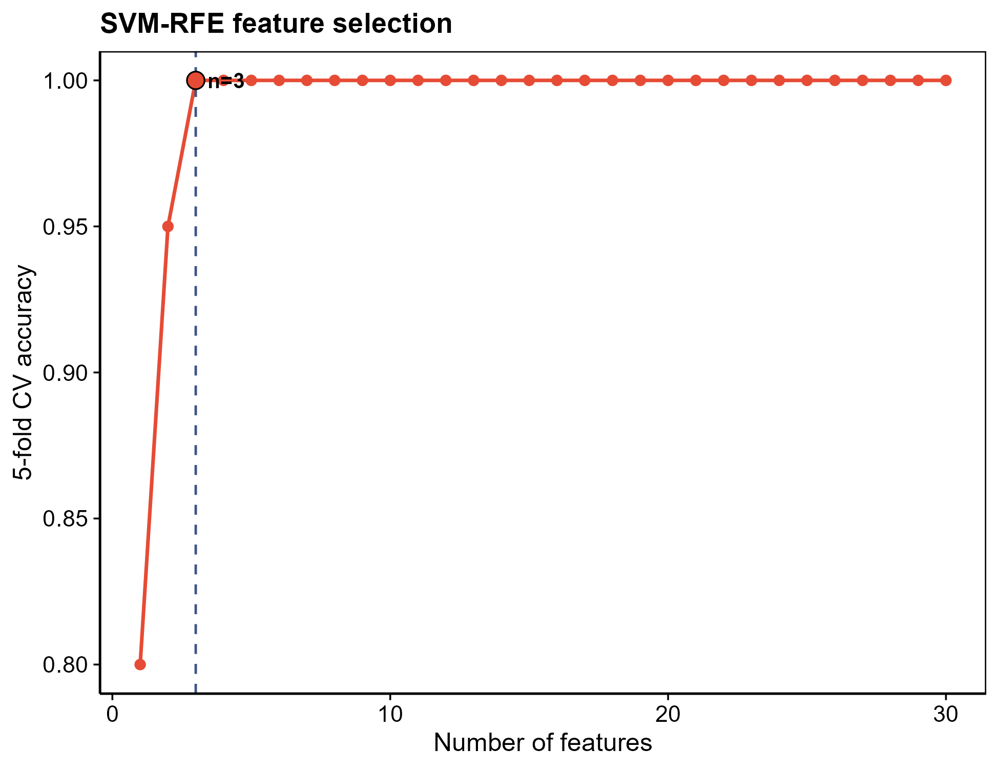

# 013 · SVM-RFE feature gene selection

Ranks candidate genes by SVM recursive feature elimination and selects the optimal subset using a cross-validation accuracy curve.

| | |
|---|---|
| **Language / main dependencies** | R · `e1071` `ggplot2` |
| **Purpose** | Rank features by linear SVM weights via recursive elimination and select the optimal feature count |
| **Input** | `example_data/Sample_Type_Matrix.csv` + `candidate_genes.csv` |
| **Output** | `results/` rankings/subset plus figures · display figures in `assets/` |

## Input

Same as [012](../012_lasso_feature_selection/): expression matrix (group encoded in the sample name suffix) plus optional candidate genes.

## Method

A linear-kernel SVM is fit and each feature is scored by its squared weight. The lowest-scoring feature is removed each round (SVM-RFE recursive elimination) to produce a full ranking. Top-k subsets are then evaluated with k-fold cross-validation, and the feature count with the highest accuracy is taken as optimal.

Method citation: Guyon *et al.*, *Machine Learning* 2002 (SVM-RFE).

## Purpose

Feature selection complementary to LASSO/RF; reports the minimum number of genes needed to reach the best discrimination.

## Features

- Runs the example without edits; `--maxk/--folds` are configurable.
- Figures: CV accuracy vs feature count (optimal n annotated) and RFE ranking plot (selected/unselected colored).

## Outputs

| File | Type | Description |
|------|------|------|
| `assets/SVMRFE_CV_accuracy.png` | Curve | CV accuracy vs feature count, optimal annotated |
| `assets/SVMRFE_top_rank.png` | Ranking plot | RFE ranking of top features |
| `results/SVMRFE_ranking.csv` · `SVMRFE_selected_genes.txt` | Table | Full ranking / optimal subset |



## Usage

```bash
Rscript 013_SVM_RFE_feature_selection.R                                  # 示例
Rscript 013_SVM_RFE_feature_selection.R --input data/expr.csv --maxk 30 --folds 5
```

## Dependencies

```r
install.packages(c("e1071","ggplot2"))
```
