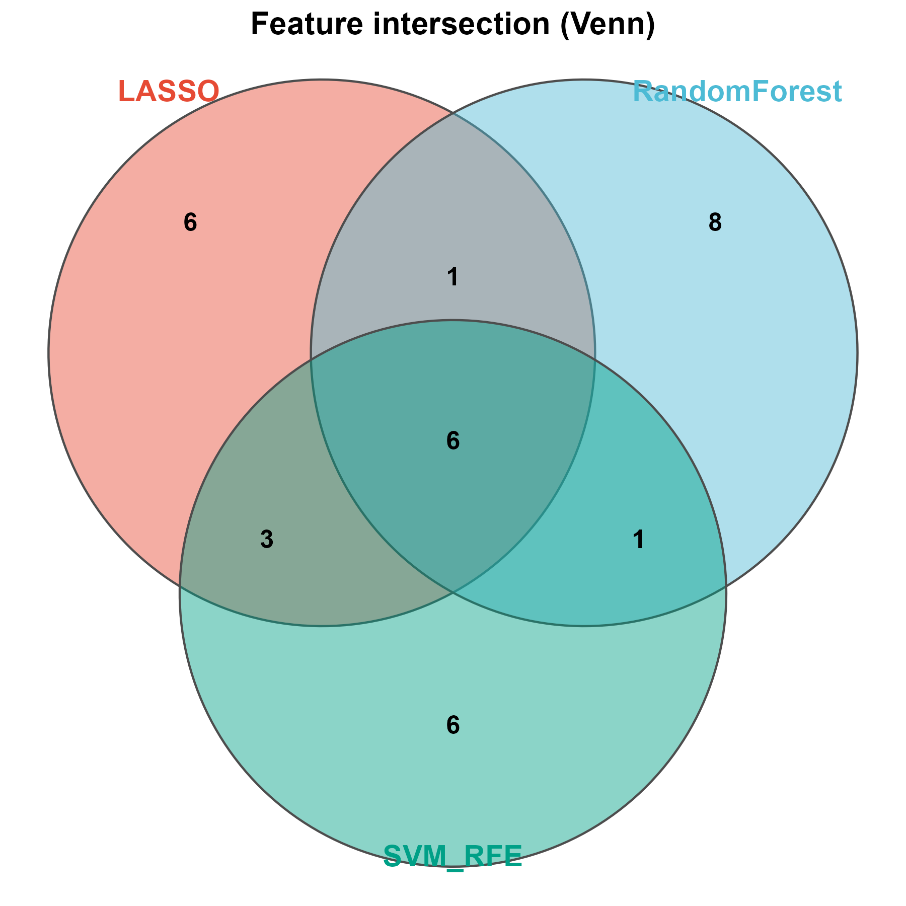

# 015 · Multi-method feature intersection (Venn / UpSet)

Compute global and pairwise intersections across multiple gene lists in a directory and visualize them with Venn (up to 3 sets) and UpSet plots.

## Input

The input is a directory (`--input`) containing at least 2 gene lists (csv/txt; first column = gene name; file name = set name).

## Method

Each list is read, then `Reduce(intersect)` computes the global intersection along with pairwise intersections. Venn plots are drawn for up to 3 sets using the dependency-free `venn_pub`, and UpSet plots handle any number of sets.

## Usage

After multi-method feature selection (LASSO, RF, SVM-RFE, etc.), take the consistent feature genes; the intersection gives the most robust candidates for diagnostic or prognostic modeling.

## Outputs

| File | Plot type | Description |
|------|------|------|
| `assets/Feature_Venn.png` | Venn | Intersection Venn for up to 3 sets |
| `assets/Feature_UpSet.png` | UpSet | Intersection bars for any number of sets |
| `results/global_intersection.csv` · `pairwise_intersection.csv` | Table | Intersection genes |



## Run

```bash
Rscript 015_feature_intersection.R                          # 示例(3 集)
Rscript 015_feature_intersection.R --input data/gene_sets   # 你的目录
```

## Dependencies

R, with `theme_pub` (dependency-free Venn) and `UpSetR`.

```r
install.packages("UpSetR")   # Venn 由共享 theme_pub.R 提供,无需额外包
```
