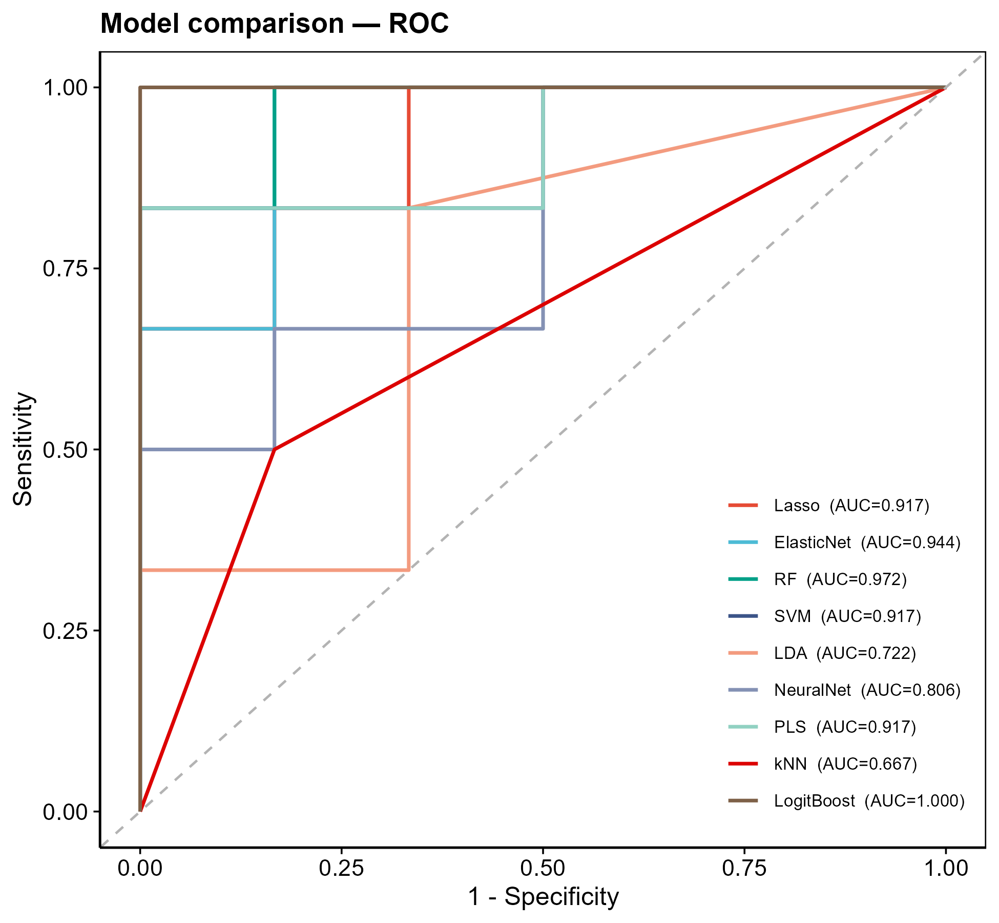
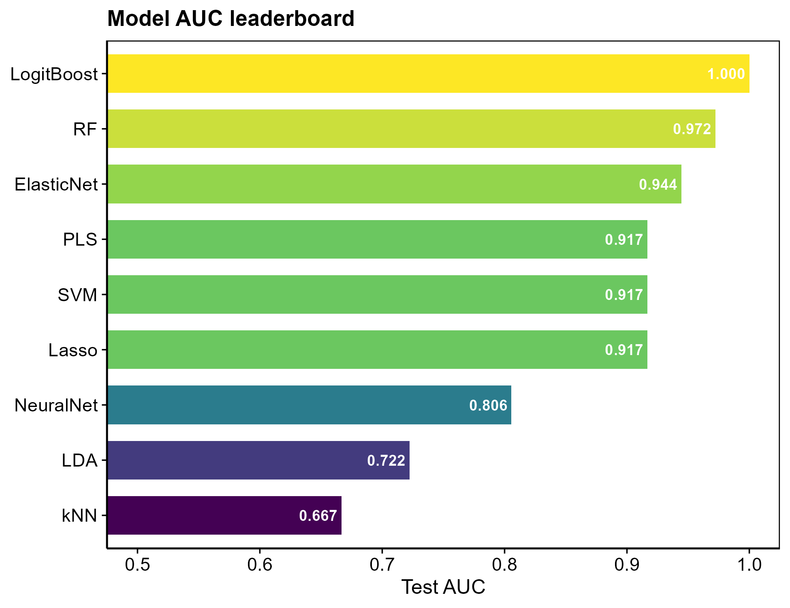

# 034 · Multi-method machine learning comparison and feature selection

Trains multiple ML classifiers on a small candidate gene set, compares ROC/AUC, and takes the intersection of each method's top features (UpSet).

| | |
|---|---|
| **Language / main dependencies** | R · `caret` `pROC` `UpSetR` plus per-algorithm packages |
| **Purpose** | Cross-model comparison and consensus feature selection |
| **Input** | `example_data/Sample_Type_Matrix.csv` (small candidate set) |
| **Output** | `results/` AUC table and intersection; figures in `assets/` |

## Input

Expression matrix CSV (first column genes; sample names suffixed `*_con`/`*_tre`). A small candidate set (tens of genes), typically an upstream intersection, is recommended to avoid LDA/PLS singularity under high dimensionality.

## Method

`caret` provides a unified interface to train 10 methods (Lasso/ElasticNet/RF/SVM/LDA/GBM/NeuralNet/PLS/kNN/LogitBoost), tuned with `repeatedcv`; test-set AUC is computed with `pROC`. Important features per method are extracted with `caret::varImp` and the intersection is taken. Methods whose algorithm package is missing are skipped automatically without interrupting the run.

Note: the original script computed importance with DALEX; this refactor uses `caret::varImp` instead (no heavy dependency, semantically equivalent).

## Use

Answers which model performs best on the data and which features are consistently selected across models. Consensus features are the most robust marker candidates.

## Notes

- Missing dependencies or a single failed method are skipped automatically with a message.
- Figures: multi-model ROC overlay (with AUC legend), viridis AUC leaderboard, and feature intersection UpSet.

## Outputs

| File | Type | Description |
|------|------|------|
| `assets/ROC_overlay.png` | ROC overlay | Per-model test-set ROC with AUC |
| `assets/AUC_leaderboard.png` | Leaderboard | Bar chart of models ranked by AUC |
| `assets/Feature_UpSet.png` | UpSet | Intersection of each method's top features |
| `results/model_AUC.csv` · `intersect_genes.txt` | Table | AUC / consensus features |




## Usage

```bash
Rscript 034_multiML_feature_selection.R                                  # 示例
Rscript 034_multiML_feature_selection.R --input data/signature.csv --topgene 10 --train 0.7
```

## Dependencies

```r
install.packages(c("caret","pROC","UpSetR","glmnet","randomForest","kernlab",
                   "gbm","nnet","pls","kknn","caTools","MASS"))
```
