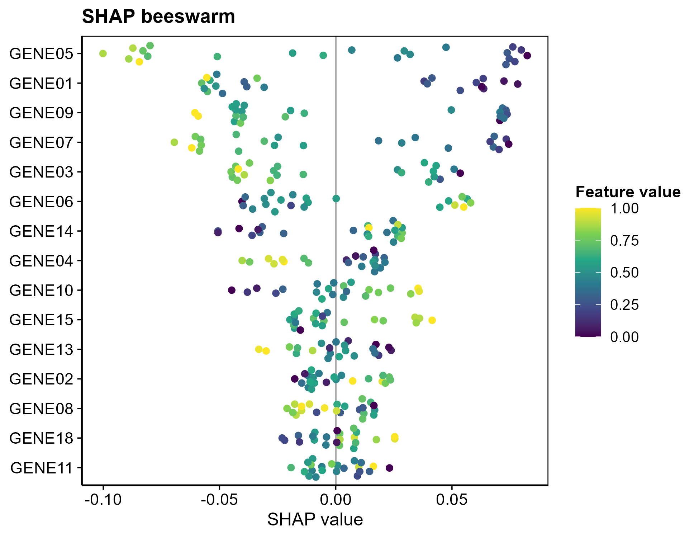

# 052 · SHAP machine learning interpretation

Trains multiple models on an expression matrix, selects the best by AUC, and interprets it with Kernel SHAP, producing SHAP figures (importance, beeswarm, dependence, waterfall, force).

| | |
|---|---|
| **Language / main dependencies** | R · `caret` `kernelshap` `shapviz` `pROC` |
| **Purpose** | Use SHAP to interpret the model and identify key feature genes |
| **Input** | `example_data/geneexp.csv` |
| **Output** | `results/` SHAP tables and figures; display figures in `assets/` |

## Input

Expression matrix CSV (first column genes, sample column names suffixed by group; default control `*_con`, case `*_tra`, configurable via `--ctrl/--case`).

## Method

`caret` trains RF/SVM/XGB, selects the best by test AUC, `kernelshap` (model-agnostic Kernel SHAP) computes feature contributions, and `shapviz` generates figures.

Method citation: Lundberg & Lee, *NeurIPS* 2017 (SHAP).

## Usage

This not only selects features but also explains how and in which direction each gene affects the prediction (global importance plus per-sample attribution).

## Outputs

| File | Figure type | Description |
|------|------|------|
| `assets/SHAP_beeswarm.png` | Beeswarm | Global feature contribution distribution (color = feature value) |
| `assets/SHAP_importance_bar.png` | Bar | Mean \|SHAP\| importance |
| `assets/SHAP_dependence.png` | Dependence | SHAP-expression relationship for top genes |
| `assets/SHAP_waterfall.png` · `SHAP_force.png` | Waterfall/force | Per-sample attribution |
| `assets/Model_ROC.png` | ROC | Multi-model comparison |



## Run

```bash
Rscript 052_SHAP_interpretation.R                              # 示例
Rscript 052_SHAP_interpretation.R --input data/geneexp.csv --case _tre
```

## Dependencies

```r
install.packages(c("caret","kernelshap","shapviz","pROC","randomForest","kernlab","xgboost"))
```
