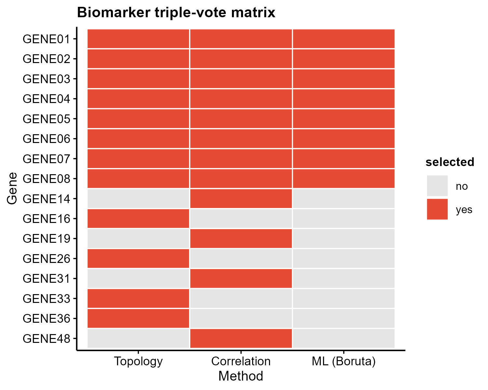

# 502 · Biomarker triple-vote feature selection

Shortlists high-confidence biomarker candidates by intersecting three independent
feature-selection methods (network topology × correlation centrality × machine
learning) and keeping only genes chosen by **≥2** methods. Guards against the
single-signature false positives that a lone LASSO/SVM-RFE run tends to produce.

| | |
|---|---|
| Language / deps | R · `igraph` `Boruta` `Hmisc` `ggplot2` |
| Purpose | Robust biomarker shortlist via multi-method voting |
| Input | `example_data/expr.csv` + `group.csv` + `candidate_genes.csv` |
| Output | `results/` (vote table + consensus); preview in `assets/` |

## Input

| File | Spec |
|------|------|
| `expr.csv` | gene × sample expression matrix (first column = gene symbol) |
| `group.csv` | columns `sample,group`; two groups (e.g. `con`/`tre`) |
| `candidate_genes.csv` | column `gene`; the candidate pool (e.g. DEGs, module genes, targets) |

Example data is synthetic (60 genes × 40 samples, 8 true co-expressed signals); generated on first run.

## Method

Three independent selectors, then a majority vote:

1. **Topology** (`igraph`) — correlation network of candidates; top-K genes by degree centrality (CytoHubba-style hubs).
2. **Correlation centrality** (`Hmisc`/`cor`) — top-K genes by point-biserial correlation with the phenotype.
3. **Machine learning** (`Boruta`) — random-forest wrapper; `Confirmed` features after `TentativeRoughFix`.

Genes selected by **≥2 of 3** methods become the consensus shortlist.
Rationale follows the NETs multi-omics paper (CytoHubba × correlation × Boruta intersection), which is far more robust to reviewer "single-signature" criticism than one selector alone.

## Use

Turn a noisy candidate gene pool into a small, defensible biomarker set for
downstream diagnostic/prognostic modeling (modules 016/063) — with built-in
defense against single-method overfitting.

## Outputs

| File | Type | Description |
|------|------|------|
| `results/vote_table.csv` | table | per-gene selection by each method + total votes |
| `results/consensus_biomarkers.csv` | table | genes with ≥2 votes |
| `assets/vote_matrix.png` | heatmap | triple-vote matrix (gene × method) |
| `assets/consensus_bar.png` | bar | consensus genes ranked by phenotype correlation |



## Run

```bash
Rscript 502_biomarker_triple_vote.R
Rscript 502_biomarker_triple_vote.R --input expr.csv --group group.csv --candidates candidate_genes.csv
```

## Dependencies

```r
install.packages(c("igraph","Hmisc","ggplot2"))
install.packages("Boruta", type = "binary")   # binary avoids the Rust build of newer source versions
```
