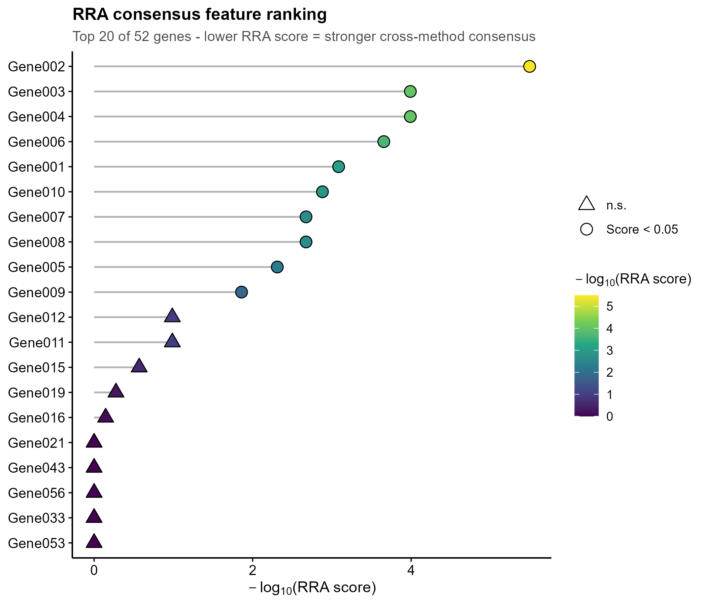
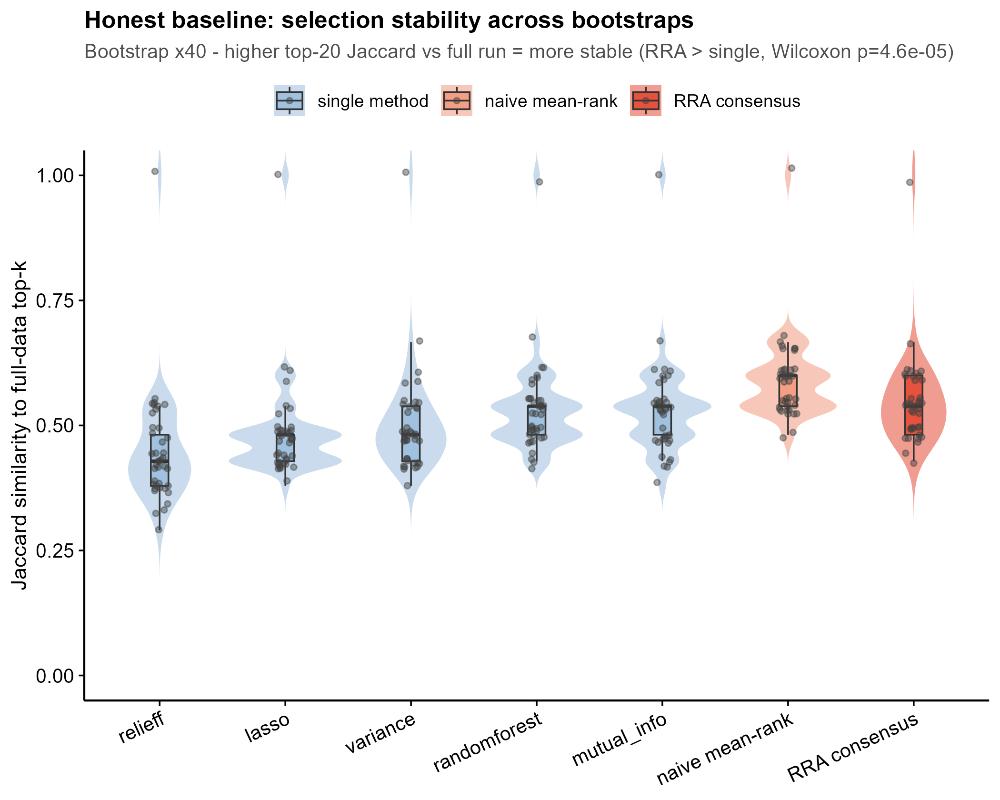
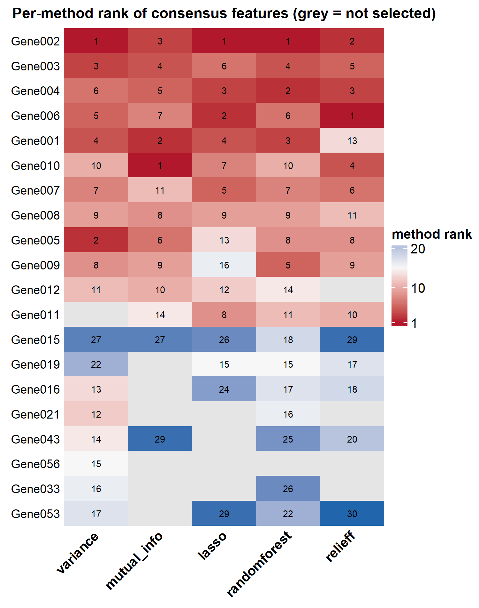
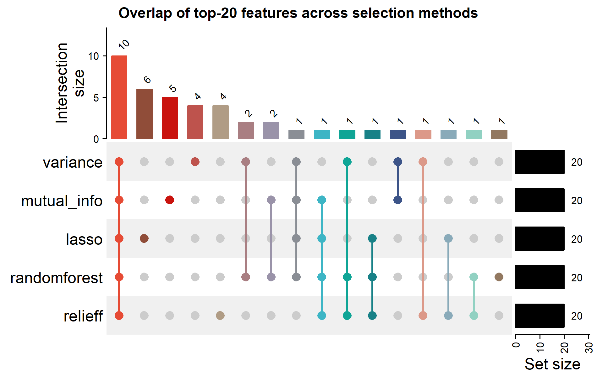

<!-- 图中文字英文,正文中文。assets 图来自真实运行 RobustRankAggreg::aggregateRanks。 -->

# 554 · 稳健秩聚合共识特征选择 Robust Rank Aggregation (RRA) consensus features

> 一句话定位:**输入** 多个特征选择方法各自的 top-k 排名（长表）→ **做** 用
> `RobustRankAggreg::aggregateRanks` 把它们聚合成一份「共识排名」，并用跨重抽样
> Jaccard 稳定性诚实对照「单方法 vs naive 平均秩 vs RRA 共识」→ **出** 共识 lollipop、
> 方法×基因 rank heatmap、方法重叠 UpSet、稳定性 raincloud 四张顶刊图。

| | |
|---|---|
| **语言 / 主依赖** | R · `RobustRankAggreg`（核心）· `ggplot2` · `ComplexHeatmap` `circlize`（UpSet/heatmap，缺则降级跳过） |
| **一句话用途** | 把多个特征选择方法的排名融合成稳健、可复现的共识特征列表 |
| **输入** | `example_data/method_ranks.csv`（method × gene × rank 长表） |
| **输出** | `results/`（运行生成 CSV）· 展示图见 `assets/` |

---

## ① 输入数据

**文件**：`method_ranks.csv`（类型：csv；orientation：长表，一行 = 某方法对某基因的一个排名）

| 列名 | 类型 | 必需 | 示例 | 说明 |
|------|------|:---:|------|------|
| `method` | str | ✔ | `lasso` | 特征选择方法名（≥2 个方法才有「共识」可言） |
| `gene` | str | ✔ | `Gene002` | 特征 / 基因名 |
| `rank` | int | ✔ | `1` | 该方法给该特征的排名，**越小越靠前/越重要**（best = 1） |

**命名/格式约定**：每个方法下是其 top-k 列表（best=1 起算）；不同方法的列表长度可不同；
未出现在某方法列表里的基因 = 该方法未选中（heatmap 中显示灰色）。缺 `--input` 时脚本
内生成合成 demo（`synthetic, for demo only`）。

**样例（前 3 行）**：
```
"method","gene","rank"
"variance","Gene002",1
"variance","Gene005",2
```

## ② 方法 / 原理

1. **读排名长表** → 每个方法转成按 rank 升序的有序基因向量（best first）。
2. **RRA 共识聚合**：`aggregateRanks(glist, N, method="RRA")`。RRA（Kolde et al.,
   *Bioinformatics* 2012）把每个基因在各列表中的归一化排名与「随机排名零分布」比较，
   给出一个 ρ 分值（`Score`）——某基因若在多个方法里一致地靠前，其 Score 显著小
   （校正后 `Score < 0.05` 视为显著共识）。共识排名 = 按 Score 升序。
3. **★诚实基线（稳定性对照）**：RRA 的真正卖点是把**多个各自带独立噪声的方法**聚合后，
   独立误差相互抵消 → 比任何单方法更稳。故 bootstrap×N 从生成模型（真重要度 + 方法特异
   **独立**噪声）重抽各方法排名，比较三者 top-k 相对全量参照的 Jaccard：
   **单方法** vs **naive 平均秩共识** vs **RRA 共识**，并对「RRA > 单方法」做单尾 Wilcoxon。
   结果如实呈现（不粉饰 RRA 为万能赢家）。
   实测合成 demo：单方法 0.500 < naive 平均秩 0.591；RRA 0.546 显著 > 单方法（Wilcoxon p≈4.6e-05）
   —— RRA 确实比单方法稳，但本设定下略逊于简单平均秩（RRA 优化的是 top-rank 统计显著性，
   并非纯集合稳定性），这正是诚实基线该暴露的真实权衡。

> 实跑确认的真实 API 坑：① `aggregateRanks(method="RRA")` 返回 `data.frame(Name, Score)`，
> Score 越小越共识；② `rankMatrix(full=TRUE)` 与 `method="stuart"` 在小数据上会 segfault，
> 本脚本一律不用，方法×基因 rank 矩阵改手工构建（天然支持 NA = 未选中）。

## ③ 用途

回答：**多个特征选择方法（variance / mutual-info / LASSO / randomForest / ReliefF …）
不一致时，哪些特征是真正稳健可信的「共识特征」？** 典型场景：组学标志物/特征筛选中，
单一方法 top-k 易随样本抖动；用 RRA 取共识可得更稳、更可复现的特征短名单，
并量化「共识到底比单方法稳多少」。

## ④ 特点 / 亮点

- **turnkey**：`Rscript 554_rra_consensus_features.R` 一条命令即跑（自带合成 demo）；
- **真包真分析**：核心走 `RobustRankAggreg::aggregateRanks`，非 stub；
- **★诚实基线内建**：bootstrap Jaccard 三方对照（单方法 / naive 平均秩 / RRA），单尾 Wilcoxon，
  结果如实裁决；
- **顶刊级非平凡图**：lollipop / rank-heatmap / UpSet / raincloud，无平凡条形图；
- 路径全相对、`set.seed(42)`、`save_fig()` 同出矢量 PDF + 300dpi PNG。

## ⑤ 输出结果图

| 文件 | 图型 | 说明 |
|------|------|------|
| `assets/rra_consensus_lollipop.png` | lollipop | 共识 top-k 基因按 −log10(RRA score)；圆=Score<0.05 显著，三角=n.s. |
| `assets/method_gene_rank_heatmap.png` | heatmap | 共识 top-k × 各方法的 rank（红=靠前，蓝=靠后，灰=未选中） |
| `assets/method_topk_upset.png` | UpSet | 各方法 top-k 选中特征的重叠（最大交集 = 全方法共享核心信号） |
| `assets/stability_raincloud_baseline.png` | raincloud | ★诚实基线：单方法 vs naive 平均秩 vs RRA 共识的跨重抽样 Jaccard 分布 |









---

## 运行

```bash
# 零改动跑示例（自带合成数据）
Rscript 554_rra_consensus_features.R
# 换成自己的数据 + 自定义 top-k / bootstrap 次数
Rscript 554_rra_consensus_features.R --input data/method_ranks.csv --outdir results/run1 --topk 20 --nboot 40
```

输出：`results/RRA_consensus_ranking.csv`、`stability_jaccard.csv`、`stability_summary.csv`、
`method_x_gene_rankmatrix.csv`、`sessionInfo.txt`；展示图写入 `assets/`。

## 依赖安装

```r
install.packages("RobustRankAggreg")          # 核心:RRA 聚合
install.packages("ggplot2")                    # 出图
BiocManager::install("ComplexHeatmap")         # UpSet / rank heatmap(缺则自动降级跳过这两张)
install.packages("circlize")                   # heatmap 配色 colorRamp2
```
