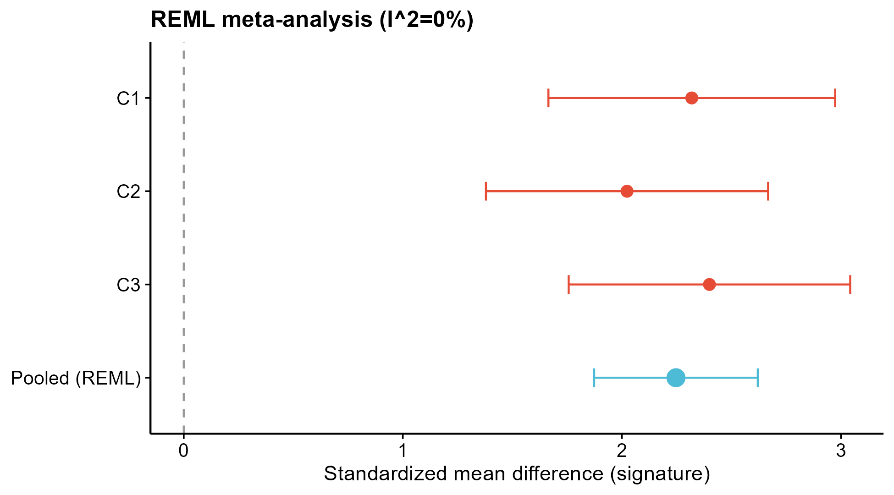

# 503 · Cross-cohort generalization & honest robustness

Three checks most bioinformatics papers skip but that markedly raise method
credibility (from the NETs multi-omics paper): a random-effects **meta-analysis**,
**leave-one-dataset-out (LODO)** external validation, and a **meta-weighted**
cross-platform score. Use these to honestly show whether a signature *generalizes*.

| | |
|---|---|
| Language / deps | R · `metafor` `glmnet` `pROC` `ggplot2` |
| Purpose | Honestly assess cross-cohort generalization of a signature/model |
| Input | `example_data/cohorts.rds` (list of cohorts: expr + group) |
| Output | `results/` + `assets/` |

## Input

`cohorts.rds`: a named list of cohorts, each `list(expr = gene×sample matrix, group = con/tre vector)`.
Example data = 3 synthetic cohorts with heterogeneous effects/baselines (simulating cross-platform), generated on first run. Edit `SIG` in the script to your own signature genes.

## Method

1. **REML meta-analysis** (`metafor`): per-cohort signature SMD (con vs tre) → pooled effect with I²/τ² + forest plot. Shows whether the effect is consistent across cohorts.
2. **LODO** (leave-one-dataset-out): hold out each cohort in turn, train LASSO (`glmnet`) on the rest, report held-out AUC (`pROC`). This is *true external* generalization — report it even when it is poor.
3. **Meta-weighted score**: per-gene meta-pooled effect as weights → a cross-platform-robust sample score; check group separation in every cohort.

## Use

Before claiming a signature/model "works", demonstrate it (a) pools consistently
across cohorts, (b) generalizes to unseen cohorts (LODO), and (c) a weighted score
separates groups across platforms. Directly defends against the common
"trained-and-tested-on-one-dataset" overfitting criticism.

## Outputs

| File | Type | Description |
|------|------|------|
| `results/LODO_AUC.csv` | table | held-out AUC per cohort + mean |
| `results/meta_weights.csv` | table | per-gene meta-pooled weight |
| `assets/meta_forest.png` | forest | random-effects pooled effect + per-cohort |
| `assets/LODO_auc.png` | bar | LODO held-out AUC |
| `assets/meta_weighted_score.png` | boxplot | score separation across cohorts |



## Run

```bash
Rscript 503_generalization_robustness.R
```

## Dependencies

```r
install.packages(c("metafor","glmnet","pROC","ggplot2"))
```
