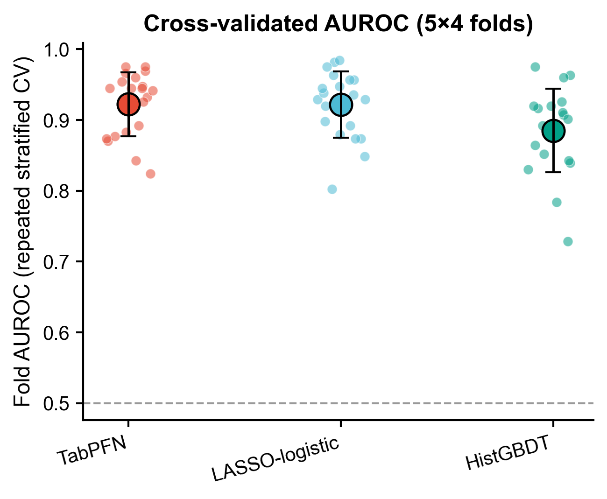
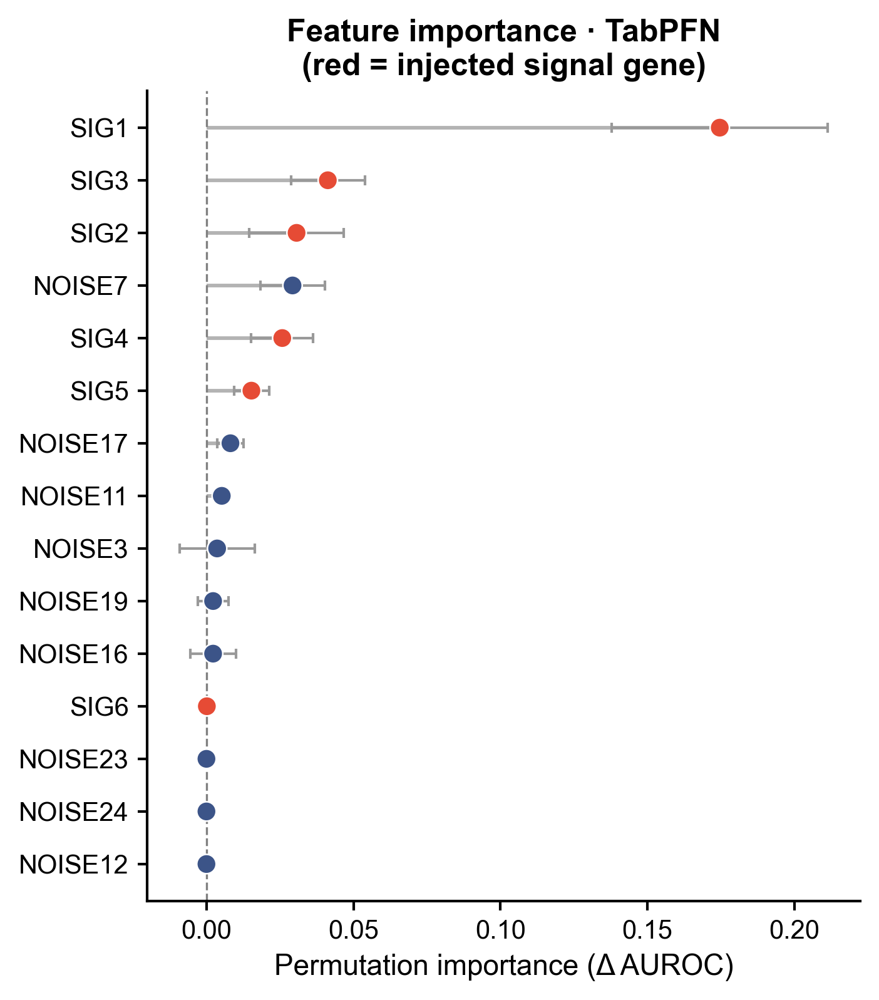

# 550 · TabPFN 表格基础模型诊断分类 TabPFN tabular foundation model classifier

> 一句话定位:输入「样本 × 基因表达 + label」的小样本二分类诊断表 → 用表格基础模型
> **TabPFN(零训练 in-context)** 与 **LASSO-logistic / GBDT** 同管线三方对照 → 出
> 交叉验证 AUROC 分布、ROC/PR、校准、混淆矩阵与置换重要性,**诚实回答 TabPFN
> 在你的小数据上到底有没有真比线性基线强**。

| | |
|---|---|
| **语言 / 主依赖** | Python · `tabpfn(>=2)` `scikit-learn` `numpy` `pandas` `matplotlib` `scipy`(可选 `xgboost`) |
| **一句话用途** | 小样本表达签名诊断分类 + 基础模型 vs 经典基线的诚实增量评估 |
| **输入** | `example_data/expr_demo.csv`(合成示例,首列样本名 / 末列 label / 其余为基因) |
| **输出** | `results/`(运行生成:对照表 + 诚实裁决 + 版本快照) · 展示图见 `assets/` |

---

## ① 输入数据

**文件**:`expr_demo.csv`(类型:csv;orientation:**行 = 样本,列 = 基因**)

| 列名 | 类型 | 必需 | 示例 | 说明 |
|------|------|:---:|------|------|
| 第 1 列(`sample`) | str | ✔ | `S001` | 样本名,任意字符串,自动剔除不入模 |
| 中间各列 | float | ✔ | `1.4279` | 基因表达(可为对数化/标准化前的连续值) |
| 末列 `label` | int∈{0,1} | ✔ | `0` | 二分类标签:0 = control,1 = case |

**命名/格式约定**:首列名固定建议 `sample`、末列名必须是 `label`;特征列名即基因名
(示例中 `SIG*` = 注入真实组间差异的信号基因,`NOISE*` = 噪声基因,仅用于可视化验证)。

**样例(前 2 行,列已截断)**:
```
sample,SIG1,SIG2,...,NOISE24,label
S001,1.4279,0.3413,...,-0.2122,0
S002,0.4999,-1.7424,...,-0.9454,0
```

换自己的数据:`python 550_tabpfn_tabular_classifier.py --input data/你的.csv`(同样首列样本名、末列 `label`)。

## ② 方法 / 原理 与诚实基线

**核心问题**:2025 年的硬证据是「深度学习 / 基础模型在小表格上常常打不过简单线性基线或
GBDT」(记忆 `reference_dl_ai_strategy` 的「两把屠刀」)。因此本模块**强制【同管线三方对照】**,
绝不只报一个好看模型:

1. **TabPFN**(Prior Labs 表格基础模型,Nature 2025;**in-context、零训练**)——
   使用**公开免授权的 v2 权重**(`TABPFN_MODEL_VERSION=v2`,GCS 直链下载,无需 token),
   CPU 实跑。**无任何 proxy/stub 顶替**:取不到权重则如实报错而非伪造数字。
2. **LASSO-logistic**(L1 稀疏逻辑回归)—— 高维小样本经典强基线。
3. **GBDT**(`XGBoost` 若已装则优先,否则 sklearn `HistGradientBoosting`)—— 树模型代表。

**防数据泄漏(铁律第 7 类)**:差异基因预筛(`SelectKBest` ANOVA-F top-k)与标准化
(`StandardScaler`)**全部封进 sklearn `Pipeline`**,只在每个 CV 训练折上 `fit`、再
`transform` 验证折,选择器/缩放器**永不见验证标签**;绝不在划分前全局选基因。

**评估**:`RepeatedStratifiedKFold`(5×4 = 20 折)同口径报各折 AUROC/AUPRC,
配对(同 split 同折)`scipy.stats.ttest_rel` 检验 TabPFN vs 最强基线的 ΔAUROC 是否显著;
另留 30% 测试集出干净的 ROC/PR/校准/混淆曲线。

## ③ 用途

- 小样本(几十~几百例)表达签名的 **case/control 诊断分类**;
- 在投稿/汇报前客观回答「**用了高级的 TabPFN 基础模型,到底比 LASSO 强多少、显不显著**」,
  避免只报单一好看模型造成的过度自信;
- 作为诊断模型章节的**诚实基线模板**(任何 DL/FM 预测都应配此类对照)。

## ④ 特点 / 亮点

- **turnkey**:一条命令零改动即跑;首跑联网下载 v2 权重(约几十 MB,缓存 `~/.cache/tabpfn`),之后离线可跑;
- **真包真路径**:TabPFN 为真实基础模型推理(本模块实测 `tabpfn==8.0.8` 跑通),非占位;
- **诚实三方对照 + 配对检验**:落盘 ΔAUROC 与配对 t 检验,显式裁决增量是否真实/显著;
- **防泄漏管线**:预筛 + 标准化封进 Pipeline,仅训练折拟合;
- **顶刊级非条形图**:叠加 ROC/PR 曲线、校准曲线、混淆 heatmap、置换重要性 lollipop、CV 折级 dot+errorbar 分布;
- 固定 `SEED=42`、路径全相对、`save_fig` 同出矢量 PDF + 300dpi PNG、依赖版本快照落盘。

## ⑤ 输出结果图

| 文件 | 图型 | 说明 |
|------|------|------|
| `assets/550_cv_auroc_strip.png` | dot + errorbar 分布 | 三方模型各折 AUROC 分布(展示不确定性,非均值条) |
| `assets/550_roc_pr.png` | 叠加曲线 | 留出集 ROC 与 Precision-Recall(含 prevalence 基线) |
| `assets/550_calibration.png` | 可靠性曲线 | 预测概率校准(分位分箱) |
| `assets/550_confusion.png` | heatmap | 各模型 0.5 阈值混淆矩阵 |
| `assets/550_permutation_importance.png` | lollipop | TabPFN 整管线置换重要性;红 = 注入信号基因,验证模型抓到真信号 |

**模型对照(CV 折级 AUROC,合成示例)** — TabPFN ≈ LASSO > HistGBDT:



**置换重要性** — 注入的信号基因(SIG1-5,红)正确占据前列,强效 SIG1 最高、弱效 SIG6 近零,噪声基因围绕 0:



**诚实裁决(示例数据实测)**:CV_AUROC TabPFN 0.922 vs LASSO 0.921 vs HistGBDT 0.885;
ΔAUROC = +0.001、配对 t 检验 p = 0.858 → **TabPFN 未显著胜出,简单线性基线已足够强**
(正是「两把屠刀」预期的结果;真实数据上结论可能不同)。完整裁决见 `results/verdict.txt`。

---

## 运行

```bash
# 零改动跑合成示例
python 550_tabpfn_tabular_classifier.py
# 换成自己的数据(首列样本名,末列 label∈{0,1},其余列基因表达)
python 550_tabpfn_tabular_classifier.py --input data/你的.csv
```

首跑会下载公开 v2 权重(无需 token);CPU 即可,无需 GPU。

## 依赖安装

```bash
pip install "tabpfn>=2" scikit-learn numpy pandas matplotlib scipy
pip install xgboost          # 可选:装了则 GBDT 基线用 XGBoost,否则自动退回 sklearn HistGradientBoosting
```
