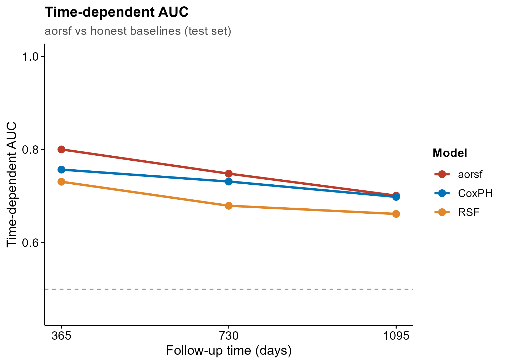
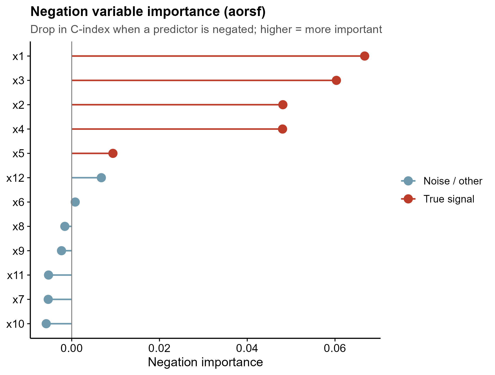
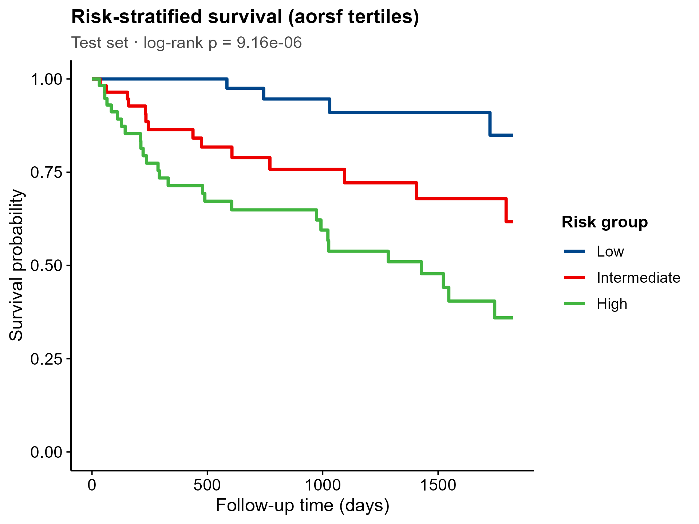

<!-- 图中文字英文,正文中文。 -->

# 551 · 加速斜分裂随机生存森林 aorsf (Oblique Random Survival Forest)

> 一句话定位:**输入** 一张含 `time`/`status` + 任意协变量的生存表 → **做** 斜分裂(oblique)随机生存森林预后建模并**强制对照 CoxPH / 标准 RSF 基线** → **出** time-dependent AUC 曲线、negation 变量重要性 lollipop、风险分层 KM 三张顶刊级图。

| | |
|---|---|
| **语言 / 主依赖** | R · `aorsf` `survival` `randomForestSRC` `timeROC` `ggplot2` |
| **一句话用途** | 用斜分裂随机生存森林做生存预后,且诚实地与线性 Cox / 轴对齐 RSF 比 C-index |
| **输入** | `example_data/synthetic_survival.csv`(自动生成) |
| **输出** | `results/`(运行生成) · 展示图见 `assets/` |

---

## ① 输入数据

**文件**:`synthetic_survival.csv`(类型 csv;orientation:行=样本,列=time/status/协变量)

| 列名 | 类型 | 必需 | 示例 | 说明 |
|------|------|:---:|------|------|
| `time` | num | ✔ | `584.7` | 随访时间(>0,任意单位;示例为天) |
| `status` | int | ✔ | `1` | 事件=1 / 删失=0 |
| `x1`…`x12` | num/factor | ✔ | `1.371` | 协变量(数值或因子均可;字符列自动转因子) |

**命名/格式约定**:必须含 `time` 与 `status` 两列(列名可用 `--time_col` / `--status_col` 覆盖);其余列一律当协变量。无其它命名要求。

**样例(前 3 行)**:
```
time,status,x1,x2,x3,...,x12
58.5,0,1.371,-0.248,-0.747,...,-0.932
584.7,1,-0.565,0.422,0.037,...,-1.358
1792.8,0,0.363,0.988,0.323,...,-0.178
```
> 合成数据 synthetic, for demo only:600 例,事件率约 27%;`x1`–`x5` 真实关联生存(含一个 `x1×x2` 交互项与一个 `x3²` 非线性项),`x6`–`x12` 为噪声。

## ② 方法 / 原理 与 ★诚实基线

1. **train/test 划分**(默认 70/30,`set.seed(42)`),所有评估在独立 test 上。
2. **aorsf 斜分裂随机生存森林**:`orsf(data, Surv(time,status)~., importance="negate")`。与标准 RSF 在每个节点用**单变量**阈值切分不同,aorsf 在每个分裂节点拟合**变量的线性组合**(oblique split),天然适合捕捉交互/非线性结构,Jaeger et al. 提出的加速实现训练快、精度高(*JCGS* 2024;包 `aorsf`)。
3. **★诚实基线(必报,不只报好看数字)**:同一 train/test 上并列跑
   - **CoxPH**(`survival::coxph`)——正则线性基线;
   - **标准 RSF**(`randomForestSRC::rfsrc`)——轴对齐随机生存森林;
   并以 `survival::concordance(..., reverse=TRUE)` 统一算 **test C-index**,落盘 `results/cindex_comparison.csv`。
   > 本示例实测:**aorsf 0.738 > CoxPH 0.722 > 标准 RSF 0.682**(aorsf−Cox = +0.016)。即:斜分裂确实捕捉到交互/非线性带来温和提升,但**对线性主导的数据,正则 Cox 仍高度竞争** —— 大队列 ML 常仅与正则 Cox 持平,这是诚实结论而非缺陷。
4. **time-dependent AUC**:`timeROC::timeROC` 在多个时点对三模型的风险评分评估判别力。
5. **negation 变量重要性**:`orsf_vi_negate()` —— 把某预测子在所有树中取负后 C-index 的下降量,值越大越重要(可正确把噪声压到 ≈0)。
6. **风险分层**:对 aorsf 在 test 上的风险三分位(Low/Intermediate/High)做 KM + log-rank。

## ③ 用途

回答「一组协变量能否预测预后、谁是关键预测子、能否把患者分成判别清晰的风险层」。典型场景:TCGA / 临床队列的生存预后建模与风险分层;当怀疑变量间存在交互或非线性、想要一个比单变量 RSF 更强又可解释、且**敢和 Cox 正面比**的森林模型时。

## ④ 特点 / 亮点

- **turnkey**:`Rscript 551_aorsf_oblique_survival.R` 一条命令即跑(合成数据自动生成)。
- **★内置诚实基线**:aorsf 与 CoxPH、标准 RSF 三方并列 test C-index,杜绝只报好看指标。
- **真实 API 实跑**:`orsf` / `orsf_vi_negate` / `predict(pred_type="risk")` 均经最小试跑确认(非 stub);本环境 aorsf 多线程会段错误 → 全程 `n_thread=1`(已注明)。
- **顶刊级图、零条形图**:折线+点的 time-dependent AUC、lollipop 重要性、阶梯 KM;`save_fig()` 一次出矢量 PDF + 300dpi PNG。
- **sanity-check 内建**:重要性图按「真信号 vs 噪声」着色,可一眼核对模型是否找回真实结构(本示例 x1–x5 全部排顶、噪声压零)。

## ⑤ 输出结果图

| 文件 | 图型 | 说明 |
|------|------|------|
| `assets/fig1_time_dependent_auc.png` | 折线+点 | 三模型 × 多时点 time-dependent AUC(含 0.5 参考线) |
| `assets/fig2_negation_importance_lollipop.png` | lollipop | aorsf negation 变量重要性,真信号/噪声着色 |
| `assets/fig3_risk_stratified_km.png` | KM 阶梯 | aorsf 风险三分位 KM + log-rank p |





另有表:`results/cindex_comparison.csv`(★诚实基线对照)、`results/time_dependent_auc.csv`、`results/sessionInfo.txt`(依赖快照)。

---

## 运行

```bash
# 零改动跑示例(自动生成合成数据)
Rscript 551_aorsf_oblique_survival.R

# 换成自己的数据
Rscript 551_aorsf_oblique_survival.R --input data/你的.csv --outdir results/run1

# 自定义事件列名 / 树数 / 评估时点
Rscript 551_aorsf_oblique_survival.R --input cohort.csv \
  --time_col OS.time --status_col OS --n_tree 1000 --horizons 365,1095,1825
```

## 依赖安装

```r
install.packages(c("aorsf", "survival", "randomForestSRC", "timeROC", "ggplot2"))
```
> 注:本库测试环境下 aorsf 多线程会触发段错误,脚本已固定 `n_thread=1`;真实大数据可自行试探更高线程并验证稳定性。
