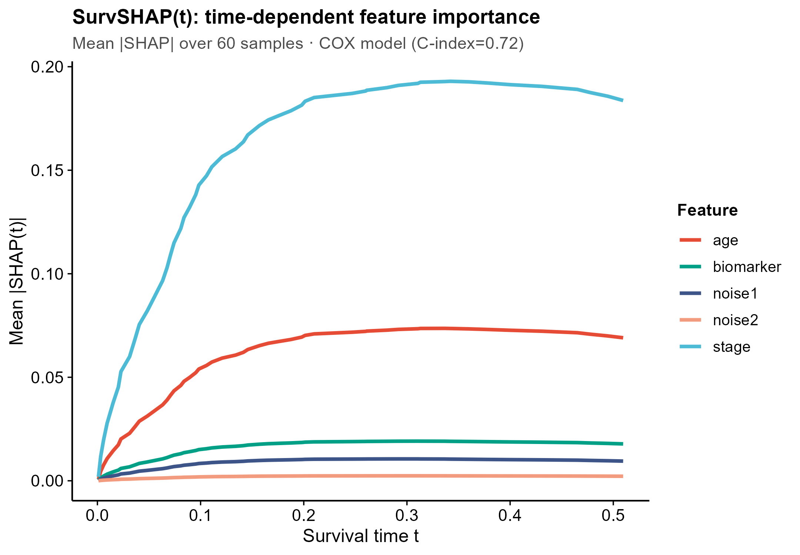
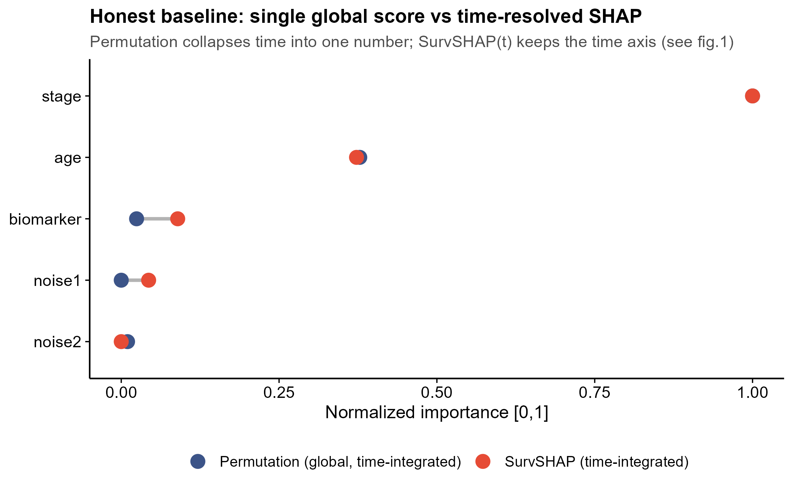

<!-- 图中文字英文,正文中文。 -->

# 552 · 生存模型可解释 SurvSHAP(t) + survex

> 一句话定位:**输入**一张生存数据表(时间+事件+特征)→ 拟合 Cox/RSF 并用 **survex** 做**时间依赖**可解释(SurvSHAP(t)、SurvLIME、时间依赖性能)→ **出**贡献随时间变化的曲线/热图/单样本 profile,并与"单一全局重要性"诚实基线并排对比。

| | |
|---|---|
| **语言 / 主依赖** | R · `survex`(>=1.2) `survival` `ranger` `ggplot2` |
| **一句话用途** | 把生存预后模型(Cox / 随机生存森林)的特征贡献沿生存时间 t 展开,识别"早期重要、晚期失效"等动态效应 |
| **输入** | `example_data/synthetic_survival.csv`(无文件时脚本自动合成) |
| **输出** | `results/`(运行生成 CSV) · 展示图见 `assets/` |

---

## ① 输入数据

**文件**:`synthetic_survival.csv`(类型:csv/tsv;orientation:行=样本,列=时间/事件/特征)

| 列名 | 类型 | 必需 | 示例 | 说明 |
|------|------|:---:|------|------|
| `time` | num | ✔ | `0.2033` | 生存/随访时间(>0);列名经 `--time_col` 指定 |
| `status` | int(0/1) | ✔ | `1` | 事件指示:1=事件发生,0=删失;经 `--event_col` 指定 |
| `age` | num | ✔ | `1.371` | 任意数值特征;时间/事件以外的数值列自动作为特征 |
| `stage` | num | | `-0.0046` | 同上(可 `--features a,b,c` 限定) |
| `biomarker`/`noise1`/`noise2` | num | | … | 同上 |

**命名/格式约定**:时间列、事件列名通过 `--time_col`/`--event_col` 指定(默认 `time`/`status`);其余**数值列**自动作为特征。事件列必须为 0/1。

**样例(前 3 行)**:
```
"time","status","age","stage","biomarker","noise1","noise2"
0.0334,1,1.371,-0.0046,-0.2485,0.9419,-0.7465
0.2033,1,-0.5647,0.7602,0.4223,-0.2486,0.0366
```

> 合成数据刻意构造**时间依赖效应**(`stage` 早期主导风险、`biomarker` 中后期才显现的保护)与两个**纯噪声阴性对照**(`noise1`/`noise2`,期望贡献≈0,用于检验"解释不虚报"),仅用于冒烟测试与出图(`synthetic, for demo only`)。

## ② 方法 / 原理

1. **拟合模型**:`survival::coxph`(默认)或 `ranger`(随机生存森林,`--model rsf`)。
2. **统一封装**:`survex::explain()` 把任意生存模型包成 explainer,统一接口。
3. **时间依赖性能**:`model_performance()` 报 C-index / Integrated Brier score。
4. **★诚实基线(可解释基线,非统计显著性)**:`model_parts()` 时间依赖排列重要性 → 沿时间梯形积分压成**每特征一个标量**(单一全局重要性)。这正是 SurvSHAP(t) 要超越的对象——它会掩盖动态效应。
5. **核心增量 SurvSHAP(t)**:`model_survshap()` 算时间依赖 SHAP,跨样本平均 |SHAP(t)| → 每特征一条随时间变化的重要性曲线;`predict_parts(type="survshap")` 出单样本 profile;`type="survlime"` 出局部线性代理(SurvLIME)系数。

核心方法:SurvSHAP(t)(Krzyziński et al., *KBS* 2023)与 survex(Spytek et al., *Bioinformatics* 2023)。

## ③ 用途

回答"**哪些预后特征在生存时间的哪个阶段起作用**":TCGA 预后模型解释、识别早期 vs 晚期风险驱动因子、给单个患者出可解释的风险归因。适用于 Cox 与机器学习(RSF)生存模型的事后可解释。

## ④ 特点 / 亮点

- **turnkey**:一条命令即跑(无输入时自动合成数据);`--model cox|rsf`、`--input/--time_col/--event_col/--features/--outdir` 可换数据即跑。
- **★内置诚实基线对比**:全局排列重要性(时间积分,单一标量)vs SurvSHAP(t)(保留时间轴)并排,凸显时间依赖解释的增量价值;两法 min-max 归一后用 dumbbell 对照。
- **阴性对照自检**:噪声特征 SurvSHAP/排列重要性均≈0(实测 `noise1/noise2` < 0.01),证明解释不虚报。
- **顶刊级出图**:全部为时间曲线/dumbbell/lollipop/heatmap,**无平凡条形图**;`save_fig()` 一次出矢量 PDF + 300dpi PNG;`set.seed(42)`、路径全相对、依赖快照落 `sessionInfo.txt`。

## ⑤ 输出结果图

| 文件 | 图型 | 说明 |
|------|------|------|
| `assets/01_survshap_t_curves.png` | 时间曲线 | **核心图**:跨样本平均 |SHAP(t)|,贡献随时间变化 |
| `assets/02_baseline_vs_survshap_dumbbell.png` | dumbbell | **诚实基线**:全局排列重要性 vs SurvSHAP(归一对照) |
| `assets/03_baseline_permutation_lollipop.png` | lollipop | 基线本体:全局(时间积分)排列重要性 |
| `assets/04_single_obs_survshap_profile.png` | 时间曲线 | 单焦点样本的带符号 SurvSHAP(t) profile |
| `assets/05_survshap_t_heatmap.png` | heatmap | 特征 × 时间 的平均 |SHAP(t)|(viridis) |
| `assets/06_single_obs_survlime_lollipop.png` | lollipop | 单样本 SurvLIME 局部线性代理系数(升/降风险) |





> 示例运行(合成数据,Cox):C-index=0.724,Integrated Brier=0.172;全局重要性 `stage > age > biomarker > noise2 > noise1`,SurvSHAP 时间积分同序,噪声≈0——阴性对照通过。

---

## 运行

```bash
# 零改动跑示例(合成数据,Cox)
Rscript 552_survex_survshap_explain.R

# 换成自己的数据 / 用随机生存森林
Rscript 552_survex_survshap_explain.R --input data/你的.csv \
        --time_col OS.time --event_col OS --model rsf --outdir results/run1
```

## 依赖安装

```r
install.packages(c("survex", "survival", "ranger", "ggplot2"))
```
