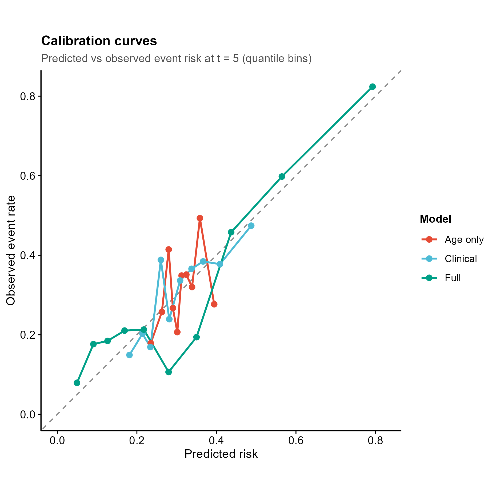
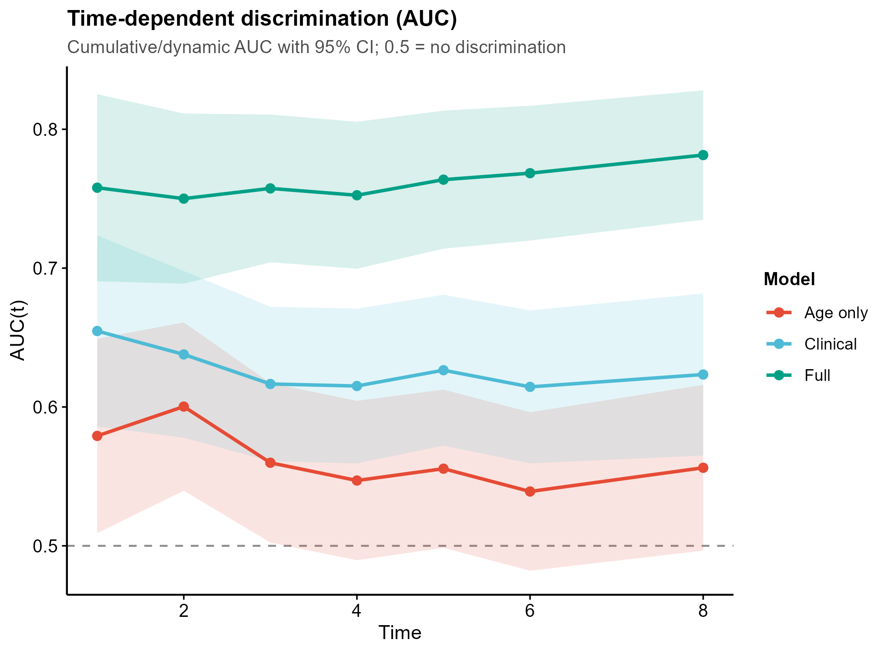
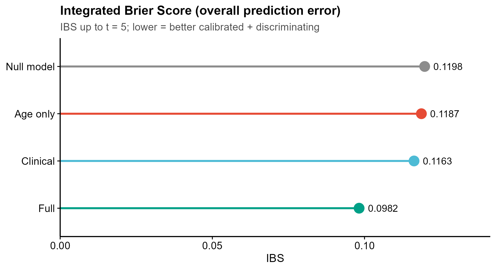

# 553 · 生存模型诚实评估 Honest Survival-Model Evaluation (Calibration + DCA + time-AUC/Brier)

> 一句话定位:**输入**一张生存表(time/status + 协变量)→ 拟合 3 个竞争 Cox 模型 → **诚实评估**(超越 C-index):时变 AUC + 校准曲线 + 决策曲线 DCA 净获益 + 积分 Brier 评分 → **出** 5 张顶刊级图。

| | |
|---|---|
| **语言 / 主依赖** | R · `riskRegression` `dcurves` `survival` `prodlim` `ggplot2` |
| **一句话用途** | 不要只盯 C-index:把区分度、校准、临床净获益、整体预测误差一并报出来 |
| **输入** | `example_data/survival_demo.csv`(合成,synthetic demo only) |
| **输出** | `results/`(运行生成 csv + sessionInfo) · 展示图见 `assets/` |

---

## ① 输入数据

**文件**:`survival_demo.csv`(csv;行=样本)

| 列名 | 类型 | 必需 | 示例 | 说明 |
|------|------|:---:|------|------|
| `time` | num | ✔ | `4.12` | 随访时间(任意一致单位,如年/月)|
| `status` | 0/1 | ✔ | `1` | 事件指示:1=事件,0=删失 |
| `age` | num | ✔* | `61` | 协变量(临床)|
| `stage` | num | ✔* | `3` | 协变量(临床)|
| `gene1`,`gene2`,`gene3` | num | ✔* | `0.84` | 协变量(分子;gene3 为故意置入的噪声列)|

\*协变量列名可在脚本顶部 3 个模型公式里替换为你的真实变量。`--time_col` / `--status_col` 覆盖生存列名。

**命名/格式约定**:`time>0`、`status∈{0,1}`;其余列为数值型协变量。

**样例(前 3 行)**:
```
time,status,age,stage,gene1,gene2,gene3
4.12,1,61,3,0.84,-0.21,0.05
9.77,0,54,1,-1.10,0.33,-0.88
```

## ② 方法 / 原理 与 ★诚实基线

拟合 3 个**信号强度递增**的竞争模型:`Age only`(弱)→ `Clinical`(+stage)→ `Full`(+gene1+gene2),再用四类互补指标做诚实评估:

1. **区分度** — `riskRegression::Score(..., metrics="auc")` 的 **time-dependent AUC**(cumulative/dynamic,含 95%CI)。
2. **校准** — `plotCalibration(..., method="quantile", q=10)` 取 `plotFrames` 的 (Pred, Obs),画**预测风险 vs 观测发生率**,对角线=完美校准。
3. **临床有用性** — `dcurves::dca(Surv(time,status)~risk, time=)` 的 **净获益 net benefit**,对照 Treat-All / Treat-None 两条参照线。
4. **整体预测** — `Score(..., metrics="brier", summary="ibs")` 的 **Brier / 积分 Brier 评分 IBS**(越低越好,Null model=KM 参照)。

> **★为什么必须诚实基线(2026 范式):** 只报 C-index/AUC 会误导——高 AUC 的模型可能严重校准失衡(系统高估/低估风险),或在任何决策阈值下都不如"全治/不治"(无临床净获益)。本模块强制把【校准 + DCA 净获益 + IBS】与区分度并列,并用 3 个竞争模型 + Null 参照作对照,让"看着好看的指标"无处遁形。核心方法:Gerds & Kattan / `riskRegression`(Score);Vickers DCA / `dcurves`;Graf 等的 IBS。

## ③ 用途

回答:**"我的预后/风险模型真的可用吗?"** 适用于 TCGA 风险评分、临床列线图、机器学习生存模型的发表前评估,以及"加了组学变量到底带来多少增量价值"的对照论证(△AUC / △IBS / △净获益)。

## ④ 特点 / 亮点

- **turnkey**:`Rscript 553_riskregression_dca_calibration.R` 一条命令即跑,自带合成数据。
- **真包实跑**:全部走 `riskRegression::Score` / `dcurves::dca` / `plotCalibration` 真实 API,非 stub。
- **诚实基线内置**:区分度 + 校准 + 净获益 + IBS 四轴 + Null/竞争模型对照,一表汇总(`honest_eval_summary.csv`)。
- **顶刊级图,零条形图**:校准折线、DCA 净获益曲线、AUC 带 CI 带状、Brier 折线、IBS **lollipop**(代替条形)。
- 每图独立成文件,一次出 **矢量 PDF + 300dpi PNG**;图中文字英文,代码注释中文。

## ⑤ 输出结果图

| 文件 | 图型 | 说明 |
|------|------|------|
| `assets/calibration_curve.png` | 校准折线 + 对角线 | 预测风险 vs 观测发生率;贴对角线者校准好 |
| `assets/decision_curve.png` | DCA 净获益曲线 | 跨阈概率的临床净获益;含 Treat All/None 参照 |
| `assets/timedep_auc.png` | 折线 + 95%CI 带 | 时变区分度 AUC(t);0.5=无区分 |
| `assets/timedep_brier.png` | 折线 | 时变预测误差 Brier(越低越好,Null=KM)|
| `assets/ibs_lollipop.png` | lollipop | 积分 Brier 评分 IBS 跨模型对比(代替条形图)|






**示例数据上的诚实评估实测**(Full > Clinical > Age only,三轴一致):

| Model | AUC@5 | IBS@5(↓) | NetBenefit@0.2(↑) |
|-------|:---:|:---:|:---:|
| Age only | 0.556 | 0.1187 | 0.135 |
| Clinical | 0.626 | 0.1163 | 0.141 |
| Full | **0.764** | **0.0982** | **0.158** |

---

## 运行

```bash
# 零改动跑合成示例
Rscript 553_riskregression_dca_calibration.R
# 换成自己的数据(改顶部模型公式里的协变量名)
Rscript 553_riskregression_dca_calibration.R --input data/你的.csv --time_eval 5 --eval_grid 1,3,5,8 --outdir results/run1
```

## 依赖安装

```r
install.packages(c("survival","prodlim","riskRegression","dcurves","ggplot2","data.table"))
```
