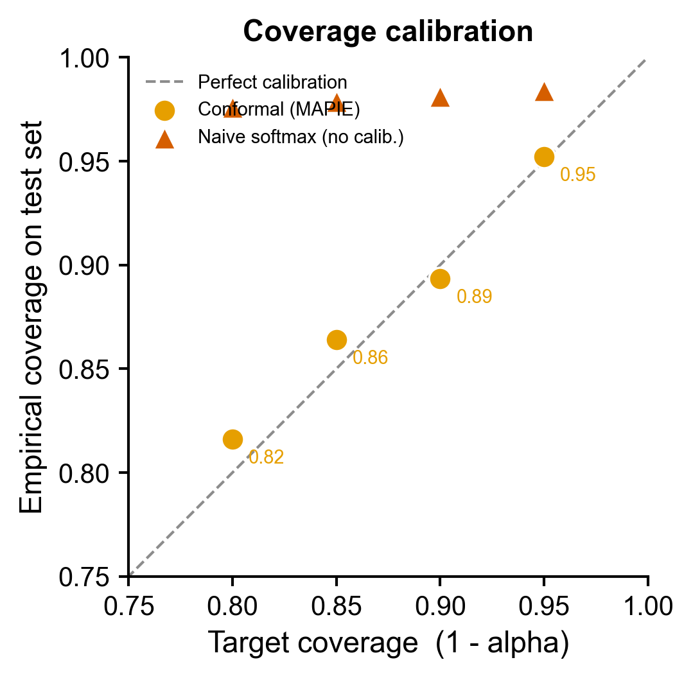
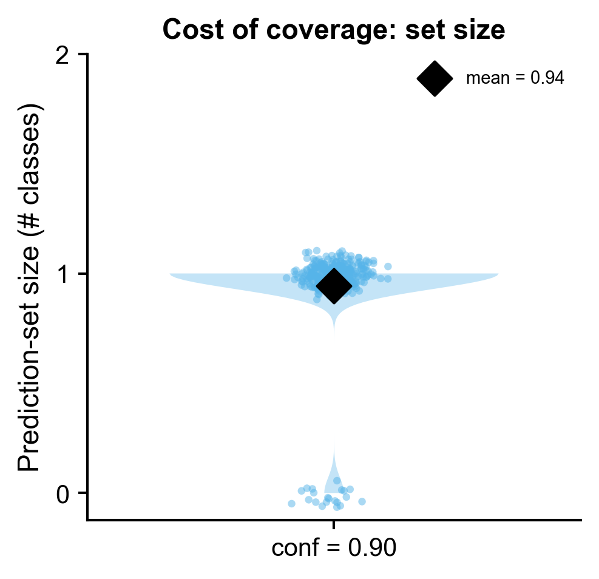
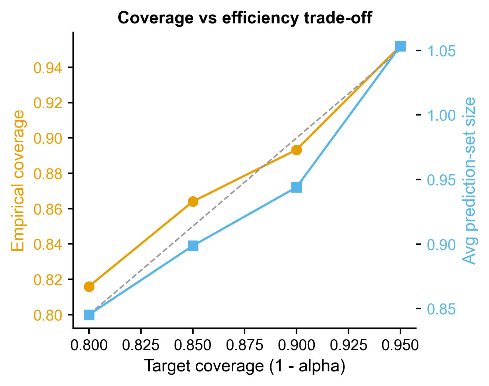
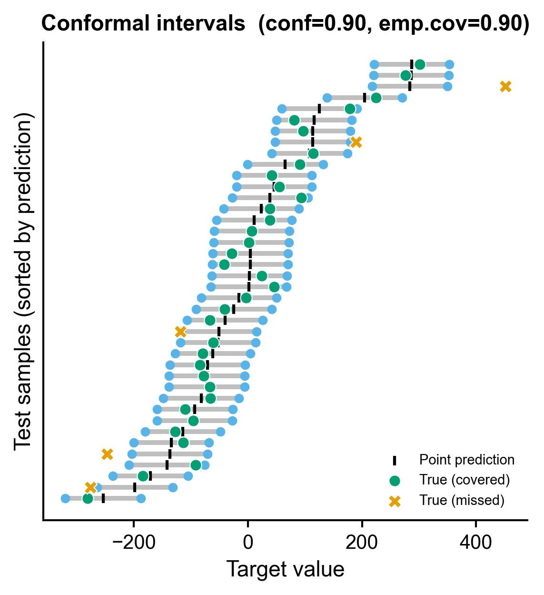

# 555 · 共形预测不确定性量化 (conformal prediction UQ)

给任意分类/回归签名加一层**统计有效**的不确定性：共形预测(conformal prediction)
用一个独立校准集，把模型分数转成带**有限样本覆盖保证**的预测集(分类)或预测区间
(回归)——在目标置信度 1-α 下，真值被覆盖的概率 ≥ 1-α，对模型与分布几乎无假设。
一句话：不只给一个点预测，而是给"模型对每个样本有多大把握"的可信范围。

| | |
|---|---|
| 语言 / 依赖 | Python · `mapie` 1.4 `scikit-learn` (+ 共享 `_framework/pubstyle.py`) |
| 输入 | `--input table.csv --target label`(一列 target + 数值特征列)；缺省合成 |
| 输出 | `results/` 覆盖诊断表 + `assets/` 4 张展示图(PDF+PNG) |
| 诚实基线 | 目标覆盖率 vs 实测覆盖率校准曲线 + 集合大小代价 + naive 无校准对照 |

---

## ① 输入数据

一张表格 CSV：一列是 `target`(分类标签字符串/类别，或回归数值)，其余列是数值特征。
脚本自动判别任务类型(target 为字符串或唯一值 ≤ 10 视为**分类**，否则**回归**)。

**共形的核心要求**：数据必须**三分**为独立的 train / calibration / test
(本模块 50% / 25% / 25%，分类用分层抽样)。校准集**绝不能**与训练集重叠，
否则覆盖保证失效——这正是共形与"随便切个验证集"的本质区别。

| 列 | 类型 | 说明 |
|----|------|------|
| `label`(可改名 `--target`) | 字符串/类别 或 数值 | 分类标签 或 回归目标 |
| `feat_*` | 数值 | 特征(组学常见的表达量/打分/影像特征) |

样例(`example_data/synthetic_signature.csv`，首次运行自动生成，1500×17，3 亚型)：

| label | feat_00 | feat_01 | … | feat_noise |
|-------|---------|---------|---|-----------|
| SubtypeA | 1.83 | -0.42 | … | 0.11 |
| SubtypeC | -0.77 | 2.05 | … | -1.34 |

---

## ② 方法 / 原理

1. **底模训练**(独立 train)：分类用 `RandomForestClassifier`，回归用
   `GradientBoostingRegressor`(可换任意 sklearn 估计器)。
2. **共形校准**(独立 calibration)：用 **MAPIE 1.4** 新接口
   `SplitConformalClassifier(estimator=..., confidence_level=[...],
   conformity_score="lac", prefit=True).conformalize(X_cal, y_cal)`。
   分裂共形(split conformal)在校准集上计算非一致性分数(此处 LAC =
   least ambiguous set-valued classifier，1 - 真类预测概率)，取其 (1-α) 分位数
   作阈值。
3. **预测集 / 区间**(test)：分类 `predict_set(X)` 返回每样本的**类别集合**
   (可能 0、1 或多个类)；回归 `predict_interval(X)` 返回每样本
   `[lower, upper]` 区间。理论保证：可交换性下边际覆盖 ≥ 1-α。
4. **诊断**：在 test 上实测覆盖率(真值落在集合/区间内的比例)、预测集平均大小、
   区间平均宽度，并与目标 1-α 比较。

> 参考：Vovk, Gammerman & Shafer 2005 *Algorithmic Learning in a Random World*；
> Angelopoulos & Bates 2023 *A Gentle Introduction to Conformal Prediction*；
> Romano et al. 2020 (LAC/APS)；实现 [MAPIE](https://mapie.readthedocs.io)。

---

## ③ 用途

- 给**诊断/分型模型**的每个病人输出"可信类别集合"——单类=有把握，多类=需复核，
  比单一 argmax + 一个 softmax 数字诚实得多，适合临床风险沟通。
- 给**回归签名**(年龄/分期评分/药物剂量)输出带覆盖保证的区间。
- 任何机器学习签名投稿时的**不确定性量化(UQ)章节**：审稿人越来越要求模型给出
  校准良好、有统计保证的置信度，而非裸 softmax。
- 作为 **selective prediction**(拒识)的基础：集合过大的样本可标记"模型不确定"。

---

## ④ 特点 / 亮点

- **Turnkey**：`python 555_conformal_prediction_uq.py` 零改动跑通，自动生成合成数据、
  三分、校准、出 4 图、写诊断表与依赖快照。
- **★诚实基线(库的灵魂)**：本模块的诚实对照=**覆盖率校准曲线本身**。我们实测
  "目标覆盖 vs 实际覆盖"(校准好则贴对角线)，并对照一个 **naive softmax 阈值**
  (无独立校准)——它的覆盖率不随目标 1-α 移动(无统计保证)，且为求安全把预测集
  撑得更大(本例平均 1.60 vs 共形 0.94)。**不只报好看结果，而是验证保证是否兑现、
  并量化覆盖的代价**。
- **真实 API**：用实测确认的 MAPIE 1.4 新接口(`SplitConformalClassifier` /
  `SplitConformalRegressor` + `prefit` + `conformalize`)，非旧式 `MapieClassifier`。
- **非条形图**：校准散点、violin+jitter 集合大小、双轴权衡曲线、per-sample 区间
  **dumbbell**——全部高信息量绘图，复用顶刊 `pubstyle` 风格(图中文字英文)。
- **可复现**：`SEED=42` 显式贯穿每个随机步骤；路径全从脚本位置派生，无硬编码、
  无 `chdir`；收尾写 `versions.txt`。

---

## ⑤ 输出结果图

| 文件 | 类型 | 说明 |
|------|------|------|
| `results/classification_coverage.csv` | 表 | 各置信度的实测覆盖、集合大小、单例/空集占比 |
| `results/naive_baseline_coverage.csv` | 表 | 诚实对照(无校准 softmax 阈值)覆盖 |
| `results/regression_intervals.csv` | 表 | 回归 per-sample 真值/点预测/区间上下界 |
| `results/coverage_diagnostics.txt` | 文本 | 校准是否兑现 + 与基线对比的结论 |
| `results/versions.txt` | 文本 | 各包 `__version__` 依赖快照 |
| `assets/calibration_scatter.png` | 散点 | 目标 vs 实测覆盖率(贴对角线=校准良好) |
| `assets/setsize_distribution.png` | violin+dot | 预测集大小分布(覆盖的代价) |
| `assets/coverage_efficiency.png` | 双轴曲线 | 置信度 ↑ 时覆盖 vs 集合大小权衡 |
| `assets/regression_interval_dumbbell.png` | dumbbell | 回归 per-sample 区间 + 真值落点 |

**覆盖率校准**(共形圆点贴对角线；naive 三角偏离、不随目标移动)：



**预测集大小分布**(覆盖保证的代价——多数样本单类，少数空集/多类)：



**覆盖 vs 效率权衡**(目标越高，覆盖与平均集合大小同步上升)：



**回归 per-sample 共形区间**(绿=真值被覆盖，橙 X=漏覆盖，约 1-α 比例)：



---

## 运行

```bash
# turnkey:合成数据零改动
python 555_conformal_prediction_uq.py

# 换自己的数据(分类或回归自动判别)
python 555_conformal_prediction_uq.py --input mytable.csv --target subtype
python 555_conformal_prediction_uq.py --input mytable.csv --target age --conf 0.9 0.95
```

## 依赖安装

```bash
pip install mapie scikit-learn matplotlib pandas numpy
# 备选共形库(回归/分类等价能力):pip install crepes  (from crepes import WrapClassifier)
```
