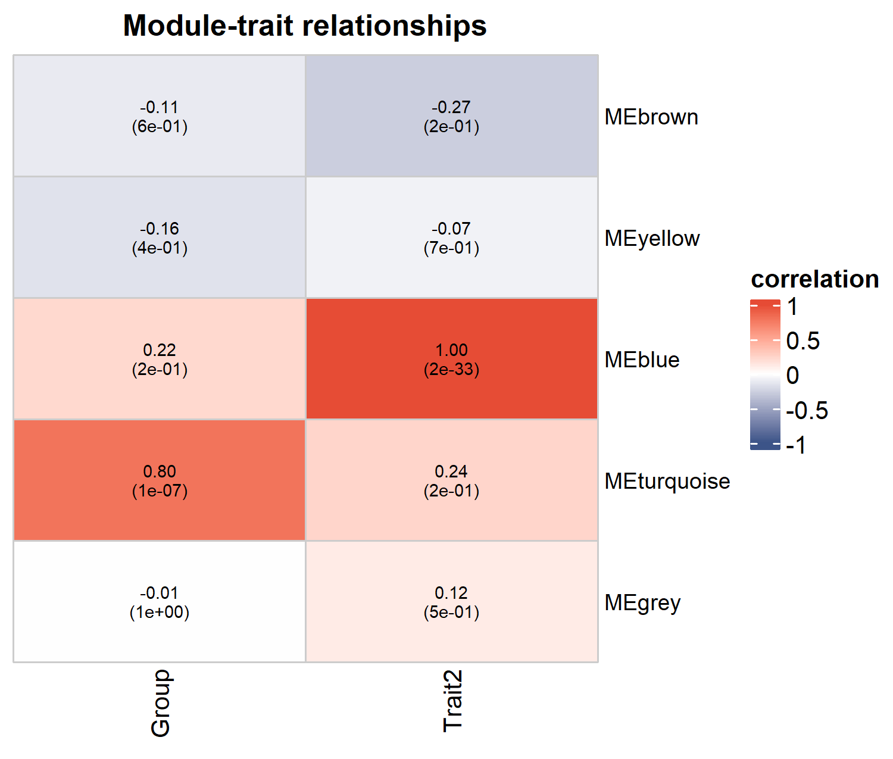

# 054 · WGCNA co-expression network analysis

Takes an expression matrix and a trait table and runs soft-threshold selection, module detection, and module-trait correlation in one command.

## Input

| File | Required | Description |
|------|:---:|------|
| `--input` expression matrix csv | Yes | First column genes, remaining columns samples (high-variance genes recommended) |
| `--traits` trait table csv | Yes | First column `Sample` (matching the samples), remaining columns numeric traits (groups/grades, etc.) |

## Method

`pickSoftThreshold` selects the scale-free soft threshold, `blockwiseModules` builds the TOM and detects modules by dynamic tree cut, `moduleEigengenes` computes the module eigengenes (ME), and the ME values are correlated with the traits (with p-values) to identify trait-associated modules.

Method citation: Langfelder & Horvath, *BMC Bioinformatics* 2008 (WGCNA).

## Purpose

Identifies co-expressed gene modules from an expression profile and the modules and hub genes significantly associated with a disease or phenotype, for downstream enrichment (007) and mechanistic study.

## Features

- Runs from a matrix plus traits; the soft threshold is selected automatically (or set with `--power`).
- Scale-free fit plot, module dendrogram (with colored module bands), and module-trait correlation heatmap (correlation and p-values).

## Outputs

| File | Plot type | Description |
|------|------|------|
| `assets/Module_trait_heatmap.png` | Correlation heatmap | Module × trait (correlation and p), identifies key modules |
| `assets/Module_dendrogram.png` | Dendrogram | Gene clustering with module colors |
| `assets/SoftThreshold.png` | Scatter | Scale-free topology R² vs power |




## Usage

```bash
Rscript 054_WGCNA_coexpression.R                              # 示例
Rscript 054_WGCNA_coexpression.R --input data/expr.csv --traits data/traits.csv --power 6
```

## Dependencies

```r
BiocManager::install(c("WGCNA","ComplexHeatmap","impute","preprocessCore","GO.db"))
install.packages(c("ggplot2","circlize"))
```
