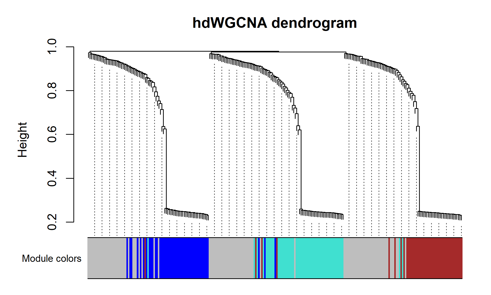

# 504 · hdWGCNA single-cell co-expression network

Single-cell co-expression network analysis with **hdWGCNA**, using metacell
aggregation to overcome scRNA-seq sparsity. The single-cell counterpart of module
054 (bulk WGCNA). Follows the dry-AMD paper, which used hdWGCNA on metacells to
find disease-module hubs.

| | |
|---|---|
| Language / deps | R · `Seurat` `hdWGCNA` `WGCNA` `igraph` `patchwork` |
| Purpose | Find co-expression modules + hub genes from scRNA-seq |
| Input | `example_data/sc_counts.rds` (gene × cell counts) |
| Output | `results/` (modules + hubs); preview in `assets/` |

## Input

`sc_counts.rds`: a gene × cell raw count matrix. Example data is synthetic
(900 cells × 250 genes, 3 cell types A/B/C, 3 planted co-expression modules),
generated on first run. Replace with your own Seurat-compatible counts.

## Method

Seurat standard preprocessing → hdWGCNA pipeline:
1. `SetupForWGCNA` (gene_select = fraction).
2. `MetacellsByGroups` — aggregate similar cells into metacells per cell type (anti-sparsity).
3. `SetDatExpr` → `TestSoftPowers` → pick the power with the highest scale-free fit (auto-selection falls back robustly when no power clears 0.8).
4. `ConstructNetwork` (signed) → `ModuleEigengenes` → `ModuleConnectivity`.
5. Extract modules + hub genes.

Note: on small/synthetic data the scale-free fit may not reach 0.8; the script
takes the best-fit power from the diagnostic table instead of failing.

## Use

Identify gene co-expression modules and their hub genes within a single-cell
dataset (e.g. a disease-associated subpopulation), then relate modules to cell
types / conditions. More appropriate than bulk WGCNA when working in scRNA-seq.

## Outputs

| File | Type | Description |
|------|------|------|
| `results/modules.csv` | table | gene → module assignment + color |
| `results/hub_genes.csv` | table | top hub genes per module |
| `assets/soft_power.png` | diagnostic | scale-free topology fit vs power |
| `assets/dendrogram.png` | dendrogram | gene clustering + module colors |
| `assets/module_featureplot.png` | UMAP | module eigengene (hME) per cell |



## Run

```bash
Rscript 504_hdwgcna_single_cell.R
```

## Dependencies

```r
install.packages(c("Seurat","WGCNA","igraph","patchwork"))
# hdWGCNA (GitHub; behind GFW use gh-proxy + install_local):
#   git clone https://gh-proxy.org/https://github.com/smorabit/hdWGCNA
#   R -e 'remotes::install_local("hdWGCNA")'   # needs Bioc dep GeneOverlap
```
