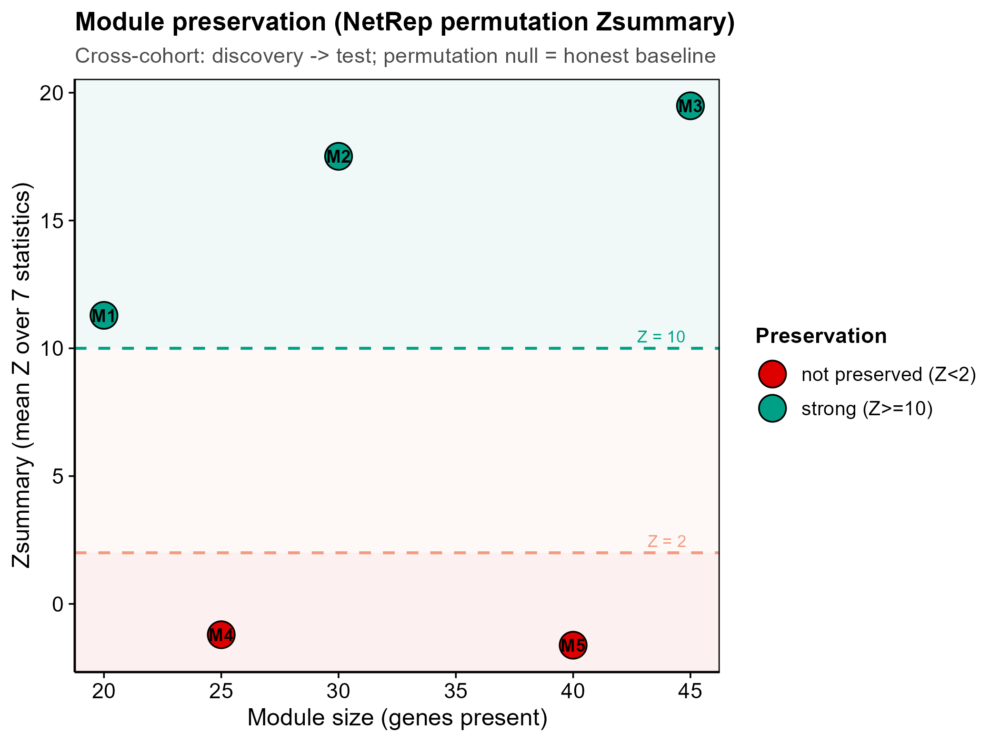
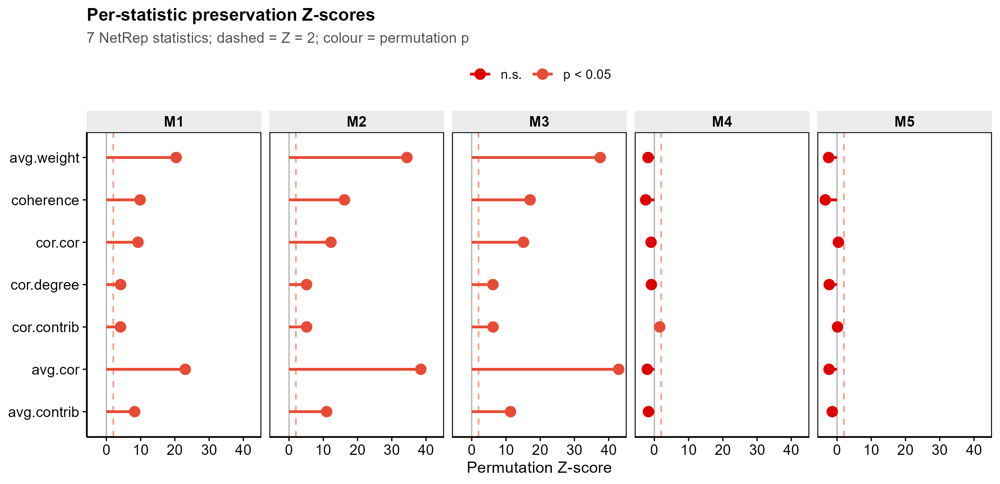
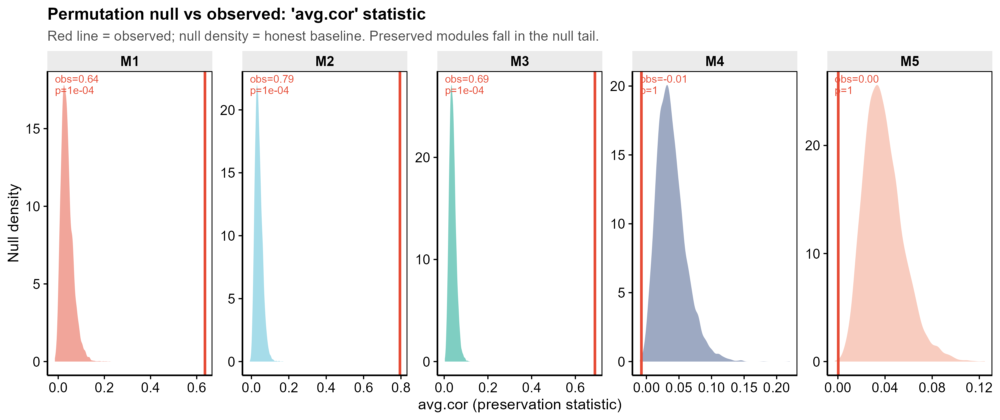

<!-- 图中文字英文,正文中文。 -->

# 538 · NetRep 跨数据集模块保守性置换检验 NetRep Module Preservation

> 一句话定位:输入 **discovery + test 两套表达 + 一套 WGCNA 模块标签**,用 NetRep 做 **无分布假设的置换检验** → 输出每个共表达模块在独立队列中是否「可重复 / 保守」(7 个保守性统计的无偏 p 值 + WGCNA 式 Zsummary)。

| | |
|---|---|
| **语言 / 主依赖** | R · `NetRep`(核心)· `ggplot2` · `theme_pub.R` |
| **一句话用途** | 跨队列验证 WGCNA 模块的可重复性(置换检验,远快于 `WGCNA::modulePreservation`,且不假设正态) |
| **输入** | `example_data/discovery_expr.csv` · `test_expr.csv` · `module_labels.csv` |
| **输出** | `results/`(运行生成 4 张表) · 展示图见 `assets/` |

---

## ① 输入数据

**(1) 表达矩阵** `discovery_expr.csv` / `test_expr.csv`(csv;行=基因,列=样本)

| 列名 | 类型 | 必需 | 示例 | 说明 |
|------|------|:---:|------|------|
| `gene` | str | ✔ | `Gene_001` | 首列基因名(两队列须可对齐) |
| `<sample_1>` … | num | ✔ | `0.42` | 每列一个样本的表达值 |

**(2) 模块标签** `module_labels.csv`(两列)

| 列名 | 类型 | 必需 | 示例 | 说明 |
|------|------|:---:|------|------|
| `gene` | str | ✔ | `Gene_001` | 与表达矩阵 `gene` 对齐 |
| `module` | int | ✔ | `1` | 模块编号;`0` = 背景/未分配(**不检验**) |

**命名/格式约定**:模块标签通常来自配对模块 **054 WGCNA 共表达**(把它的模块结果转成 `gene,module` 两列即可);`discovery` 用于定义模块,`test` 为独立验证队列。

**样例(`module_labels.csv` 前 3 行)**:
```
gene,module
Gene_001,1
Gene_002,1
```

## ② 方法 / 原理(含★诚实基线)

1. **构网**:各队列分别算 Pearson 相关矩阵 `correlation` 与无符号邻接 `network = |r|`;`data` = 样本×基因表达。三套均为 `list(discovery=, test=)`。
2. **置换检验** `NetRep::modulePreservation(network=, data=, correlation=, moduleAssignments=, nPerm=, null="overlap", alternative="greater")` —— 对每个模块计算 **7 个保守性统计**(`avg.weight` / `coherence` / `cor.cor` / `cor.degree` / `cor.contrib` / `avg.cor` / `avg.contrib`),并通过随机打乱 test 队列节点标签生成 **置换 null 分布**,得到无偏 p 值。
3. **Zsummary**:据真实置换 null 计算每统计 `Z = (obs − mean_null)/sd_null`,再取 7 统计均值得 WGCNA 式 `Zsummary`(阈值 **Z<2 不保守 / 2–10 中等 / ≥10 强保守**,Langfelder et al. 2011 *PLoS Comput Biol*)。

> **★诚实基线 = 置换 null 本身。** 每个观测统计都与「把 test 节点标签随机打乱」得到的 null 分布对照(图 3)。若模块只是「碰巧像」,观测值会落在 null 分布内(p≫0.05、Z<2)。本模块的合成数据**刻意混入不保守模块作为阳性对照**:管道必须把它们判为不保守,才证明有判别力(非只报好看指标)。外部真实队列验证则配对库内 **054 WGCNA** 的模块产出。
>
> **核心方法引用**:NetRep — Ritchie et al. 2016, *Cell Systems*「A scalable permutation approach reveals replication and preservation patterns of network modules」。

## ③ 用途

回答:**「我在队列 A 发现的共表达模块,在独立队列 B 里还存在吗?」** 典型场景 —— WGCNA 找到疾病相关模块后,在外部 GEO/TCGA 队列做可重复性验证;只保留跨队列保守的模块(及其 hub 基因)进入下游因果 / 功能分析,避免在不可复现的模块上立论。

## ④ 特点 / 亮点

- **turnkey**:`Rscript 538_netrep_module_preservation.R` 一条命令即跑(自带合成两队列数据)。
- **真包实跑**:接地 `NetRep 1.2.x` 真实 API(已最小试跑确认输入三套 list 结构 + 返回 `observed`/`p.values`/`nulls` 结构),非 stub。
- **★内置诚实基线**:置换 null 作对照,阳性对照模块(合成不保守)被正确判为 not-preserved。
- **顶刊级图(无平凡条形图)**:Zsummary 散点(阈值带)+ 7 统计 lollipop + 置换 null 密度;`save_fig()` 一次出矢量 PDF + 300dpi PNG。
- 比 `WGCNA::modulePreservation` 快,且**不假设正态**(置换检验)。

## ⑤ 输出结果图

| 文件 | 图型 | 说明 |
|------|------|------|
| `assets/01_Zsummary_vs_size.png` | 散点 + 阈值带 | Zsummary vs 模块大小,Z=2/10 虚线 + 三色保守性带 |
| `assets/02_perstat_lollipop.png` | 分面 lollipop | 各模块 7 个保守性统计的 Z 值,颜色=置换 p 是否<0.05 |
| `assets/03_permutation_null_density.png` | 分面密度 + 观测线 | ★诚实基线:置换 null 分布 vs 观测值(`avg.cor`) |





运行表(`results/`):`preservation_summary.csv`(模块×{size,Zsummary,maxP,判定})、`observed_statistics.csv`、`permutation_pvalues.csv`、`permutation_zscores.csv`、`sessionInfo.txt`。

**示例运行结果(合成数据,nPerm=10000)**:模块 M1/M2/M3=strong(Z≈11.3/17.5/19.5,maxP=1e-4)、**M4/M5=not preserved(Z≈−1.2/−1.6,maxP≈1.0)**——阳性对照(合成的不保守模块)被基线正确命中。

---

## 运行

```bash
# 零改动跑示例(合成两队列 + 模块标签)
Rscript 538_netrep_module_preservation.R

# 换成自己的数据(模块标签可由 054 WGCNA 结果转成 gene,module 两列)
Rscript 538_netrep_module_preservation.R \
    --disc_expr disc.csv --test_expr test.csv --modules mod.csv \
    --nperm 10000 --nthreads 4 --outdir results/run1
```

参数:`--nperm`(置换次数,p 精度上限≈1/(nperm+1),真实数据建议 ≥10000)、`--nthreads`(并行核数)。

## 依赖安装

```r
install.packages("NetRep")    # 核心(已装,1.2.x)
install.packages("ggplot2")   # 出图(theme_pub.R 提供顶刊主题)
```
