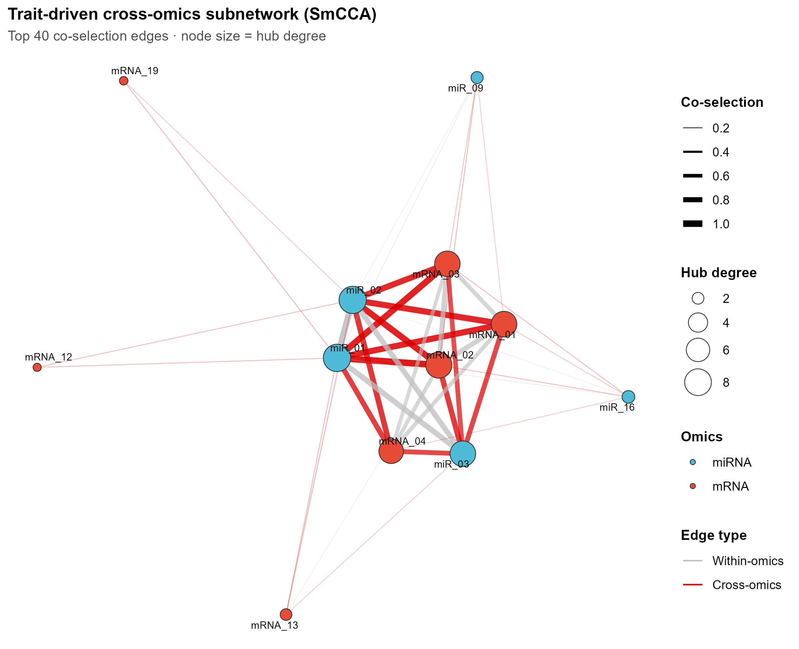
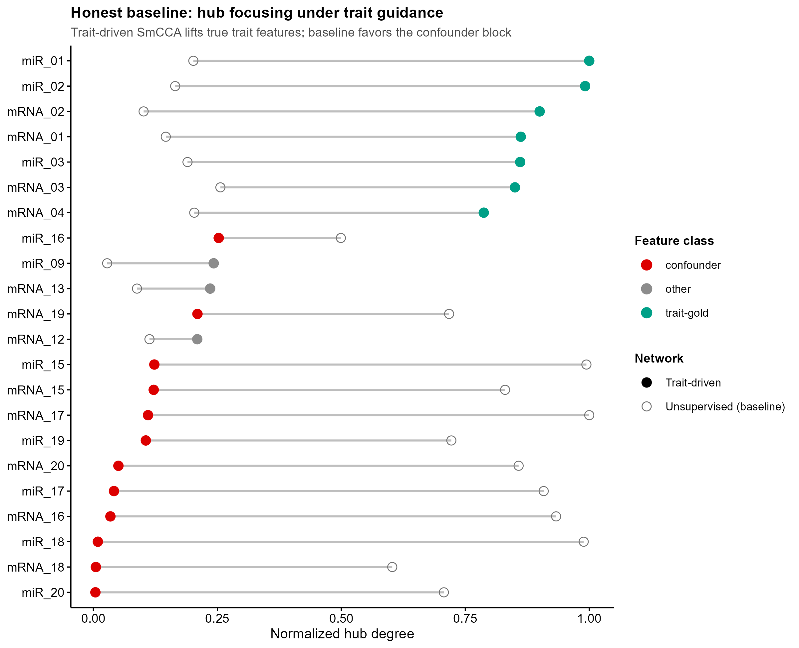
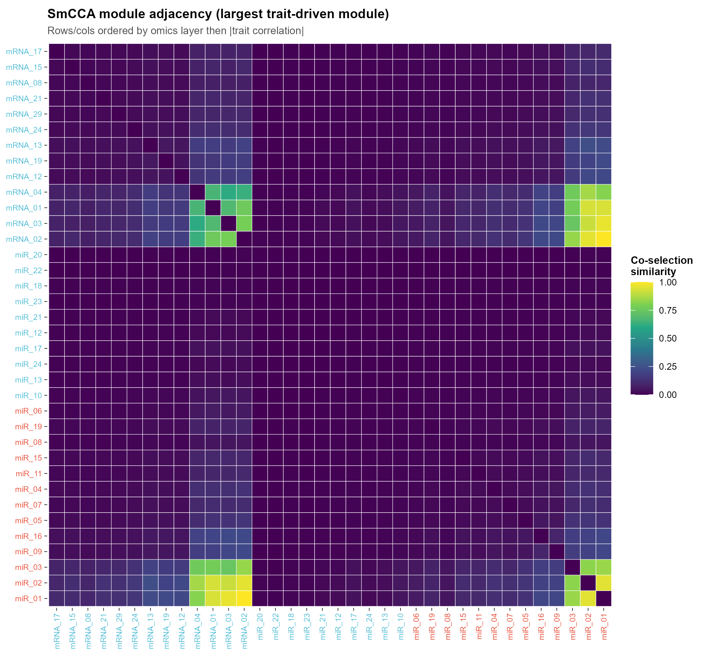
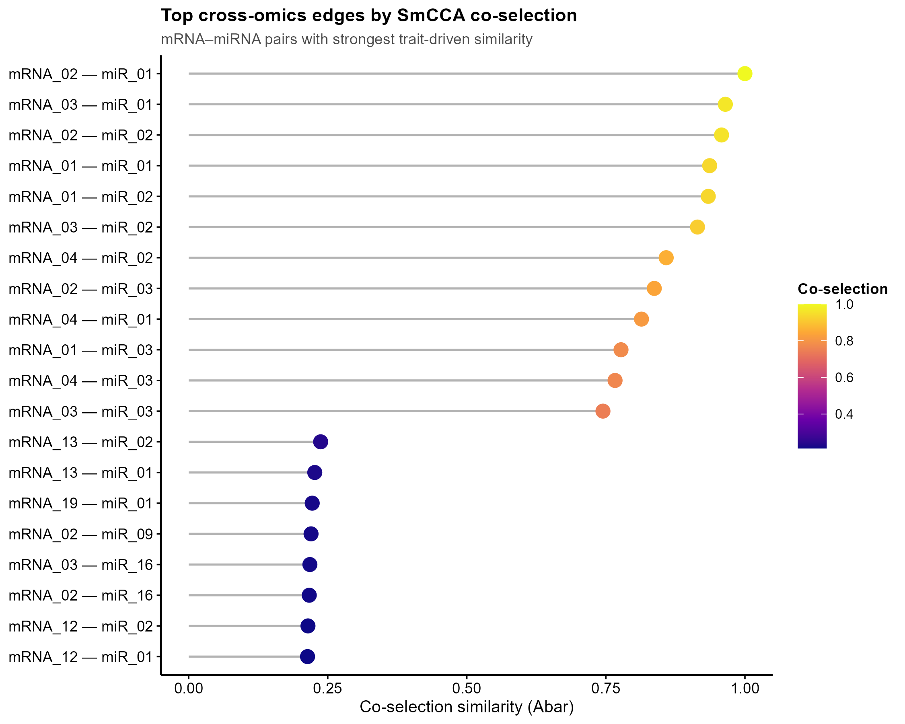

# 539 · 表型驱动多组学稀疏典则相关网络 SmCCNet Trait-Driven Multi-Omics Network

> 一句话定位:输入**两组学(mRNA + miRNA)+ 连续表型** → 用 SmCCNet(SmCCA + LASSO + 子采样)重建**性状特异**的跨组学子网络 → 出网络图 / 模块邻接热图 / 边权 lollipop / ★诚实基线对比图。

| | |
|---|---|
| **语言 / 主依赖** | R · `SmCCNet`(2.0.7) `igraph` `ggraph` `ggplot2` `ggrepel` `reshape2` |
| **一句话用途** | 找出由表型驱动、跨 mRNA–miRNA 协同选择的特征子网络(性状特异跨组学模块) |
| **输入** | `example_data/mrna.csv` `example_data/mirna.csv` `example_data/pheno.csv`(行=样本) |
| **输出** | `results/`(运行生成:节点表/边表/诚实基线对比) · 展示图见 `assets/` |

---

## ① 输入数据

**3 张表,行=样本、首列样本 ID**(三表样本须能对齐)。

`mrna.csv` / `mirna.csv`(组学矩阵):

| 列名 | 类型 | 必需 | 示例 | 说明 |
|------|------|:---:|------|------|
| `SampleID` | str | ✔ | `S001` | 样本 ID(首列) |
| `<feature>` | num | ✔ | `mRNA_01` | 每列一个特征(基因 / miRNA),表达值 |

`pheno.csv`(连续表型):

| 列名 | 类型 | 必需 | 示例 | 说明 |
|------|------|:---:|------|------|
| `SampleID` | str | ✔ | `S001` | 样本 ID(首列) |
| `Trait` | num | ✔ | `1.23` | 1 列连续表型(脚本取首个非 ID 列) |

**命名/格式约定**:三表的 `SampleID` 取交集对齐;脚本内部对组学做 `scale()` 标准化(SmCCA 对尺度敏感)。

**样例(`mrna.csv` 前 3 行)**:
```
SampleID,mRNA_01,mRNA_02,...
S001,1.84,-0.21,...
S002,-0.55,0.97,...
```

## ② 方法 / 原理 + ★诚实基线

**SmCCA(Sparse multiple Canonical Correlation Analysis)** 把多组学与表型的全部**成对典则相关**(omics–omics 与 omics–trait)加权求和作为目标,LASSO 惩罚使典则权重稀疏:

1. `getRobustWeightsMulti(NoTrait=FALSE)` — 子采样(默认 200 次)+ SmCCA,得稳健典则权重矩阵 `Ws`;表型驱动通过 `CCcoef` 上调 omics–trait 成对相关的权重(对应 `fastAutoSmCCNet` 的 `BetweenShrinkage` 思想)。
2. `getAbar(Ws)` — 由共选频率构建 p×p **相似度矩阵 Abar**(= 网络邻接)。
3. `getOmicsModules(Abar)` — 层次聚类切出跨组学模块;边表只保留**跨组学边**(mRNA↔miRNA)的最强者成网。

**★诚实基线(内置,不可只报好看图)**:再跑一次 `getRobustWeightsMulti(NoTrait=TRUE)` 得**无监督相关网络**(完全不看表型,纯 omics–omics 典则相关)。合成数据**故意埋两块跨组学结构**:① **trait 块**(真表型驱动的特征,gold)② **confounder 块**(更强但与表型无关的批次/混杂轴)。脚本量化两个网络 top-K hub 节点对 gold / confounder 的命中数 —— 用数字证明「表型驱动 = 更聚焦」,而非只画图。

> 方法引用:Shi WJ et al., *SmCCNet 2.0*; Liu et al. 原始 SmCCNet(*Bioinformatics*)。

## ③ 用途

回答「**哪些 mRNA–miRNA 跨组学特征是由某个连续表型(疾病评分 / 表达量 / 临床指标)协同驱动的**」。典型场景:多组学队列里找性状特异的调控子网络 / 候选 biomarker 模块,作为后续机制与因果分析的起点。相比 WGCNA(单组学、无监督),SmCCNet 同时整合多组学**并以表型为锚**。

## ④ 特点 / 亮点

- **turnkey**:`Rscript 539_smccnet_multiomics_network.R` 一条命令即跑(合成数据 CPU 秒级),用**真包 SmCCNet 2.0.7** 实跑,非 stub。
- **★内置诚实基线**:表型驱动 vs 无监督对照 + 量化命中数(实测见下),杜绝只报好看指标。
- **顶刊级图**:网络(ggraph)/ 邻接热图(viridis)/ 边权 lollipop / 诚实基线 dumbbell —— **全程无平凡条形图**;每图独立成 PDF+PNG。
- **可换数据即跑**:`--mrna --mirna --pheno` 指向自己的三表;关键超参(`--lambda --trait_weight --subsamp --top_edges`)CLI 可调;路径全相对、固定种子 42。

### ★诚实基线实测表现(合成示例,top-19 hub)

| 网络 | 命中真表型(gold /7) | 命中混杂(conf /12) |
|------|:---:|:---:|
| **Trait-driven SmCCA** | **7 / 7** | 3 / 12 |
| Unsupervised(baseline) | 6 / 7 | **12 / 12** |

无监督网络被**更强的混杂块**完全带偏(12/12 混杂特征进 hub);表型驱动子网把 hub 聚焦到真表型特征(7/7 gold、混杂仅 3)。dumbbell 图直观呈现:trait 特征在表型引导下被「抬升」、混杂特征被「压低」。

## ⑤ 输出结果图

| 文件 | 图型 | 说明 |
|------|------|------|
| `assets/fig1_trait_subnetwork.png` | 网络(ggraph) | 表型驱动跨组学子网络;红边=跨组学,节点大小=hub 度,颜色=组学层 |
| `assets/fig2_module_adjacency_heatmap.png` | 邻接热图(viridis) | 最大 trait 模块的 Abar 子块,行列按组学+|表型相关|排序,亮黄块=跨组学协同 |
| `assets/fig3_edge_weight_lollipop.png` | lollipop | 最强 mRNA–miRNA 跨组学边的共选相似度排名 |
| `assets/fig4_honest_baseline_dumbbell.png` | dumbbell | ★诚实基线:表型驱动 vs 无监督的 hub 度,直观显示「聚焦」效应 |






`results/` 另产:`node_table.csv`(节点 hub 度 / 表型相关 / 模块)、`trait_network_edges.csv`(全边表)、`honest_baseline_contrast.csv`(基线对比表)、`sessionInfo.txt`(依赖快照)。

---

## 运行

```bash
# 零改动跑合成示例
Rscript 539_smccnet_multiomics_network.R

# 换成自己的三表(行=样本,首列样本ID)
Rscript 539_smccnet_multiomics_network.R \
  --mrna data/mrna.csv --mirna data/mirna.csv --pheno data/pheno.csv \
  --lambda 0.5 --trait_weight 5 --subsamp 500 --top_edges 50 --outdir results/run1
```

## 依赖安装

```r
install.packages("SmCCNet")   # CRAN, 2.0.7
install.packages(c("igraph","ggraph","ggplot2","ggrepel","reshape2"))
```
