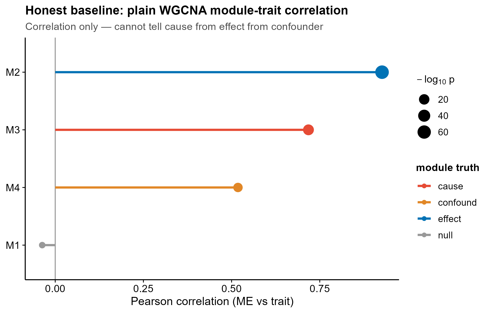
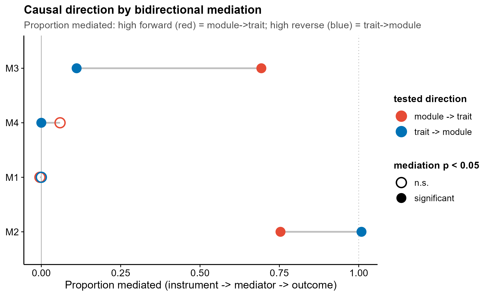
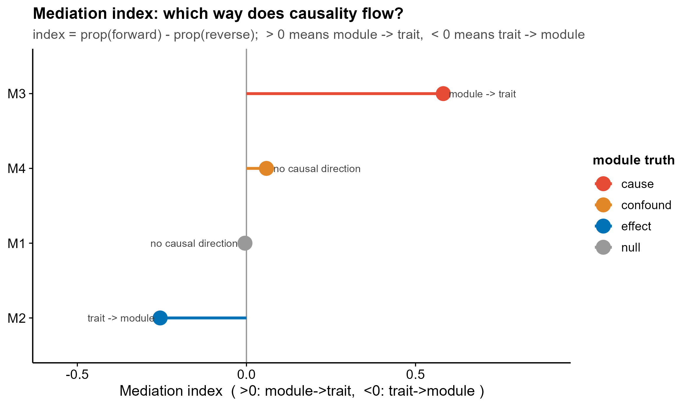
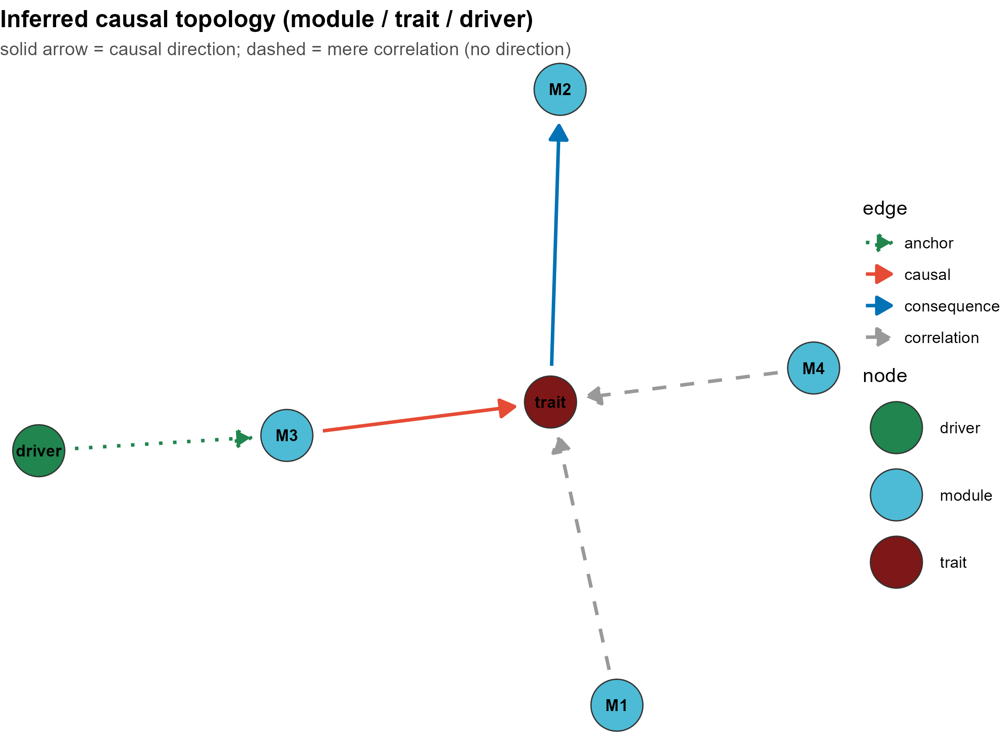

<!-- 图中文字英文,正文中文。 -->

# 540 · CWGCNA 因果模块推断 Causal module inference in WGCNA

> 🟡 **降级模块(DEGRADED)**:核心工具 **CWGCNA**(GitHub,`yuabrahamliu/CWGCNA`)本机**未安装**。
> 本模块**接地其真实 API**(主函数 `diffwgcna(..., mediation=TRUE)`),并用已装的 **WGCNA + 基础 lm 双向中介**
> 真实跑通"诚实基线 + 因果方向"演示路径(不依赖缺失包,退出码 0、出 4 张图)。
> 装上 CWGCNA 后脚本会额外真实调用 `diffwgcna()` 作交叉印证。
>
> **安装 CWGCNA(需联网 / 建议服务器):** `devtools::install_github("yuabrahamliu/CWGCNA")`

一句话定位:在 WGCNA 共表达模块基础上做**中介/因果方向推断**,区分"模块→性状"(潜在干预靶)与"性状→模块"(下游标志物),回应"共表达 = 相关 ≠ 因果"。

| | |
|---|---|
| **语言 / 主依赖** | R · `WGCNA`(已装) · `ggplot2` · 可选 `CWGCNA` / `igraph`+`ggraph`+`tidygraph`(网络图) |
| **一句话用途** | 判断每个共表达模块与目标性状之间的**因果方向**,而非仅相关 |
| **输入** | `example_data/expr.csv`(表达,行=样本) + `example_data/traits.csv`(性状+外生工具) |
| **输出** | `results/`(运行生成,含因果方向表) · 展示图见 `assets/` |

---

## ① 输入数据

**文件 1 `expr.csv`**(表达矩阵;行=样本,列=基因,首列样本名)

| 列名 | 类型 | 必需 | 示例 | 说明 |
|------|------|:---:|------|------|
| `sample` | str | ✔ | `S001` | 样本 ID(首列) |
| `<gene>` | num | ✔ | `CAU_g01` | 各基因表达(每列一个基因) |

**文件 2 `traits.csv`**(性状表;首列样本名)

| 列名 | 类型 | 必需 | 示例 | 说明 |
|------|------|:---:|------|------|
| `sample` | str | ✔ | `S001` | 与 expr 对齐 |
| `trait` | num | ✔ | `0.30` | 目标性状(`--trait` 指定,默认 `trait`) |
| `driver` | num | ○ | `1.37` | **外生工具变量**(SNP/暴露;锚定因果方向,强烈建议提供) |
| `confounder` | num | ○ | `-0.04` | 仅合成数据自带,真实数据无需 |

**命名/格式约定**:expr 与 traits 用 `sample` 列对齐取交集;无 `driver` 时方法退化为弱版(ME↔trait 残差互检),真实数据请尽量提供外生工具(如 eQTL/SNP)。合成示例的基因前缀 `CAU/EFF/CON/NUL` 仅用于对照核验,真实数据无此奢侈。

**样例(`traits.csv` 前 3 行)**:
```
sample,trait,driver,confounder
S001,0.296,1.371,-0.041
S002,-1.083,-0.565,-1.552
```

## ② 方法 / 原理

1. **WGCNA 共表达模块**:`blockwiseModules()` 软阈值建网 → 模块特征基因 `moduleEigengenes()`(ME)。
2. **★诚实基线**:普通 WGCNA **模块-性状 Pearson 相关** + `corPvalueStudent`。**只给相关系数与方向号,无法区分因果方向** —— cause / effect / confound 三类模块都会显示强相关。
3. **因果方向推断(复刻 CWGCNA `diffwgcna(mediation=TRUE)` 双向逻辑)**:以外生工具 `driver` 锚定方向,对每模块跑两条中介路径——
   - **forward** `driver → ME → trait`:ME 是否中介 driver 对 trait 的效应(**模块→性状**);
   - **reverse** `driver → trait → ME`:trait 是否中介 driver 对 ME 的效应(**性状→模块**)。
   间接效应 `a*b` 用 **bootstrap** 取双尾 p,并算 **proportion mediated**(占总效应比例);
   **工具相关性闸**:若 `driver→outcome` 总效应(c 路)不显著,则"无可中介的效应"→ 不下因果结论(混杂模块由此判为无方向)。
4. **交叉印证(可选)**:若本机装了 CWGCNA,额外真实调用 `diffwgcna(dat, pddat, responsevarname="Group", mediation=TRUE, topn=1)`,落盘其 `mediationres`。

> 方法引用:CWGCNA(Liu Y., `yuabrahamliu/CWGCNA`,`diffwgcna` 双向中介:module→gene→trait vs trait→gene→module);WGCNA(Langfelder & Horvath, 2008);中介 proportion / bootstrap(Preacher & Hayes)。

## ③ 用途

回答 WGCNA 分析里最常被忽略的问题:**这个与疾病强相关的模块,是病因还是病的结果?** —— 用于把"相关的共表达模块"分流为**潜在干预靶(模块→性状)** vs **下游标志物(性状→模块)** vs **仅混杂相关**,避免把下游结果误当成驱动靶。

## ④ 特点 / 亮点

- **turnkey**:`Rscript 540_cwgcna_causal_module.R` 一条命令即跑(自动生成合成数据)。
- **★内置诚实基线对照**:同一份数据并排展示"普通 WGCNA 相关(无方向,被 cause/effect/confound 同时骗)"与"双向中介(恢复方向)";合成数据预埋 4 类对照模块(真上游因 / 真下游果 / 仅混杂 / 阴性)检验是否被骗。
- **接地真实工具**:对 CWGCNA 的调用以 `try(library(CWGCNA))` 包裹;降级路径用已装包真实出图。
- **顶刊级图,无平凡条形图**:lollipop / dumbbell / 有向因果网络(箭头=推断方向)。
- 路径全相对、固定种子 42、依赖版本落盘 `sessionInfo.txt`。

**实测(合成示例)**:基线相关把 cause/effect/confound 都标为强相关(r=0.52–0.91);双向中介正确恢复:**M3[cause]→trait**、**trait→M2[effect]**、**M4[confound] 无方向**、**M1[null] 无方向**。

## ⑤ 输出结果图

| 文件 | 图型 | 说明 |
|------|------|------|
| `assets/A_baseline_module_trait_lollipop.png` | lollipop | ★诚实基线:普通 WGCNA 模块-性状相关(**只有相关、无方向**) |
| `assets/B_causal_direction_dumbbell.png` | dumbbell | 每模块 forward vs reverse 的中介比例(实心=显著);一眼判方向 |
| `assets/C_mediation_index_lollipop.png` | lollipop | 方向指数(>0 模块→性状,<0 性状→模块)+ 文字结论 |
| `assets/D_causal_topology_network.png` | 有向网络 | driver/trait/模块节点 + 有向边(实线=因果方向,虚线=仅相关) |






---

## 运行

```bash
# 零改动跑合成示例(无需安装 CWGCNA)
Rscript 540_cwgcna_causal_module.R

# 换成自己的数据(强烈建议 traits 含外生工具 driver 列,如 eQTL/SNP)
Rscript 540_cwgcna_causal_module.R --expr data/expr.csv --traits data/traits.csv --trait DiseaseStatus
```

## 依赖安装

```r
# 已装即可跑(降级演示路径):
install.packages("ggplot2")
BiocManager::install("WGCNA")
# 可选:有向网络图
install.packages(c("igraph","ggraph","tidygraph"))
# 可选:真实 CWGCNA 交叉印证(需联网,建议服务器)
# install.packages("devtools"); devtools::install_github("yuabrahamliu/CWGCNA")
```

> SERVER/缺包说明:本机 **CWGCNA 未安装**(MISSING, github),降级演示路径用 WGCNA + base lm 真实跑通出图;
> 如需 CWGCNA 原生 `diffwgcna()` 结果,请在可联网环境/服务器 `install_github` 后重跑。
