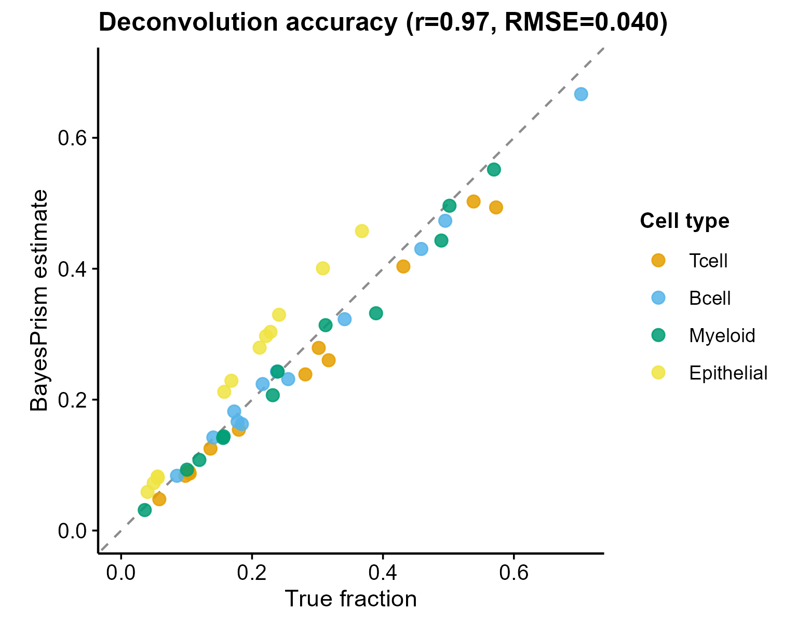

# 520 · BayesPrism bulk deconvolution (scRNA reference)

Bayesian deconvolution of bulk RNA-seq using a single-cell reference (**BayesPrism**,
the real package). The demo bulk samples are known Dirichlet mixtures, so the estimated
cell-type fractions are **validated against ground truth** (Pearson r + RMSE).

| | |
|---|---|
| Language / deps | R · **BayesPrism** + `ggplot2` |
| Purpose | Estimate cell-type composition of bulk samples from a scRNA reference |
| Input | synthetic scRNA reference (4 types) + bulk with known fractions |
| Output | `results/` fractions + accuracy; `assets/` scatter + heatmap |

## Input

Generated on first run: `reference_counts.csv` (cells × genes) + `reference_labels.csv`
(cell type per cell) + `bulk_counts.csv` (samples × genes) + `true_fractions.csv`.
For real data: a scRNA count matrix with cell-type labels, and a bulk count matrix.

## Method

`new.prism(reference, mixture, cell.type.labels, cell.state.labels)` → `run.prism()` →
`get.fraction(which.theta="final", state.or.type="type")`. Validation = estimated vs
true fraction (Pearson r, RMSE). BayesPrism's Bayesian model is robust to reference–bulk
batch differences (better than NNLS/linear deconvolution).

## Use

Estimate immune/stromal/malignant composition of bulk cohorts when a matched scRNA
reference exists. Complements modules 017-021 (deconvolution) and 492 (IOBR multi-method).

## ⚠️ Full version on the server

BayesPrism **is installed on this machine** and the demo runs locally, but a fresh
server needs it installed:

```r
# install on a clean server
remotes::install_github("Danko-Lab/BayesPrism/BayesPrism")   # via gh-proxy if blocked
```

For large cohorts set `run.prism(..., n.cores = N)` and pre-filter genes with
`cleanup.genes()` / `select.gene.type()` (protein-coding) as in the BayesPrism tutorial.
Demo uses `n.cores = 1` for cross-platform reproducibility.

## Outputs

| File | Type | Description |
|------|------|------|
| `results/estimated_fractions.csv` | table | sample × cell-type estimated fractions |
| `results/deconvolution_accuracy.csv` | table | Pearson r + RMSE vs truth |
| `assets/accuracy_scatter.png` | scatter | estimated vs true fraction (y=x) |
| `assets/fraction_heatmap.png` | heatmap | estimated composition (sample × type) |



## Run

```bash
Rscript 520_bayesprism_deconvolution.R
```

## Dependencies

```r
remotes::install_github("Danko-Lab/BayesPrism/BayesPrism")
install.packages("ggplot2")
```
