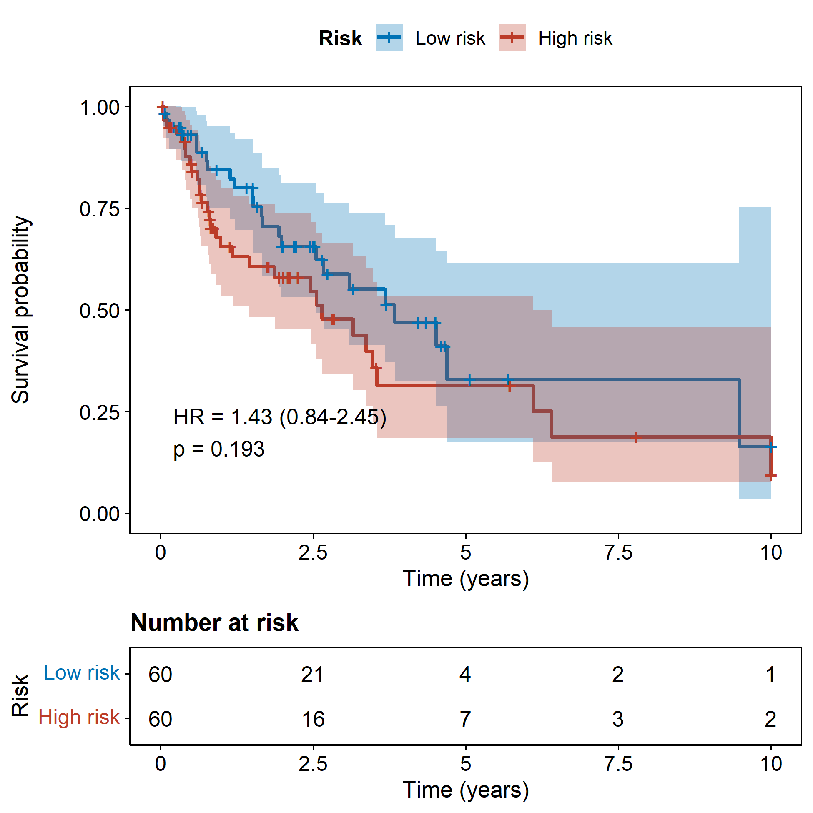

# 057 · TCGA prognostic risk model visualization

Visualization of a prognostic risk signature: risk distribution, survival status, gene heatmap, KM curve, and time-dependent ROC.

| | |
|---|---|
| Language / main dependencies | R · `survival` `survminer` `timeROC` `ComplexHeatmap` |
| Purpose | Complete visualization of a prognostic risk signature |
| Input | `example_data/risk.csv` |
| Output | Tables and figures in `results/`; example figures in `assets/` |

## Input

CSV with required columns: `futime` (follow-up days), `fustat` (0 = alive / 1 = dead), `riskScore`, `risk` (low/high). Remaining numeric columns are treated as risk gene expression.

## Method

Samples are ordered by riskScore to show risk distribution and survival status. A z-score heatmap of risk genes is plotted. KM curves (HR/p) are produced with `survfit` + `coxph`. Time-dependent ROC at 1/3/5 years is computed with `timeROC`.

Method citations: `survminer` (Kassambara); Blanche *et al.*, *Stat Med* 2013 (timeROC).

## Use case

Standard presentation of a TCGA/cohort prognostic signature (derived from Cox/LASSO-Cox), validating the prognostic discrimination of the risk stratification.

## Features

- Runs the five figures from risk.csv; groups samples automatically and skips time points beyond the follow-up period.
- Figures: risk distribution, survival status, heatmap, KM (with risk table), and time-dependent ROC.

## Outputs

| File | Figure type |
|------|------|
| `assets/KM_curve.png` | KM survival curve (HR/p + risk table) |
| `assets/timeROC.png` | Time-dependent ROC at 1/3/5 years |
| `assets/Risk_distribution.png` · `Survival_status.png` · `Risk_heatmap.png` | Risk triptych |




## Usage

```bash
Rscript 057_prognostic_risk_model.R                              # 示例
Rscript 057_prognostic_risk_model.R --input data/risk.csv
```

## Dependencies

```r
install.packages(c("survival","survminer","timeROC","circlize")); BiocManager::install("ComplexHeatmap")
```
