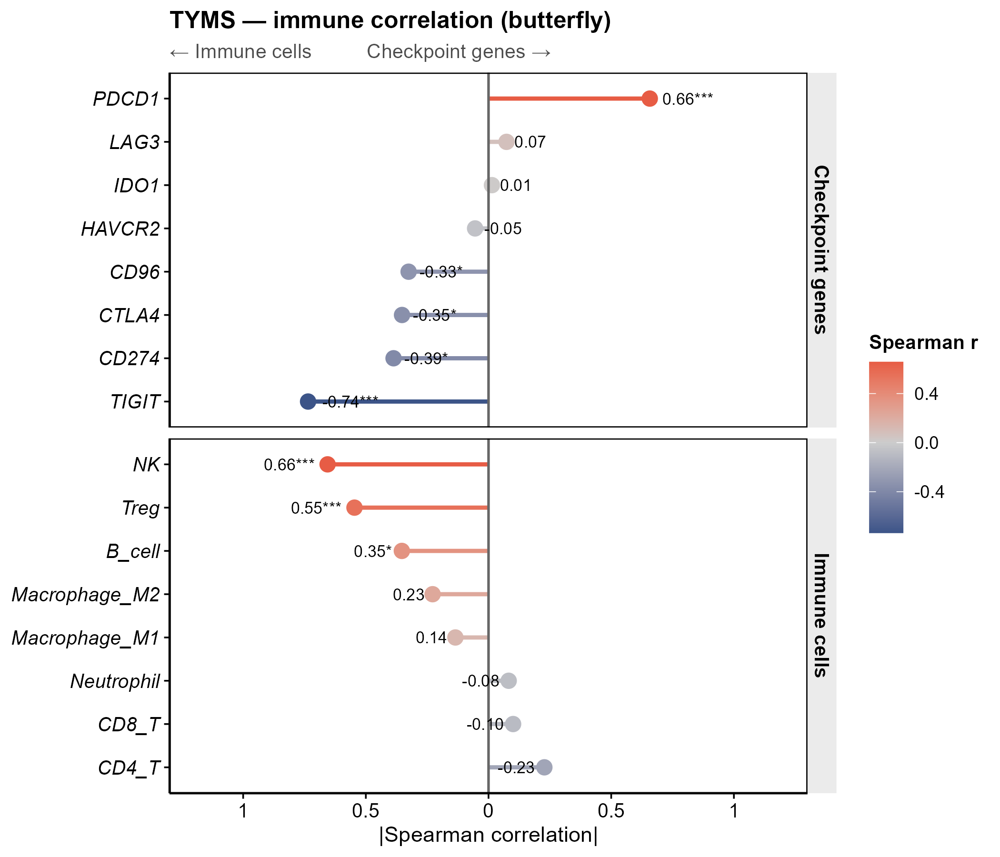

# 060 · Single-gene immune butterfly correlation plot

Correlates a target gene against immune cell fractions and checkpoint genes, and renders a two-sided diverging butterfly plot.

## Input

| File | Description |
|------|-------------|
| `--expr` expression matrix csv | First column is gene (includes the target gene and checkpoint genes) |
| `--immune` immune fraction csv | First column `Sample`, remaining columns are immune cell fractions |
| `--checkpoints` txt | Checkpoint gene list (defaults to a built-in set of common checkpoints) |

Example inputs are in `example_data/` (expression + immune_fraction + checkpoint_genes).

## Method

Spearman correlation of target gene expression against each immune cell fraction and against each checkpoint gene expression. Results are drawn as two-sided diverging bars (butterfly plot), with color indicating correlation direction and labels for r and significance.

## Usage

In tumor immunology, this shows the target gene's association with immune infiltration and with immune checkpoints in a single plot, indicating its immune-regulatory role and potential relationship to ICB.

Implemented in plain ggplot (replacing the original linkET), with no heavy dependencies.

## Outputs

| File | Plot type |
|------|-----------|
| `results/correlation.csv` | Correlation table |
| `assets/Immune_butterfly.png` | Butterfly correlation plot |



## Run

```bash
Rscript 060_immune_butterfly.R                                       # 示例
Rscript 060_immune_butterfly.R --expr data/expr.csv --immune data/immune.csv --gene TP53
```

## Dependencies

```r
install.packages("ggplot2")
```
