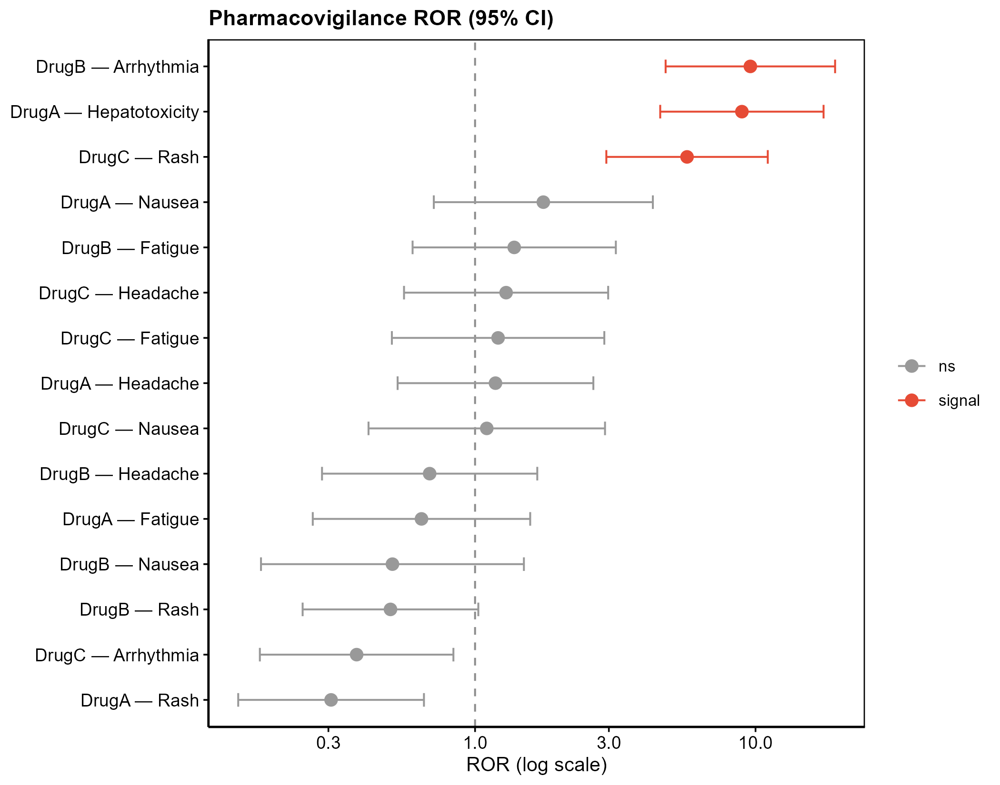

# 078 · FAERS Pharmacovigilance Signal Mining

Disproportionality analysis of drug-adverse event reports using ROR, PRR, BCPNN, and EBGM, with a forest plot and signal heatmap.

| | |
|---|---|
| **Language / main dependency** | R · `ggplot2` |
| **Purpose** | Disproportionality analysis of adverse events to identify drug safety signals |
| **Input** | `example_data/drug_event_cases.csv` |
| **Output** | `results/signals.csv` and `assets/` |

## Input

One of two formats: (1) raw report rows (columns `case_id, drug, event`); (2) precomputed 2x2 counts (columns `drug, event, n11, n10, n01, n00`).

## Method

Build a drug x event 2x2 table and compute ROR (reporting odds ratio), PRR (proportional reporting ratio), BCPNN-IC (information component), and EBGM. A consensus signal is called when ROR025 > 1, PRR >= 2, IC025 > 0, and n11 >= 3.

Method citations: Evans 2001 (PRR); Bate 1998 (BCPNN); standard pharmacovigilance disproportionality analysis.

## Use case

Mining drug-adverse reaction signals from spontaneous reporting databases such as FAERS and JADER, supporting drug safety research and repurposing risk assessment.

## Notes

- Accepts either raw reports or precomputed counts; all four algorithms are computed together.
- Figures: ROR forest plot (95% CI, colored by signal) and drug x event signal heatmap (signals marked with a star).

## Outputs

| File | Type | Description |
|------|------|------|
| `assets/ROR_forest.png` | Forest plot | Top drug-event ROR with CI |
| `assets/Signal_heatmap.png` | Heatmap | log2(ROR), star = consensus signal |



## Usage

```bash
Rscript 078_FAERS_pharmacovigilance.R                              # 示例
Rscript 078_FAERS_pharmacovigilance.R --input data/cases.csv
```

## Dependencies

```r
install.packages("ggplot2")
```
