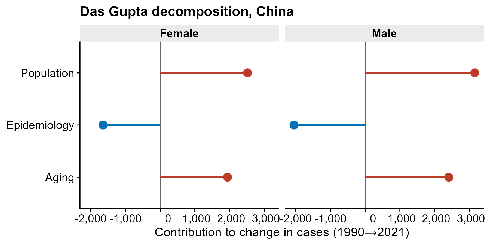

# 527 · GBD disease-burden trend (ASR / EAPC / Das Gupta / SDI)

Turns a GBD long-format export into a standard disease-burden analysis set:
age-standardized rate (ASR) trends, EAPC, age-sex structure, three-factor Das
Gupta decomposition, and the ASR–SDI cross-region gradient.

| | |
|---|---|
| Language / deps | R · `dplyr` `ggplot2` (+ framework `theme_pub.R`); all base-installed |
| Purpose | Describe and decompose disease burden over time and across regions |
| Input | `example_data/burden.csv` + `pop.csv` (+ `sdi.csv`); synthetic on first run |
| Output | `results/` (EAPC, decomposition tables) + 5 figures in `assets/` |

## Input

| File | Spec |
|------|------|
| `burden.csv` | GBD long table: `measure_name, location_name, sex_name, age_name, metric_name, year, val, upper, lower` (+`sdi`). `age_name` holds the 20 GBD bands plus `Age-standardized` and `All ages`; `metric_name` ∈ `Rate`/`Number`. |
| `pop.csv` | population by `location_name, sex_name, year, age_name, val` (needed for decomposition). |
| `sdi.csv` | `location_name, year, sdi`. |

Example data is synthetic (12 regions, 2 sexes, 1990–2021, 20 age bands); generated on first run. Run on your own GBD download with `--burden`/`--pop`.

## Method

1. **ASR trend** — read `Age-standardized` `Rate` rows; line + 95% UI ribbon by sex.
2. **EAPC** — `100·(exp(β)−1)` from `lm(log(ASR) ~ year)`, 95% CI from `confint()` (log-linear; see note).
3. **Age-sex structure** — incident cases by age band for the latest year as a back-to-back lollipop (not a bar pyramid).
4. **Das Gupta decomposition** — the three-factor formula (Aging / Population growth / Epidemiological change) **copied verbatim** from `99_external_sources/R-script-for-GBD/decomposition.R`; the script asserts `sum(effects) == observed case change`.
5. **ASR–SDI** — scatter across regions + LOESS + Spearman `cor.test`.

## Grounding & honesty

Adapted from the real cloned tools in `modules/21_disease_burden_gbd/99_external_sources/` (`R-script-for-GBD/*`, `GBD2021/*`). **Not** reproduced because they need external/heavy tooling: **Joinpoint** (external NCI program → replaced by log-linear EAPC), **BAPC projection** (needs INLA → omitted). ASR is obtained by direct standardization of age-specific rates here. Associations are descriptive, not causal.

## Output figures

`assets/`: `asr_trend`, `eapc_forest`, `agesex_lollipop`, `decomposition_lollipop`, `asr_sdi_scatter` (vector PDF + 300-dpi PNG each). No bar charts.



## Run

```bash
Rscript 527_gbd_burden_trend.R
Rscript 527_gbd_burden_trend.R --burden my_burden.csv --pop my_pop.csv
```
