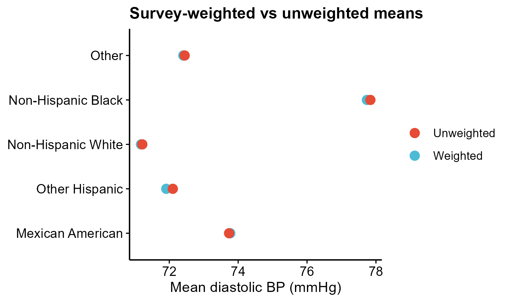

# 528 · NHANES complex-survey weighted analysis

Survey-design-correct estimation for NHANES-style data: weighted descriptives,
weighted regression, and weighted prevalence, using the `survey` package exactly
as the nhanesA `UsingSurveyWeights` vignette does.

| | |
|---|---|
| Language / deps | R · `survey` `dplyr` `ggplot2` (+ `theme_pub.R`); all installed |
| Purpose | Design-based weighted estimation & association for cross-sectional survey data |
| Input | `example_data/nhanes.csv`; synthetic on first run |
| Output | `results/` (svyglm coefficients, weighted prevalence) + 3 figures in `assets/` |

## Input

`nhanes.csv` — one row per respondent:

| Column | Meaning |
|--------|---------|
| `SEQN` | respondent id (merge key across NHANES tables) |
| `SDMVSTRA` | masked variance pseudo-stratum (`strata=`) |
| `SDMVPSU` | masked variance pseudo-PSU (`id=`; unique only within stratum → `nest=TRUE`) |
| `WTMEC2YR` | 2-year MEC examination weight (`weights=`; use `WTINT2YR` for interview-only vars) |
| `RIDAGEYR` | age (continuous / subset filter) |
| `RIAGENDR` | sex (Male/Female) |
| `RIDRETH1` | race-ethnicity (5-level factor) |
| `BPXDI1` | continuous outcome (diastolic BP); `HTN` is a 0/1 outcome |

Example data is synthetic (4000 respondents, minorities over-sampled so weighted ≠ unweighted).

## Method

1. `svydesign(id=~SDMVPSU, strata=~SDMVSTRA, weights=~WTMEC2YR, nest=TRUE)` on the **full** data, then `subset()` the design (age ≥ 20) — never filter rows first.
2. Weighted means by subgroup with `svyby(~BPXDI1, ~RIDRETH1, svymean)` → weighted-vs-unweighted **dumbbell**.
3. Design-adjusted regression `svyglm(BPXDI1 ~ age + sex + ethnicity)` → coefficient **forest**.
4. Weighted prevalence of a 0/1 outcome via `svymean` → subgroup **lollipop** with 95% CI.
`options(survey.lonely.psu="adjust")` guards single-PSU strata.

## Grounding & honesty

Survey calls adapted verbatim from `99_external_sources/nhanes/vignettes/UsingSurveyWeights.{rmd,R}` and the `nhanes()` data contract in `nhanes/R/nhanes.R`. Build the design **before** subsetting; include weights + strata + PSU or SEs are wrong; match the weight to the variable source. `svyglm` coefficients are **cross-sectional associations, not causal effects**.

## Output figures

`assets/`: `weighted_vs_unweighted_dumbbell`, `svyglm_forest`, `weighted_prevalence_lollipop`. No bar charts.



## Run

```bash
Rscript 528_nhanes_survey_weighted.R
Rscript 528_nhanes_survey_weighted.R --input my_nhanes.csv
```
