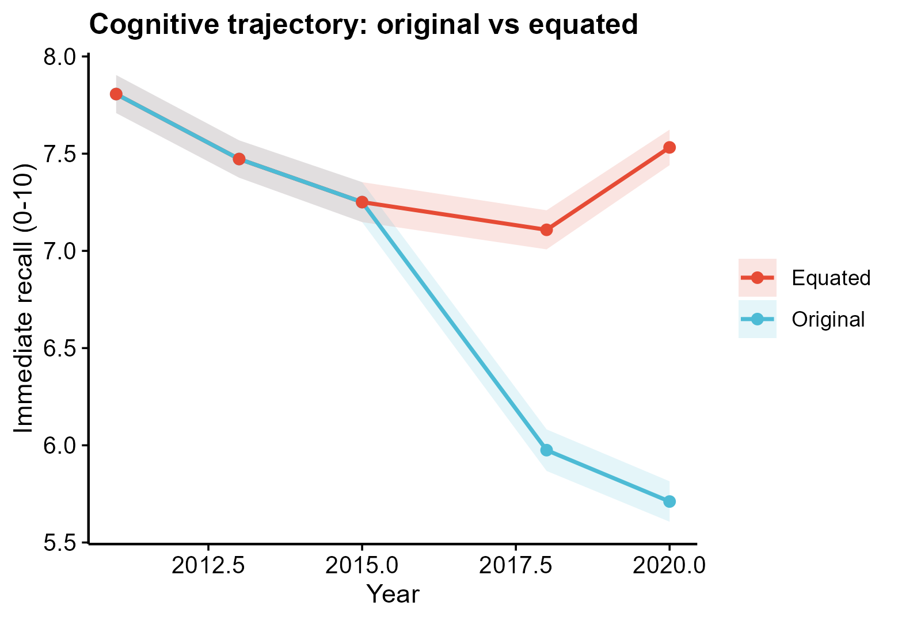

# 529 · CHARLS longitudinal cohort (trend / equating / mixed model / survival)

Standard outputs for a CHARLS-style repeated-measures cohort: wave-stratified
description, longitudinal trend, cross-wave **equipercentile equating**, a linear
mixed model, and an incident-event Cox/KM analysis.

| | |
|---|---|
| Language / deps | R · `dplyr` `tidyr` `ggplot2` `survival` `lme4` (+ `theme_pub.R`); all installed |
| Purpose | Describe, harmonise, model, and survival-analyse a multi-wave cohort |
| Input | `example_data/panel.csv` (+ `survival.csv`); synthetic on first run |
| Output | `results/` (Table 1, crosswalk, LMM, Cox) + 5 figures in `assets/` |

## Input

`panel.csv` — long, one row per person-wave:

| Column | Meaning |
|--------|---------|
| `ID` | participant id (stable across waves) |
| `wave`, `year` | wave index / calendar year |
| `age`, `female`, `edu`, `rural` | covariates |
| `mm0` | baseline chronic-condition count |
| `score` | repeated outcome (immediate recall 0–10) |
| `wtresp` | individual sampling weight |

`survival.csv` adds `time`, `event` (incident CVD), `mm_group`. Example data is synthetic (1200 participants × 5 waves) with a deliberate 2018/2020 test-difficulty drift so equating has work to do.

## Method

1. **Table 1** by wave (`dplyr` summarise).
2. **Equipercentile equating** — crosswalk later-wave scores onto the 2015 reference scale via **weighted-ECDF percentile-rank → inverse weighted-quantile**, top/bottom-coded to the valid range.
3. **Longitudinal trend** — per-wave mean ± 95% CI, original vs equated.
4. **Concordance curve** of the crosswalk.
5. **Score distribution** by wave (violin + box + jitter, raincloud-style).
6. **Linear mixed model** `lmer(score ~ year + age + female + edu + (1|ID))` → fixed-effect forest.
7. **Survival** — `coxph(Surv(time,event) ~ baseline multimorbidity)` + KM by group.

## Grounding & honesty

Adapted from `99_external_sources/charls_memory_equating/scripts/*.R`. The `equate` package is **not installed**, so equipercentile equating is reimplemented from the standard weighted-ECDF inversion (an equivalent, fully base-R method). The `grip-strength…ipd` repo ships **only** `00_setup_paths.R` — its Cox/multistate/joint scripts are not on disk, so they are used as method vocabulary only; the Cox/KM here use base `survival`. Associations are not causal; the CHARLS file carries individual weights only (no strata/PSU), so design-based SEs would be approximate.

## Output figures

`assets/`: `trend_original_vs_equated`, `equipercentile_concordance`, `score_distribution_violin`, `lmer_forest`, `km_incident_cvd`. No bar charts.



## Run

```bash
Rscript 529_charls_longitudinal_cohort.R
Rscript 529_charls_longitudinal_cohort.R --input my_panel.csv
```
