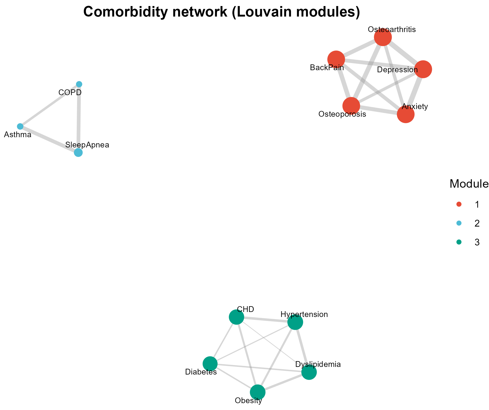

# 530 · Comorbidity network (association → igraph → Louvain)

Builds a disease-pair comorbidity network from a per-patient disease table:
2×2 co-occurrence association, an `igraph` network, Louvain community detection,
and centrality — with an association heatmap and hub ranking.

| | |
|---|---|
| Language / deps | R · `igraph` `ggraph` `dplyr` `ggplot2` (+ `theme_pub.R`); all installed |
| Purpose | Find disease modules and hubs from co-occurrence data |
| Input | `example_data/patients.csv`; synthetic on first run |
| Output | `results/` (pairwise association, node metrics) + 3 figures in `assets/` |

## Input

`patients.csv` — two columns, one row per patient–disease:

| Column | Meaning |
|--------|---------|
| `patient_id` | subject id (a patient contributes one row per condition) |
| `disease` | condition label (ICD chapter / named condition) |

Example data is synthetic (2500 patients; 13 conditions in 3 latent comorbidity clusters).

## Method

1. Build the patient × disease 0/1 matrix.
2. For each disease pair form the 2×2 table and compute **phi**, **odds ratio** (Haldane 0.5 correction for zero cells), **Jaccard**, and a Fisher p-value; BH-adjust across pairs.
3. Build the `igraph` network from positive, significant edges (`OR>1 & padj<0.05`, weight `log2(OR)`), following the real `graph_from_adjacency_matrix`/`delete_edges`/`decompose` pattern in `sample_code.R`.
4. **Louvain** community detection (undirected, non-negative weights) + degree/strength/betweenness.
5. Figures: network (`ggraph` FR layout, nodes by module), log2(OR) association heatmap (diverging, centred at OR=1), weighted-degree hub lollipop.

## Grounding & honesty

`igraph` construction adapted from `99_external_sources/comorbidity_networks/sample_code.R` and `CSB-IG_Comorbidity_Networks/Jaccard.R`. Honesty notes: associations are **not causal**; a directed OR network must be symmetrised before Louvain and weights must be non-negative; the `OR>1` filter drops protective associations, so phi (symmetric) is reported alongside; zero cells use Haldane correction; the FR layout seed is pinned for reproducibility. `arules`/`comorbidity`/`epitools` are not needed — phi/OR/RR/Jaccard are computed from the 2×2 in base R.

## Output figures

`assets/`: `comorbidity_network`, `association_heatmap`, `hub_lollipop`. No bar charts.



## Run

```bash
Rscript 530_comorbidity_network.R
Rscript 530_comorbidity_network.R --input my_patients.csv
```
