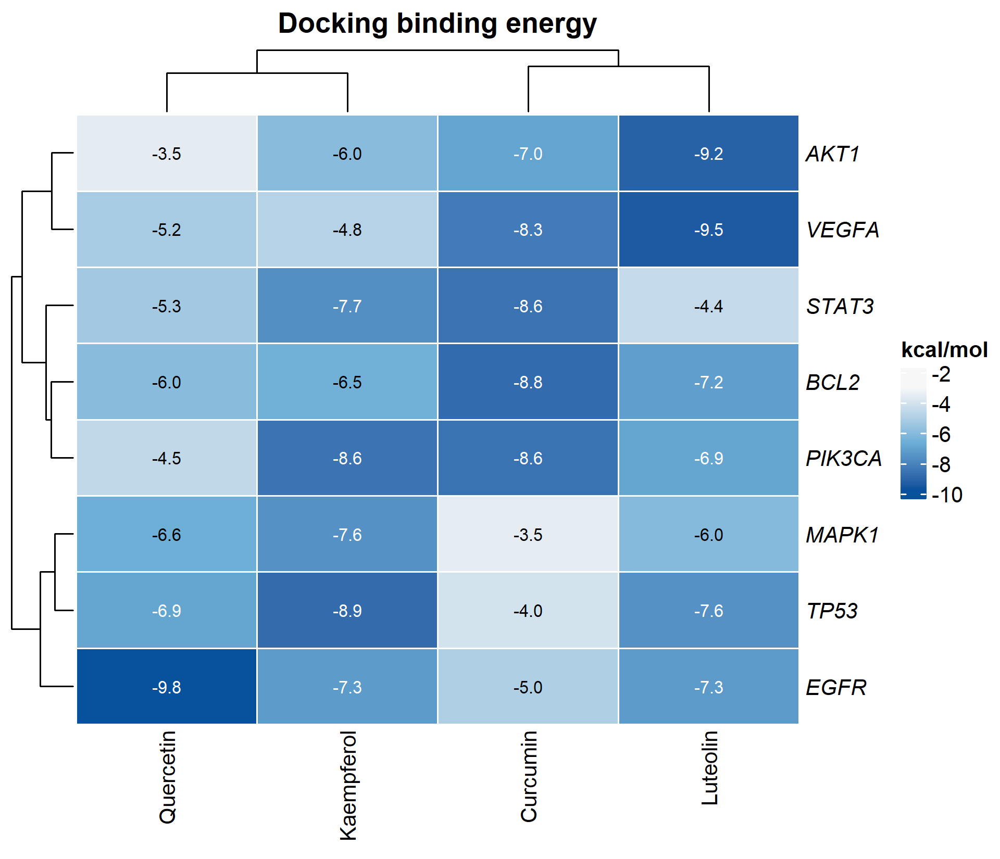

# 022 · Docking binding-energy visualization

Visualizes a compound-by-target docking binding-energy matrix as a clustered heatmap and a per-target strongest-binding ranking plot.

## Summary

| | |
|---|---|
| Language / main dependencies | R · `ComplexHeatmap` `ggplot2` |
| Purpose | Matrix heatmap and ranking visualization of docking binding energies |
| Input | `example_data/binding_energy.csv` |
| Output | Tables and figures in `results/`; example figures in `assets/` |

## Input

CSV with the first column `Target` (target name) and remaining columns holding the docking binding energy of each compound (kcal/mol; more negative means stronger binding). A single compound requires only one such column.

## Method

The binding-energy matrix is rendered as a ComplexHeatmap clustered heatmap (blue-to-white gradient, values annotated). For each target, the strongest-binding compound is selected and shown in a ranking bubble plot.

## Use

Network pharmacology and docking validation: compare the affinity of multiple compounds across multiple targets and identify strong compound-target pairs (binding energy < -7 kcal/mol is generally considered good binding).

## Outputs

| File | Plot type | Description |
|------|------|------|
| `assets/Binding_heatmap.png` | Heatmap | Compound-by-target binding energy |
| `assets/Binding_bubble.png` | Bubble / lollipop | Strongest binding per target |



## Usage

```bash
Rscript 022_docking_binding_energy.R                              # 示例
Rscript 022_docking_binding_energy.R --input data/binding_energy.csv
```

## Dependencies

```r
install.packages(c("ggplot2","circlize")); BiocManager::install("ComplexHeatmap")
```
