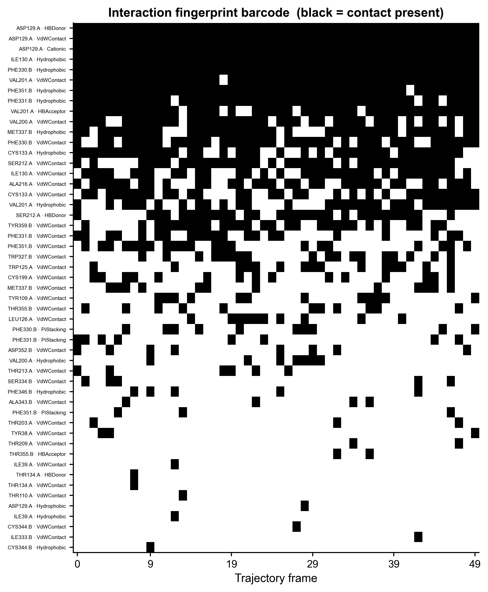
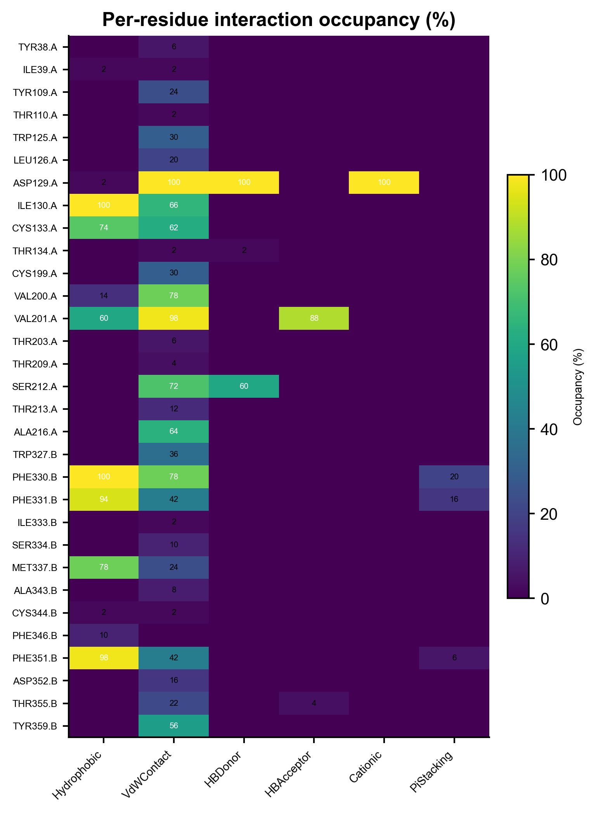
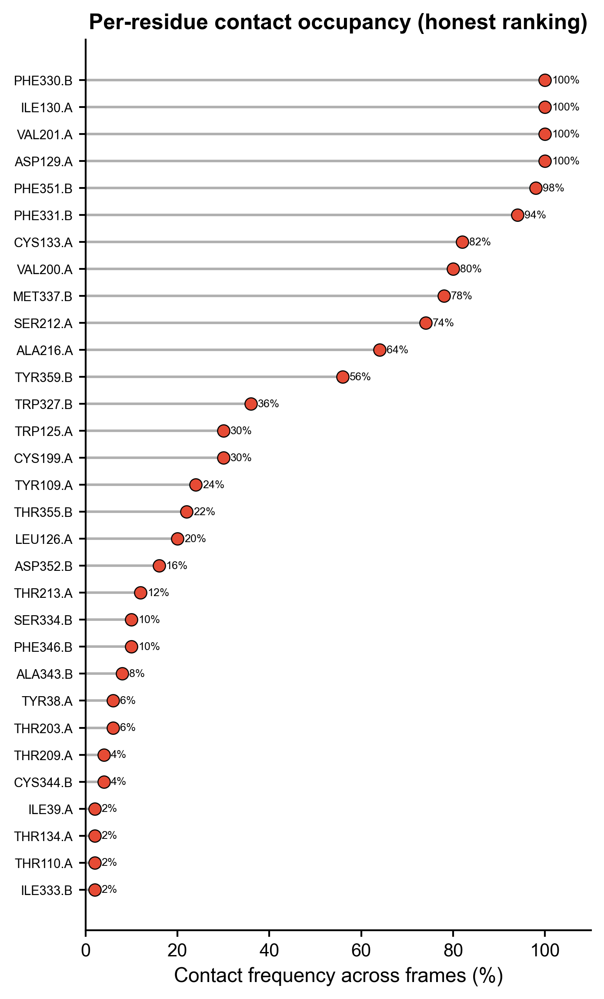

# 547 · ProLIF 蛋白-配体相互作用指纹 (Interaction Fingerprint)

把对接 / MD 的结合 pose 解码成「残基 × 相互作用类型」的指纹(IFP），逐帧客观检测
氢键、疏水、盐桥、π-堆叠、范德华等接触，量化每个口袋残基的**占据率**——定量回答
"配体到底稳定抓住了哪些关键残基"，替代主观挑残基讲故事。

| | |
|---|---|
| 语言 / 依赖 | Python · `prolif` 2.2 `MDAnalysis` 2.10 `rdkit`(+ 共享 `_framework/pubstyle.py`) |
| 输入 | 默认 prolif 自带真实复合物 demo；`--top/--traj` 换自己的体系 |
| 输出 | `results/` 指纹与占据率表；`assets/` barcode / heatmap / lollipop |
| 诚实基线 | 逐帧客观占据率%（高=稳定接触，低=偶发噪声），不主观钦点关键残基 |

## ① 输入数据

| 项 | 规格 |
|---|---|
| `--top` | 拓扑文件（`.pdb/.gro/.psf/.prmtop` 等，MDAnalysis 可读）。省略 = 用 prolif 官方打包的真实蛋白-配体 MD 复合物 |
| `--traj` | 轨迹文件（`.xtc/.dcd/.trr` 等）。省略且给 `--top` = 当作**单帧 pose**（对接结果常见） |
| `--ligand` | 配体的 MDAnalysis 选择语句，默认 `"resname LIG"` |
| `--protein` | 蛋白选择语句，默认 `"protein"` |
| `--frames` | 最多分析前 N 帧（demo 加速），默认 50 |

样例（demo 数据自带，无需准备）：prolif 打包的一个 79 原子配体（`resname LIG`）+
4988 原子蛋白的 250 帧 MD 轨迹，是一个真实的丝氨酸蛋白酶-抑制剂类复合物，含盐桥、
氢键、疏水、π 相互作用，演示完整。

## ② 方法 / 原理

1. **读体系**：`MDAnalysis.Universe(top, traj)` 载入轨迹，按选择语句切出配体 / 蛋白。
2. **算指纹**：`prolif.Fingerprint()` → `fp.run(traj_slice, lig, prot)` 逐帧、逐残基
   检测一组标准相互作用（Hydrophobic / VdWContact / HBDonor / HBAcceptor / Cationic /
   Anionic / PiStacking / CationPi …），`fp.to_dataframe()` 返回
   行=帧、列=三级 `(ligand, protein, interaction)` 的布尔矩阵。
3. **诚实占据率（基线）**：对每个 `(残基, 相互作用)` 列在所有帧上取均值×100 = 占据率%；
   再用 OR 折叠每残基的多种相互作用，得该残基的整体接触频率%，作为**客观排序**依据。
4. **绘图**：barcode（帧×接触栅格，看接触是否持续）、heatmap（残基×相互作用占据率）、
   lollipop（每残基接触频率排序）。

引用：Bouysset & Fiorucci, *J. Cheminform.* 2021, *ProLIF: a library to encode
molecular interactions as fingerprints*；MDAnalysis（Michaud-Agrawal 2011 / Gowers 2016）。

## ③ 用途

- 对接 / MD **结合模式解读**：哪些残基贡献了稳定接触、什么类型（氢键 vs 疏水 vs 盐桥）。
- **多 pose / 多配体对比**：同一口袋不同配体的指纹差异 → SAR 解释、先导优化方向。
- **MD 轨迹接触稳定性**：占据率区分"全程锚定的关键残基"与"偶发瞬态接触"。
- 给计算化学论文出**可发表的相互作用图**（IFP barcode / 占据率 heatmap），替代单张
  2D 配体图的定性描述。

## ④ 特点 / 亮点

- **Turnkey**：零参数即跑——内置 prolif 官方**真实复合物**轨迹，不自造假 PDB。
- **诚实基线内建**：占据率%由数据逐帧客观给出，不挑残基讲好故事；单帧时占据率即 0/100，
  多帧时反映真实稳定性。
- **非条形图**：barcode 栅格 + 占据率 heatmap + lollipop（顶刊风格，弃平凡 bar）。
- **复用真实 API**：`prolif 2.2.0` 实测核对（`Fingerprint().run().to_dataframe()`），
  非臆造；矢量 PDF + 300dpi PNG 双出。

## ⑤ 输出结果图

| 文件 | 类型 | 说明 |
|------|------|------|
| `results/fingerprint_per_frame.csv` | 表 | 原始指纹：帧 × (残基\|相互作用) 布尔矩阵 |
| `results/occupancy_by_residue_interaction.csv` | 表 | 每 (残基, 相互作用) 的占据率% |
| `results/contact_freq_per_residue.csv` | 表 | 每残基整体接触频率%（诚实排序） |
| `results/versions.txt` | 表 | 各包版本 + 分析帧数 + seed |
| `assets/547_barcode.png` | barcode | 帧 × 接触栅格（黑=该帧存在接触），看持续性 |
| `assets/547_heatmap_occupancy.png` | heatmap | 残基 × 相互作用类型，格值=占据率% |
| `assets/547_lollipop_contact_freq.png` | lollipop | 每残基接触频率排序（非条形） |







## 运行

```bash
# Turnkey（默认 prolif 自带真实 demo 复合物）
python 547_prolif_interaction_fingerprint.py

# 换自己的 MD 体系
python 547_prolif_interaction_fingerprint.py --top my.pdb --traj my.xtc \
       --ligand "resname LIG" --protein "protein" --frames 100

# 单帧对接 pose（只给拓扑，不给轨迹）
python 547_prolif_interaction_fingerprint.py --top complex.pdb --ligand "resname UNL"
```

## 依赖安装

```bash
pip install prolif MDAnalysis rdkit
```
