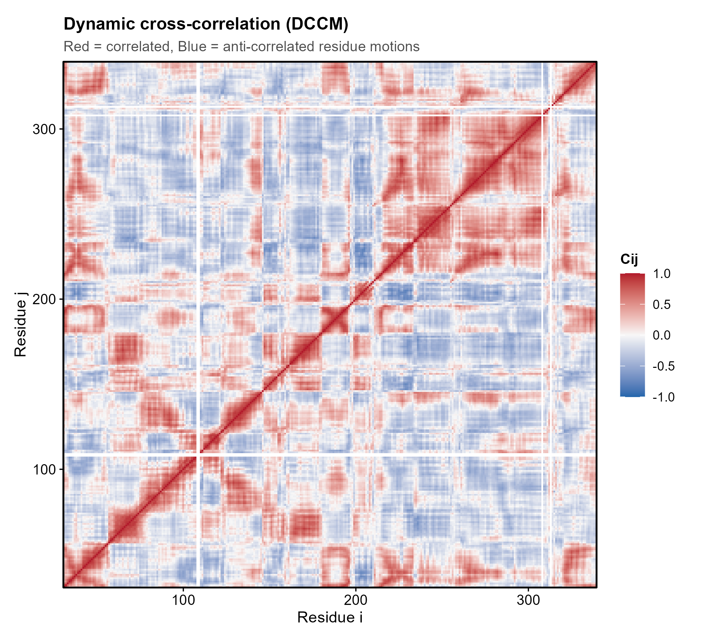
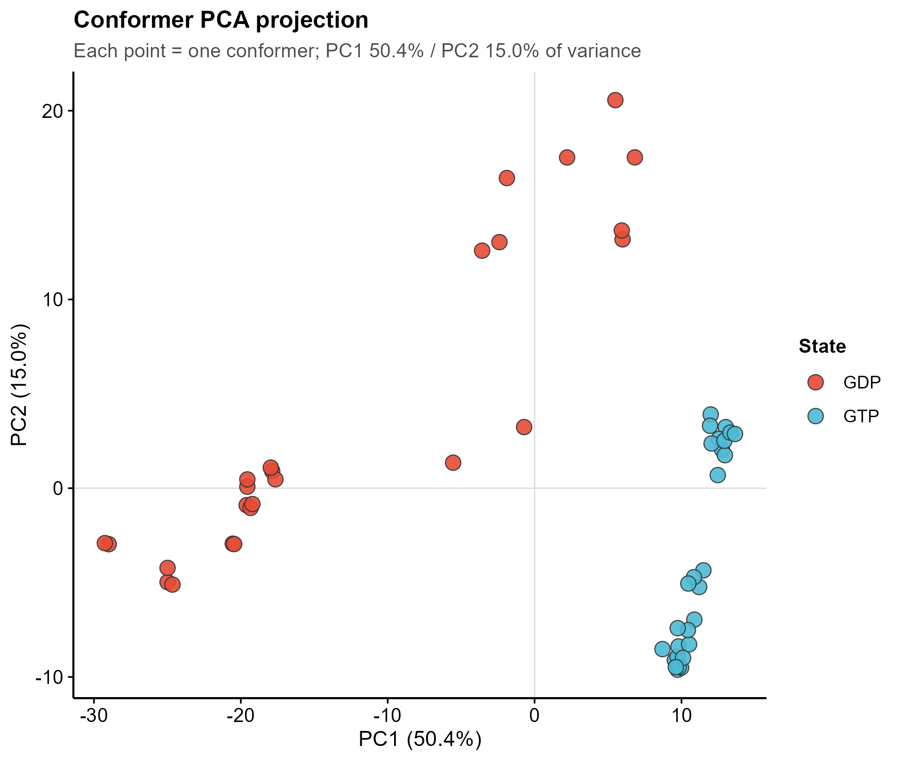
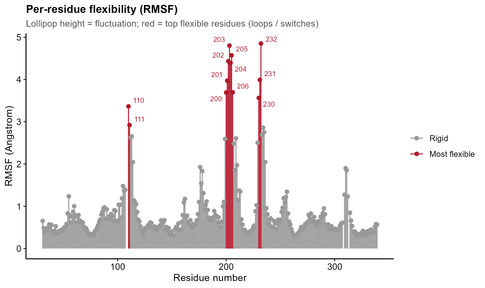
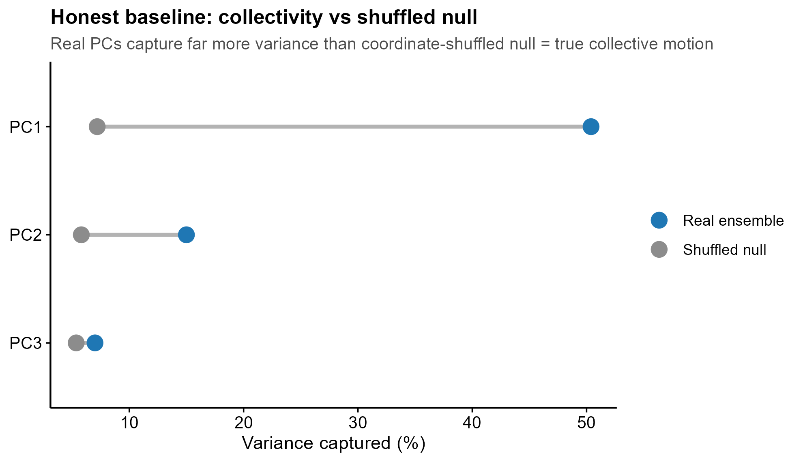

<!-- 图中文字英文,正文中文。 -->

# 548 · bio3d 结构系综 / MD 轨迹分析 — DCCM + PCA + RMSF

> 一句话定位:**输入**一组蛋白构象(内置晶体系综 / 单 PDB / MD 轨迹)→ 用 bio3d 做
> **PCA 集体运动 + DCCM 动态互相关 + RMSF 逐残基柔性**(并带集体性零模型诚实基线)→
> **出** 5 张顶刊级矢量图。

| | |
|---|---|
| **语言 / 主依赖** | R · `bio3d` `ggplot2`(`ggrepel` 可选;`_framework/theme_pub.R`) |
| **一句话用途** | 对接 / MD 下游高级动力学分析:提取集体运动、关联运动域、柔性热点 |
| **输入** | 默认 = bio3d 内置 `transducin` 晶体系综(零下载);或 `--pdb` 单结构;或 `--traj`+`--topol` MD 轨迹 |
| **输出** | `results/`(CSV + sessionInfo,运行生成) · 展示图见 `assets/` |

---

## ① 输入数据

三条入口,均落到统一的 `(xyz_fit, resno, dccm)` 结构,下游一视同仁。**默认入口 A 零下载即跑。**

| 入口 | 触发参数 | 输入规格 | 系综来源 | DCCM 来源 |
|------|----------|----------|----------|-----------|
| **A(默认)** | 无 | bio3d 内置 `data(transducin)` | 53 个 Gα 晶体结构(GDP/GTP 两态),305 残基(Cα) | 系综坐标协方差 |
| **B** | `--pdb my.pdb` | 单结构 PDB(任意蛋白) | 弹性网络 NMA 模式 7-9 造系综 | NMA 模式协方差 |
| **C** | `--traj t.dcd --topol ref.pdb` | MD 轨迹(`.dcd`/`.nc`)+ 拓扑 PDB | 轨迹帧叠合(`fit.xyz` 对 Cα) | 轨迹协方差 |

**命名/格式约定**:入口 C 的轨迹与拓扑须为同一体系(原子数一致);叠合基于 Cα(`atom.select(..., "calpha")`)。无其它命名约束。

**样例(入口 A,无需文件)**:直接 `Rscript 548_bio3d_md_dccm_pca.R` 即用内置 transducin(`synthetic/built-in, for demo only`)。

## ② 方法 / 原理

三个互补的描述性视角(PCA=方向,DCCM=耦合,RMSF=幅度):

1. **PCA**(`bio3d::pca.xyz`)— 对叠合后的构象坐标做主成分分析,提取主导构象空间的集体运动;PC1/PC2 投影把构象按功能态分群。
2. **DCCM**(`bio3d::dccm`)— 残基对 Cα 位移的归一化协方差(Cij ∈ [-1,1]);红=关联运动、蓝=反关联,揭示协同的结构域。
3. **RMSF**(`bio3d::rmsf`)— 逐残基均方根涨落,定位柔性 loop / 末端 / 别构开关。

**★诚实基线(描述性,非 p 值)**:把每个坐标列**独立随机重排**(打散残基间协方差)构成"集体性零模型",重排 `N_NULL=15` 次重做 PCA。若真实系综前几个 PC 的方差占比**远高于**零模型,则观察到的是**真集体运动**而非独立残基噪声 / 采样假象。本基线产出 `baseline_collectivity.csv` 与图 5 的 real-vs-null dumbbell 对照。
> DCCM/PCA/RMSF 本身不产生统计检验,结论是「揭示 / 定位」而非「证明因果」。

核心方法引用:Grant et al., *Bioinformatics* 2006(bio3d);Hayward & de Groot, *Methods Mol Biol* 2008(PCA/DCCM 于蛋白动力学)。

## ③ 用途

- 对接 / MD 后:回答"哪些结构域协同运动、哪段最柔、最大集体运动是否对应功能态切换"。
- 别构机制探查:DCCM 反关联块 = 候选别构通路;RMSF 热点 = 开关 / 铰链。
- 系综构象空间可视化:PCA 投影按状态(如配体结合态)分群。
- 典型场景:GPCR/G 蛋白、激酶、转运体的构象转换分析;晶体系综或 ns–μs MD 快照。

## ④ 特点 / 亮点

- **turnkey**:一条命令即跑(内置 transducin,零下载);换 `--pdb` / `--traj` 即用自有数据。
- **三入口统一**:晶体系综 / 单结构 NMA / MD 轨迹,落到同一下游,代码一致。
- **★诚实基线**:集体性零模型(逐坐标重排)对照,真实 PC1 ≈ 50% vs 零模型 ≈ 7%(**7.0×**),证明非噪声。
- **顶刊级矢量图**:无平凡条形图——DCCM heatmap / PCA scatter / PC1 porcupine / RMSF lollipop / baseline dumbbell;`save_fig()` 一次出 PDF+PNG。
- 固定种子 `set.seed(42)`,相对路径,落盘 `sessionInfo.txt` 锁依赖。

## ⑤ 输出结果图

| 文件 | 图型 | 说明 |
|------|------|------|
| `assets/fig1_dccm_heatmap.png` | 发散热图(RdBu) | 残基×残基动态互相关 Cij;红=关联、蓝=反关联运动域 |
| `assets/fig2_pca_projection.png` | 散点 | 构象在 PC1-PC2 平面,按状态(GDP/GTP)着色;PC1 分离功能态 |
| `assets/fig3_pc1_porcupine.png` | porcupine 矢量场 | 沿主链画 PC1 每残基集体位移方向(viridis 编码幅度) |
| `assets/fig4_rmsf_lollipop.png` | lollipop | 逐残基柔性;红=最柔残基(loops / switches),ggrepel 标注 |
| `assets/fig5_baseline_collectivity.png` | dumbbell | ★诚实基线:真实系综 vs 集体性零模型逐 PC 方差占比 |

CSV 输出:`PCA_variance.csv`、`DCCM_matrix.csv`、`RMSF_per_residue.csv`、`baseline_collectivity.csv`。






---

## 运行

```bash
# 零改动跑示例(内置 transducin 晶体系综)
Rscript 548_bio3d_md_dccm_pca.R

# 单 PDB → 弹性网络 NMA 驱动 DCCM/系综
Rscript 548_bio3d_md_dccm_pca.R --pdb my.pdb

# 真实 MD 轨迹(dcd/nc + 拓扑 pdb)
Rscript 548_bio3d_md_dccm_pca.R --traj traj.dcd --topol ref.pdb

# 可调参数:--n_pc 展示主成分数 · --n_top_flex RMSF 标注的最柔残基数 · --outdir 输出目录
```

## 依赖安装

```r
install.packages(c("bio3d", "ggplot2", "ggrepel"))   # ggrepel 可选(用于 RMSF 残基标注)
```
