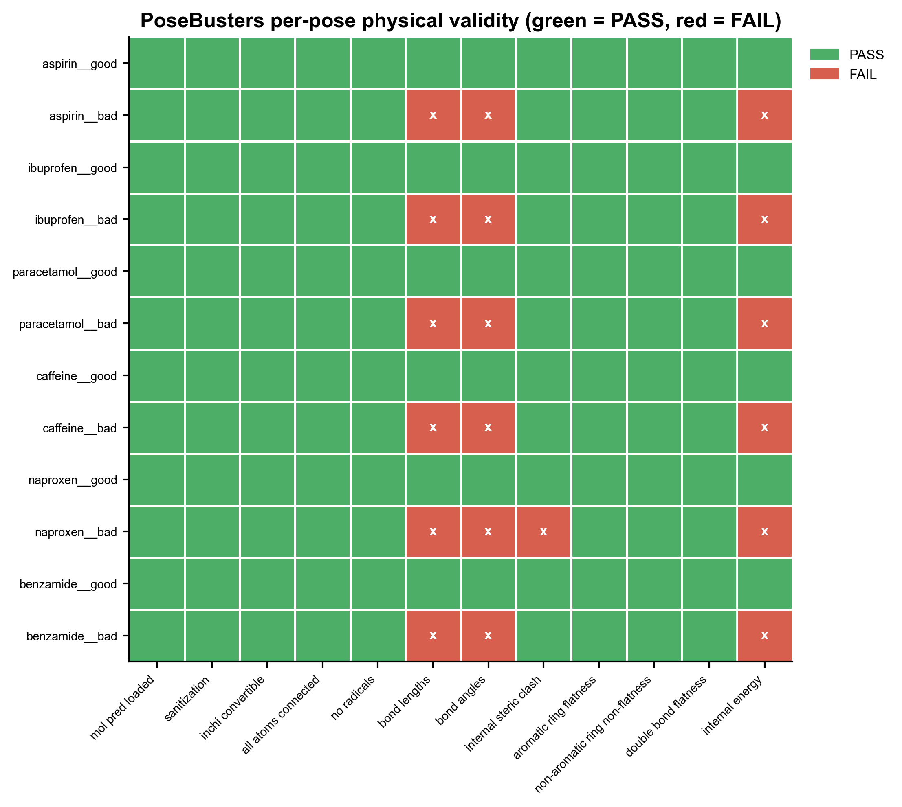
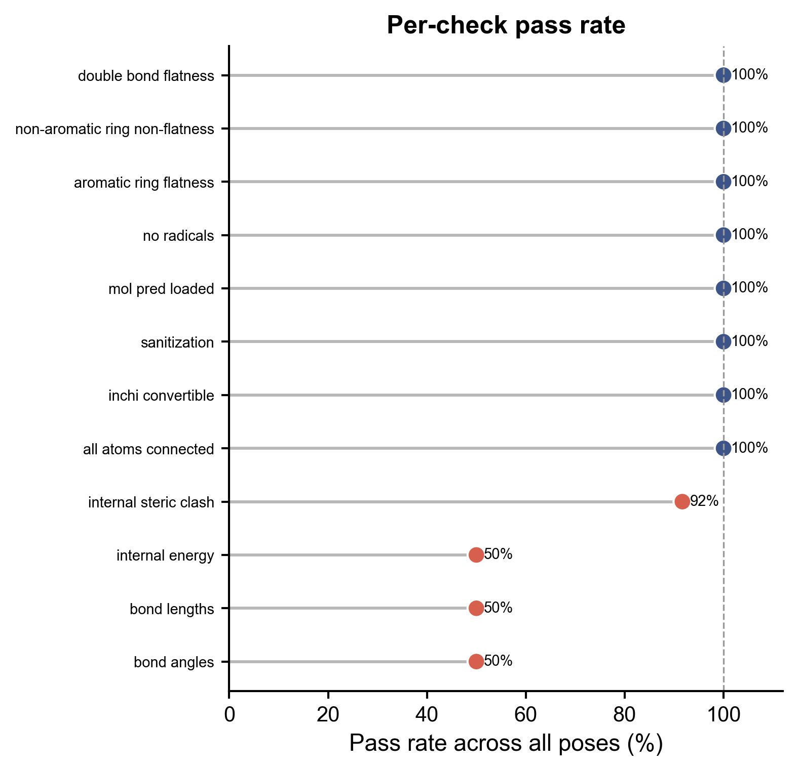
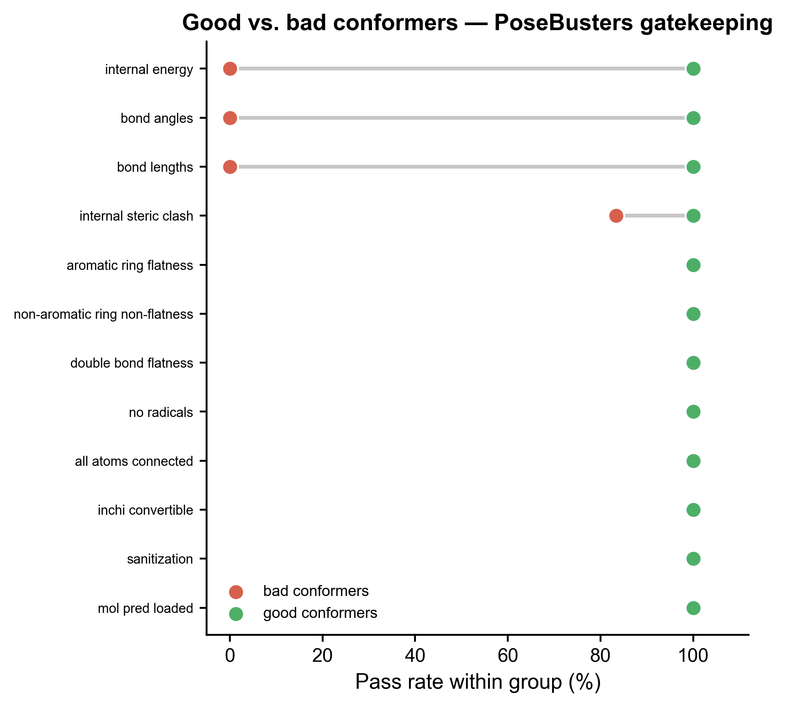

# 556 · PoseBusters 对接 pose 物理有效性面板 (PoseBusters validity panel)

对一批对接 / AI 生成的小分子 3D pose 做"物理体检":键长、键角、内部位阻冲突、芳环/双键平面性、内能等 ~12 项逐 pose 给 PASS/FAIL，并汇总 **PB-valid 整体通过率**。守门思路对齐领域铁律——DiffDock 等 DL pose 生成器打分再高，**过不了 PoseBusters 物理体检就不能信**。

| | |
|---|---|
| 语言 / 依赖 | Python · `posebusters` `rdkit` `pandas` (+ 共享 `_framework/pubstyle.py`) |
| 输入 | `--input poses.sdf`（多构象，每构象一个 pose）；缺省自动合成 |
| 输出 | `results/` 检查表 + 通过率 + 环境快照；`assets/` 三张图 |
| 诚实基线 | 直接报每项通过率%；好 vs 坏构象对照证明坏 pose 被抓出 |

## ① 输入数据

一个**多构象 SDF**，每个 3D 构象当作一个待检 pose。无表头字段要求；脚本会读取可选属性 `pose_id`（标识）与 `expected`（`valid`/`invalid`，用于好/坏对照，缺省记 `unknown`）。

| 规格 | 说明 |
|---|---|
| 格式 | `.sdf`（含 3D 坐标，建议含 H） |
| 每条记录 | 一个 pose（一个构象） |
| 可选属性 | `pose_id`、`expected` |

**样例（合成示例 `example_data/demo_poses.sdf`）**：6 个常见药物骨架（aspirin / ibuprofen / paracetamol / caffeine / naproxen / benzamide），每个生成 1 个 RDKit `MMFF` 优化的**好构象** + 1 个故意破坏的**坏构象**（把相邻两原子坐标设为重合制造位阻冲突 / 键长塌缩，再把另一原子平移 5 Å 制造异常长键），共 12 个 pose。首次运行自动生成。

## ② 方法 / 原理

1. **读 pose** — RDKit `SDMolSupplier` 读多构象 SDF（`removeHs=False`）。
2. **物理体检** — `posebusters.PoseBusters(config="mol")`，对每个分子调用
   `bust.bust([mol_pred], None, None)` 返回逐项布尔检查（"mol" 模式无需蛋白口袋 / 参考晶体结构，纯单分子几何/能量体检）。检查项含 `bond_lengths`、`bond_angles`、`internal_steric_clash`、`aromatic_ring_flatness`、`double_bond_flatness`、`internal_energy` 等。
3. **守门从严** — 无法评估（NaN）的检查按 **FAIL** 记，避免把"测不了"当通过。
4. **汇总** — 逐 pose"全部检查都过"= PB-valid；统计整体通过率 + 每项通过率 + 好/坏分组通过率。

> 引用：Buttenschoen et al., *PoseBusters: AI-based docking methods fail to generate physically valid poses or generalise to novel sequences.* **Chem. Sci.** 2024, 15, 3130. PoseBusters 0.6.5 / RDKit 实测 API。

## ③ 用途

- 对接软件（AutoDock Vina / Glide / GNINA）或 DL 生成器（DiffDock / EquiBind / Uni-Mol）产出的 pose **批量物理质检**，过滤掉几何/能量不合理的"假阳性高分 pose"。
- 论文里给一张**物理有效性守门图**，回应审稿人"你的 pose 物理上合理吗"。
- 比较多个对接 / 生成方法的 PB-valid 率，作为打分之外的第二道客观标准。

## ④ 特点 / 亮点

- **Turnkey** — 零改动 `python 556_posebusters_validity_panel.py` 即跑，首次自动合成好/坏成对示例。
- **★诚实基线** — 不只报好看通过率：内置**好 vs 坏构象对照**，直接报每项通过率%，并验证 PoseBusters 把坏构象（异常键长/键角/位阻）拦下（示例中坏构象 PB-valid = 0%，好构象 = 100%）。
- **非条形图** — tick-heatmap / lollipop / dumbbell（遵守绘图铁律）；图中文字全英文、矢量 PDF+PNG 双出。
- **可复现** — `SEED=42`，RDKit 嵌入显式传 `randomSeed`，收尾写 `session_info.txt` 依赖快照。

## ⑤ 输出结果图

| 文件 | 类型 | 说明 |
|---|---|---|
| `results/posebusters_checks.csv` | 表 | pose × check 全布尔结果 + `expected` + `pb_valid_all` |
| `results/per_check_pass_rate.csv` | 表 | 每项检查的通过率% |
| `results/summary.txt` | 文本 | n_poses / n_checks / 整体及好坏分组 PB-valid 率 |
| `results/session_info.txt` | 文本 | python / posebusters / rdkit 等版本 + seed |
| `assets/pose_check_heatmap.png` | tick-heatmap | 每个 pose × 每项检查 PASS(绿)/FAIL(红)，失败格标 ✗ |
| `assets/per_check_passrate_lollipop.png` | lollipop | 各项检查通过率排序棒糖图，100% 参考线 |
| `assets/good_vs_bad_dumbbell.png` | dumbbell | 好 vs 坏构象逐项通过率落差，体现守门作用 |







## 运行

```bash
python 556_posebusters_validity_panel.py                 # 合成示例，turnkey
python 556_posebusters_validity_panel.py --input my_poses.sdf   # 换自己的 pose
```

## 依赖安装

```bash
pip install posebusters rdkit pandas matplotlib numpy
```
